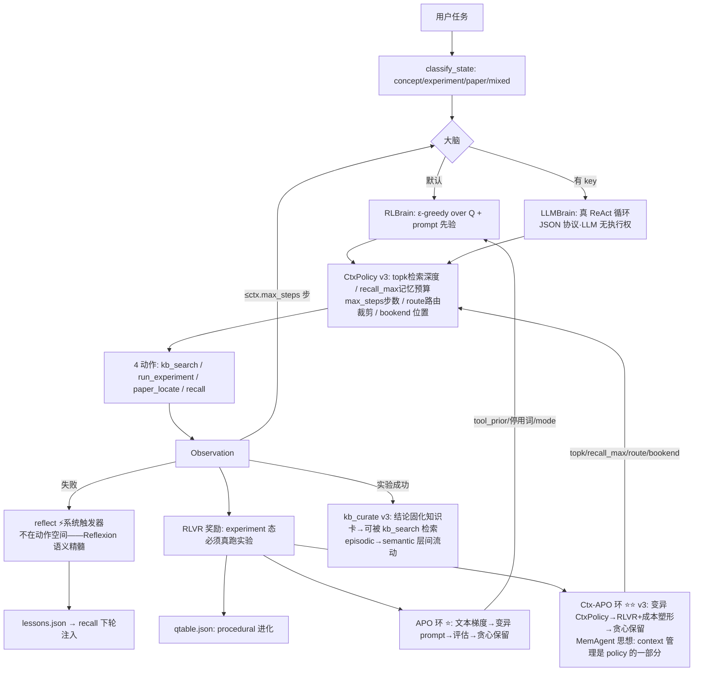

# 实战案例：RL 领域 Agent（rl_agent v3）——项目知识全融合

> **定位**（采纳多角色审查判词）：讲透Agent × 讲透RL × 讲透Prompt 的可跑缝合器——contextual bandit 内核 + prompt 先验 + **三进化环**（Q表/APO/**Ctx-APO**），30 秒在终端看见 ε-greedy、Reflexion、RLVR、reward hacking、以及 **context 栈本身被奖励信号进化** 的最小形态。
> **v4 = 同日新增 [harness_rl/](./harness_rl/)**：RL agent 融合 [harness工程手册](../../工程化手册库/harness工程手册/README.md) 全部 12 章技术（六组件 E/T/C/S/L/V + 配置即动作空间的 bandit 内环 + AHE 编辑-预测-回滚外环），并**反哺迭代两类 harness**：v3.1 的 ctx_policy（RL 域靶）与自身 components/（自指靶）。实跑战报与设计卡见 [harness_rl/DESIGN.md](./harness_rl/DESIGN.md)（5 REVERT/2 COMMIT 的可证伪闭环全史）。
> 宪法：纯标准库零依赖 · demo 1.8s · toy 简化处全部诚实标注。
> v2 = 2026-08-17 五角色审查（[多角色审查报告](./多角色审查报告-RL领域Agent.md)）后大修版：P0×6/P1×13 全修。
> v3 = 2026-08-17 同日增量：**融合 context 技术全集为可进化配置**（CtxPolicy 五维：检索深度/记忆预算/步数预算/路由/bookend）+ **第三进化环 Ctx-APO**（agent 迭代自己的 context 栈，MemAgent arXiv:2507.02259 思想 toy 版）+ **kb_curate**（实验结论固化回 kb，episodic→semantic，agent 迭代 RL 领域知识）。
> v3.1 = 同日五角色二审（oracle/security/councillor/perf + 主审计）：修 P0×2（eval 隔离假/塑形退化→字典序）+ P1×6（CTX_F 读回生效/缓存同步失效/卡片投毒净化/ev_ref 截断漏固化/glm_ctx_apo 挂链/元数据）。审查发现记录于 [GLM-CtxAPO实验报告.md](./GLM-CtxAPO实验报告.md) §审查。
> v3.2 = 同日路线图落地：**debate 双 agent 对抗验证**（P 提案 bandit × C 规则挑战，映射 #31）。

---

## 一、快速开始

```bash
python3 rl_agent.py demo                    # 全景演示（无需任何 key，~2.4s）
python3 rl_agent.py --task "什么是探索-利用？"      # 单任务
python3 rl_agent.py --task "跑一个 grpo 实验" --sc 3   # Self-Consistency 三次采样投票
python3 rl_agent.py apo                     # ★ RL agent 迭代自己的 prompt
python3 rl_agent.py ctx-apo                 # ★★ v3: RL agent 迭代自己的 context 栈（第三进化环）
python3 rl_agent.py audit --text "你是...专家..."     # ROIF-CSE 拆解任意 prompt
python3 rl_agent.py chat                    # 交互模式

# 接真 LLM（OpenAI 兼容，强制 https + 24 次调用熔断 + 注入边界）
read -s RL_AGENT_API_KEY && export RL_AGENT_API_KEY   # read -s 防 key 进 shell history
export RL_AGENT_BASE_URL="https://api.xxx.com/v1" RL_AGENT_MODEL="glm-4.7"

# ★ 真 GLM-5 上的 APO（UCB bandit 迭代提示词，凭证自动读 opencode 配置）
python3 glm_apo.py            # 探索：8臂×3轮（24 次调用）
python3 glm_apo_finals.py     # 决赛：最优臂 vs 朴素基线 16 题配对
python3 glm_apo_eval6.py      # 手册04章 6 维度评估最优 prompt
python3 glm_ctx_apo.py        # ★★ v3: context 臂（few-shot/bookend/分隔符）在 RCF 最优底座上的增益实验（24 次）
# 成果见 GLM-APO实验报告.md + GLM-CtxAPO实验报告.md

# ★ 6 维度评估（手册04章标准）+ promptfoo 工具栈（手册05章）
python3 glm_apo_eval6.py                      # 稳健/迁移/可控/安全 补测（41 调用）
cd pf-eval && promptfoo eval -c promptfooconfig.yaml   # 三臂跨模型矩阵（36 请求）
# 结论见 RCF-prompt-6维度评估报告.md：26/30 可上线；RCF 思考成本=基线2倍(刻意权衡)
```

harness 四件套：`AGENTS.md`（行为契约，已提交）+ 首次运行自动生成 `progress.md`/`feature_list.json`/`memory/`（运行产物，`.gitignore` 挡住不进 git）。

## 二、架构（v3：4 动作 + CtxPolicy 五维 context 配置 + 三进化环）



**三进化环**：Q 表（What 轴 procedural）+ APO（prompt 文本）+ **Ctx-APO（context 栈配置）**——同一 RLVR 奖励信号驱动三层自改；kb_curate 让领域知识本身也随运行增长（第四条慢环）。

## 三、技术映射表（31 项，全部名实相符 ✅ 审查后逐项核验）

| # | 技术 | 落点（可验证） | 出处 |
|---|------|--------------|------|
| 1 | Agent=LLM+循环+工具+记忆 | 整体架构 | 讲透Agent/00 |
| 2 | ReAct | RLBrain 主循环 / LLMBrain JSON 工具循环 | 讲透Agent/01·AG1 |
| 3 | 工具调用=action space | 4 工具注册表=动作集 | 讲透Agent/02·AG2 |
| 4 | 规划（贪心+失败排除） | pick(exclude=failed) | 讲透Agent/03·AG4 |
| 5 | 记忆四层 | working=当轮/episodic=lessons/semantic=kb缓存/procedural=qtable | 讲透Agent/04·AG3 |
| 6 | **Reflexion=系统触发器**（非动作）| 失败→reflect→教训→recall 注入；demo 必失败任务全链路可见 | 讲透Agent/01·05·AG5 |
| 7 | 自进化 What/When/How | procedural=What 轴 / demo=inter-test-time | 讲透Agent/05 |
| 8 | MDP/Q-learning | exp_gridworld（TD/off-policy max/goal 不进 Q——oracle 审查确认全对）| 讲透RL/01 |
| 9 | DQN replay+target | exp_dqn 表格版（诚实标注：确定性 toy 收益有限）| 讲透RL/01 |
| 10 | ε-greedy/UCB/Thompson | exp_bandit 配对 rng，regret 对比 | 讲透RL/09§P1 |
| 11 | 策略梯度+GRPO 组采样 | exp_grpo：21 seed mean±std，**实测** baseline 降方差(0.02 vs 0.06) | 讲透RL/02·03 |
| 12 | PPO-clip（近似）/熵正则 | exp_grpo 乘法 clip∈[0.8,1.25] + β·H(π) 开关 | 讲透RL/02 |
| 13 | DPO | exp_dpo：偏好对直连 vs 两阶段计数 RM | 讲透RL/03 |
| 14 | 课程学习 | exp_curriculum（诚实：toy 迁移收益有限）| 讲透RL/09 |
| 15 | RLVR 可验证奖励 | r∈{0,1} + **反短路**：experiment 态必须真跑实验 | 讲透RL/05 |
| 16 | 奖励五分类之⑤塑形 | APO 目标=reward−0.02×步数（全成功时塑形提供梯度）| PaperAgent §八 |
| 17 | Agentic RL=POMDP | 文档化七元组 + 诚实声明 γ=0 bandit 退化 | PaperAgent §十 |
| 18 | zero/few/CoT/ReAct/Reflexion 五模式 | PromptLayer.answer_template() | prompt工程手册 03 |
| 19 | ROIF-CSE 七要素 | `audit` 命令拆解任意 prompt | prompt工程手册 02 |
| 20 | few-shot/ICL | LLMBrain 协议示例 + kb 证据注入（RAG 式）| 讲透Prompt/01 |
| 21 | CoT 两段式 | 答案模板：证据→结论 | 讲透Prompt/02 |
| 22 | Self-Consistency | `--sc N`：多 seed 采样→证据引用投票（平票诚实标注）| 讲透Prompt/05 |
| 23 | **APO 文本梯度** | `apo`：失败分析→变异（mode/先验/停用词）→RLVR 评估→贪心保留；demo 实测 v0 0.96→v1 0.98 | 讲透Prompt/09·ProTeGi |
| 24 | harness 五子系统+安全件 | AGENTS.md/progress/feature_list + 原子写/记忆校验/API 熔断/注入边界/引用回查/ANSI 剥离 | harness精华合入 |
| 25 | **context 管理=policy（MemAgent 思想）** | CtxPolicy 五维配置（topk/recall_max/max_steps/route/bookend）进决策路径 | MemAgent arXiv:2507.02259 |
| 26 | RAG top-K 配置化 | `kb_search(topk=ctx.topk)`：检索深度是被优化的超参而非硬编码 | prompt工程手册 10 #19 |
| 27 | 路由裁剪（按态激活动作子集） | `ctx.route_cut(state)`：experiment 态禁 paper_locate 等 | prompt工程手册 12 病4 |
| 28 | bookend 位置技术 | `ctx.bookend`：关键约束在决策段重申（lost-in-middle 对策） | prompt工程手册 06 |
| 29 | **Ctx-APO 环 ⭐⭐** | `ctx-apo`：变异 CtxPolicy→RLVR+成本塑形→贪心保留；demo 实测 v0 0.92→记忆关闭 0.93→检索收紧 0.94（toy 真实 Pareto） | MemAgent×GEPA 精神交集 |
| 30 | **kb_curate 知识固化** | 实验成功→结论卡写 `memory/kb_generated/`→下轮 kb_search 命中（实测第二轮第一击命中）——episodic→semantic | 讲透Agent/04 |
| 31 | **debate 双 agent 对抗验证** | `debate`：P 提案（rank 选择=bandit）vs C 挑战（引用真伪+行质量）；demo 实测 3 轮涌现——P 被击倒后学会弃标题行改提实质行（Q[rank0]0.35→Q[rank1]0.76）——挑战从系统触发器变独立角色 | 讲透Agent/06·多智能体 |

## 四、三层讲透（宪法合规·v2 诚实版）

**直觉层**：工具选择=contextual bandit（情境→拉臂→反馈），Q 表是 System-1 直觉，prompt 先验是 System-2 的手；APO 让"手"的摆放也被奖励信号优化。

**数学层**：$\pi(a|s)=\arg\max_a [Q(s,a) + \text{prior}_\text{prompt}(s,a)]$（ε=0.2）；$Q \leftarrow Q + \alpha(r - Q)$，γ=0（**只更新已试工具**：证据工具得 r_task，试而不成得 0——诚实信用分配）。GRPO 优势 $(r-\bar{r}_{group})/(\sigma+\epsilon)$，乘法 clip 近似 PPO 目标（**简化版，缺重要性采样**——诚实标注）。

**代码层**：829 行（v2 716 + v3 增量 113），行内锚点 `← 讲透X/NN`（61 个，审查抽查准确率 100%）。

**v3 诚实声明**：toy 上 context 技术的收益上限有限（玩具看不出量化损失，同理真 lost-in-middle 需长上下文）——Ctx-APO 可见的是步数/检索量/记忆预算的 Pareto 改进；端到端 GRPO 训练（MemAgent 原版）本机跑不了，Ctx-APO 是其黑盒进化退化形态，与[手册11 方案对决](../../工程化手册库/prompt工程手册/11-自动化优化闭环-六步流水线.md)结论一致（A 冷启动/B 巡航）。真 LLM 上的 context 优化走 `glm_apo` 式路径。

## 五、内置 toy 实验 ×6（全部秒级 + 实测输出）

| 实验 | 一句话结果（2026-08-17 实跑） | 验证 |
|---|---|---|
| gridworld | 5×5 200 轮成功率 98%，贪婪路径 9 步到达 | TD/ε-greedy/终止处理 |
| dqn | replay+target vs vanilla（确定性 toy 差距小=诚实结论）| 两件套 |
| bandit | regret: Thompson 13 < UCB 29 ≈ ε-greedy 31 | 探索三雄 |
| grpo | baseline 使终态策略跨 seed std 0.02 vs 无 baseline 0.06 | 组均值+std 归一降方差 |
| dpo | 偏好对直连 ≈ 两阶段 RM（toy 趋同；真差异=免分布偏移）| DPO 推导可跑版 |
| curriculum | 3×3→5×5 vs 直学（toy 收益有限，诚实标注）| 课程学习 |

## 六、路线图（feature_list.json 同步；不在映射表——审查教训：TODO 不算融合）

~~debate 双 agent~~ ✅ v3.2 已落地（映射 #31）。待做：n-step 轨迹级 credit / mcts_planner / arxiv_verify 联网核实 / RLHF-RM toy / debate 的 LLM 版挑战者。

---
v3：2026-08-17 · context 融合 + Ctx-APO + kb_curate（MemAgent arXiv:2507.02259 思想）· v2 审查闭环见 [多角色审查报告](./多角色审查报告-RL领域Agent.md) · 姊妹案例：[Open-AutoGLM](../实战案例-Open-AutoGLM手机Agent/)（读生产项目）、[DeepSeek Harness](../Agent框架案例/deepseek-harness插件化框架/)（读工业框架）、**本案例**（自己写一个）
