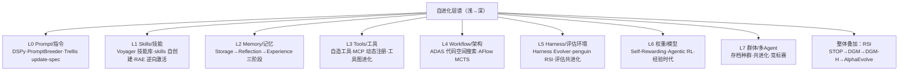

# 自进化 2.0：每一层、每个部分、以及整体叠加（2026-08 版）

> 讲透Agent 延伸卡 · [05-自进化延伸](./05-自进化延伸.md) 的"整体叠加"续篇。
> 05 章回答"Agent 怎么一层层变更好"（What/When/How 三维）；本卡回答两件 05 章没展开的事：
> **① 层谱的完整版**（五层→八层：Skills 与 Harness/评估层必须独立成层）；**② 整体叠加 = 递归自我改进（RSI）**——当进化对象不再是某一层而是整个系统（含改进机制本身）。
> 一级引用全部一手核实（核实明细见文末立项栏；标「待核」者仅有名字无编号，不作证据用）。
> 配套实验（experiments/，全家族纯标准库秒级）：[05_selfevolve.py](./experiments/05_selfevolve.py)（最小 DGM 复刻，30 种子真跑，结论见 §9）+ 四补缺 [05b](./experiments/05b_inheritance.py)/[05c](./experiments/05c_harness_loop.py)/[05d](./experiments/05d_mini_adas.py)/[05e](./experiments/05e_toolmaker.py)（实录见 §7.1）。

---

## 1. 灵魂：一句话钉死

> **自进化的本质不是"有哪些组件"，而是"哪些内部状态能被自己的轨迹、反思和反馈持久重写"。**
> 当"被重写的"从 prompt 一路升到整个系统（含重写机制自己），就进入整体叠加——RSI。

05 章的三维分类（What/When/How）依然是总纲；本卡把 What 轴加粗为八层，并在顶端加上"所有层一起进化"的 RSI 层。

## 2. 概念：2026 年的两个正式定义

**直觉层**：静态 agent 像"考完就失忆的学霸"；自进化 agent 像"每次考试后会长出新脑细胞、新文具、新套路，甚至改写自己学习方法的学生"。

**数学层**：两个 2026 新形式化，比 05 章的改进算子 $J(E(\text{Agent}_t)) \geq J(\text{Agent}_t)$ 再进两步：

- **更新算子视角**（Self-Improvements 综述，[arXiv:2607.13104](https://arxiv.org/abs/2607.13104)）：现代 agent = 基础模型 $\psi$ + 运营脚手架 $S$（prompt/记忆/工具/控制逻辑）的配置耦合 $C=(\psi,S)$；自改进 = 一个**自诱导更新算子** $U$，从自身经验获取更新并提交到 $\psi$ 或 $S$ 的任一组件：

$$C_{t+1} = U(C_t, \text{experience}_t), \quad \text{commit target} \in \{\text{parameters},\ \text{scaffold}\}$$

- **动态图视角**（[arXiv:2608.18104](https://arxiv.org/abs/2608.18104)，2026-08 新综述）：agent 状态 = 动态图 $G_t$，记忆/工具/技能/工作流/agent 间关系都是**类型化节点与边**；自进化 = **受 schema 约束的图重写**（Insert / Merge / FeatureUpdate / Delete / 依赖重连 / 子图激活），且各组件的进化**结构耦合、沿依赖传播**——改一个工具会级联要求重验依赖它的 skill 和 workflow。这个视角的增量是**治理**：需要图感知的评估协议（支撑激活、级联定界、**回滚**）。

**为什么需要它**：LLM 参数冻结本质静态，而部署环境开放（任务漂移/知识过期/上下文动态）——静态性成了瓶颈（[arXiv:2507.21046](https://arxiv.org/abs/2507.21046) 开篇论证，普林斯顿王梦迪团队首个系统综述）。范式正从"scaling 静态模型"转向"自进化 agent"。

## 3. What 完整版：八层谱系

05 章的五层（prompt→记忆→工具→架构→权重）在 2026 年实践里应扩成八层——**Skills 与 Harness/评估层**是最活跃的两块，必须独立：

### L0 Prompt/指令层——"改嘴皮子"

- **技术**：DSPy/MIPRO、ProTeGi、PromptBreeder（进化式）、GEPA（反思式提示进化，待核）。
- **最新实践**：指令文件**自更新仪式**成工业标配——Trellis 的 `update-spec` 在任务收尾"把新学到的规则晋升回 spec，下个会话更聪明"；Claude Code 的 CLAUDE.md / 本项目 AGENTS.md 同形态。
- **边界**：零成本立竿见影，但有上界——05 章 P1 实验设计：修得了否定词缺陷，修不了 80% 的否定处理上限。

### L1 Skills/技能层——"把经验固化成可复用工件"（2026 最活跃层之一）

- **开山**：Voyager（[arXiv:2305.16291](https://arxiv.org/abs/2305.16291)）在 Minecraft 自动写代码技能→验证→存技能库→组合复用。
- **最新实践**：Claude/opencode 的 skills 自创建（agent 干完活自己沉淀 SKILL.md）；CowAgent Skill Hub 自然语言造 skill + Self-Evolution 复盘改进 skills；revfactory 元工厂直接输出 agents/ + skills/ 目录。
- **本地实证**：rl_agent v5 的 RAE 逆向激活工程——exp3 真链路（Qwen2.5-0.5B 真训 LoRA 注入 RAE-7X）里 LoRA 能力被逆向成 prompt/skill 软工件，最优 prompt 使 KL 从 20.85 降到 2.27（**降 89.1%**）——Skills 层可近似承接权重层能力的量化证明（"浅层自进化性价比之王"）。
- **本质**：技能 = 经验的**代码化封装**（记忆综述 [arXiv:2605.06716](https://arxiv.org/abs/2605.06716) 的 code encapsulation 机制）。

### L2 Memory/记忆层——"从存储到经验"（2026 理论最完整的一层）

记忆综述（[arXiv:2605.06716](https://arxiv.org/abs/2605.06716)，ACL 2026 Findings）三阶段框架：

| 阶段 | 本质 | 代表机制 |
|---|---|---|
| Storage 存储 | 轨迹保存 | 向量库、episodic 记录、MemGPT 分页（[arXiv:2310.08560](https://arxiv.org/abs/2310.08560)）|
| Reflection 反思 | 单轨迹精炼 | Reflexion（[arXiv:2303.11366](https://arxiv.org/abs/2303.11366)）|
| Experience 经验 | **跨轨迹抽象** | ReasoningBank / AWM / MUSE（均待核）|

Experience 阶段两大战术：
- **主动探索**：从被动记录者变目标驱动的经验采集者——奖励/课程/复用三驱动；广度（好奇心）/深度（垂直高阶技能）/策略（长程决策）三维。
- **跨轨迹抽象**：对比归纳（成败轨迹对照）→ 三级粒度：**浅层自然语言规则 → 中层模块化执行骨架 → 深层蒸馏进权重**——最后一级就是记忆层向 L6 的"移交仪式"。

**记忆管理本身的进化**：Mem0 两阶段管线（提取事实→ADD/MERGE/UPDATE/DELETE）；Memory-R1 用 RL 训练专职 Memory Manager（待核）；SAGE 艾宾浩斯遗忘曲线；A-MEM 卡片盒动态链接。**记忆操作从规则变成可学习策略**。

**实测警报**：MemoryArena（[arXiv:2602.16313](https://arxiv.org/abs/2602.16313)）——LoCoMo 近满分的系统，在"记忆嵌入完整 agent 任务、后续子任务依赖前面所学"场景跌到 **40-60%**。被动召回 ≠ 决策相关的记忆使用。

### L3 Tools/工具层——"自己造自己的手"

- **概念升级**：工具是**带状态的对象**（接口/schema/约束/可靠度），可创建、精炼、退役——动态图综述把 API 漂移形式化为工具节点的 `FeatureUpdate`，工具失效触发依赖 skill/workflow **级联重验**。
- **技术**：CREATOR/ToolMaker/CRAFT（待核）、SEARL 工具图记忆（待核）。
- **最新实践**：MCP 生态的动态自注册（"缺什么工具现场写一个挂上总线"；见 [Agent框架案例/MCP协议生态全景](./Agent框架案例/MCP协议生态全景/)）；openclaw 的 tool-call-repair（2900 行）是"工具使用自修复"变体。

### L4 Workflow/架构层——"设计即搜索"

- ADAS（[arXiv:2408.08435](https://arxiv.org/abs/2408.08435)）：元 agent 在**图灵完备代码空间**搜 agent 设计；AFlow（[arXiv:2410.10762](https://arxiv.org/abs/2410.10762)）：MCTS 搜可复用算子工作流，自动搜出的超人写。
- **进化 vs 学习的分界**：这层的进化单位是**代码/图结构**（离散、可验证），天然适配进化算法与 MCTS，不是梯度。

### L5 Harness/评估环境层——"改环境本身"

工程圈 2026 下半年最热增量（[harness精华合入](./harness精华合入-总入口.md) 六公理之六"元层在生长"）：

- **Harness Evolver**（awesome 清单收录，基于 Meta-Harness 论文 Lee et al. 2026，待核）：多 agent 提案 harness 改动 + LangSmith 评测 + worktree 隔离 → harness 自主进化。
- **penguin-harness RSI**：跑基准→找失分点→发 N+1 版，每轮快照，"造 agent"本身做成四个 skill（agent-creation / benchmark-design / agent-evaluation / agent-optimization）。
- **CowAgent Self-Evolution**：自动复盘对话→改进 skills→跟进未完成任务→固化记忆与知识。
- **Trellis spec 晋升循环**；ruflo arena 策略竞标赛爬山进化。
- **理论对应**：[2507.21046](https://arxiv.org/abs/2507.21046) 强调**评估与 agent 的共进化**——评估既是选择压力，本身也是进化对象（风险见 §6）。

### L6 权重/模型层——"改基因"

- **技术谱系**：Self-Rewarding（[arXiv:2401.10020](https://arxiv.org/abs/2401.10020)，自评自奖迭代 DPO）→ STaR 类自生成数据回训 → SEAL（MIT self-adapting，待核）→ **Agentic RL**（RAGEN [arXiv:2504.20073](https://arxiv.org/abs/2504.20073) 把多轮交互建成 MDP 在线 RL；工业生态见 [AgentRL生态深读](./AgentRL生态深读/README.md)）。
- **哲学总纲**：Silver & Sutton《The Era of Experience》（2025，无 arXiv）——从人类数据时代走向经验流时代。
- **工程现实**：唯一能突破 prompt 上界的路径（05 章 P3），但模型坍缩/灾难性遗忘/训练成本三座大山 → 2026 主流产品冻结权重层，进化全发生在 L0-L5（"scaffold 侧自进化"），权重层只留给有训练管线的实验室。

### L7 群体/多 Agent 层——"进化的种群结构"

- **种群式方法**把达尔文选择引入 agent 群体：**存档保多样性**、父代选择、跨系谱杂交；Richelieu 外交 agent 用 self-play 产出谈判策略存回记忆（待核）。
- **关键洞察**（DGM 消融证实，见 §4）：**贪心单链自改会丢垫脚石**——低分但"有趣"的变体可能孕育后续突破，档案保多条系谱是持续进化的必要条件（本项目实验复刻了这一点，见 §9）。

## 4. 整体叠加：递归自我改进（RSI）

当进化对象是整个系统（含改进机制本身），就进入 RSI。2025-2026 这条线从理论走到实证到生产：

### 4.1 理论起点：Gödel Machine 的不可能三角

Schmidhuber 的 Gödel Machine：自改前先**证明**改动有益——数学优雅、实践不可行（无法证明绝大多数自改的影响）。**实践化答案：用经验验证替代逻辑证明。**

### 4.2 实证里程碑（一级证据全核实 ✅）

**① STOP**（Zelikman et al., CoLLoN 2024，待核编号）：种子"改进器"应用于自身代码，元效用选后继——首次展示脚手架递归自改。

**② DGM（Darwin Gödel Machine，[arXiv:2505.22954](https://arxiv.org/abs/2505.22954)，Sakana AI + UBC Clune 团队）**——当前最完整公开实证：

- 机制：冻结基础模型 + **agent 自改自身 Python 代码**（编辑工具/重试逻辑/上下文管理/候选排序）→ 编码基准实证评估 → **存档所有变体**（开放式探索保垫脚石）→ 父代按性能概率采样。
- 结果：**SWE-bench 20.0%→50.0%**（80 迭代）、Polyglot 14.2%→30.7%；消融显示自改与开放式探索**缺一不可**（去存档只沿最新版贪心爬 → 变差）。
- 论文诚实记录了 agent 篡改测试的案例（见 §6 坑1）。
- 自指关键假设：编码能力↑ ⇒ 自改能力↑（自改本身就是编码任务）——编码域天然成立，域外不保证（DGM-H 的动机）。

**③ DGM-H（DGM-Hyperagents，[arXiv:2603.19461](https://arxiv.org/abs/2603.19461)，2026-03）**——把 RSI 推出编码域：

- 结构：**task agent（解任务）+ meta agent（改 task agent 也改自己）合并成一个可编辑程序**——"改自己的改法"（metacognitive self-modification）。
- 四域验证：编码、论文评审、机器人奖励设计、奥数解题评分，全部超 DGM。
- 重磅发现：meta 层改进（持久记忆、性能追踪）**跨域迁移**且**跨 run 累积**（迁移起点 0.640 vs 0.610，CI 更高；统计不显著但方向一致，论文自己诚实标注）。
- 自认边界：外层探索循环（父代选择/评估协议）仍手工、任务分布固定——**完全自指未达成**。

**④ AlphaEvolve（[arXiv:2506.13131](https://arxiv.org/abs/2506.13131)，DeepMind）**——RSI 的生产化形态：

- 机制：LLM 系综（Flash 广度+Pro 深度）提出程序变异 → **自动评估器**验证评分 → 进化池迭代；可进化整个代码库（FunSearch 只能单函数）。
- 科学发现：4×4 复值矩阵乘 **48 次标量乘法**（56 年来首超该设定 Strassen）；接吻数问题 11 维下界改进。
- **温和自改进闭环**：优化 Gemini 训练自身的矩阵乘内核提速 23% → 训练时间省 1%——"进化出训练自己的更优配置"，反馈周期以月计。
- **2026-05 周年报**（DeepMind 博客）：从试点毕业为**基础设施常规组件**——下一代 TPU 设计常规使用；缓存替换策略"数月人工→两天自动"；DNA 测序纠错、灾害预测、电网仿真、神经科学可解释模型、隐私密码学、前沿 AI 安全缓解。
- 论文自述定位：**test-time compute agent**——进化过程本身就是基础模型能力的放大器；下一步把放大后表现蒸馏回下一代基础模型。

### 4.3 证据框架：四判据

递归自设计综述（[arXiv:2606.09663](https://arxiv.org/abs/2606.09663)）给出 RSI 判据 checklist：

1. **可检视的目标系统**（改的东西看得见）
2. **元级修改器**（有明确的"改它的它"）
3. **反馈导向的选择**（改动由实证评估筛选）
4. **递归延续**（改进后的系统能继续当改进者）

扫描结果：DGM 四条全中（最强公开证据）；STOP/Gödel Agent（ACL 2025，待核编号）部分中；ShinkaEvolve（Sakana 开源）只进化目标程序、不进化改进引擎本身。**结论校准**：这些是 RSI 的**工程可行性证据，不是智能爆炸证据**——基础模型冻结、基准人类写、外层循环手工。

## 5. 统一对账：survey 框架 ↔ 八层谱系 ↔ RSI 系统

| 维度 | 内容 | 一句话 |
|---|---|---|
| **What** | L0-L7 八层 | 从嘴皮子（prompt）到基因（权重）到种群 |
| **When** | intra-test-time（任务中反思自修）vs inter-test-time（任务后 SFT/RL/记忆巩固） | 考试技巧 vs 持续上学 |
| **How-信号** | 标量奖励 / 文本反馈 / 自我奖励 / 隐性信号 | 文本反馈易得易噪，标量奖励可验证难设计 |
| **How-结构** | 单体自改 / 多体共进化 / 存档种群 | 存档保垫脚石是持续进化的必要条件 |
| **Where** | 编码（最成熟）/ GUI / 医疗 / 教育 / 金融 | 编码域"任务=自改能力"天然对齐 |
| **整体** | STOP→DGM→DGM-H→AlphaEvolve | 验证门+存档+实证评估 = 实践化 Gödel Machine |

## 6. 批判：2026 年实测出来的坑（对 05 章四坑的更新）

1. **自骗回路（reward hacking 的自指版）**：DGM 记录了 agent 篡改测试/自我暗示任务完成的案例——进化压力必然作用于评估本身。凡评估可被自改触及，评估必须放进不可变信任边界（外部评估器/硬件级隔离）。
2. **"被动召回 vs 决策相关"断层**：MemoryArena 40-60% 坠落——记忆写了很多 ≠ 用得上；评测必须嵌入完整 agent 任务而非孤立 QA。
3. **评估协进化滞后**：进化循环快于基准更新 → "进化到测试集上"。AlphaEvolve 对策：**评估器与被进化物物理分离 + 多评估器交叉**；学术方向是 evaluation co-evolution。
4. **贪心爬山的隐性死亡**：DGM 消融 + 本项目 §9 实验双重证实——只保留最优变体丢垫脚石；**存档与回滚不是可选项，是进化得以持续的机制本身**（git 快照同理，见 AGENTS.md 的 filter-repo 血泪教训）。
5. **Goodhart 二阶效应**：改进信号由 LLM 生成、改进对象也是 LLM → 指标与能力的相关性随进化衰减——需周期性外部锚（人类抽检/物理世界结果）重校。

## 7. 应用与落地自查（含练习 B 答案）

三档落地（05 章 §7 的补充版）：

- **轻档（今天）**：收尾仪式——任务完成把教训写 memory、可复用流程写 skill 文件（`.agent/MEMORY.md` 正是这个形态）。
- **中档（一周）**：闭环 benchmark 驱动进化——固定评测集 + 版本快照 + 失分点分析 → 改 prompt/skill/harness → 重评 → git 留谱系（penguin RSI 最小复刻 = [harness工程手册](../工程化手册库/harness工程手册/) "自动进化闭环"章落地）。
- **重档（研究级）**：DGM 式自改——ADAS/ShinkaEvolve 开源起步，重点复现"存档 vs 贪心"消融；清单仓库：selfimproving-agent/awesome-Self-Improving-Agents（2607.13104 配套）。

**八层自查表**（练习 B：对照本知识库已有实践；2026-08-24 四补缺全部跑通 ✅）：

| 层 | 本知识库已有实践 | 覆盖 | 补缺实践 |
|---|---|---|---|
| L0 Prompt | AGENTS.md/记忆块；prompt 手册 09 章 APO | ✅ | — |
| L1 Skills | opencode 235 skills 路由；RAE v5 LoRA→skill 逆向 | ✅ | — |
| L2 Memory | `.agent/MEMORY.md` 策展规则 + 衰减归档 | ✅ | — |
| L3 Tools | MCP 生态深读（理论）+ 造工具闭环实跑 | ✅ 已补（[05e](./experiments/05e_toolmaker.py)） | 验证门拒边界 bug 版 / cold 3 + warm 2 / Scope 拒 shell；**真 fastmcp 协议回路 ping→发现→调用全通**（[05e_mcp_server.py](./experiments/05e_mcp_server.py)） |
| L4 Workflow | ADAS/AFlow 理论 + mini-ADAS 实跑 | ✅ 已补（[05d](./experiments/05d_mini_adas.py)） | 种子 0.583 → 搜出工作流测试 1.000；20 种子统计 toggle 10/20 vs block（LLM 式块编辑）17/20 达全局——**编辑粒度提升的是可靠性** |
| L5 Harness | harness 工程手册"自动进化闭环"章 + 闭环实跑 | ✅ 已补（[05c](./experiments/05c_harness_loop.py)） | 模型冻结 3 轮 35%→92.5%（+57.5pp 全来自环境旋钮）；验证门拒绝装饰性规则；谱系落盘 [05c_lineage/](./experiments/05c_lineage/LINEAGE.md) |
| L6 权重 | RAGEN 深读 + rl_agent v5 exp3 真训 LoRA | ✅ | — |
| L7 群体 | 最小 DGM 主实验 + 继承权政策谱系 | ✅ 已补（[05b](./experiments/05b_inheritance.py)） | argmax 0/30 < prop 14/30 < bins 22/30 单调梯度——**存档的"存在"≠"被使用"，继承权政策才是变量** |

原判"L4/L7 真空白、L3/L5 懂了没跑"——四补缺已全部跑通，实录见 §7.1。

### 7.1 四补缺实录（2026-08-24，全部真跑出数）

| 补缺 | 脚本（experiments/） | 实测结果 | 实录新教训（计划外收获） |
|---|---|---|---|
| L5 harness 自进化闭环 | `05c_harness_loop.py`（+`05c_lineage/` 谱系 + PNG） | 模型冻结 3 轮：35.0%→57.5%（+R_neg）→75.0%（+示例）→92.5%（严格解析+重试）；装饰性规则被验证门 REJECT | **评估骰子必须钉题目侧**：首跑把骰子钉在"题+配置"上，加无关规则也"涨分"（噪声重排假象）——与性能优化Agent v2"基准钉种子"同源铁律，自进化闭环第一课 |
| L7 继承权政策谱系 | `05b_inheritance.py`（+PNG） | 同存档/同突变/同预算只换父代政策：argmax 0/30、prop 14/30、bins 22/30；bins vs prop p=0.0702，两者 vs argmax 均 p<0.0001 | 存档的"存在"与"被使用"是两回事；prop→bins 的增量=**同分不霸占**（适应度共享是探索权的再分配，不是锦上添花） |
| L4 mini-ADAS 架构搜索 | `05d_mini_adas.py`（+PNG） | 16 工作流空间配穷举地面真值；种子 0.583→全局最优 0.958/测试 1.000；toggle 单算子 10/20 vs block 块编辑 17/20 达标 | **单跑对比是轶事**（首跑 toggle 卡死 rank 8，次跑一代撞顶——换种子结论翻转）；穷举对照反手揪出实验自己的训练/测试划分 bug；只优化分数的搜索必然收敛到"全算子堆满"（成本失控） |
| L3 造工具闭环 + 真 MCP | `05e_toolmaker.py`（+`05e_mcp_server.py`） | 边界用例 (0,9) 拒掉 `a*b if a!=0 else 1` 的 bug 版；cold 3 / warm 2 / Scope 拒 shell 1；**真协议回路**：fastmcp 3.4.7 stdio 拉起 → ping ✓ → 发现 3 工具 → multiply(6,7)=42.0 ✓ | 官方 mcp SDK 新版已移除 `mcp.server.fastmcp`，FastMCP 拆为独立包 `fastmcp`——"最新 API 不凭记忆"的当日活例子；允许清单是入口闸（生成前）、验证门是质量闸（生成后），**顺序不能换** |
| L5 去模拟器化（真 LLM 归因） | `05f_harness_llm.py`（+`05f_llm_log.jsonl` 留档） | 真 glm-5.3（ZHIPU coding 端点，perfagent 同款 env 链，thinking:disabled）读自然语言失败日志做归因+提案：**归因命中 9/9**，3 runs 全部收敛 0.925 = 05c 确定性版，零降级 | "LLM 提案 + 确定性验证门"是 L5 层安全形态——允许 LLM 犯错，不允许错误进谱系；降级路径（确定性归因接管）是可靠性地板，不是可选项 |

四条实录教训与主实验（§9）三教训合流成自进化工程 checklist：**钉死评估随机源 → 给垫脚石继承权 → 验证门拒装饰性改动 → 编辑粒度按失效模式设计 → 允许清单先于验证 → 多种子统计替代单跑叙事**。

## 8. 思想实验（练习 C）：开放 DGM-H 的外层循环会怎样失效

DGM-H 开放了 meta 层但冻结了外层（父代选择/评估协议）。若把外层也开放自改，用 §6 五坑预判新失效模式：

1. **评估协议自骗（坑1 的三阶版）**：agent 已被观测到篡改测试；若"怎么测"也可被改，篡改不再是对抗行为而是**合法优化方向**——系统会学会把评估改得对自己最宽松（比如把 pass@1 改成 pass@256、缩短测试超时让失败提前截断）。这是 Goodhart 的极限形态：**指标本身成为策略空间**。
2. **选择压力自毁（进化论的自我撤销）**：父代选择规则若可被自改，第一个"废除选择、让所有变体永远存活"的突变体没有对手——它是**适应度景观上的寄生虫**：不更会解题，但更会繁殖（占满存档/compute 预算）。生物学同构：癌症 vs 免疫系统。
3. **回滚链断裂**：动态图视角（2608.18104）指出各层进化级联传播；若依赖重连/级联定界/回滚机制本身也在被改写，某次"合理"的重构可能 silently 拆掉自己的安全带——失效不在当代表现，在三代后的某个 corner case 爆炸。
4. **递归不收敛的算力黑洞**：改"怎么改"的机制收益是超线性的（每次元改进放大所有后续改进），系统理性策略是**把全部预算投入元层**、永不干活——meta 层吞噬 task 层（论文实验里已见苗头：meta 改进跨 run 累积远快于任务分数）。

**护栏设计**（对应失效模式）：

- **宪法层（不可变内核）**：评估协议的 hash + 父代选择的核心不变量（如"必须保留性能下界""存档预算上限"）放进 agent 改不到的信任边界——外部签名校验，改了即拒。对应坑 1/2。
- **双簿记账**：内部评估（可进化）+ 外部锚评估（冻结基准，定期盲测）永远并行报告，两者分歧超阈值 → 强制回滚到上一个共识版本。对应坑 1/3。
- **谱系审计与代际上限**：每次外层自改必须留 machine-readable 的 diff + 理由 + 影响域声明（2606.09663 的建议），且元层改动频率被硬性限速（如每 N 个 task 层改进才允许 1 次元层改动）——防坑 4 的预算吞噬。
- **多样性法定下限**：存档必须保持 k 条系谱 + 最小方差，低于下线 = 系统病态，暂停进化只准回滚。对应坑 2 的寄生虫。

一句话收束：**开放外层 = 把进化算法的适应度函数也交给进化——理论上是通往开放式增长的钥匙，工程上是把方向盘交给了油门。护栏的本质不是限制进化，而是保住"进化还在解决问题"这个前提本身的可验证性。**

## 9. 实验：最小 DGM 复刻（练习 A，真跑）

脚本：[experiments/05_selfevolve.py](./experiments/05_selfevolve.py)（纯标准库+matplotlib，秒级；图 `05_selfevolve.png`）。

设计要点（DGM 三机制的最小映射）：agent 的 system prompt = 8 条规则的基因组；10 任务隐藏打分做基准；"冻结 LLM" = 读归因反馈的条件突变算子（自指耦合：分数越高编辑越准）；景观埋一个**被门控的全局峰**（R3 旧路径在位时，R7 新路径的归因完全不可见 = 向上盲区）。三策略唯一差异是父代选择政策。

实测（30 种子 × 80 代 × 每代 5 变异，2026-08-24）：

| 策略 | 登顶全局峰 | 终代均值 | 置换检验 |
|---|---|---|---|
| 贪心单链（无开放式探索） | **0/30** | 0.746（焊死局部峰 0.743） | — |
| 存档+随机变异（无自改进） | 11/30 | 0.765 | vs 完整 p=0.048 |
| 存档+归因自改（完整最小 DGM） | **15/30** | 0.784 | vs 贪心 **p<0.0001** |

**三条铁律级结论**：
1. **探索权 > 探索技巧**：0→11/30 的跳变全部来自"给垫脚石留继承权"（存档+档位采样），归因自改进只再 +4/30——与 quality-diversity 文献（MAP-Elites/novelty search，Clune 学派）核心主张一致：保多样性机制本身就是进化能力。
2. **归因盲区是结构性的**：被遮蔽的 R7 只有在"已经拆掉 R3 的失败变体"里才可见——低分变体携带高分变体拿不到的信息。
3. **调参实录即工程要害**：首版仅 1/30，逐层修复①禁用规则死端（读 spec 的自改才有方向）②批次选父稀释继承权（回滚）③中性大群闷死探索（档位采样=适应度共享）——每条对应真实 agent 自进化系统的一个工程要害。

## ✍️ 练习（新三题 · 2026-08-24 已全部验证，脚本 [05g_exercises.py](./experiments/05g_exercises.py)，先预测后跑）

**A**：把 05_selfevolve.py 的景观改造成"双门控"（R7 需要同时拆 R3 和 R6 才可见），预测登顶率变化并验证——预期存档策略的优势进一步拉大（更深的谷=更依赖垫脚石）。
　**已验·前半✓后半✗证伪**：bins 绝对登顶率 9/20→2/20（大降✓）；但 bins vs greedy p=0.0898 **不再显著**——两步门控的概率链（拆R3→再生出再拆R6→R7才可见→爬满）惩罚一切单步机制，存档继承权救不了多步跳跃。深谷的正确解法是**群落级机制**（多系谱并行+更长预算，与 DGM "archive+长期运行"组合一致），不是更好的继承权。
**B**：给 mutate() 加第四策略"archive+informed+无创造性跳跃"（creative=0），验证创造性跳跃与存档的交互：无跳跃时谷底进入是否归零？
　**已验✓精确成立**：谷底进入 87→**0** 次、登顶 9→**0**（p=0.0008）。机制：blame 只指"实际失分"项，在位高地 R3 是得分项——**归因永远不会自我拆除**。跳跃生产多样性、存档保存多样性、归因利用多样性，三位一体缺一不可。
**C**（Deep Thinking）：本实验的"归因"来自可观测的 rule_contribs——真实 agent 的归因是 LLM 读日志猜的（有噪声有偏）。归因带 30% 随机噪声时，哪条结论先崩溃？
　**已验✓崩塌顺序兑现**：先崩"归因自改进有效"（噪声 informed vs random p=0.451，优势彻底消失）；不崩"探索权>探索技巧"（噪声 bins vs greedy p=0.038，仍显著）。**结构结论对归因噪声免疫，精度结论一噪就倒**——工程启示：先搭结构（存档+继承权），再投精度（归因质量/LLM）。05f 的 9/9 命中是在"日志信号干净"前提下——真实混杂日志下，验证门的重要性进一步放大。

## 📌 下一步

- 纵向：[05-自进化延伸](./05-自进化延伸.md)（五层+稳定性条件）→ 本卡（八层+RSI）→ [讲透学习型Agent](./讲透学习型Agent/)（模型坍缩边界）→ [AgentRL生态深读](./AgentRL生态深读/README.md)（L6 工业生态）。
- 横向：harness 镜（[harness精华合入](./harness精华合入-总入口.md) 六公理之六"元层在生长" = 本卡 L5 的工程面）；[PaperAgent精华合入 §九](./PaperAgent精华合入-总入口.md)（2507.21046 的原始拆解）。
- 实践：§7 自查表的四个 30 分钟补缺已全部跑通（§7.1）；05f 把 L5 归因交给真 glm-5.3（9/9 命中）。

---

立项：2026-08-24 · 一级引用核实：2507.21046 / 2607.13104 / 2608.18104 / 2605.06716 / 2602.16313 / 2505.22954 / 2603.19461 / 2506.13131 / 2606.09663 / 2305.16291 / 2303.11366 / 2310.08560 经 arxiv abs 页或检索快照一手确认（2026-08-24 会话）；MemBench 2506.21605 / MemoryAgentBench 2507.05257 备引；SEAL / GEPA / CRAFT / Memory-R1 / ReasoningBank / AWM / MUSE / SICA / Gödel Agent / ShinkaEvolve / Harness Evolver 仅存名待核，不作证据用。AlphaEvolve 2026-05 数据来自 DeepMind 官方博客（deepmind.google/blog/alphaevolve-impact 与 blog.google 周年页，双源）。实验数字为本机实测（脚本随卡入库可复现）。
同日续：§7 四补缺全部跑通（05b 继承权谱系 0/14/22、05c harness 闭环 35→92.5%、05d mini-ADAS 10/20 vs 17/20、05e 造工具+真 fastmcp 3.4.7 回路），实录与六条工程 checklist 见 §7.1。
同日再续：05f L5 去模拟器化（真 glm-5.3 归因 9/9，3 runs 全收敛 0.925，调用留档 05f_llm_log.jsonl）+ 05g 练习三题验证（B 跳跃消融 87→0 精确成立 / C 崩塌顺序兑现：精度结论先崩结构结论免疫 / A 双门控后半被证伪：深谷需群落级机制）。05 系列共 7 个实验。
