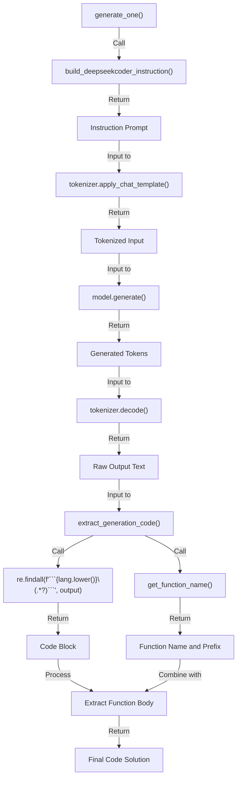

> 来源: [https://deepwiki.com/deepseek-ai/DeepSeek-Coder/4.1-humaneval-benchmark](https://deepwiki.com/deepseek-ai/DeepSeek-Coder/4.1-humaneval-benchmark)
> DeepWiki deepseek-ai/DeepSeek-Coder

# HumanEval Benchmark

  Relevant source files 
 - [Evaluation/HumanEval/__pycache__/humaneval.cpython-38.pyc](https://github.com/deepseek-ai/DeepSeek-Coder/blob/b7ba5659/Evaluation/HumanEval/__pycache__/humaneval.cpython-38.pyc)
 - [Evaluation/HumanEval/eval_instruct.py](https://github.com/deepseek-ai/DeepSeek-Coder/blob/b7ba5659/Evaluation/HumanEval/eval_instruct.py)
 - [Evaluation/HumanEval/utils/__pycache__/instruct.cpython-38.pyc](https://github.com/deepseek-ai/DeepSeek-Coder/blob/b7ba5659/Evaluation/HumanEval/utils/__pycache__/instruct.cpython-38.pyc)
 - [Evaluation/HumanEval/utils/utils.py](https://github.com/deepseek-ai/DeepSeek-Coder/blob/b7ba5659/Evaluation/HumanEval/utils/utils.py)
 - [pictures/HumanEval.png](https://github.com/deepseek-ai/DeepSeek-Coder/blob/b7ba5659/pictures/HumanEval.png)
 - [pictures/MBPP.png](https://github.com/deepseek-ai/DeepSeek-Coder/blob/b7ba5659/pictures/MBPP.png)
 
  
## Purpose and Scope

 This page documents the HumanEval evaluation system in DeepSeek-Coder, which measures code generation capabilities across multiple programming languages. It covers the evaluation process, architecture, implementation details, and usage instructions. For information about other evaluation methods, see [MBPP Benchmark](https://deepwiki.com/deepseek-ai/DeepSeek-Coder/4.2-mbpp-benchmark) and [LeetCode Evaluation](https://deepwiki.com/deepseek-ai/DeepSeek-Coder/4.3-leetcode-evaluation).

 
## Overview of HumanEval

 HumanEval is a standard benchmark created by OpenAI that consists of 164 programming problems designed to test functional correctness of generated code. In DeepSeek-Coder, the benchmark has been extended to support multiple programming languages beyond the original Python implementation.

 Each HumanEval problem includes:

 
 - A function signature with docstring describing the task
 - A prompt for the model to complete
 - Test cases to evaluate functional correctness
 
 The problems cover various programming tasks, from string manipulation to complex algorithms, testing different aspects of coding ability.

 
## Evaluation System Architecture

 
### Component Structure

 
```

```

 Sources: [Evaluation/HumanEval/eval_instruct.py](https://github.com/deepseek-ai/DeepSeek-Coder/blob/b7ba5659/Evaluation/HumanEval/eval_instruct.py) [Evaluation/HumanEval/utils/utils.py](https://github.com/deepseek-ai/DeepSeek-Coder/blob/b7ba5659/Evaluation/HumanEval/utils/utils.py)

 
### Evaluation Process

 
```

```

 Sources: [Evaluation/HumanEval/eval_instruct.py48-89](https://github.com/deepseek-ai/DeepSeek-Coder/blob/b7ba5659/Evaluation/HumanEval/eval_instruct.py#L48-L89) [Evaluation/HumanEval/eval_instruct.py22-46](https://github.com/deepseek-ai/DeepSeek-Coder/blob/b7ba5659/Evaluation/HumanEval/eval_instruct.py#L22-L46)

 
## Implementation Details

 
### Instruction Prompt Construction

 DeepSeek-Coder uses a specific instruction prompt to guide the model in completing the function:

 
```

```

 '''.strip().format(languge.lower(), question.strip())

 
```
Sources: <FileRef file-url="https://github.com/deepseek-ai/DeepSeek-Coder/blob/b7ba5659/Evaluation/HumanEval/eval_instruct.py#L14-L20" min=14 max=20 file-path="Evaluation/HumanEval/eval_instruct.py">Evaluation/HumanEval/eval_instruct.py:14-20</FileRef>

### Code Generation Pipeline



 Sources: [Evaluation/HumanEval/eval_instruct.py22-46](https://github.com/deepseek-ai/DeepSeek-Coder/blob/b7ba5659/Evaluation/HumanEval/eval_instruct.py#L22-L46) [Evaluation/HumanEval/utils/utils.py54-105](https://github.com/deepseek-ai/DeepSeek-Coder/blob/b7ba5659/Evaluation/HumanEval/utils/utils.py#L54-L105)

 
### Code Extraction Process

 The `extract_generation_code()` function processes model output to extract and clean the generated code:

 
 - Extract the code block from the response using regex
 - Remove main function if present (for languages like C++, Java)
 - Identify function name and prefix from the original prompt
 - Extract the relevant function body
 - Handle language-specific post-processing (e.g., adding closing braces for PHP, TypeScript, JavaScript)
 - Combine prefix and body to form the complete solution
 
 Sources: [Evaluation/HumanEval/utils/utils.py54-105](https://github.com/deepseek-ai/DeepSeek-Coder/blob/b7ba5659/Evaluation/HumanEval/utils/utils.py#L54-L105)

 
### Evaluation Metrics

 
```

```

 Sources: [Evaluation/HumanEval/eval_instruct.py80-87](https://github.com/deepseek-ai/DeepSeek-Coder/blob/b7ba5659/Evaluation/HumanEval/eval_instruct.py#L80-L87)

 The main metric used is pass@k, which measures the probability that at least one correct solution appears in k independently generated samples. This metric is calculated using bootstrap resampling with the following parameters:

 
 - `n_workers`: Number of parallel workers for execution (default: 8)
 - `timeout`: Maximum execution time per test case (default: 3.0 seconds)
 - `language`: Target programming language
 
 
## Language Support

 DeepSeek-Coder's HumanEval implementation supports multiple programming languages:

 
| Language | Full Name | Indent | Main Function Pattern |
|---|---|---|---|
| Python | Python | 4 | N/A |
| C++ | cpp | 0 | "int main()" |
| Java | Java | 4 | "public static void main" |
| C# | csharp | 0 | "public static void Main" |
| PHP | PHP | 0 | N/A |
| TypeScript | TypeScript | 0 | N/A |
| JavaScript | JavaScript | 0 | N/A |
| Bash | Bash | 0 | N/A |

 Sources: [Evaluation/HumanEval/utils/utils.py3-39](https://github.com/deepseek-ai/DeepSeek-Coder/blob/b7ba5659/Evaluation/HumanEval/utils/utils.py#L3-L39)

 
## Usage Instructions

 To evaluate a model on HumanEval:

 
```

```

 Command-line arguments:

 
 - `--model`: Path to the DeepSeek-Coder model
 - `--output_path`: Path to save generated solutions
 - `--language`: Target language for evaluation (python, cpp, java, etc.)
 - `--temp_dir`: Directory for temporary files during evaluation
 
 To evaluate previously generated solutions without regenerating:

 
```

```

 Sources: [Evaluation/HumanEval/eval_instruct.py119-129](https://github.com/deepseek-ai/DeepSeek-Coder/blob/b7ba5659/Evaluation/HumanEval/eval_instruct.py#L119-L129) [Evaluation/HumanEval/eval_instruct.py91-117](https://github.com/deepseek-ai/DeepSeek-Coder/blob/b7ba5659/Evaluation/HumanEval/eval_instruct.py#L91-L117)

 
## Performance Results

 The DeepSeek-Coder models achieve state-of-the-art results on HumanEval across multiple languages. Results are visualized in the repository's `pictures/HumanEval.png` file, showing comparative performance against other leading code generation models.

 Sources: [pictures/HumanEval.png](https://github.com/deepseek-ai/DeepSeek-Coder/blob/b7ba5659/pictures/HumanEval.png)
