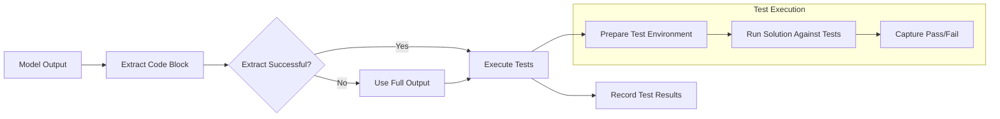

> 来源: [https://deepwiki.com/deepseek-ai/DeepSeek-Coder/4.2-mbpp-benchmark](https://deepwiki.com/deepseek-ai/DeepSeek-Coder/4.2-mbpp-benchmark)
> DeepWiki deepseek-ai/DeepSeek-Coder

# MBPP Benchmark

  Relevant source files 
 - [Evaluation/MBPP/eval_instruct.py](https://github.com/deepseek-ai/DeepSeek-Coder/blob/b7ba5659/Evaluation/MBPP/eval_instruct.py)
 - [Evaluation/MBPP/human_eval/evaluation.py](https://github.com/deepseek-ai/DeepSeek-Coder/blob/b7ba5659/Evaluation/MBPP/human_eval/evaluation.py)
 
  
## Purpose and Scope

 This document details the MBPP (Mostly Basic Python Problems) benchmark implementation in DeepSeek Coder. MBPP is a standard benchmark for evaluating code generation capabilities of language models specifically focused on basic Python programming tasks. The benchmark tests a model's ability to generate functionally correct Python code based on natural language problem descriptions and test cases.

 For information about other evaluation benchmarks used in DeepSeek Coder, see [HumanEval Benchmark](https://deepwiki.com/deepseek-ai/DeepSeek-Coder/4.1-humaneval-benchmark) and [LeetCode Evaluation](https://deepwiki.com/deepseek-ai/DeepSeek-Coder/4.3-leetcode-evaluation).

 
## Overview of the MBPP Dataset

 The MBPP benchmark in DeepSeek Coder uses a dataset of Python programming problems, each consisting of:

 
 - A task identifier
 - A natural language problem description
 - A list of test cases
 - A reference solution (for evaluation purposes)
 
 The evaluation focuses on problems from index 10 to 509 in the dataset, while using problems 1-3 as few-shot examples to guide the model.

 Sources: [Evaluation/MBPP/eval_instruct.py14-51](https://github.com/deepseek-ai/DeepSeek-Coder/blob/b7ba5659/Evaluation/MBPP/eval_instruct.py#L14-L51)

 
### Dataset Structure

 
```

```

 Sources: [Evaluation/MBPP/eval_instruct.py22-51](https://github.com/deepseek-ai/DeepSeek-Coder/blob/b7ba5659/Evaluation/MBPP/eval_instruct.py#L22-L51) [Evaluation/MBPP/eval_instruct.py86-119](https://github.com/deepseek-ai/DeepSeek-Coder/blob/b7ba5659/Evaluation/MBPP/eval_instruct.py#L86-L119)

 
## Evaluation Process

 The MBPP benchmark evaluation follows a systematic process to test code generation models:

 
### Prompt Construction

 The system constructs prompts with few-shot examples to guide the model. Each prompt includes:

 
 - Three example problems (index 1-3) with their descriptions, test cases, and solutions
 - The target problem description and test cases (without solution)
 
 The prompt structure uses a consistent template that encourages the model to generate a Python function for the given problem based on the examples provided.

 Sources: [Evaluation/MBPP/eval_instruct.py14-51](https://github.com/deepseek-ai/DeepSeek-Coder/blob/b7ba5659/Evaluation/MBPP/eval_instruct.py#L14-L51)

 
### Code Generation and Evaluation Flow

 
```

```

 Sources: [Evaluation/MBPP/eval_instruct.py65-87](https://github.com/deepseek-ai/DeepSeek-Coder/blob/b7ba5659/Evaluation/MBPP/eval_instruct.py#L65-L87) [Evaluation/MBPP/eval_instruct.py118-129](https://github.com/deepseek-ai/DeepSeek-Coder/blob/b7ba5659/Evaluation/MBPP/eval_instruct.py#L118-L129) [Evaluation/MBPP/human_eval/evaluation.py195-295](https://github.com/deepseek-ai/DeepSeek-Coder/blob/b7ba5659/Evaluation/MBPP/human_eval/evaluation.py#L195-L295)

 
## Key Components

 
### Prompt Template Structure

 The system uses a specific template for prompting the model:

 
```
Please refer the given examples and generate a python function for my problem.
Examples are listed as follows:
- Example 1:
>>> Problem:
[problem description]
>>> Test Cases:
[test cases]
>>> Code:
```python
[solution code]
```

 
 - Example 2: ...
 - Example 3: ...
 
 Here is my problem:

 
> > > Problem: [target problem description] Test Cases: [target test cases]

 
```
This structured format helps the model understand the expected output format and provides reference examples.

Sources: <FileRef file-url="https://github.com/deepseek-ai/DeepSeek-Coder/blob/b7ba5659/Evaluation/MBPP/eval_instruct.py#L40-L47" min=40 max=47 file-path="Evaluation/MBPP/eval_instruct.py">Evaluation/MBPP/eval_instruct.py:40-47</FileRef>

### Code Extraction and Testing



 The system attempts to extract code blocks surrounded by Python markdown tags (`python ...`) from the model's output. If extraction fails, the entire model output is used as the solution code. The solution is then evaluated for functional correctness.

 Sources: [Evaluation/MBPP/eval_instruct.py53-63](https://github.com/deepseek-ai/DeepSeek-Coder/blob/b7ba5659/Evaluation/MBPP/eval_instruct.py#L53-L63) [Evaluation/MBPP/human_eval/evaluation.py113-176](https://github.com/deepseek-ai/DeepSeek-Coder/blob/b7ba5659/Evaluation/MBPP/human_eval/evaluation.py#L113-L176)

 
## Metrics

 
### pass@k Evaluation

 The MBPP benchmark uses the pass@k metric, which estimates the probability that at least one of k independent generations will pass all test cases. For example:

 
 - pass@1: The probability that a single generation passes all tests
 - pass@10: The probability that at least one of 10 generations passes all tests
 - pass@100: The probability that at least one of 100 generations passes all tests
 
 The metric is calculated using the formula:

 
```
pass@k = 1 - comb(n - c, k) / comb(n, k)
```

 Where:

 
 - n is the number of samples per problem
 - c is the number of correct samples
 - k is the number of generations to consider
 
 Sources: [Evaluation/MBPP/human_eval/evaluation.py88-111](https://github.com/deepseek-ai/DeepSeek-Coder/blob/b7ba5659/Evaluation/MBPP/human_eval/evaluation.py#L88-L111) [Evaluation/MBPP/human_eval/evaluation.py279-295](https://github.com/deepseek-ai/DeepSeek-Coder/blob/b7ba5659/Evaluation/MBPP/human_eval/evaluation.py#L279-L295)

 
## Usage Guide

 To run the MBPP evaluation on a DeepSeek Coder model, use the `eval_instruct.py` script with the following parameters:

 
| Parameter | Description |
|---|---|
| --model | Model name or path (e.g., "deepseek-ai/deepseek-coder-6.7b-instruct") |
| --output_path | Path to save generation results |
| --temp_dir | Temporary directory for evaluation (default: "tmp") |

 Example command:

 
```

```

 Sources: [Evaluation/MBPP/eval_instruct.py131-139](https://github.com/deepseek-ai/DeepSeek-Coder/blob/b7ba5659/Evaluation/MBPP/eval_instruct.py#L131-L139)

 
## System Integration

 
```

```

 The MBPP benchmark integrates with the larger DeepSeek Coder evaluation system, providing standardized metrics that can be compared with other code generation models. The evaluation results help in assessing the model's Python code generation capabilities and identifying areas for improvement.

 Sources: [Evaluation/MBPP/eval_instruct.py89-129](https://github.com/deepseek-ai/DeepSeek-Coder/blob/b7ba5659/Evaluation/MBPP/eval_instruct.py#L89-L129)
