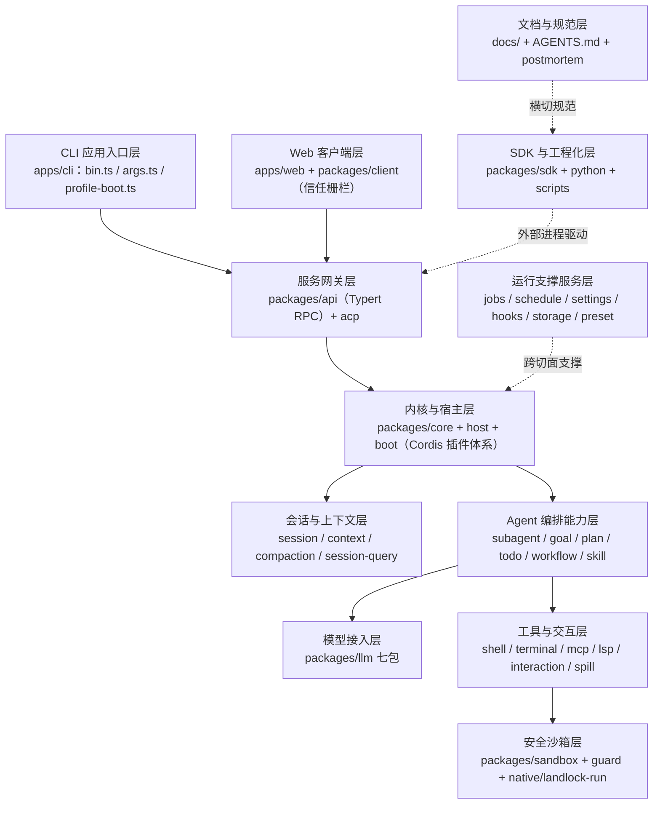

# DeepSeek Harness（dsh）新人上手指南

> 基于仓库 deepseek-ai/deepseek-harness（commit `76fda72`，v0.1.2-rc.1 developer preview）的 understand 知识图谱（12 层架构 / 16 步导览 / 3447 文件）与 DeepWiki 39 页文档生成。配套：同级 `../deepwiki/` 目录为 DeepWiki 全量转档。

## 1. 项目是什么

一句话定位：**DeepSeek Harness（dsh）是 DeepSeek AI 开源的 agent harness——把运行一个任务型 AI agent 所需的会话、模型接入、工具执行、沙箱隔离与 Web UI 全部做成插件，按 profile 组合出 Web、headless、SDK、ACP 四种产品形态的运行时框架。**

三个背景要点：

- **everything-is-a-plugin**：全仓两百来个 `@deepseek-ai/dsh-*` 包全部以 Cordis 插件形式挂载，没有硬编码的"核心功能"——连 bash 工具、系统提示词、会话标题都是插件。换能力 = 换组合文件，不改代码。
- **Cordis 内核**：插件体系来自 Cordis（时空可组合编程范式，论文 arXiv:2608.25512），源码钉版在 `vendor/`。核心概念是 Context / Fiber / Service / 事件 waterfall 与 `cordis.yml` 组合文件。
- **developer preview**：项目处于开发者预览期，明确"会有破坏性变更"，地基层（会话日志格式 `SESSION_FORMAT_VERSION=0`、SQLite schema）不做兼容承诺；运行前必读 `SAFETY.md`（未审计的实验性预览）。MIT 协议。

入口统一是 `dsh` 命令：`dsh web`（Web UI，默认 `127.0.0.1:3080`）、`dsh --profile headless "task"`（单任务直跑）、`dsh --profile sdk/acp`（供程序化驱动，如编辑器经 Agent Client Protocol 接入）、`dsh plugin`（插件管理，pnpm 转发器）。语言栈：TypeScript 主体 + Python SDK + C（Landlock 沙箱启动器），pnpm workspace 管理。

与常见"聊天客户端"不同，harness 的职责是把 agent 运行所需的工程地基一次做对并全部开放成插件位：会话如何持久化与恢复、上下文窗口如何预算与压缩、工具调用如何守卫与沙箱化、多代理如何委派与结算、人类如何审批与追问。dsh 把这些地基做成约 40 个能力缝（capability seam），每个缝都可替换实现或叠加插件——这也是它对插件开发者有吸引力的根本原因。

## 2. 快速上手

### npm 一键启动（先体验）

```sh
npx @deepseek-ai/dsh web        # 需 Node.js ^22.19 || >=24
```

启动后浏览器打开 http://127.0.0.1:3080，三步即可用（见 `docs/user/guide/index.md`）：

1. **Settings → Models** 填 DeepSeek API key（platform.deepseek.com），保存即生效、无需重启；
2. **Choose workspace** 添加项目目录并选中（未选工作区前 composer 不可用）；
3. 新建会话发任务，如"总结这个仓库并指出主要包"。Agent 可读写工作区文件、跑命令、委派子代理并维护计划；受权限策略约束的操作会先请求批准。

其他供应商与 OpenAI 兼容端点见 `docs/user/guide/providers.md`。

### 源码运行

```sh
git clone https://github.com/deepseek-ai/deepseek-harness.git
cd deepseek-harness
pnpm install && pnpm run build    # tsc 出 lib/types + tsdown 打 runtime
pnpm dsh web                      # 用已构建产物启动，不重建
pnpm dsh --profile headless "task"   # 需 DEEPSEEK_API_KEY
```

密钥约定：真实 API 的 e2e 与 demo 读 `DEEPSEEK_API_KEY`（可选 `DEEPSEEK_BASE_URL`）与仓库根 `.env`；没有 key 也能跑通绝大多数开发循环——单测、typecheck、无 key 快照回放（`test:snapshot`）与浏览器 replay 车道全部不依赖模型。`cordis.yml` 里允许 `!!js` 表达式（仅限插件 `config` 与 entry `disabled`），条件组合优先用 overlay patch 而非内联表达式。

### 目录速览

```
apps/       cli（dsh 入口与 profile 集成测试）、web（React 前端）
packages/   全部 dsh 工作区包，按 <组>/<包> 两级分组：
  core/       产品 API 主干：session、system-prompt、tools、agent、agent-loop
  api/        Typert RPC 网关与 session/workspace/settings 控制器；acp/
  llm/        LlmRuntime + DeepSeek/pi-ai 双适配器 + token-meter + llm-retry
  shell/ terminal/ mcp/ lsp/ fs/ web/    工具能力族
  sandbox/ guard/    沙箱与守护；native/  C 版 landlock-run
  subagent/ goal/ plan/ todo/ workflow/ skill/   编排能力族
  session/ context/ compaction/ session-query/   会话数据与上下文治理
  preset/ jobs/ schedule/ settings/ hooks/ storage/ identity/  支撑服务
  sdk/        TS SDK 三件套；python/  Python SDK 与打包 runtime
vendor/     Cordis 源码钉版副本      docs/  架构/子系统/烹饪书/用户指南
scripts/    质量门与生成器            .agents/  Agent 工作流与决策记录
```

## 3. 架构总览

知识图谱把全仓聚成 12 层（层名与图谱一致）：



读图四个要点：

- **组合先于代码**。`dsh` 只是启动器：`apps/cli/src/bin.ts` 按 invocation.mode 动态分发到 `profile-boot.ts`，后者把 patch 层按序堆叠（bundle 基座层 → profile 自带 `cordis.patch.yml` → `$DSH_HOME` 用户层 → `--patch` 命令行覆盖），组装成插件树再启动。`--dump-config` 可打印各层合成结果用于诊断（cordis.patch.yml 损坏时的恢复入口），live 模式下用户 patch 还支持 HMR 热重载。
- **capability seam 三角色**。几乎每个能力都拆成 Service Definition（契约，如 `packages/shell/shell` 定义 `ctx.shell`）、Service Provider（实现，如 bash-local / bash-sandbox）、Consumer（模型可见工具，如 tool-bash）三个包；角色独立演进、实现可替换，这是"一切皆插件"的具体形态。
- **模型可见 ⟺ 已记录**。任何进入模型请求的内容都必须能从 append-only 会话事件日志重建——全仓铁律，也是快照测试与录制回放的根基。
- **纵深防御**。工具执行默认经沙箱（Linux bwrap/Landlock、macOS Seatbelt、Windows ACL 受限令牌），越权操作走 fail-closed 审批缝，无可用 runner 时结构化报 `SANDBOX_UNAVAILABLE` 而非裸跑。

12 层可再归并为四段便于记忆：**入口双面**（CLI 应用入口层 + Web 客户端层，负责把人机输入变成协议调用）；**中枢**（服务网关层做程序化访问边界，内核与宿主层提供 Cordis 插件体系与产品 API 主干）；**四条能力纵深**（会话与上下文层管状态，Agent 编排能力层管协作，模型接入层管推理，工具与交互层加安全沙箱层管行动与隔离）；**横切两翼**（运行支撑服务层托底，SDK 与工程化层对外、文档与规范层对内）。读任何包之前先问一句"它在哪条线上"，定位会快很多。

另一个贯穿全仓的工程 motif 值得专门记下：**不变量伴生插件**。几乎每个包都在主实现之外附带一个 `invariant.ts` 伴生插件，在运行时持续校验自己声称的性质——例如 `agent-loop` 的伴生插件在每次模型调用前校验"循环构建的请求与 `session.deriveMessages()` 的持久推导完全一致"，任何分歧都判定为日志重建失步。读到某个包时顺手看它的 invariant 文件，是快速理解"这个包对外承诺了什么"的捷径。

## 4. 核心模块巡礼

按层各挑最重要的包（依据图谱 layerSamples 摘要）：

**CLI 应用入口层**——`apps/cli/src/bin.ts` 是一切表面的起点：读版本、解析 argv、按 invocation.mode 动态 import 三个 runner；`args.ts` 划清 launcher 旗标与应用参数的分界（`-h` 透传给被启动应用）；`profile-boot.ts` 是共享引导核心（patch 层堆叠 + fail-loud + 有界关停 + HMR watcher）。`apps/cli/tests/profiles/` 是跨包 profile 行为测试树：headless 车道用真实模型验证编码任务、todo、压缩、会话续接；acp 车道以真实子进程 + 真实 ACP SDK 客户端钉住 stdout 纯净性与权限升级全流程。

**Web 客户端层**——`apps/web/src/main.ts` 挂载浏览器应用，`preview.ts` 是亮点：在浏览器内构造 dsh-host Worker 并以打包 VFS 镜像握手，实现"仅浏览器、无 Node 宿主"的 Worker 部署形态；`vite.config.ts` 明确拒绝独立 serve、必须经 `dsh web` 宿主启动，这是理解双半区架构的钥匙。`apps/web/tests/` 有上百个真实 chromium e2e（replay 模式零模型调用、零 API key），本身就是学习产品行为最好的活文档。

**内核与宿主层**——`packages/core` 是产品 API 主干：`core/session` 定义事件溯源会话日志，消息历史由 `deriveMessages()` 派生而非单独存储，`surface.ts` 折叠模型可见消息面（含压缩 checkpoint 与工具结果改写）；`core/agent-loop` 是全仓唯一的具体 agent 循环，`agent.ts` 的 ReactLoopAgent phase 状态机（send/followup/steer/inject/cancel）与 `tool-calls.ts` 的并行/串行分组调度构成执行主路径；`core/tools` 的 ToolRuntime 管注册、allow/deny/ask 策略与 native/PTC 双模式分派。宿主侧 `host/webserver` + `frontend-static` 承接 Web 的 HTTP 路由与 SPA dist 服务。

**会话与上下文层**——`session/session-persistence-jsonl`：每会话一个仅追加 JSONL 文件（可选 zstd），跨进程 resume 靠重放事件日志"回忆"暗号级状态；`compaction/compaction-basic`：token 压力触发的自动压缩 + `/compact` 按需压缩，summarizer 让摘要调用复用提供方 KV Cache 前缀；`context/agent-instructions`：把用户全局与项目链 AGENTS.md 按字节预算注入首请求，文件触碰后增量协调；`session-query` 族提供 SQLite FTS5 全文检索与五个模型侧只读会话历史工具。

**模型接入层**——`llm/llm`：供应商中立的 `ctx.llm`，LlmRuntime 管适配器注册表、路由冻结与 waterfall 可拦截的流式调用，BlockAssembler 把流式 chunk 组装为最终消息；`llm/llm-deepseek`：DeepSeekAdapter 用 fetch+SSE 直连 chat-completions 端点，serialize/translate 双向翻译 wire 格式，支持 thinking 档位与视觉模型；`llm/llm-pi-ai`：多供应商孪生实现，二者互相验证 seam 契约完备性；`llm/token-meter`：回放感知的用量/上下文压力计量，驱动压缩决策。

**Agent 编排能力层**——`subagent/subagent`：统一一次性/可续接两类子代理，`child-agent.ts` 把父上下文的提示节序、工具限制与沙箱策略投影到子会话并守门递归深度（默认 3）；后端有 in-process、dsh-sdk 进程外、ACP、Claude Code、Codex 多种 provider。`workflow/workflow-worker-thread`：模型写 JS 编排脚本，在 Worker 线程 node:vm 沙箱里以 `agent()/parallel()/pipeline()/phase()/log()` 钩子扇出子代理。`goal`（每会话一个持久目标域，七种 CAS 变更动词）+ `plan/plan-mode`（`/plan` 审查式计划）+ `todo/tool-todo`（事件日志维护任务清单）三件套覆盖长任务治理。

**工具与交互层**——`shell/tool-bash`：模型可用的 bash 工具（参数校验→沙箱策略解析→升级审批→前台运行或后台作业）；`mcp/mcp-client`：以代际模型管理外部 MCP 服务器连接，工具按"服务器名__工具名"注册；`lsp`：语言服务 seam，四种语义操作供模型做代码导航；`interaction`：user-approval（fail-closed 一次性审批缝，审计事件对入日志）、commands（斜杠命令）、ask-user（模型向人类提问）。

**安全沙箱层**——`sandbox/sandbox-local`：在 bwrap/Landlock/Seatbelt/Windows ACL 四种 runner 间探测选择并管理临时目录生命周期；`native/landlock-run`：musl 静态 C11 单文件启动器，对自身施加 Landlock 限制后 exec 包裹命令，处处 fail-closed（125 退出码契约）；`guard/`：repeat-tool-reminder（同参重复调用只提醒不阻断）与 timeout-policy（协作式超时）。

**服务网关层**——`api/gateway`：双面 Typert RPC 端点（Host 服务 `ctx.typertGateway` / Client 代理 `ctx.remote`），WebSocket 多路复用；`api/session-controller`：汇聚会话冷读、命令面与实时控制（历史分页、prompt、取消）；`packages/client/connection`：浏览器↔宿主信任模型——Host/Origin 校验防 DNS rebinding，launch token 一次性兑换 HMAC cookie。

**运行支撑服务层 / SDK 与工程化层**——`preset/agent-presets`：预设目录（单个 `agent.cordis.yml`）按会话组装 agent 的工具/提示段/技能，内置 standard/minimal/ptc/cordis 四预设，`mount.ts` 实现 PresetTree 子树挂载与挂载后审计；`jobs`（后台任务注册表 + 模型侧 job_output/job_list/job_kill，空闲 owner 自动唤醒回合）、`settings/settings-file`（单文档多命名空间、文件锁+原子写+外部编辑热发布）、`hooks`（Claude Code / Codex 钩子桥，复用既有 hooks.json）。`packages/sdk` 三件套（protocol 线协议 / client / server）让外部进程经 stdio JSON-RPC 驱动完整 harness——server 插件 prompt 懒建 agent+session 并把会话/子代理事件转发为线通知；`python/sdk-runtime` 把打包的原生可执行直接带给 pip 用户。

**文档与规范层**——dsh 的文档本身就是分层产品：`docs/architecture.md` 是有序地图（改 packages/ 前必读）；`docs/subsystems/` 40+ 页每子系统一页的类型级参考（含生成的 Cordis API）；`docs/cookbook/` 步骤式烹饪书；`.agents/notes/` 决策记录（每个非平凡变更的同 PR 附件）；`docs/postmortem/` 事故复盘。四篇复盘都极有教学价值——例如 0001 讲"178 个单测全绿、行覆盖 100% 仍逃逸"的 Loader 路径缺陷，0002 讲 `!!js` 表达式只插值 config 不插值 entry 元数据导致文件系统工具全禁用。

## 5. 关键数据流：一次用户请求的旅程

以 Web UI 发一条消息为例（串自图谱 16 步导览）：

1. **入口与信任**：浏览器 composer 输入 → `packages/client/connection` 走信任栅栏（launch token 兑换签名 cookie）→ 经 `api/gateway` 的 Typert Remote 发出 session prompt 命令。
2. **会话与 Agent 激活**：`session-controller/src/agent.ts` 解析该会话的 preset 组合并激活 agent（AgentRegistry，initiator 作用域，一个会话一个 scope）；消息入 agent inbox，`agent-loop` 认领提示开启 turn（`turn/start` 落日志）。
3. **上下文组装**：`system-prompt.assemble()` 收集插件提示段（harness 身份、persona、AGENTS.md 指令、技能目录、时间上下文…）与工具 schema；`session/surface.ts` 从事件日志折叠模型可见消息面。
4. **模型调用**：请求经 `ctx.llm.stream()` 的 waterfall（重试策略、请求扩展在此可拦截）→ DeepSeekAdapter 发 fetch+SSE → 流式 chunk 一边回传 UI 一边被 BlockAssembler 组装；usage 由 token-meter 从事件记账。
5. **工具执行**：模型产出 tool_calls → ToolRuntime 校验策略 → `tool-bash` 解析沙箱策略 → `ctx.shell` → bash-sandbox → sandbox-local 选定 runner（Linux 上即 landlock-run 包裹 exec）→ 命令在受限文件系统内运行；越权写触发审批缝，经用户批准才落盘，拒绝则文件永不出现。结果规范化为 canonical 输出并作为工具结果事件追加日志。
6. **循环与结算**：agent-loop 视工具结果决定下一步或收尾；`turn/end` 后事件经 gateway 流回浏览器，projection-store 按"高 seq 胜"推送会话投影更新 UI。同一份日志同时被 JSONL 持久化（崩溃恢复/跨进程 resume）、被 session-query 索引（全文检索）、被 compaction 监控（压力超阈值自动压缩）。

两条补充路径值得知道：**中断与恢复**——进程被杀后重开，`session/repair.ts` 会为中断回合生成规范收尾事件，checkpoint 策略保证回合边界一致，resume 后模型只能从重放的事件日志"回忆"上下文（headless 的 resume e2e 用"暗号"验证过这一点）；**headless 变体**——CLI 单任务模式下同一条链路不经过浏览器：`bin.ts` 直接引导 headless profile，prompt 来自 argv，结果写 stdout，适合脚本化与基准测试。

UI、日志、SDK 通知全是同一事件日志的投影——理解这一点就理解了 dsh 的设计重心。

## 6. 推荐学习路径

### 路线 A：插件开发者（写工具/钩子/适配器）

1. `README.md` + `docs/cordis-primer.md`（五个核心概念、waterfall 语义、cordis.yml——全仓最重要入门篇）；
2. 跟跑 `docs/cordis-tutorial/` 七章教程（无需 API key，第 7 章直通 harness）；
3. `docs/user/develop/basic/`（config / tool / publish 三篇）+ `docs/capability-seams.md`（每个 ctx.* 服务的提供者/消费者地图）；
4. 按需选烹饪书：`docs/cookbook/adding-a-tool.md`、`adding-an-llm-adapter.md`、`extension-cookbook.md`（工具/hook/UI/外部协议四种扩展形态）；
5. 对照 `packages/preset/agent-presets/presets/standard/agent.cordis.yml` 与 `apps/cli/composition.md`（约 80 个插件行的组合清单）看"一切皆插件"落到实物；
6. 用 `dsh plugin add`（pnpm 转发器）装自己的包，验证 bundle 声明自动激活；
7. DeepWiki 补课：2.2 Plugin Composition、7.2 MCP Client Hooks & Skills 两章。

### 路线 B：贡献者（给主仓提 PR）

1. `AGENTS.md`（工程约定总纲：注册即 effect、waterfall 必调 `next()`、模型可见⟺已记录、插件而非循环改动…）+ `CONTRIBUTING.md`；
2. `docs/architecture.md`（改 `packages/` 前必读）+ `docs/glossary.md` 建立术语；
3. `docs/development.md` 跑通本地环境，先让 `pnpm run test && pnpm run typecheck` 绿；
4. `docs/testing.md`（分层测试政策：per-file 100% 覆盖门、快照归属、真实实现优先于 mock）；
5. 目标子系统读 `docs/subsystems/<name>.md`（40+ 页类型级参考）与对应包 README；
6. `docs/defensive-patterns.md` + `docs/postmortem/`（四篇真实事故复盘）培养防御直觉；
7. 规矩：非平凡变更同 PR 附 Agent Note（`.agents/notes/`），文档同步过 `pnpm run doc-sync`，推送前按 dsh-pre-push-checks 只跑相关检查、不默认全量套件。

### 路线 C：部署使用者（把 dsh 用进工作流）

1. `npx @deepseek-ai/dsh web` 跑通 + `docs/user/guide/index.md`（key/工作区/任务三步）；
2. `docs/user/guide/providers.md` 配多供应商或自定义 OpenAI 兼容端点；
3. 场景指南：`github-review.md`（PR 审查 webhook）、`mcp-memory.md`（记忆类 MCP）、`schedule.md`（定时提醒）、`network-proxy.md`；
4. `apps/cli/README.md` + `apps/cli/reference/README.md` 掌握 headless/sdk/acp 各 profile 与 patch 层序；
5. `docs/user/guide/python-sdk.md` + `python/sdk-runtime/README.md` 用 Python 驱动完整 runtime；
6. 安全基线：`SAFETY.md` + `docs/subsystems/permission-presets.md`（sandbox/approval 双旋钮预设）。

三条路线共通的三个习惯：**先用 `dsh --profile <name> --dump-config` 看组合**——你关心的 profile 到底挂了哪些插件，答案永远在这份转储里，比猜源码快十倍；**改行为先查事件词汇表**——`SessionEventMap` 靠声明合并扩展，任何模型可见的新输入都要有对应会话事件，先在图谱/子系统文档里确认事件名再动手；**无 key 验证优先**——本地优先跑单测与 replay 快照，把带 key 的真实 API 验证留到最后一步，这与仓库自身的测试政策一致。

## 7. 开发工作流

- **包管理**：pnpm workspace（`pnpm-workspace.yaml`）；所有包命名 `@deepseek-ai/dsh-<name>` 且 `private: true`，Cordis 为 peerDependency；ESM only（`"type": "module"`），`dsh` 源码启动走 tsx 的 ESM hook。
- **构建**：`pnpm run build` = tsc 产出 `lib/` 与类型，tsdown 打包 runtime（Host/Client 双面，见根 `tsdown.config.ts`）；`clean`、`hygiene`（publint + 依赖检查）；Web 开发热循环用 `scripts/dev-web.ts` 三阶段监视构建。
- **测试**（vitest 多配置）：`pnpm run test` 单测；`test:coverage` 是 CI 覆盖门（`packages/*/*/src` per-file 100%）；`test:e2e` 真实 API，无 `DEEPSEEK_API_KEY` 自动跳过；`test:snapshot` 无 key 录制会话回放（`-t` 过滤，`test:snapshot:record` 带 key 重录）；`test:expected` owner-local 期望输出。Web 浏览器 e2e 用真实 chromium + replay/record/refresh 三模式车道。两条配套纪律：每个非平凡的模型可见或用户可见变更都要更新一条无 key 录制会话快照；agent-loop、会话生命周期或 `SessionEventMap` 的改动必须在同一 PR 里同步更新 TypeScript 与 Python 两个 SDK 的期望输出。
- **质量门**：`typecheck` / `lint`（oxlint）/ `duplication`（跨文件克隆检测）/ `doc-sync`（文档全门禁：链接、type-equiv、字数预算等）；统一调度在 `scripts/run-gates.ts`。测试写"行为"而非"正确性"，行为变更连同测试一起改。
- **Git 钩子**：lefthook 管 pre-commit（如尾随换行检查）；推送前按 `.agents/skills/dsh-pre-push-checks` 匹配证据面跑聚焦检查——CI 负责穷尽覆盖，本地不重复全量。
- **i18n 双语**：docs 每篇 `x.md` + `x.zh.md` + `x.i18n.yaml` 配对更新，术语真源在 `docs/i18n/terminology.md`；客户端 UI 文案必须走类型化字典，`verify-client-ui-i18n` 拒绝硬编码。

## 8. 延伸资源

**DeepWiki 39 页导读**（本地 `../deepwiki/`，INDEX.md 有全表）：

| 章 | 页面 | 适合 |
|---|---|---|
| 1 Overview | 1-3（总览/上手/monorepo 结构） | 第一站 |
| 2 Core Architecture | 5-8（Cordis、插件组合、事件总线与 capability seams） | 架构入门 |
| 3 Agent System | 9-14（循环、工具注册、会话日志、subagent、LLM 适配器） | 核心中的核心 |
| 4 Execution Environment | 15-18（文件系统、shell/终端、沙箱安全） | 安全必读 |
| 5 API Layer | 19-22（网关、Typert 类型安全 RPC、客户端运行时） | 集成开发 |
| 6 Web UI | 23-27（会话界面、工作区、设置与预设） | 前端贡献 |
| 7 Extensions | 28-32（ACP、MCP/hooks/skills、编排工具、Python SDK） | 扩展生态 |
| 8-9 质量与文档 | 33-39（测试体系、CI/CD、双语文档与校验门） | 贡献流程 |

**related 仓**：`related/cordis.md`（底层组合式框架，everything-is-a-plugin 的根基）、`related/mcp-servers.md`（MCP 官方服务器生态，mcp 包对接的外部工具源）、`related/deepseek-v32.md`（dsh 接入的主力模型家族）。

**官方渠道**：文档站 https://deepseek-harness.github.io/deepseek-harness/ （VitePress，由 docs/ 投影）；GitHub Discussions 反馈与报 bug；插件仓打 `dsh-plugin` topic 进入生态发现；Discord 社区 https://discord.gg/Ycq5dCaS4 。

**仓内进阶阅读**：`docs/graph-atlas.md` / `module-graph.md`（生成模块图谱）、`docs/agent-lifecycle.md`（回合时序图）、`docs/tool-execution-pipeline.md`（工具管线全图）、`docs/postmortem/`（事故复盘）、`BENCHMARK.md`（基准说明）。

祝上手顺利：从 `npx @deepseek-ai/dsh web` 开始，按导览逐层深入，两周内你就能在这个仓库里自由行走了。
