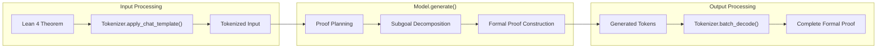

> 来源: [https://deepwiki.com/deepseek-ai/DeepSeek-Prover-V2/3.2-inference-guide](https://deepwiki.com/deepseek-ai/DeepSeek-Prover-V2/3.2-inference-guide)
> DeepWiki deepseek-ai/DeepSeek-Prover-V2

# Inference Guide

  Relevant source files 
 - [DeepSeek_Prover_V2.pdf](https://github.com/deepseek-ai/DeepSeek-Prover-V2/blob/36acbf5d/DeepSeek_Prover_V2.pdf)
 - [README.md](https://github.com/deepseek-ai/DeepSeek-Prover-V2/blob/36acbf5d/README.md?plain=1)
 
  This guide provides detailed instructions for using DeepSeek-Prover-V2 models to generate formal mathematical proofs in Lean 4. It covers model loading, input formatting, inference execution, and output processing. For information about the training methodology and architecture, see the [Training Pipeline](https://deepwiki.com/deepseek-ai/DeepSeek-Prover-V2/3.1-training-pipeline) page.

 
## Model Overview

 DeepSeek-Prover-V2 is available in two variants:

 
| Model | Parameters | Base Architecture | Context Length | Features |
|---|---|---|---|---|
| DeepSeek-Prover-V2-7B | 7 billion | DeepSeek-Prover-V1.5-Base | 32K tokens | Efficient, suitable for most proofs |
| DeepSeek-Prover-V2-671B | 671 billion | DeepSeek-V3-Base | Standard | State-of-the-art performance |

 Sources: [README.md94-97](https://github.com/deepseek-ai/DeepSeek-Prover-V2/blob/36acbf5d/README.md?plain=1#L94-L97)

 
## Inference Process

 The following diagram illustrates the end-to-end inference process for generating formal proofs with DeepSeek-Prover-V2:

 
```

```

 Sources: [README.md114-163](https://github.com/deepseek-ai/DeepSeek-Prover-V2/blob/36acbf5d/README.md?plain=1#L114-L163)

 
## Basic Usage

 
### Setup and Installation

 First, ensure you have the necessary dependencies installed:

 
```

```

 
### Loading the Model

 The following code demonstrates how to load a DeepSeek-Prover-V2 model:

 
```

```

 Sources: [README.md124-126](https://github.com/deepseek-ai/DeepSeek-Prover-V2/blob/36acbf5d/README.md?plain=1#L124-L126) [README.md155-156](https://github.com/deepseek-ai/DeepSeek-Prover-V2/blob/36acbf5d/README.md?plain=1#L155-L156)

 
### Input Preparation

 The input to DeepSeek-Prover-V2 consists of a theorem statement in Lean 4 syntax. The model is designed to accept inputs formatted as chat messages:

 
```

```

 Here's how to prepare the input:

 
```

```

 Before producing the Lean 4 code to formally prove the given theorem, provide a detailed proof plan outlining the main proof steps and strategies. The plan should highlight key ideas, intermediate lemmas, and proof structures that will guide the construction of the final formal proof. """.strip()

 
# 3. Format as chat message

 chat = [ {"role": "user", "content": prompt.format(formal_statement)}, ]

 
```
Sources: <FileRef file-url="https://github.com/deepseek-ai/DeepSeek-Prover-V2/blob/36acbf5d/README.md?plain=1#L127-L153" min=127 max=153 file-path="README.md">README.md:127-153</FileRef>

### Generating Proofs

Once the input is prepared, you can generate the proof as follows:

```python
# 1. Apply the chat template and tokenize
inputs = tokenizer.apply_chat_template(
    chat,
    tokenize=True,
    add_generation_prompt=True,
    return_tensors="pt"
).to(model.device)

# 2. Generate the response
outputs = model.generate(
    inputs,
    max_new_tokens=8192  # Ensure enough tokens for complete proofs
)

# 3. Decode the output
proof = tokenizer.batch_decode(outputs)[0]
print(proof)
```

 Sources: [README.md156-162](https://github.com/deepseek-ai/DeepSeek-Prover-V2/blob/36acbf5d/README.md?plain=1#L156-L162)

 
### Complete Example

 Here's a full example demonstrating the entire inference process:

 
```

```

 Before producing the Lean 4 code to formally prove the given theorem, provide a detailed proof plan outlining the main proof steps and strategies. The plan should highlight key ideas, intermediate lemmas, and proof structures that will guide the construction of the final formal proof. """.strip()

 
# 4. Create chat message

 chat = [ {"role": "user", "content": prompt.format(formal_statement)}, ]

 
# 5. Process and generate

 inputs = tokenizer.apply_chat_template(chat, tokenize=True, add_generation_prompt=True, return_tensors="pt").to(model.device)

 start = time.time() outputs = model.generate(inputs, max_new_tokens=8192) print(f"Generation time: {time.time() - start} seconds")

 
# 6. Print result

 proof = tokenizer.batch_decode(outputs)[0] print(proof)

 
```
Sources: <FileRef file-url="https://github.com/deepseek-ai/DeepSeek-Prover-V2/blob/36acbf5d/README.md?plain=1#L119-L163" min=119 max=163 file-path="README.md">README.md:119-163</FileRef>

## Advanced Configuration

### Model Architecture and Processing Flow

The following diagram illustrates how DeepSeek-Prover-V2 processes inputs and generates formal proofs:



 Sources: [README.md44-67](https://github.com/deepseek-ai/DeepSeek-Prover-V2/blob/36acbf5d/README.md?plain=1#L44-L67) [README.md155-162](https://github.com/deepseek-ai/DeepSeek-Prover-V2/blob/36acbf5d/README.md?plain=1#L155-L162)

 
### Generation Parameters

 You can customize the proof generation process by adjusting the following parameters:

 
```

```

 
### Memory Requirements and Optimization

 The memory requirements vary significantly between model sizes:

 
| Model | Approximate Memory Usage (BF16) | Recommended GPU Configuration |
|---|---|---|
| DeepSeek-Prover-V2-7B | 14-16 GB | Single GPU with 16+ GB VRAM |
| DeepSeek-Prover-V2-671B | 1.2+ TB | Multi-GPU system or cloud setup |

 For memory-constrained environments, consider these optimizations:

 
 - Use `device_map="auto"` for automatic model sharding across GPUs
 - Use BF16 or FP16 precision with `torch_dtype=torch.bfloat16`
 - For 671B model, consider cloud solutions with sufficient GPU memory
 
 
## Troubleshooting

 
### Common Issues

 
 - **Out of Memory Errors**

 
 - Switch to a smaller model variant
 - Reduce batch size to 1
 - Use lower precision (BF16/FP16)
 - Use `device_map="auto"` for multi-GPU usage
 - **Incomplete or Incorrect Proofs**

 
 - Increase `max_new_tokens` beyond the default 8192
 - Use a lower temperature (0.1-0.3) for more deterministic outputs
 - Provide more detailed instructions in the prompt
 - Include relevant mathematical background in the prompt
 - **Slow Generation**

 
 - Proof generation can take several minutes, especially for complex theorems
 - Generation time increases with `max_new_tokens`
 - The 7B model offers faster generation at the cost of some performance
 
 Sources: [README.md66-67](https://github.com/deepseek-ai/DeepSeek-Prover-V2/blob/36acbf5d/README.md?plain=1#L66-L67) [README.md160](https://github.com/deepseek-ai/DeepSeek-Prover-V2/blob/36acbf5d/README.md?plain=1#L160-L160)

 
## Integration with Lean 4

 To verify the generated proofs, you need to have Lean 4 installed. The typical workflow is:

 
 - Generate the proof using DeepSeek-Prover-V2
 - Save the complete proof (including the initial imports and theorem statement) to a `.lean` file
 - Verify the proof using Lean 4's verification tools
 
 For complex proofs, DeepSeek-Prover-V2 implements a recursive theorem proving approach, breaking down complex problems into manageable subgoals. This technique is especially effective for challenging theorems that would be difficult to prove directly.

 Sources: [README.md54-59](https://github.com/deepseek-ai/DeepSeek-Prover-V2/blob/36acbf5d/README.md?plain=1#L54-L59)
