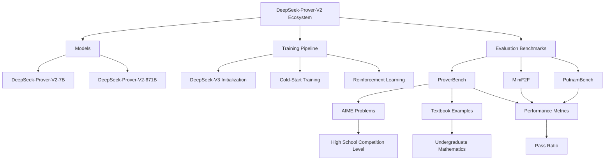

> 来源: [https://deepwiki.com/deepseek-ai/DeepSeek-Prover-V2/4.1-proverbench-dataset](https://deepwiki.com/deepseek-ai/DeepSeek-Prover-V2/4.1-proverbench-dataset)
> DeepWiki deepseek-ai/DeepSeek-Prover-V2

# ProverBench Dataset

  Relevant source files 
 - [README.md](https://github.com/deepseek-ai/DeepSeek-Prover-V2/blob/36acbf5d/README.md?plain=1)
 - [figures/performance.png](https://github.com/deepseek-ai/DeepSeek-Prover-V2/blob/36acbf5d/figures/performance.png)
 
  This document details the ProverBench dataset, a benchmark collection developed for evaluating formal theorem proving capabilities in the DeepSeek-Prover-V2 system. For information about other evaluation benchmarks like MiniF2F, see [MiniF2F Solutions](https://deepwiki.com/deepseek-ai/DeepSeek-Prover-V2/4.2-minif2f-solutions).

 
## 1. Overview

 ProverBench is a comprehensive benchmark dataset comprising 325 formally verified mathematical problems implemented in Lean 4. It was designed to provide a diverse evaluation framework that spans both high-school competition problems and undergraduate-level mathematics across multiple domains.

 The dataset serves as a key evaluation metric for the DeepSeek-Prover-V2 models, offering a standardized way to assess their formal theorem proving capabilities across varied mathematical domains and difficulty levels.

 
```

```

 Sources: [README.md71-92](https://github.com/deepseek-ai/DeepSeek-Prover-V2/blob/36acbf5d/README.md?plain=1#L71-L92)

 
## 2. Dataset Composition

 ProverBench consists of two main categories of problems:

 
 - **AIME Competition Problems (15)**: Formalized problems from the American Invitational Mathematics Examination (AIME) competitions, specifically from AIME 24 and 25. These problems represent authentic high-school competition-level challenges, primarily focused on number theory and algebra.
 - **Textbook Examples (310)**: Problems drawn from curated textbooks and educational tutorials, covering a wide range of undergraduate-level mathematics domains.
 
 The dataset's domain distribution is carefully balanced to ensure comprehensive coverage across mathematical fields:

 
| Domain | Number of Problems |
|---|---|
| AIME 24 & 25 | 15 |
| Number Theory | 40 |
| Elementary Algebra | 30 |
| Linear Algebra | 50 |
| Abstract Algebra | 40 |
| Calculus | 90 |
| Real Analysis | 30 |
| Complex Analysis | 10 |
| Functional Analysis | 10 |
| Probability | 10 |
| Total | 325 |

 Sources: [README.md71-92](https://github.com/deepseek-ai/DeepSeek-Prover-V2/blob/36acbf5d/README.md?plain=1#L71-L92)

 
## 3. Problem Structure and Formalization

 Each problem in ProverBench is formalized in Lean 4, a dependently typed functional programming language and theorem prover. Problems follow a standard structure that includes:

 
 - Required imports from Mathlib (Lean's mathematical library)
 - A natural language description of the problem
 - A formal theorem statement in Lean 4 syntax
 - A `sorry` placeholder to be replaced with the formal proof
 
 
```

```

 The problems range from high-school competition level (AIME) to advanced undergraduate mathematics, with formalized theorem statements that capture the essence of the mathematical problems while adhering to Lean 4's type system and syntax requirements.

 Example problem structure:

 
```
import Mathlib
import Aesop

set_option maxHeartbeats 0

open BigOperators Real Nat Topology Rat

/-- What is the positive difference between $120\%$ of 30 and $130\%$ of 20? Show that it is 10.-/
theorem mathd_algebra_10 : abs ((120 : ℝ) / 100 * 30 - 130 / 100 * 20) = 10 := by
  sorry
```

 Sources: [README.md126-138](https://github.com/deepseek-ai/DeepSeek-Prover-V2/blob/36acbf5d/README.md?plain=1#L126-L138)

 
## 4. Usage in Model Evaluation

 ProverBench serves as a critical evaluation benchmark for assessing the theorem-proving capabilities of models like DeepSeek-Prover-V2. The evaluation process generally follows these steps:

 
 - The model is presented with a formalized theorem statement from ProverBench
 - The model generates a formal proof in Lean 4
 - The generated proof is verified for correctness using the Lean 4 theorem prover
 - Performance is measured by the pass ratio (percentage of successfully proven theorems)
 
 
```

```

 ProverBench complements other standard benchmarks in the formal theorem proving domain, such as:

 
 - **MiniF2F**: A collection of formal mathematics statement translations from informal mathematics
 - **PutnamBench**: Problems from the William Lowell Putnam Mathematical Competition
 
 Together, these benchmarks provide a comprehensive evaluation suite for assessing the capabilities of formal theorem proving models across various difficulty levels and mathematical domains.

 Sources: [README.md44-48](https://github.com/deepseek-ai/DeepSeek-Prover-V2/blob/36acbf5d/README.md?plain=1#L44-L48) [README.md117-163](https://github.com/deepseek-ai/DeepSeek-Prover-V2/blob/36acbf5d/README.md?plain=1#L117-L163)

 
## 5. Dataset Access and Usage

 The ProverBench dataset is publicly available through Hugging Face Datasets:

 
```
deepseek-ai/DeepSeek-ProverBench
```

 The dataset can be used to:

 
 - Evaluate theorem-proving models like DeepSeek-Prover-V2
 - Train new models or fine-tune existing ones
 - Benchmark progress in formal mathematical reasoning capabilities
 - Study patterns in formal theorem proving
 
 The following code demonstrates how to load a problem from ProverBench and use DeepSeek-Prover-V2 to generate a proof:

 
```

```

 Before producing the Lean 4 code to formally prove the given theorem, provide a detailed proof plan outlining the main proof steps and strategies. The plan should highlight key ideas, intermediate lemmas, and proof structures that will guide the construction of the final formal proof. """

 chat = [ {"role": "user", "content": prompt.format(formal_statement)}, ]

 inputs = tokenizer.apply_chat_template(chat, tokenize=True, add_generation_prompt=True, return_tensors="pt").to(model.device) outputs = model.generate(inputs, max_new_tokens=8192) proof = tokenizer.batch_decode(outputs)[0]

 
```
Sources: <FileRef file-url="https://github.com/deepseek-ai/DeepSeek-Prover-V2/blob/36acbf5d/README.md?plain=1#L107-L112" min=107 max=112 file-path="README.md">README.md:107-112</FileRef> <FileRef file-url="https://github.com/deepseek-ai/DeepSeek-Prover-V2/blob/36acbf5d/README.md?plain=1#L117-L163" min=117 max=163 file-path="README.md">README.md:117-163</FileRef>

## 6. Significance and Role in the Ecosystem

ProverBench plays a vital role in the DeepSeek-Prover-V2 ecosystem by providing:

1. **Diverse Evaluation**: Spans multiple mathematical domains and difficulty levels, offering a comprehensive assessment of model capabilities
2. **Educational Progression**: Covers the progression from high-school competition problems to undergraduate mathematics
3. **Standardized Benchmarking**: Enables consistent comparison between different models and approaches
4. **Domain Coverage**: Ensures models can handle varying mathematical domains, from elementary algebra to advanced topics like functional analysis



 The inclusion of both competition problems and textbook examples makes ProverBench particularly valuable for evaluating how well models can bridge the gap between competition-style mathematical reasoning and more structured academic mathematical knowledge.

 Sources: [README.md40-68](https://github.com/deepseek-ai/DeepSeek-Prover-V2/blob/36acbf5d/README.md?plain=1#L40-L68) [README.md71-92](https://github.com/deepseek-ai/DeepSeek-Prover-V2/blob/36acbf5d/README.md?plain=1#L71-L92)
