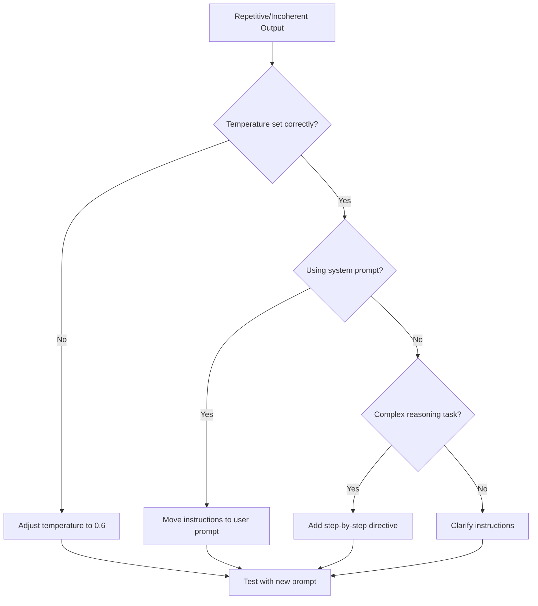

> 来源: [https://deepwiki.com/deepseek-ai/DeepSeek-R1/3.3-prompting-guidelines](https://deepwiki.com/deepseek-ai/DeepSeek-R1/3.3-prompting-guidelines)
> DeepWiki deepseek-ai/DeepSeek-R1

# Prompting Guidelines

  Relevant source files 
 - [README.md](https://github.com/deepseek-ai/DeepSeek-R1/blob/0cf78561/README.md?plain=1)
 
  This document outlines best practices for constructing effective prompts when using the DeepSeek-R1 family of models. Following these guidelines will help ensure optimal performance across various tasks, particularly for reasoning, mathematics, and code generation. For information about accessing the models, see [Model Access](https://deepwiki.com/deepseek-ai/DeepSeek-R1/3.1-model-access), and for local deployment instructions, see [Local Deployment](https://deepwiki.com/deepseek-ai/DeepSeek-R1/3.2-local-deployment).

 
## 1. General Prompting Recommendations

 The DeepSeek-R1 models have specific preferences for how prompts should be structured to achieve optimal performance. The following guidelines apply to all models in the DeepSeek-R1 family, including the distilled versions.

 
### 1.1 Key Recommendations

 
| Parameter | Recommendation | Notes |
|---|---|---|
| Temperature | 0.5-0.7 (0.6 recommended) | Prevents endless repetitions or incoherent outputs |
| System Prompts | Avoid using | All instructions should be contained within the user prompt |
| Evaluation | Conduct multiple tests | Average results for more accurate performance assessment |
| Response Format | Enforce thinking pattern | Start response with `\nFinal Answer"] |

 
```
end

"Reasoning Prompt Structure" --> "Model Processing"
```

 
```
Sources: [README.md:195-196]()

## 3. Special Use Case Templates

The DeepSeek-R1 models support specialized prompting templates for specific use cases, such as file upload and web search.

### 3.1 File Upload Template

When working with file uploads, use the following template structure:
```

 [file content begin] {file_content} [file content end] {question}

 
```
Where:
- `{file_name}` is the name of the uploaded file
- `{file_content}` is the content of the file
- `{question}` is the user's question about the file

Sources: [README.md:202-209]()

### 3.2 Web Search Templates

The DeepSeek-R1 models use different templates for web search queries depending on the language.

#### Chinese Web Search Template

A specialized template for handling web search in Chinese, including citation formatting and response structure guidelines.

#### English Web Search Template  

A structured template for English web search queries, with similar citation formatting and response structure guidelines.

Sources: [README.md:212-254]()

## 4. Troubleshooting Common Issues

### 4.1 Repetitive or Incoherent Outputs

If the model produces repetitive or incoherent outputs:

1. Verify that the temperature is set between 0.5-0.7 (preferably 0.6)
2. Ensure all instructions are in the user prompt (not in a system prompt)
3. For complex reasoning tasks, explicitly instruct the model to think step by step



 Sources: README.md:187-196

 
### 4.2 Bypassing Thinking Pattern

 If the model bypasses the thinking pattern:

 
 - Explicitly instruct the model to start its response with `<think>\n`
 - Use clear directives such as "Think through this problem step by step, starting with `<think>`"
 
 Sources: README.md:195-196

 
## 5. Evaluation Settings

 When evaluating the DeepSeek-R1 models on benchmarks or comparing performance:

 
 - Set temperature to 0.6
 - Set top-p to 0.95
 - For sampling-based evaluations, generate 64 responses per query to estimate pass@1
 - Maximum generation length should be set to 32,768 tokens
 
 Sources: README.md:101-103

 
## 6. Comparison with Standard Prompting Approaches

 The DeepSeek-R1 models differ from many other language models in their prompting preferences, particularly in their approach to system prompts and reasoning patterns.

 
```

```

 Sources: README.md:187-196

 This specialized prompting approach is designed to leverage the advanced reasoning capabilities of the DeepSeek-R1 family of models, which were trained using reinforcement learning techniques specifically to enhance reasoning performance.

 
```

```
