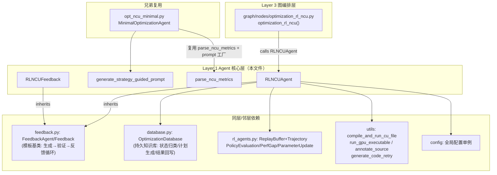

# 深解 `src/kernelblaster/agents/opt_ncu_rl.py` — RL 优化主循环

> 基于知识图谱（`.understand-anything/knowledge-graph.json`）节点 `file:src/kernelblaster/agents/opt_ncu_rl.py`（complexity: complex，tags: entry-point / rl-loop / 优化agent）+ 1672 行源码全文。

## ① 角色定位：Agent 核心层的"心脏"

在 10 层架构中，本文件位于 **Layer 1「Agent 核心层」**（7 个节点），是整个 MAIC-RL（Memory-Augmented In-context RL，arXiv:2602.14293）框架的执行心脏。它存在的原因：上游 LangGraph 编排层（`graph/nodes/optimization_rl_ncu.py`）把 KernelBench 的 `init.cu` + `driver.cpp` 交给它，它负责跑完整的"RL 式探索"——多条并发 rollout、每步 LLM 生成优化 kernel、NCU 实测定 reward、结果回写持久知识库。README 声称的 geomean 1.43x(L1)/2.50x(L2)/1.50x(L3) 加速，产出直接由本文件的 `run()` 落盘（`success_rl_optimization.cu` / `failure_rl_optimization.cu`）。

## ② 内部结构（4 个顶层成员）

| 成员 | 类型 | 职责 |
|---|---|---|
| `parse_ncu_metrics()` | function | 正则解析 NCU 文本日志为 10 项指标 dict（memory/compute throughput、occupancy、coalescing、L2 hit、tensor core、register 等）。技巧：匹配指标名后取**行内最后一个数字**（NCU 表格不一定带 `%`）。 |
| `generate_strategy_guided_prompt()` | function | 策略引导 prompt 工厂：内置 23 条编号技术（`1.1_coalesced_access` … `6.1_thread_coarsening`）的人类描述字典；区分 `CompositeOptimization`（多技术组合+应用顺序+副作用警告）与单项两条模板；注入标注源码/原始代码回退、NCU 日志（截 4000 字符）、知识库文本（截 6000 字符）。 |
| `RLNCUFeedback(Feedback)` | dataclass | 反馈容器扩展：额外携带 elapsed_cycles、ncu_log、annotated_ncu、技术名、预测/实测改进、状态。 |
| `RLNCUAgent(FeedbackAgent)` | class（核心） | RL 主 agent。关键方法：`initialize()`（基线 NCU profiling + 初始状态判定）、`run()`（并发 `num_rl_iterations`（默认 50）条 rollout 取最优）、`run_rollout()`（单条轨迹的逐步循环）、`apply_optimization()`（一步"生成+修复+验证"）、`gather_perf_metrics()`（编译/运行/NCU 采样）、`calculate_reward()`、`policy_update_cycle()`（三级反思回路）、`get_feedback()`（FeedbackAgent 基类钩子的兼容入口）。 |

## ③ 外部连接

**入边**（谁用它）：LangGraph 节点 `optimization_rl_ncu`（唯一工作流调用方）；`opt_ncu_minimal.py` 复用两个工具函数做轻量对照臂；`agents/__init__.py` barrel 导出；README documents。**出边**（它用什么）：`database.py`（知识库=它的"可学习参数"）、`rl_agents.py`（replay buffer + 三个 LLM 反思 agent）、`utils`（编译执行/NCU 解析/代码生成重试）、`config`。

## ④ 数据流：一条完整循环

以 `run()` → `run_rollout()` 为主线，每步落到具体函数：

1. **基线**：`initialize()` 把 `init.cu` 经 `gather_perf_metrics()` 编译+运行+正确性验证（`compile_and_run_cu_file`，`num_runs=1` 防非确定 kernel 假失败），NCU 采样得 `initial_cycles`，`parse_ncu_metrics` + `database.get_state_from_ncu_report` 归类初始状态（如 memory_bound）。
2. **并发 rollout**：`run()` 用 `asyncio.create_task` 一次性拉起 50 条 `_run_single_iteration`，`as_completed` 收割；每条调 `run_rollout()`，uuid 后缀建 `trajectory_N_xxxx/` 目录隔离工件。
3. **逐步循环**（`run_rollout`，≤`max_rollout_steps`=5 步）：
   - **NCU profile**：`gather_perf_metrics()` 单次 `ncu --page details --csv`（SpeedOfLight/Occupancy/WarpState 等 section + UTILIZATION_METRICS），按 kernel 名切分 CSV、累加 `Elapsed Cycles`，`annotate_source` 生成行级标注，`_extract_speed_of_light_section` 只留 SOL 表省 token。
   - **检索**：`database.analyze_performance_state()`（LLM 定性）→ `database.generate_optimization_plan(top_n=max(4, 步数预算))`（LLM 排序计划）→ 按 `relevance_score³` 加权随机选一项（探索），`_lookup_optim_entry_by_name` 定位库条目；全失败则走 `select_best_optimization` 三级回退 + `_try_add_default_optimizations` 兜底。
   - **生成**：`apply_optimization()` 取 `database.get_database_md_text()` → `generate_strategy_guided_prompt()` → `generate_code_retry`（≤3 次重试）。
   - **验证**：编译+运行+数值验证失败则进入 `MAX_FIX_ATTEMPTS=4` 修复循环——错误日志+库 footer 代码片段喂回 LLM 修码。
   - **reward**：`calculate_reward` = 实测改进%/100 + 预测准确度奖励（actual/predicted ∈ [0.8,1.2] 给 +0.2，否则 −0.1×|偏差|）− 变慢惩罚（−0.5）。
   - **回写**：`TrajectoryStep` 入 `trajectory` → `database.update_optimization_result`（实测改进回写库）；`run()` 收尾时轨迹入 `ReplayBuffer`，库 JSON 落 `snapshots/` 快照。
4. **策略更新**（`policy_update_cycle`，buffer ≥3 条时）：`PolicyEvaluationAgent`（预测 vs 实测趋势）→ 收集失败步（reward<0 或 actual<0.5×predicted）→ `PerfGapAnalysisAgent`（根因归因）→ `ParameterUpdateAgent`（六类 JSON 更新真正写回知识库）。

## ⑤ 设计决策

**为什么 in-context RL 而不微调**：LLM 微调对每 kernel/每 GPU 代价高且不可迁移；这里"policy"= LLM + 策略引导 prompt，"参数更新"= 三个反思 agent 修改**持久化 OptimizationDatabase**（调预测值/置信度、增策略、造组合、淘汰劣者）——学习发生在外部记忆而非权重，天然跨任务/跨 GPU 代累积。与兄弟臂 `opt_ncu_minimal.py`（单发生成、无状态检索）对照，本文件的"RL 性"体现在三处：`relevance_score³` 加权随机采样=带探索的 policy；ReplayBuffer + 三级反思=off-policy 评估与更新；reward 准确度项专门校准库中 `predicted_improvement` 的可信度，使知识库越用越准。

**profile 信号如何进 prompt**（三路）：① 行级标注源码（`annotate_source` 把每行周期数写进注释）；② 原始 NCU SOL 表截 4000 字符（`_extract_speed_of_light_section` 两级正则+兜底，纯 token 经济学）；③ 10 项解析指标驱动状态归类与计划排序。`KERNELAGENT_RL_NCU_CYCLES_ONLY=1` 可砍掉全部日志只留 cycles，进一步省 token。

## ⑥ 新人提示（坑）

- **`new_state = None  # TODO: Temp Disable state update`**（`apply_optimization` 尾部）：步间状态转移当前被禁用，第 2 步起 state 为 None，全靠 DB 回退链工作——读代码别假设状态在演进。
- 环境变量开关：`KERNELAGENT_RL_NCU_CYCLES_ONLY`（省 token 模式）、`KERNELAGENT_DB_FALLBACK_TOP1`（确定性选 top-1，调试复现用）。
- NCU 解析是正则"行尾取数"+多重模糊匹配（kernel 名模板 `<1>` 后缀等），**对 ncu 版本输出格式敏感**；csv 缺 `Kernel Name` 列时按单 kernel 兜底。
- 早期停止阈值放宽到 −500%（历史从 −20% → −50% → −500%），别被巨幅退化吓到；正确性失败（FeedbackError）才是硬失败。
- `gpu_optimization_report.md` 路径硬编码（文件上五级目录的 `algo-sol-modeling/algo-space/`），目录重构会静默失配。
- 入口参数：`RLNCUAgent(fb_config, code_to_optimize_fp, database_path, max_rollout_steps=5, replay_buffer_size=1000, update_frequency=10, database=共享库实例)`；`num_rl_iterations=50` 可由工作流覆写。50 并发 rollout × 5 步 × (1 profile + 1 生成 + ≤4 修复) ≈ 数千次 LLM/GPU 调用，跑全量实验前先估成本。
- 调试入口建议：从 `graph/nodes/optimization_rl_ncu.py` 断点进 `RLNCUAgent.run()`；每条轨迹的 prompt/响应/编译结果全落 `trajectory_N_*/agentic_steps_log.txt` 与 `step_*.cu`，先看工件再读日志最省时间。`policy_update_cycle` 的产物在 `analysis_iteration_N.json`。
