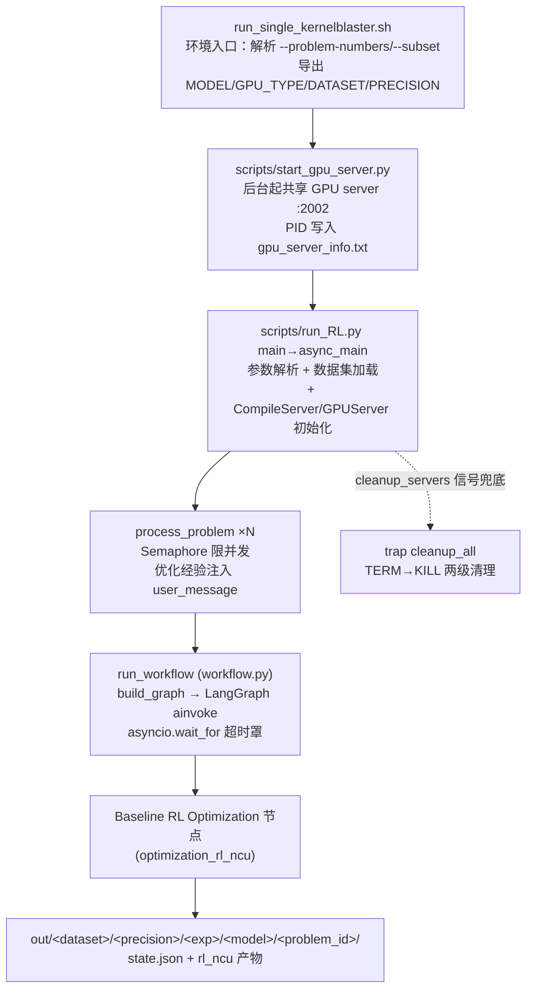

# 深解 KernelBlaster 实验编排链：run_single_kernelblaster.sh → run_RL.py → workflow.py

> 基于知识图谱（.understand-anything/knowledge-graph.json，269 节点/589 边）与源码精读。
> 三文件分属三层：entry-scripts（入口脚本层）→ orchestration（图编排层）→ resources（资源管理层）。

## 1. 角色定位：从 shell 到 workflow 的完整启动链

这条链是 KernelBlaster（NVIDIA，MAIC-RL kernel 优化管线）的主执行动脉：

启动顺序上还有两条常被忽略的暗线：一是 `main()` 在进入异步世界前就注册了 SIGINT/SIGTERM 处理器，`signal_handler` 按 signal 次数分级退出（首次清理后 sys.exit(0)，二次 sys.exit(1)，三次直接 os._exit），保证 Ctrl+C 也能触发服务器清理；二是 `cleanup_servers` 把两个服务器的 cleanup 各自放进 5 秒超时的守护线程，避免某个服务器卡死拖住整个退出流程。总体上，shell 负责"环境级"事务（目录、GPU server、进程清理、trap 信号），run_RL.py 负责"实验级"编排（数据集、并发、断点续跑），workflow.py 负责"单问题级"执行（图组装+超时）。三层职责正交，通过 `--gpu-server-url` 等 CLI 参数与 `config` 全局单例衔接；`config` 在进程启动时读一次环境变量（MODEL/OPENAI_API_KEY 等），之后全程以单例形态被各层共享，shell 的 `export MODEL=...` 正是经 config.MODEL → argparse 默认值这条路径生效的。

## 2. run_RL.py 内部结构

**参数体系**：`add_common_arguments`（utils/arguments.py）注册全套公共参数——`--dataset`（默认 kernelbench-cuda，唯一选项）、`--precision`（fp32/fp16/bf16）、`--subset`（level1/2/3、cub、thrust、cuda、A/B/H）、`--problem-numbers`（支持 `8-20,25` 复合区间）、`--start/--end`、`--single-file-path`、流程开关（`--cuda/--cuda-perf/--cuda-bench`）、RL 超参（`--use-rl/--rl-iterations/--rl-rollout-steps/--rl-buffer-size/--rl-update-frequency`）。run_RL.py 自加 `--concurrency`、`--no-resume`、`--compiler-port`、`--gpu-port`、`--gpu-server-url`。`validate_common_arguments` 强校验（如 `--cuda-perf` 必须伴 `--cuda`）。

**数据集准备**：`get_dataset(dataset, subset, split, precision, problem_numbers, ...)` 返回 (dataset, dataset_iter)，每个 entry 含 `id/user_message/task_id/level_id/op_name`。

**服务器启动**：先建 `CompileServer`（端口自动分配自 2001）；GPU 侧若给 `--gpu-server-url` 则仅 `config.set_gpu_server_url()` 复用既有服务（`GPU_SERVER=None`），否则自建 `GPUServer` 并 `wait_for_connection`，且断言 `--gpu` 与实际 GPU 类型一致。URL 最终写入 config 单例，供图节点内 HTTP 客户端发现。

**输出目录**：`OUT_DIR = out/<dataset>/<precision>/<experiment_name>/<model_name>/`（model_name 由 config.MODEL 剥离 `llmgateway//azure/` 等网关前缀得到）；shell 里 `mkdir out/<dataset>/<precision>/<experiment>` 只建了前三级，末级由 run_RL.py 补齐。每问题一个子目录 `<problem_id>/`，含独立 run.log（loguru filter 按 problem_id 分流）。

**断点续跑**：`should_skip_folder` 跳过已完成；`--no-resume` 则 `rm -r folder/*` 重跑；目录存在即 resume。

**主循环**：`async_main` 建 `asyncio.Semaphore(concurrency)` 限流，为每个 entry `asyncio.create_task(process_problem(...))`，最后 `asyncio.gather` 汇总。`process_problem` 内先做三元组提取（含从 `problem_name` 去数字前缀构造 op_name 的降级逻辑），再进信号量临界区：为本问题挂一个按 `problem_id` 过滤的 loguru sink（日志精确落 `folder/run.log`，与全局 stderr 双轨），调 `run_workflow`，成功打印 generated_codes，失败打 error，末尾摘除 sink 防泄漏。

**知识注入**（本文件亮点）：`load_comprehensive_analysis_results` glob 缓存历史 `detailed_analysis_chunk_*.json`（按 op_name 聚合，进程内只加载一次），`find_matching_optimization_data` 按 (task_id, level_id, op_name) 打分匹配（level/task 各 10 分+quality_score），`enhance_user_message_with_optimization_data` 把历史优化模式/参考代码（截断 2000 字符）拼进 prompt——RL 式跨问题经验复用，等于在图执行前先做了一轮"记忆检索增强"。

## 3. workflow.py 如何组装 graph

`run_workflow` 是图执行的唯一入口：mkdir 输出目录 → 清理上次失败标记 → `build_graph()` 编译 LangGraph → 组装初始 state（`user_message/reference_code/folder/logger/model/shared_optimization_database` + `WorkflowConfig.dict()` 全量展开）→ `asyncio.wait_for(workflow.ainvoke(...), timeout_seconds)` → 成功则 `save_state_to_json` 落 state.json 并从 `final_state["rl_ncu_cuda_fp"]` 提取产物路径。

`build_graph`（graph/graph.py）当前极简：`StateGraph(GraphState)` 注册单节点 "Baseline RL Optimization"（处理函数 `optimization_rl_ncu`），`START→节点→END` 后 compile。四个 route_* 函数（传统生成/NCU benchmark 分支）是历史多节点图的路由残留，现仅单节点直通；`route_baseline_or_generation` 里仍保留了"无基线时回退传统生成并强制 `run_cuda=True`"的兜底逻辑，说明图结构正处于从多节点向单节点收缩的演进中间态。`GraphState` 是 22 字段 TypedDict 契约（模型/GPU、4 个流程开关、RL 超参、各级产物 `_fp` 文件指针），`save_state_to_json` 会跳过 logger/shared_optimization_database 等不可序列化字段并把 Path 转字符串——所以 state.json 是事后复盘最可靠的快照。`WorkflowResult.success` 判据唯一：`rl_cuda_perf_filepath` 非空；失败写 `failed_rl_cuda_perf` 标记文件，配合 `retry_failed` 决定下次是否清 `rl_ncu/` 重试。超时被单独建模：`asyncio.TimeoutError` 被捕获为 `result.timeout=True` 而非异常抛出，调用方可以区分"模型失败"与"跑超时"两种失败形态。

## 4. GPU server 共享机制（简述）

`start_gpu_server.py` 调 `management.start_standalone_gpu_server` 拉起子进程，PID/URL 写 `gpu_server_info.txt` 供发现——多个实验进程可共享同一 GPU 执行服务。`resources/servers.py` 的 `ManagedServer` 基类统一子进程生命周期（spawn/wait_for_connection/cleanup 带超时），`CompileServer/GPUServer` 子类按 config 中既有 URL 决定"连接"还是"自管"，实现本地/远程无差别复用。

## 5. 复现实验要点

- **环境变量**：`OPENAI_API_KEY`（config.py:41 必读）、`MODEL`（默认 gpt-4.1，shell 默认 gpt-5-mini-2025-08-07）、`GPU_TYPE`（默认 L40S）、`DATASET`/`PRECISION`/`EXPERIMENT_NAME`（shell 侧默认 kernelbench-cuda/fp16/timing_analysis）、`KERNELBLASTER_OPT_RL_NCU=1`（RL 特性门控，不设则走传统生成）。
- **题目选择**：`--problem-numbers 5`（或 `8-20,25`）、`--subset level1`；直接调 run_RL.py 时可用 `--start/--end`。
- **最小复现**：`bash scripts/run_single_kernelblaster.sh --problem-numbers 1 --subset level1` 即跑通全链（RL 超参已内置：iterations 10/rollout 10/buffer 100/update-freq 3/timeout 480min/compiler-port 2011/gpu-server-url :2002）。
- **断点续跑**：默认 resume；彻底重跑加 `--no-resume`。

## 6. 新人提示

1. 先读 `state.json`（每问题一份）快速定位失败环节，再查同目录 `run.log`（loguru 带 backtrace/diagnose）。
2. `failed_rl_cuda_perf` 标记文件是失败原因的一手记录；删除它（或带 `--retry`）可触发重试。
3. GPU server 偶发残留：shell 的 cleanup 只杀自己记录的 PID，异常退出后需 `lsof -ti:2002/2011` 手查。
4. 改图结构时注意：route_* 函数仍在被单节点图外的路径引用，勿直接删；改 state 字段需同步 `GraphState` 与 `save_state_to_json` 的序列化白名单。
5. 单元调试建议绕过 shell 直调 run_RL.py，用 `--single-file-path` + `--concurrency 1` 最小化变量。
6. 注意 shell 里 `--precision fp16` 是硬编码而非引用 `$PRECISION`，改环境变量换精度不会生效，需直接改脚本或绕过 shell。
7. 共享 GPU server 的语义：一旦传 `--gpu-server-url`，run_RL.py 就不再管理该服务器生死（`GPU_SERVER=None`），退出清理责任完全在启动方（shell 的 trap）——多实验共用一个 server 时请确保启动它的进程最后退出。
