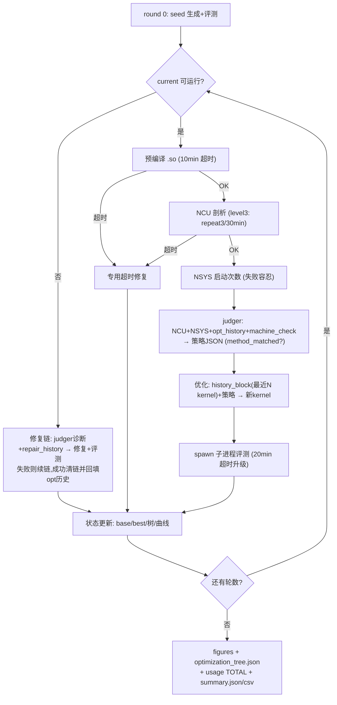

# 深解 `main_memory_latest.py` —— KernelMem 的心脏

> 1831 行，单一文件承担整个自进化 kernel 生成/修复/优化闭环的编排。知识图谱定位：**orchestration 层（编排与剖析层）**，被 README 唯一引用，是 tour 第 2 站"主编排入口"。文件内 23 个函数全部在图中（1 个 file 节点 + 23 个 function 节点，`_run_single_task` 标记 complex、约 1000 行）。

## ① 角色定位

一句话：**单 LLM 自迭代 kernel 进化的总指挥**。它对每个 KernelBench 任务跑 `--round` 轮循环：round 0 生成种子 kernel → spawn 子进程隔离评测 → 不可运行则进入修复链（judger 诊断 + 错误记忆修复），可运行则 NCU/NSYS 剖析后带记忆优化。系统名 "KernelMem" 的"记忆"不在本文件实现，但**由本文件驱动回灌**：优化历史、修复历史、历史 kernel 代码块三路记忆全部在循环中读出→写入→再读出。所有性能真值来自子进程评测（`utils/compile_and_run.py`），所有 LLM 调用经统一网关（`agents/query_server.py`）记账；一次成功运行结束后，batch 目录里留下完整的可复盘证据链：每个 kernel 的谱系、每轮的提示词与回复原文、每份剖析数据与逐调用 token 成本。

## ② 内部结构

**main() CLI 参数全表**（`_build_arg_parser`）：

| 组 | 参数 | 默认 | 作用 |
|---|---|---|---|
| 任务 | `arch_py`（位置） | — | 单任务 .py 或任务目录 |
| 任务 | `--gpu` | A100-80GB | 写进 prompt 的 GPU 规格名 |
| LLM | `--server_type/address/port` | openai/localhost/8000 | 10 种后端分派 |
| LLM | `--model_name` `--max_tokens` `--temperature` `--top_p` | gpt-5.1-chat/16384/1/1.0 | 采样参数 |
| 迭代 | `--round/-G` | 10 | 每任务轮数预算 |
| 评测 | `--device` `--warmup` `--repeat` `--tol` | 0/25/100/1e-2 | 计时与容差 |
| 多任务 | `--first_n` `--start_from` `--num_tasks` `--shuffle_seed` | 0/1/1/0 | 切片/可复现抽样 |
| 断点 | `--filter_from_summary` | None | 从旧 summary 只挑失败任务重跑 |
| 并行 | `--subproc_id` | 0 | 多进程分片时隔离根目录临时文件 |
| 输出 | `--work_dir` | run/ | batch 根目录 |

**按阶段分组的函数**：

- **入口与任务选择**：`main`（收集→过滤/抽样→建 batch 目录→逐任务→汇总）→ `_collect_tasks`（目录递归 rglob 排序）→ `_filter_tasks_from_summary`（按文件名/stem 双策略匹配 `best_runnable=false`）→ `_pick_first_n` / `_sample_tasks`（种子化抽样，0=时间种子）。
- **种子生成（round 0）**：`_run_single_task` 内直接调 `build_seed_prompt` → `_llm_to_kernel(call_type="seed")`。
- **LLM 管道**：`_make_llm_caller`（闭包工厂，token 用量按 call_type/round 记入 usage.csv）；`_llm_to_kernel`（调 LLM→存原始回复→分流提取代码→`save_kernel_code` 落盘→包成 `KernelIndividual`）；`_extract_kernel_from_optimization_reply`（优化回复含"计划-代码映射"节，靠 `=== KERNEL CODE STARTS BELOW ===` 定界符取代码）。
- **评测循环**：`_bench_and_score`（spawn 子进程 + Pipe 回传，20 分钟超时 terminate/kill 升级；score=ref/test 延时比；父进程只 `empty_cache` 不同步，防子进程 CUDA 错误传播）→ `_bench_worker_entry`（子进程入口，异常分类 Compilation/Accuracy/Timeout）；`_sanitize_error_message`/`_last_n_lines`（剥掉 pybind 大张量打印、截 150 行）；`_preload_worker`（预编译缓存子进程）。
- **NCU/NSYS 触发（优化分支内）**：先 `_preload_worker` 确保 .so 缓存（10 分钟超时）→ `run_ncu_memory.profile_bench`（level3 任务 repeat=3、30 分钟超时）→ `load_ncu_metrics`+`metrics_to_prompt` 渲染指标块 → `run_nsys.profile_bench` 采 kernel 启动次数（5 分钟超时，失败容忍）。两处超时都走 `_handle_compilation_timeout`（闭包）：专用 judger 诊断→修复→评测。
- **修复分支**：repair 链judger（`build_correctness_prompts` 带 repair_history）→ `_llm_to_kernel(call_type="repair")` → 评测 → 回填 repair/opt 双历史。
- **优化分支**：`build_judger_optimization_prompts`（聚合 NCU+NSYS+优化历史+machine_check）→ 读 `machine_check_result.json` 判 `method_matched` → `_build_history_block`（按 mtime 取最近 `max(round_idx,5)` 个 kernel 源码）→ `build_optimization_prompt` → 生成→评测→回填。
- **汇总**：`_plot_scores`（绿圆=runnable/红方=失败叠加均值线）、`_append_usage_totals`（usage.csv 追加 TOTAL 行）、`_save_global_summary`（batch 级 summary.json/csv：avg_speedup/accuracy/token 总量）。

## ③ 外部连接

图谱边显示本文件 import 12 个模块，形成清晰的四向扇出：

- **agents/**：`query_server.py`（唯一 LLM 出口，10 后端分派+token 记账）——被 `_make_llm_caller` 调。
- **prompts/**（6 个构建器，全部由 `_run_single_task` 调）：`generate_custom_cuda_memory`（种子）、`judger_repair_memory`（修复诊断）、`error_memory`（修复实现）、`judger_optimization_memory_latest`（优化裁判，928 行，内部还读 memorybank YAML 与 machine_check）、`optimization_memory_latest`（优化实现）、`judger_compilation_timeout`（超时专用诊断）。
- **utils/**：`kernel_io.py`（extract_code_block/save_kernel_code/extract_json/extract_cuda_kernel_names）+ `compile_and_run.py`（`compare_and_bench` 地面真值评测器，只被 `_bench_worker_entry` 调）。
- **顶层剖析器与个体**：`run_ncu_memory.py`/`run_nsys.py` 三件套；`scripts/individual.py` 的 `KernelIndividual`（候选载体）。

无任何文件反向调用本文件（入边仅 README documents），是纯顶层入口。

## ④ 数据流：一轮迭代的状态转移

每任务目录结构：`batch_dir/<task>/` 下 `code/`（全部 kernel_时间戳.py + 每父 kernel 一份记忆子目录）、`evaluation/`（metrics JSON + `llm_io/` 全部 prompt/reply）、`profile/`（`<kernel>_ncu.csv`/`<kernel>_nsys.*`）、`figures/`、`usage.csv`、`optimization_tree.json`。评测用的 `ref_<id>.py`/`test_kernel_<id>.py`/`bench_ref_inputs_<id>.py` 写在仓库根（subproc_id 后缀防并行冲突）。

一轮优化迭代：base_kernel 代码 → 写入 test_kernel → 预编译 → NCU/NSYS 采集存 profile/ → 指标块+优化历史（从 `code/<parent>/opt_round_*.json` 读）→ judger 产策略 JSON → 存 opt_round（runnable=null 预写）→ history_block（code/ 最近 N 个 kernel 源码）→ 优化生成新 kernel 落 code/ → 子进程评测存 evaluation/ → **回填**：成功则更新 opt_round 并按 30%/0.3 阈值换 base、无条件换 best；失败则该 kernel 成为修复链头，下一轮诊断-修复历史写入 `code/<链头>/repair_round_*.json`，修好后**回溯回填**上一轮 opt 历史（repaired=true）。`optimization_tree.json` 全程记录每 kernel 的 parent/speedup/ncu_passed/strategy 谱系。

## ⑤ 设计决策

**round 预算不预分配，按 runnable 状态动态路由**。每轮恰好走一条 LLM 管道：不可运行全给修复链（可连续吃多轮），可运行全给优化。三个精妙点：(1) **双基准分离**——base_kernel 是优化锚点，需 30% 相对或 0.3 绝对提升才换（base_score≤0 时降为 0.1 绝对），防单次计时噪声导致锚点漂移；best_kernel 无条件取最大，仅用于统计。(2) 优化永远基于 base 而非 current——current 可能是刚失败的修复产物。(3) NCU 只对"已通过评测的锚点"做，且预编译保证 .so 缓存命中，避免剖析环境重复编译把超时误判为代码问题；剖析超时的 kernel 即使分数高也被视为"无效锚点"，修复版可直接无视阈值替换 base。

**`--filter_from_summary` 断点续跑**：读旧 batch 的 summary.json 抽 `best_runnable=false` 任务，双策略（带扩展名全名/stem）匹配回文件表，batch 目录名自动标 `filtered_from_summary` 便于溯源。配合 `--first_n/--start_from` 切片与 `--subproc_id` 根目录文件隔离，即可多进程并行只重跑失败子集——这是百级任务批跑后控制 API 成本的关键旋钮。token 侧同样全程记账：usage.csv 按调用类型逐行、任务尾追加 TOTAL、batch 汇总 total_tokens_sum。

## ⑥ 新人提示

1. **先读 `_run_single_task` 的 719-759 行骨架再看分支**，1000 行函数里大量是历史读写与防御性 try/except，主干只有"不可运行→修复 / 可运行→剖析优化"两条。
2. 三个易混角色：current（刚生成的，修复对象）、base（优化锚点，严格更新）、best（统计冠军，宽松更新）；test_kernel 文件内容 = base 的代码快照。
3. 修改评测逻辑只看 `_bench_worker_entry`/`compare_and_bench`；修改记忆注入去 prompts/ 六构建器；本文件只做编排，别把 prompt 细节写进来。
4. 坑位：spawn worker 必须在模块顶层（pickle 约束，文件里有醒目注释）；NSYS 失败是容忍路径（kernel_launch_count 回退）；`method_matched` 优先信 machine_check_result.json 的 case_id 而非 LLM 自报的 method_name。
5. 排查一次运行先看三处：`evaluation/llm_io/round*_*.txt`（每轮 prompt 与回复全存档）、`optimization_tree.json`（谱系全景）、`summary.json`（batch 终态+断点续跑入口）。
6. 该文件是"latest"演进版：函数命名与注释里保留了旧版语义（如 base/best 双基准的注释反复强调"满足严格条件才更新"），读代码时以注释里的不变式为准，能避免误改阈值逻辑。
