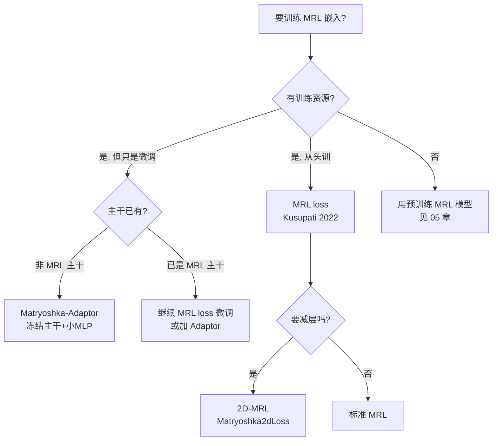

# 02 · MRL 数学：嵌套损失 + 2D-MRL + Adaptor 推导

> **本章核心**：把 MRL 的损失函数从直觉推导到公式，再推广到 2D-MRL（Wang SIGIR 2025）和 Matryoshka-Adaptor（Yoon EMNLP 2024）。

---

## 一、起点：标准嵌入训练

### 1.1 标准对比学习 loss

设 encoder $f_\theta: \text{text} \to \mathbb{R}^d$，对输入 $x$ 输出嵌入 $\mathbf{z} = f_\theta(x) \in \mathbb{R}^d$（如 768 维）。

标准 InfoNCE / contrastive loss：

$$
\mathcal{L}_{\text{standard}}(\theta) = \mathbb{E}_{(x, x^+, x^-_1, \dots, x^-_k)} \left[ -\log \frac{\exp(\text{sim}(\mathbf{z}, \mathbf{z}^+) / \tau)}{\sum_{j} \exp(\text{sim}(\mathbf{z}, \mathbf{z}^-_j) / \tau)} \right]
$$

其中 $\text{sim}(\cdot, \cdot)$ 是 cosine 相似度，$\tau$ 是温度。

**关键**：这个 loss 只在**全维 $d$** 上计算。

### 1.2 截断为什么会崩

截断到前 $m$ 维：$\mathbf{z}_{[:m]} = (z_1, \dots, z_m)$。

标准训练下，$\mathbf{z}_{[:m]}$ 与 $\mathbf{z}$ 的关系**没有任何约束**——前 $m$ 维可能恰好编码了无关信息。这就是为什么非 MRL 模型截断会断崖式掉点。

---

## 二、MRL 损失（Kusupati NeurIPS 2022）

### 2.1 核心思想

让 loss **同时在多个嵌套维度上计算**，强迫模型"在前 $m$ 维也能给出好嵌入"。

### 2.2 形式化

选一组嵌套维度 $\mathcal{M} = \{m_1, m_2, \dots, m_K\}$，其中 $m_1 < m_2 < \dots < m_K = d$。典型选择（对 $d=768$）：

$$
\mathcal{M} = \{8, 16, 32, 64, 128, 256, 512, 768\}
$$

（论文建议 $|\mathcal{M}| = O(\log d)$）

**MRL loss**：

$$
\boxed{\;\mathcal{L}_{\text{MRL}}(\theta) = \frac{1}{|\mathcal{M}|} \sum_{m \in \mathcal{M}} c_m \cdot \mathcal{L}_{\text{base}}(\theta; m)\;}
$$

其中：
- $\mathcal{L}_{\text{base}}(\theta; m)$ 是在**截断到前 $m$ 维**的嵌入上计算的 base loss（InfoNCE / CoSENT / MultipleNegativesRanking 等）
- $c_m \geq 0$ 是各项权重（原论文用 $c_m = 1$，即均匀加权）

### 2.3 关键实现细节：截断+renorm

每个 $m$ 对应的 base loss 内部要做：

$$
\mathbf{z}_{[:m]}^{\text{normalized}} = \frac{\mathbf{z}_{[:m]}}{\|\mathbf{z}_{[:m]}\|_2 + \epsilon}
$$

然后算 cosine。**不能跳过 renorm**——否则梯度信号会偏。

### 2.4 为什么这样设计——三个角度

**角度 1（信息论）**：前 $m$ 维必须能区分 $\mathcal{O}(2^m)$ 个不同语义类别。MRL loss 强迫前 $m$ 维"装下"足够信息。

**角度 2（几何）**：MRL 等价于在超球面 $\mathbb{S}^{d-1}$ 上学习一组**嵌套子球面** $\mathbb{S}^{m-1} \subset \mathbb{S}^{d-1}$。

**角度 3（梯度）**：低维 loss 的梯度会"反向影响"前面维度的权重——让前 $m$ 维的权重学到"兼顾多个 resolution"。

### 2.5 推导：为什么均匀加权和为 1

$$
\sum_{m \in \mathcal{M}} c_m = \sum_{m} 1 = |\mathcal{M}|
$$

所以除以 $|\mathcal{M}|$ 是为了**让 MRL loss 与 base loss 量级一致**——这样学习率不用调。

### 2.6 计算/存储成本

- **训练时**：每个 batch 要在 $|\mathcal{M}|$ 个维度上算 loss，成本是 base 的 $\sim |\mathcal{M}|$ 倍。但截断+renorm 是 $O(d)$ 的，相对 encoder 前向的 $O(d^2)$ 几乎免费
- **推理时**：**完全无额外开销**（截断只在最后输出做一次）
- **存储时**：只存截断后的向量，节省 $d/m$ 倍

---

## 三、推广 1：2D-MRL（Wang SIGIR 2025）

### 3.1 动机

MRL 只压缩**宽度**（embedding dimension）。但 Transformer 还有**深度**（层数）这一维。

### 3.2 公式

设 encoder 有 $L$ 层，记第 $\ell$ 层的嵌入为 $\mathbf{z}^{(\ell)} \in \mathbb{R}^d$。选两组嵌套：

$$
\mathcal{M} = \{m_1, \dots, m_K\}, \quad \mathcal{S} = \{\ell_1, \dots, \ell_J\}
$$

**2D-MRL loss**：

$$
\mathcal{L}_{\text{2D-MRL}}(\theta) = \frac{1}{|\mathcal{M}| \cdot |\mathcal{S}|} \sum_{m \in \mathcal{M}} \sum_{\ell \in \mathcal{S}} c_{m,\ell} \cdot \mathcal{L}_{\text{base}}(\theta; m, \ell)
$$

其中 $\mathcal{L}_{\text{base}}(\theta; m, \ell)$ 是**第 $\ell$ 层的前 $m$ 维嵌入**上的 loss。

### 3.3 部署收益

推理时可选 $(m, \ell)$ 组合：

| 组合 | 参数激活 | 嵌入存储 | 推理 FLOPs |
|---|---|---|---|
| (768, 12) 全 | 100% | 100% | 100% |
| (256, 6) | 50% 层 + 33% 维 | 33% | 17% |
| (128, 4) | 33% 层 + 17% 维 | 17% | 6% |

**这是 MRL 唯一能"真正缩小模型"的变体**（标准 MRL 不缩小模型）。

### 3.4 开源实现

- HF: [mixedbread-ai/mxbai-embed-2d-large-v1](https://huggingface.co/mixedbread-ai/mxbai-embed-2d-large-v1)
- ST loss: `Matryoshka2dLoss`（= `MatryoshkaLoss` × `AdaptiveLayerLoss`）

---

## 四、推广 2：Matryoshka-Adaptor（Yoon EMNLP 2024）

### 4.1 动机

**冻结主干** $f_\theta$（如 bge-small-zh-v1.5），训练一个小 adaptor MLP $g_\phi$：

$$
\hat{\mathbf{z}} = \mathbf{z} + g_\phi(\mathbf{z}), \quad \mathbf{z} = f_\theta(x) \text{（frozen）}
$$

让 $\hat{\mathbf{z}}$ 拥有 MRL 性质。

### 4.2 架构

$$
g_\phi(\mathbf{z}) = W_2 \cdot \text{ReLU}(W_1 \cdot \mathbf{z}), \quad W_1 \in \mathbb{R}^{h \times d}, W_2 \in \mathbb{R}^{d \times h}
$$

- $h$：hidden dim，通常 256 或更小
- **关键初始化**：$W_2 \leftarrow 0$ → 训练初始 $g_\phi(\mathbf{z}) = 0$，$\hat{\mathbf{z}} = \mathbf{z}$（不破坏原模型）
- 参数量：$2dh \approx 2 \times 512 \times 256 \approx 260K$（< 主干的 1%）

### 4.3 Loss：四项联合（论文 Eq.4 + Eq.6）

$$
\mathcal{L}_{\text{adaptor}}(\phi) = \mathcal{L}_{\text{topk}} + \alpha \mathcal{L}_{\text{pair}} + \beta \mathcal{L}_{\text{rec}} + \gamma \mathcal{L}_{\text{rank}}
$$

#### $\mathcal{L}_{\text{topk}}$（邻居结构保留）

$$
\mathcal{L}_{\text{topk}} = \sum_i \sum_{j \in \text{NN}_k(i)} \sum_{m \in \mathcal{M}} \left| \text{sim}(\mathbf{z}_i, \mathbf{z}_j) - \text{sim}(\hat{\mathbf{z}}_i^{[:m]}, \hat{\mathbf{z}}_j^{[:m]}) \right|
$$

直觉：在全维下 $\mathbf{z}_i$ 的 top-k 邻居，截断后还是 top-k。

#### $\mathcal{L}_{\text{pair}}$（配对相似度保留）

$$
\mathcal{L}_{\text{pair}} = \sum_i \sum_j \sum_{m} \left| \text{sim}(\mathbf{z}_i, \mathbf{z}_j) - \text{sim}(\hat{\mathbf{z}}_i^{[:m]}, \hat{\mathbf{z}}_j^{[:m]}) \right|
$$

通常在 batch 内随机采样配对，权重 $\alpha \approx 0.1$。

#### $\mathcal{L}_{\text{rec}}$（残差正则）

$$
\mathcal{L}_{\text{rec}} = \sum_i \|g_\phi(\mathbf{z}_i)\|_1
$$

直觉：adaptor 不要改得太狠，残差要小。权重 $\beta \approx 0.01$。

#### $\mathcal{L}_{\text{rank}}$（监督信号，可选）

需要 (query, doc+, doc-) 三元组：

$$
\mathcal{L}_{\text{rank}} = \sum_{(q, d^+, d^-)} \sum_m \log\left(1 + \exp\left(s^-_{[:m]} - s^+_{[:m]}\right)\right)
$$

其中 $s^\pm_{[:m]} = \text{sim}(\hat{\mathbf{z}}_q^{[:m]}, \hat{\mathbf{z}}_{d^\pm}^{[:m]})$。

### 4.4 两阶段训练

1. **Stage 1（无监督）**：用 $\mathcal{L}_{\text{topk}} + \alpha \mathcal{L}_{\text{pair}} + \beta \mathcal{L}_{\text{rec}}$ 预热
2. **Stage 2（监督）**：加 $\gamma \mathcal{L}_{\text{rank}}$ 微调，lr × 0.1

### 4.5 为什么 Adaptor 能"超越"原生 MRL 模型

论文实验：在 OpenAI text-embedding-3-large（**已 MRL 训练**）上加 Adaptor，还能再涨 1-2 pp。

原因：**Adaptor 是数据特异性（data-specific）的**——它针对你的语料微调，相当于"领域适应"。MRL 原训练是通用的。

---

## 五、损失函数选型决策树



---

## 六、常见数学陷阱

### 6.1 matryoshka_dims 必须含 $d$

```python
# ✗ 错误
MatryoshkaLoss(matryoshka_dims=[128, 256, 512])  # 缺 768

# ✓ 正确
MatryoshkaLoss(matryoshka_dims=[128, 256, 512, 768])  # 必须含全维
```

理由：缺少全维 loss 会让模型"忘记"全维精度。

### 6.2 截断维度不能超出 $d$

```python
# ✗ 错误
matryoshka_dims=[128, 256, 512, 768, 1024]  # 1024 > 768
```

### 6.3 权重 $c_m$ 的归一化

```python
# 推荐做法（让总 loss 量级与 base loss 一致）
weights = [1/len(dims)] * len(dims)
```

### 6.4 renorm 必须在 loss 内部，不能在 batch 外

```python
# ✗ 错误：截断后在外面归一化
emb_full = model(x)
emb_truncated = emb_full[:, :128]
emb_normalized = emb_truncated / emb_truncated.norm(dim=1, keepdim=True)
loss = base_loss(emb_normalized)  # 这样所有样本的"放大系数"不一样

# ✓ 正确：在 base_loss 内部 renorm
def mrl_base(emb, m):
    emb_t = emb[:, :m]
    emb_t = emb_t / (emb_t.norm(dim=1, keepdim=True) + 1e-12)
    return contrastive(emb_t)
```

---

📌 **下一步**：
- 想看 NumPy 裸实现 → [03 章 从零实现](03-从零实现.md)
- 想了解 MRL 工程部署 → [05 章 端侧部署](05-端侧部署工程.md)
- 想看 MRL 的学术批判 → [07 章 批判收尾](07-批判收尾.md)

✍️ **练习**：
1. 推导：当 $c_m = m/d$ 时，MRL loss 的几何意义是什么？（提示：高维权重更大）
2. 实现：用 NumPy 写一个简化版 MRL loss，输入两个向量矩阵，输出 loss。
3. 思考：2D-MRL 中，为什么层数选 $\mathcal{S}$ 而不是连续截断到 $\ell$？（提示：与 Funnel Retrieval 关系）
