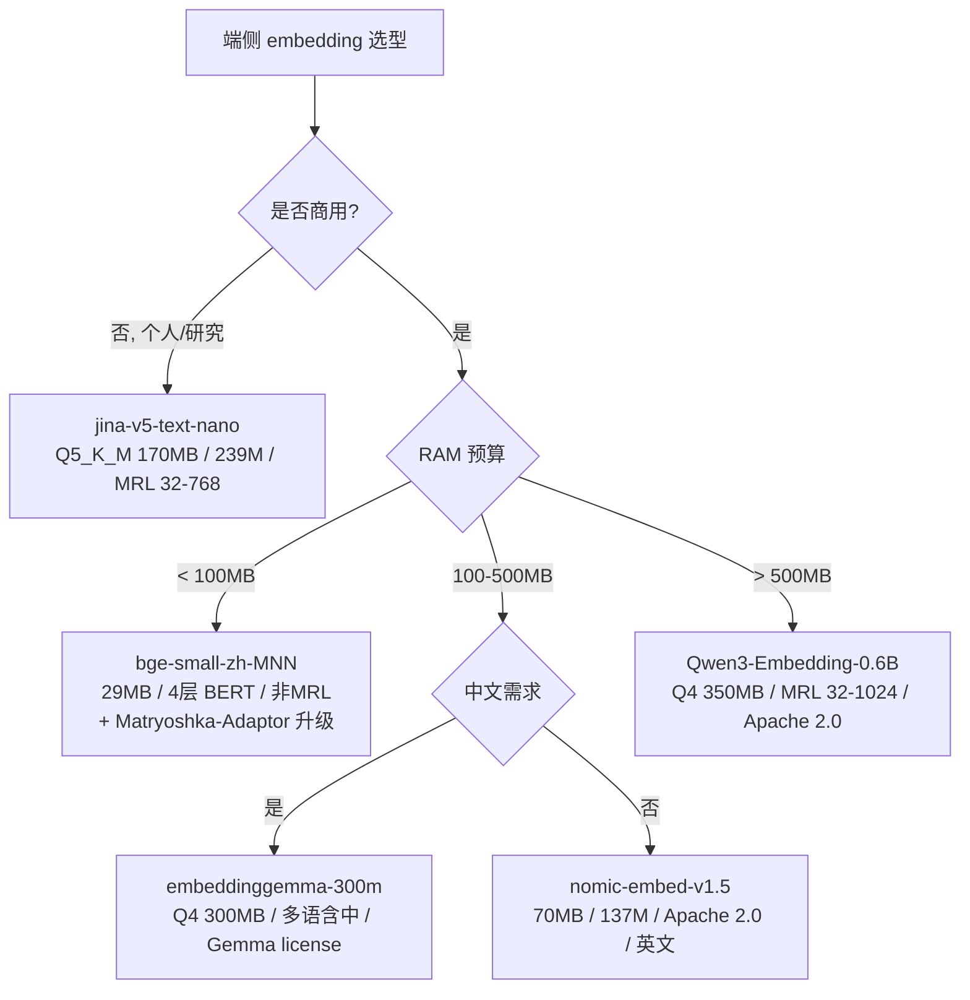

# 05 · 端侧部署工程：sqlite-vec + ModelScope + MNN 全栈

> **本章核心**：把 MRL 从理论变成可部署的端侧 RAG 系统。含 ModelScope 下载、三种截断实现位置、sqlite-vec 集成、量化配合、模型选型决策树。

---

## 一、怎么查看哪些模型支持 MRL（五步核查法）

### 1.1 五步核查（按可信度递减）

| 步骤 | 做什么 | 样例 | 可信度 |
|---|---|---|---|
| ① 读 `config.json` | 看 `matryoshka_dimensions` 字段 | embeddinggemma-300m 的 `[128,256,512,768]` | ★★★★★ |
| ② 读 HF 模型卡 | 搜 "Matryoshka" / "MRL" | mxbai-embed-large-v1 README 专章 | ★★★★★ |
| ③ 试 `truncate_dim=N` | sentence-transformers 是否接受 | `SentenceTransformer("xxx", truncate_dim=128)` 不报错 | ★★★★ |
| ④ 看 API `dimensions` 参数 | 闭源 API 文档 | OpenAI `/v1/embeddings` 的 `dimensions` | ★★★★ |
| ⑤ sqlite-vec supported list | alexgarcia.xyz/sqlite-vec/guides/matryoshka.html | text-embedding-3-small/large, mxbai, nomic-v1.5 | ★★★ |

### 1.2 一行命令快速验证

```python
from sentence_transformers import SentenceTransformer
import json, os
m = SentenceTransformer('BAAI/bge-small-zh-v1.5')
cfg = json.load(open(os.path.join(m[0].model_path, 'config.json')))
print('matryoshka_dimensions:', cfg.get('matryoshka_dimensions', 'NOT DECLARED'))
# 'NOT DECLARED' = 默认非 MRL
```

### 1.3 2026 主流 MRL 模型清单（一手核实）

**闭源 API**：

| 模型 | 原生 dim | MRL 截断点 |
|---|---|---|
| OpenAI text-embedding-3-large | 3072 | 任意 ≤3072 |
| OpenAI text-embedding-3-small | 1536 | 任意 ≤1536 |
| Cohere Embed v4 | 1536 | 256/512/1024/1536 |
| Voyage 4 系列 | 2048 | 256/512/1024/2048 |
| Gemini Embedding 001 | 3072 | 768/1536/3072 |

**开源（HF/ModelScope）**：

| 模型 | 参数 | dim | MRL 范围 | 中文 | 端侧 | 商用 |
|---|---|---|---|---|---|---|
| **jina-embeddings-v5-text-nano** | 239M | 768 | 32-768 | ✅ | ✅ | ⚠️ CC-BY-NC-4.0 |
| **embeddinggemma-300m** | 308M | 768 | 128-768 | 多语 | ✅ | ✅ |
| **Qwen3-Embedding-0.6B** | 600M | 1024 | 32-1024 | ✅ SOTA | 中 | ✅ Apache 2.0 |
| **nomic-embed-text-v2-moe** | 305M | 768 | 256-768 | ✅ | ✅ | ✅ |
| jina-v5-text-small | 677M | 1024 | 32-1024 | ✅ | 中 | ⚠️ CC-BY-NC |
| nomic-embed-text-v1.5 | 137M | 768 | 64-768 | 英 | ✅ | ✅ |
| mxbai-embed-large-v1 | 670M | 1024 | 64-1024 | 英 | 中 | ✅ |

**反例（非 MRL，截断要赌）**：
- BGE 中文 v1.5 全系列（bge-small/base/large-zh-v1.5）
- BGE 英文 v1.5
- BGE-M3（虽现代但未声明 MRL）
- all-MiniLM-L6-v2 等早期 ST 模型

---

## 二、从 ModelScope 下载（国内推荐）

```bash
# 装 modelscope CLI
pip install modelscope

# 下载到仓库外的缓存目录 (★ 不进 git!)
export MODELSCOPE_CACHE=~/ai/models
modelscope download --model google/embeddinggemma-300m \
                    --local_dir $MODELSCOPE_CACHE/embeddinggemma-300m
```

或用 Python SDK：

```python
from modelscope.hub.snapshot_download import snapshot_download
model_dir = snapshot_download('google/embeddinggemma-300m',
                              cache_dir='~/ai/models')
# model_dir 是本地路径, 直接传给 SentenceTransformer
```

---

## 三、用 embeddinggemma-300m（带 MRL）

### 3.1 推理（截断 + renorm）

```python
from sentence_transformers import SentenceTransformer

# 方法 1: 加载时指定 truncate_dim
model = SentenceTransformer(
    "~/ai/models/embeddinggemma-300m",
    truncate_dim=128                  # ★ 截断到 128
)
emb = model.encode_query("机器学习")  # shape=(128,)

# 方法 2: encode 时指定 (灵活, 同模型多 dim)
model = SentenceTransformer("...")
emb_768 = model.encode(["机器学习"])                       # 全维
emb_128 = model.encode(["机器学习"], truncate_dim=128)     # 截断

# 方法 3: 上下文管理器
with model.truncate_embeddings(truncate_dim=128):
    emb = model.encode(["机器学习"])
```

### 3.2 注意事项（embeddinggemma 专属）

- **必须用 sentence-transformers 加载**（含 Dense 投影层）
- **prompt 任务**：用 `prompt_name="STS"` 跑 STS 任务
- **截断点限制**：官方只支持 128/256/512/768（截到 64 不在训练 matryoshka_dims 内，性能不可预测）

---

## 四、用 jina-embeddings-v5-text-nano（端侧最优，**非商用**）

### 4.1 关键事实

- 239M 参数，EuroBERT-210M backbone
- **Matryoshka 维度**：32/64/128/256/512/768
- **Max seq**：8192 tokens（HF 模型卡）/ 32K（jina.ai 站点）
- **Pooling**：**last-token**（不是 mean！）
- **任务变体**：retrieval / text-matching / classification / clustering（**不要混用**）
- **License**：⚠️ **CC-BY-NC-4.0（非商用）**

### 4.2 量化变体（一手核实，2026-08-12）

| 量化级别 | 大小 | 推荐场景 |
|---|---|---|
| F16 | 480 MB | 基线 |
| Q8_0 | 280 MB | 高精度 |
| **Q5_K_M** | **170 MB** | **★ 生产 CPU 推荐** |
| Q4_K_M | 152 MB | ⚠️ 短文本精度问题 |
| IQ4_XS | 130 MB | 内存紧张时 |
| Q3_K_M | 110 MB | 不推荐 |
| IQ2_M | 70 MB | 极限内存，精度差 |

**关键警告**（jina 官方量化表）：

| 量化 | very_short (2-4 tokens) cos | short (5-15) | medium (16-30) |
|---|---|---|---|
| F16 | 1.0000 | 1.0000 | 1.0000 |
| Q8_0 | 0.9963 | 0.9998 | 0.9988 |
| Q5_K_M | **0.9409** | 0.9971 | 0.9836 |
| **Q4_K_M** | **0.9122** ⚠️ | 0.9911 | 0.9560 |
| IQ4_XS | 0.8298 ❌ | 0.9867 | 0.8897 |

**生产建议**：用 **Q5_K_M**（170 MB），不是 Q4_K_M——Q4_K_M 在 2-4 token 输入（如单词查询、人名）上 cos < 0.92，**会出明显错误**。

### 4.3 用 llama.cpp 跑

```bash
# 下载 Q5_K_M GGUF
modelscope download --model jinaai/jina-embeddings-v5-text-nano-text-matching-GGUF \
                    --local_dir ~/ai/models/jina-v5-nano-gguf

# 编译 llama.cpp
git clone https://github.com/ggml-org/llama.cpp
cd llama.cpp && cmake -B build && cmake --build build --config Release

# 跑 embedding
./build/bin/llama-embedding \
    -m ~/ai/models/jina-v5-nano-gguf/v5-nano-text-matching-Q5_K_M.gguf \
    --pooling last \      # ★ last-token pooling
    -p "Document: 机器学习是人工智能的一个分支"
```

### 4.4 任务前缀（用错全错）

| 任务 | Query 前缀 | Document 前缀 |
|---|---|---|
| retrieval | `Query: ` | `Document: ` |
| text-matching | `Document: ` | `Document: ` |
| classification | （无）| （无） |
| clustering | （无）| （无） |

---

## 五、sqlite-vec 集成（端侧 RAG 事实标准）

### 5.1 安装

```bash
pip install sqlite-vec
```

### 5.2 三种截断实现位置

#### A. 应用层（Python，最灵活）

```python
import sqlite_vec, sqlite3, numpy as np

db = sqlite3.connect(":memory:")
db.enable_load_extension(True)
sqlite_vec.load(db)

# 创建 128 维虚拟表
db.execute("""
    CREATE VIRTUAL TABLE vec_docs USING vec0(
        doc_id TEXT PRIMARY KEY,
        embedding FLOAT[128]
    )
""")

# 入库 (MRL 截断 + renorm)
def insert(doc_id, text):
    emb = model.encode(text, truncate_dim=128)  # 768d → 128d
    emb = emb / (np.linalg.norm(emb) + 1e-12)   # ★ renorm
    db.execute("INSERT INTO vec_docs VALUES (?, ?)",
               [doc_id, emb.astype(np.float32).tobytes()])
```

#### B. SQL 层（用 sqlite-vec 内置函数）

```sql
-- 入库时截断 (假设原表存 768 维)
INSERT INTO vec_docs_128(doc_id, embedding)
SELECT doc_id, vec_normalize(vec_slice(embedding_full, 0, 128))
FROM vec_docs_full;

-- 检索时 query 也要截断
SELECT doc_id, distance
FROM vec_docs_128, (SELECT vec_normalize(vec_slice(?1, 0, 128)) AS q) AS sub
WHERE embedding MATCH q
ORDER BY distance
LIMIT 10;
```

#### C. C++ 端侧（mnn-llm）

```cpp
const int DIM = 128;
float truncated[DIM];
float norm = 1e-12f;
for (int i = 0; i < DIM; ++i) { truncated[i] = emb[i]; norm += emb[i]*emb[i]; }
norm = std::sqrt(norm);
for (int i = 0; i < DIM; ++i) truncated[i] /= norm;
// 然后存入 sqlite-vec 的 vec0 虚表
```

### 5.3 MRL + 二进制量化组合（192× 压缩）

```sql
-- 入库时: 截断 + 1-bit binary
INSERT INTO vec_docs_binary(doc_id, embedding)
SELECT doc_id, vec_quantize_binary(
    vec_normalize(vec_slice(embedding_full, 0, 128))
)
FROM vec_docs_full;

-- 检索: 用 Hamming 距离
SELECT doc_id, distance
FROM vec_docs_binary
WHERE embedding MATCH vec_quantize_binary(vec_normalize(vec_slice(?1, 0, 128)))
ORDER BY distance
LIMIT 10;
```

每向量 128 / 8 = **16 字节**，10 万文档 = **1.6 MB**。

---

## 六、量化配合矩阵

| 组合 | 是否正交 | 压缩比（768d → 128d） | Recall 损失 |
|---|---|---|---|
| MRL 截断 + int8 量化 | ✅ 正交 | 24× | 1-3 pp |
| MRL 截断 + 1-bit binary | ✅ 正交 | 192× | 3-8 pp |
| **MRL 截断 + PQ（乘积量化）** | ❌ **互相干扰** | 30-100× | **可能崩** |
| MRL 截断 + HNSW | ✅ 正交 | - | HNSW 加速 |
| MRL 截断 + float16 | ✅ 正交 | 12× | < 0.5 pp |

**SingleStore 官方警告**：*"We do not recommend using MRL with PQ indexes, as the combination leads to reduced recall."*

---

## 七、距离度量兼容性

| 距离 | 截断+renorm 后是否正确 |
|---|---|
| Cosine similarity | ✅ 完全正确 |
| Dot product | ✅ 正确（**必须 renorm**）|
| L2 / Euclidean | ✅ 正确 |
| Manhattan | ⚠️ 可用但效果差 |
| Hamming（1-bit 后） | ✅ 正确 |

---

## 八、bge-small-zh-v1.5（非 MRL）的部署策略

如果你已经在用 bge-small-zh-v1.5-MNN（29 MB），想做"伪 MRL"：

### 方案 A：应用层截断（零成本试水）

```python
emb_512 = mnn_module.txt_embedding("机器学习")  # 现状
DIM = 256                                       # 推荐起点
emb_t = emb_512[:DIM]
emb_t = emb_t / (np.linalg.norm(emb_t) + 1e-12)
```

**必须实测**——bge 不是 MRL，截断损失不可预测。预期：
- 512→256（50%）：损失 2-5 pp
- 512→128（75%）：损失 5-15 pp
- 512→64（87.5%）：大概率崩

### 方案 B：加 Matryoshka-Adaptor（[03 章](03-从零实现.md)）

训一个 130K 参数的 Adaptor（CPU 5 分钟），导出 `adaptor.mnn`（200 KB），挂在 bge MNN 后面。

### 方案 C：换原生 MRL 模型（长期最优）

- **生产商用**：embeddinggemma-300m（Q4 ~300 MB）或 Qwen3-Embedding-0.6B（Q4 ~350 MB）
- **非商用 / 个人项目**：jina-v5-text-nano（Q5_K_M 170 MB）

---

## 九、模型选型决策树



---

## 十、部署清单（端到端）

```
✅ 选模型 (本章 §1, §9)
✅ 从 ModelScope 下载 (本章 §2)
✅ 跑截断扫描, 确定最优 dim (讲透MRL/04 章)
✅ 实现 MNN/ONNX/llama.cpp 推理 (本章 §3, §4)
✅ 应用层 / SQL 层 / C++ 层截断+renorm (本章 §5)
✅ sqlite-vec 创建 vec0 表, 批量入库 (本章 §5)
✅ 量化叠加 (本章 §6) - 推荐 float16 或 binary
✅ 端到端评估 Recall / 延迟 / 库体积
```

---

📌 **下一步**：
- 看真实 MRL 论文谱系 → [06 章 前沿综述](06-前沿综述-2022-2026论文谱系.md)
- 看 MRL 不能做什么 → [07 章 批判收尾](07-批判收尾.md)
- 看更多端侧压缩技术 → [../端侧AI压缩技术/](../端侧AI压缩技术/README.md)

✍️ **练习**：
1. 在 ModelScope 下载 embeddinggemma-300m，跑 768/256/128 维的 STS-B 评估，画出精度曲线。
2. 在 sqlite-vec 里建一个 10 万文档的 128d 索引，测检索延迟（应 < 10ms）。
3. 把 bge-small-zh-v1.5-MNN 接上 Matryoshka-Adaptor，对比截断精度（用你的真实数据）。
