# 06 · 前沿综述：2022–2026 MRL 论文谱系（一手落盘）

> 本章把所有 MRL 相关论文**按时间线 + 按主题**系统化落盘。每篇都标注：**一手核实的 arXiv ID / 会议**、**核心贡献**、**与本系列其他章节的关联**、**开源代码**。
>
> 截至日期：2026-08-12。所有 arXiv ID 已通过 webfetch abs 页核实。

---

## 0. 一张图看 MRL 学术脉络

```mermaid
graph TB
    ORIG[2022.05 MRL 原论文<br/>Kusupati NeurIPS 2022<br/>arXiv:2205.13147]
    ORIG -->|训练侧扩展| T1[2024.07 Matryoshka-Adaptor<br/>Yoon EMNLP 2024<br/>arXiv:2407.20243]
    ORIG -->|训练侧扩展| T2[2025.07 MatQuant<br/>Nair ICML 2025<br/>权重位宽嵌套]
    ORIG -->|训练侧扩展| T3[2025.07 CSR<br/>Wen ICML 2025<br/>稀疏编码替代]
    ORIG -->|训练侧扩展| T4[2025.11 SMEC<br/>Zhang EMNLP 2025<br/>顺序训练]
    ORIG -->|训练侧扩展| T5[2025.07 2D-MRL<br/>Wang SIGIR 2025<br/>维度+深度双嵌套]
    ORIG -->|训练侧扩展| T6[2026.05 MIC<br/>arXiv:2605.29987<br/>各向同性正则]
    ORIG -->|应用扩展| A1[2026.02 MatGPTQ<br/>arXiv:2602.03537<br/>PTQ + MatQuant]
    ORIG -->|应用扩展| A2[2026.07 Matryoshka Hypencoder<br/>arXiv:2607.17457<br/>参数空间 MRL]
    ORIG -->|应用扩展| A3[2025.09 MetaEmbed<br/>arXiv:2509.18095<br/>多向量 MRL]
    ORIG -->|应用扩展| A4[2026.06 MM-MATRYOSHKA<br/>arXiv:2606.07654<br/>多模态 VDR]
    ORIG -.批判.-> C1[2026.05 To MRL or not<br/>Takeshita arXiv:2605.16608<br/>80% 截断阈值]
    ORIG -.批判.-> C2[2025.08 LIMIT<br/>Google DeepMind<br/>arXiv:2508.21038<br/>嵌入维度理论上限]
```

## 1. 时间线一览表

| 年份 | 论文 | 会议 | 一句话贡献 | arXiv |
|---|---|---|---|---|
| 2022.05 | **MRL** (Kusupati et al.) | NeurIPS 2022 | 原始 MRL：嵌套维度 loss | [2205.13147](https://arxiv.org/abs/2205.13147) |
| 2024.02 | Matryoshka HF Blog | blog | ST 框架集成 MRL | — |
| 2024.03 | mxbai-embed-2d-large | model | 首个 2D-MRL 开源模型 | — |
| 2024.04 | ST v2.7.0 | release | `truncate_dim` API | — |
| 2024.07 | **Matryoshka-Adaptor** (Yoon) | EMNLP 2024 | 冻结主干 + 后接 MLP | [2407.20243](https://arxiv.org/abs/2407.20243) |
| 2025.02 | nomic-embed-v2-moe | model | 首个 MoE embedding + MRL | — |
| 2025.07 | **MatQuant** (Nair) | ICML 2025 | MRL 推广到权重位宽 | — |
| 2025.07 | **CSR** (Wen) | ICML 2025 | 稀疏编码替代 MRL | — |
| 2025.07 | **2D-MRL** (Wang) | SIGIR 2025 | 维度 + 层数双 MRL | — |
| 2025.08 | **LIMIT** (DeepMind) | paper | 嵌入维度的理论上限 | [2508.21038](https://arxiv.org/abs/2508.21038) |
| 2025.09 | embeddinggemma-300m | model | Google 端侧 MRL 模型 | — |
| 2025.09 | MetaEmbed | arXiv | 多向量 MRL | [2509.18095](https://arxiv.org/abs/2509.18095) |
| 2025.11 | **SMEC** (Zhang) | EMNLP 2025 | 顺序训练替代并行 | — |
| 2026.02 | jina-v5-text-nano | model | 239M 端侧 MRL SOTA | — |
| 2026.02 | MatGPTQ | arXiv | PTQ + MatQuant | [2602.03537](https://arxiv.org/abs/2602.03537) |
| 2026.05 | **To MRL or not** (Takeshita) | arXiv | 80% 截断阈值反直觉 | [2605.16608](https://arxiv.org/abs/2605.16608) |
| 2026.05 | MIC | arXiv | 各向同性正则解决谱塌缩 | [2605.29987](https://arxiv.org/abs/2605.29987) |
| 2026.06 | MM-MATRYOSHKA | arXiv | 多模态 VDR + 2D MRL | [2606.07654](https://arxiv.org/abs/2606.07654) |
| 2026.07 | MIPIC | ACL Findings 2026 | 自蒸馏 + 渐进信息链 | — |
| 2026.07 | Matryoshka Hypencoder | arXiv | 参数空间 MRL | [2607.17457](https://arxiv.org/abs/2607.17457) |

---

## 2. 原始论文（必读）

### 2.1 Matryoshka Representation Learning ★★★★★

- **作者**：Aditya Kusupati, Gantavya Bhatt, Aniket Rege, Matthew Wallingford, Aditya Sinha, Vivek Ramanujan, William Howard-Snyder, Kaifeng Chen, Sham Kakade, Prateek Jain, Ali Farhadi
- **venue**：NeurIPS 2022
- **arXiv**：[2205.13147](https://arxiv.org/abs/2205.13147)（一手核实 2026-08-12）
- **代码**：[RAIVNLab/MRL](https://github.com/RAIVNLab/MRL)

**核心贡献**：
1. 提出 MRL 损失：在 O(log d) 个嵌套维度上同时算 loss，加权求和
2. 单个嵌入向量即可在多分辨率下部署，**推理时零额外开销**
3. 在 ImageNet-1K 上：14× 嵌入缩小、14× wall-clock 检索加速，精度持平
4. 推广到 vision (ViT/ResNet) + vision-language (ALIGN) + language (BERT) 全模态

**关键公式**（详见 [02 章](02-MRL数学.md)）：

$$
\mathcal{L}_{\text{MRL}}(\mathbf{W}) = \mathbb{E}_{(x, y)} \left[ \sum_{j=1}^{m} c_j \cdot \ell(\mathbf{W}_{[:d_j]} \cdot \phi(x); y) \right]
$$

其中 $d_1 < d_2 < \dots < d_m = d$ 是嵌套维度，$c_j$ 是各项权重（默认 1/m）。

**为什么叫"Matryoshka"**：俄罗斯套娃——大套小，前 N 维是个完整可用的嵌入，前 2N 维也是，前 d 维也是。

**关键实验结论**（NeurIPS 2022 论文 §4）：
- **Adaptive Retrieval**（两阶段检索）：768d 短名单 + 16d 短列表 → 128× FLOPs 节省，14× wall-clock 提速
- **Funnel Retrieval**：200→100→50→25→10 短名单 + 16→32→64→128→256→2048 维度级联
- 在 ImageNet-1K 上 MRL 模型 14× 缩小后精度持平独立训练的低维模型

---

## 3. 训练侧 follow-up（怎么训得更好）

### 3.1 Matryoshka-Adaptor（★★★★ 端侧救星）

- **作者**：Jinsung Yoon, Raj Sinha, Sercan Ö. Arık, Tomas Pfister（Google Cloud）
- **venue**：EMNLP 2024
- **arXiv**：[2407.20243](https://arxiv.org/abs/2407.20243)
- **代码**：[primeqa/docuverse](https://github.com/primeqa/docuverse/blob/main/scripts/matryoshka/)

**核心贡献**：**让任意已训练的非 MRL 嵌入模型获得 MRL 性质**——主干完全冻结，后接一个 < 1% 参数的小 MLP（残差结构），用 MRL loss 训练这个 MLP。

**为什么重要**：bge-small-zh-v1.5 / Gecko-003 / 早期 MiniLM 等都**不是 MRL 训练**，但又广泛部署。Matryoshka-Adaptor 让它们"升级"成 MRL，**不需要重训主干**。

**Loss**（详见 [03 章](03-从零实现.md) 公式 6）：

$$
\mathcal{L}_{\text{adaptor}} = \mathcal{L}_{\text{topk}} + \alpha \mathcal{L}_{\text{pair}} + \beta \mathcal{L}_{\text{rec}} + \gamma \mathcal{L}_{\text{rank}}
$$

- $\mathcal{L}_{\text{topk}}$：邻居结构保留（top-k 在全维 vs 截断维下一致）
- $\mathcal{L}_{\text{pair}}$：随机配对相似度保留
- $\mathcal{L}_{\text{rec}}$：残差正则（防止 adaptor 改得太狠）
- $\mathcal{L}_{\text{rank}}$：监督信号（可选，pairwise margin ranking）

**论文实测**：
- 在 Gecko-003（非 MRL）上：截断 256d 时 nDCG@10 提升 2-5 pp
- 在 OpenAI text-embedding-3-large（已 MRL）上：还能再提升 1-2 pp
- 在 BEIR / MIRACL / Fashion-200K 共 35 个数据集验证

**关键工程价值**：**论文 §6.1 直接在非 MRL 模型（Gecko-003）上验证有效**——这是给 bge-small-zh-v1.5 升级 MRL 的标准方案。

### 3.2 Matryoshka Quantization (MatQuant) ★★★★

- **作者**：Pranav Ajit Nair, Puranjay Datta, Jeff Dean, Prateek Jain, Aditya Kusupati（Kusupati 是 MRL 原作者）
- **venue**：ICML 2025
- **链接**：[PMLR v267/nair25a](https://proceedings.mlr.press/v267/nair25a.html)

**核心贡献**：**把 MRL 思想从向量维度推广到整数位宽**。int8 模型的"前 4 个 bit"是 int4 模型，"前 2 个 bit"是 int2 模型——一个 checkpoint，运行时按需切片。

**核心洞察**：整数天然有 Matryoshka 结构——小位宽整数嵌套在大位宽整数的高位（MSB）。

**Loss**：在 {8, 4, 2} bit 三个精度上联合训练 + 互相蒸馏：

$$
\mathcal{L}_{\text{MatQuant}} = \sum_{b \in \{8,4,2\}} \alpha_b \cdot \mathcal{L}_b(\text{slice}_b(W))
$$

**实测**：
- int2 精度提升 4-7 个点（vs OmniQuant / QAT 标准 int2）
- 用 1 个额外 bit 表达 outlier：2.05-bit effective precision 再提升 6 个点

### 3.3 Beyond Matryoshka: CSR ★★★★

- **作者**：Tiansheng Wen 等
- **venue**：ICML 2025
- **链接**：[PMLR v267/wen25e](https://proceedings.mlr.press/v267/wen25e.html)

**核心贡献**：用**稀疏编码**（sparse coding）替代 MRL 的截断方案。把嵌入"特化为"高维但稀疏激活的特征空间，按 sparsity level 自适应推理。

**核心论点**：MRL 有两个缺陷——① 必须全参数重训；② 短向量精度明显下降。CSR 用轻量 autoencoder + 任务感知对比损失解决这两个问题。

**实测**：在图像 / 文本 / 多模态基准上**全面超越 MRL**（论文报告"often by large margins"），训练时间也大幅缩短。

**为什么重要**：CSR 是 MRL 的**有力竞争者**，挑战了"截断 = MRL"的范式垄断。

### 3.4 SMEC ★★★

- **作者**：Biao Zhang, Lixin Chen, Tong Liu, Bo Zheng（阿里）
- **venue**：EMNLP 2025
- **链接**：[aclanthology.org/2025.emnlp-main.1332](https://aclanthology.org/2025.emnlp-main.1332/)

**核心贡献**：系统分析 MRL 训练的**梯度方差问题**，提出 SMRL（Sequential MRL，顺序训练替代并行）+ ADS（Adaptive Dimension Selection）+ S-XBM（Selectable Cross-batch Memory）三件套。

**关键洞察**：MRL 并行训练时，低维 loss 的梯度方差是高维的 $\frac{1+\delta(D/2)^2}{\delta(D/4)^2}$ 倍——SMRL 用顺序训练消除这个比值。

**实测**：在 BEIR 上，256d 压缩比 Matryoshka-Adaptor +1.1 pp，比 Search-Adaptor +2.7 pp。

### 3.5 2D-MRL (Wang SIGIR 2025) ★★★★

- **作者**：Shengyao Wang, Shuo Zhuang, Bevan Koopman, Guido Zuccon
- **venue**：SIGIR 2025
- **链接**：[aclanthology.org/2025.acl-long.1332](https://dl.acm.org/doi/10.1145/3721908.3725906)（一手核实）

**核心贡献**：**MRL 的第二维——深度**。不仅嵌入维度可截断，**Transformer 层数也可截断**（前 K 层提前 exit）。

**Loss**：在宽度 $\{d_1, ..., d_m\}$ × 深度 $\{l_1, ..., l_n\}$ 网格上联合训练：

$$
\mathcal{L}_{\text{2D-MRL}} = \sum_{i,j} c_{ij} \cdot \ell_{\text{retrieval}}(\text{Exit}_i(\text{Trunc}_j(\phi(x))))
$$

**实测**：层数减半 + 维度减半 = 参数和 FLOPs 都减 75%，精度只掉 5-10%。

**端侧意义**：**真正能让模型变小**——这是 MRL 唯一的"模型瘦身"变体（标准 MRL 不缩小模型）。同思路的开源模型：[mxbai-embed-2d-large-v1](https://huggingface.co/mixedbread-ai/mxbai-embed-2d-large-v1)。

### 3.6 MIC (2026) ★★

- **arXiv**：[2605.29987](https://arxiv.org/abs/2605.29987)
- **核心问题**：MRL 训练存在"谱塌缩"和子空间冗余
- **方法**：Soft Collapse Regularization (SCR) + Spectral Isotropy Regularization (SIR)
- **实测**：在 d=16/32/64 极端低维下，比 MRL 提升 13 个绝对点（Banking77 d=16: 59.45 vs 46.39）

### 3.7 MIPIC (ACL Findings 2026) ★★

- **链接**：[aclanthology.org/2026.findings-acl.676](https://aclanthology.org/2026.findings-acl.676/)
- **方法**：Self-Distilled Intra-Relational Alignment (SIA) + Progressive Information Chaining (PIC)
- **价值**：跨维度结构一致性 + 跨深度语义固化

---

## 4. 应用侧扩展（MRL 思想到处用）

### 4.1 MatGPTQ ★★★

- **arXiv**：[2602.03537](https://arxiv.org/abs/2602.03537)
- **作者**：Maximilian Kleinegger, Elvir Crnčević, Dan Alistarh（IST Austria）
- **代码**：[IST-DASLab/MatGPTQ](https://github.com/IST-DASLab/MatGPTQ)

**核心贡献**：把 [MatQuant](#33-matryoshka-quantization-matquant-) 的思想用在 GPTQ（一 shot post-training quantization）上——一次 PTQ 产出多精度嵌套 checkpoint。

**实测**：
- 一次量化产出 {2,3,4,6,8} bit 五个版本
- 集成 EvoPress 进化搜索 heterogeneous per-layer bit-widths
- 提供 vLLM 集成 + CUDA kernels

**端侧价值**：**第一次让 MatQuant 实用化**——MatQuant 原论文需要 QAT，MatGPTQ 只需小校准集。

### 4.2 MetaEmbed (arXiv 2025.09) ★★★

- **arXiv**：[2509.18095](https://arxiv.org/abs/2509.18095)
- **核心**：把 MRL 推广到**多向量检索**（ColBERT 风格 late interaction）
- **方法**：Matryoshka Multi-Vector Retrieval (MMR) 训练
- **价值**：test-time scaling，可按需选 query/candidate 的向量数量

### 4.3 MM-MATRYOSHKA (arXiv 2026.06) ★★

- **arXiv**：[2606.07654](https://arxiv.org/abs/2606.07654)
- **核心**：2D-MRL 用于 Visual Document Retrieval (VDR)，ColPali 风格多向量页表示
- **实测**：(18, 32) 预算下保留 90.1% 全预算质量，存储 4× 压缩 + 1.78× 推理加速

### 4.4 Matryoshka Hypencoder (arXiv 2026.07) ★★

- **arXiv**：[2607.17457](https://arxiv.org/abs/2607.17457)
- **核心**：MRL 从嵌入向量推广到**参数空间**——hypernetwork 生成的 Q-Net 参数本身可截断
- **实测**：256 维 Q-Net（7× 更少参数）性能与原始 Hypencoder 持平

---

## 5. 批判性论文（必读）

### 5.1 To MRL or not to MRL ★★★★★（最重要批判）

- **作者**：Sotaro Takeshita, Yurina Takeshita, Simone Paolo Ponzetto, Daniel Ruffinelli
- **arXiv**：[2605.16608](https://arxiv.org/abs/2605.16608)（一手核实 2026-08-12）

**反直觉核心结论**：

> *"Unless heavily truncating embeddings (i.e., reducing their size by about 80%), truncated embeddings of non-MRL models are competitive with, and often outperform models trained with MRL."*

**实验设置**：8 个开源模型 + 10 个自训 encoder + 24 个下游任务（分类 + 检索）。

**关键发现**：
1. **截断 < 70%**：MRL 与非 MRL 几乎无差距，非 MRL 直接截断甚至更好
2. **截断 70-80%**：开始有差距，MRL 略优
3. **截断 > 80%**：MRL 才显著领先（重度截断区是 MRL 的真正价值区）
4. **MRL 训练的"维度方差前置"是真的**——但只在前 O(log d) 个训练点上有效，**截断到训练时未选过的维度（如 768→96）MRL 与随机截断无异**

**对工程的启示**（[07 章详谈](07-批判收尾.md)）：
- 如果你只截断到一半（如 768→384），**不必专门选 MRL 模型**
- 如果你要截断到 1/8 以下（如 768→64），**必须用 MRL 模型或加 Adaptor**
- 选择 MRL 模型时，确认它的训练 matryoshka_dims 包含你的目标维度

### 5.2 LIMIT: On the Theoretical Limitations of Embedding-Based Retrieval ★★★

- **作者**：Google DeepMind
- **arXiv**：[2508.21038](https://arxiv.org/abs/2508.21038)
- **代码**：[google-deepmind/limit](https://github.com/google-deepmind/limit)

**核心定理**：对固定维度 $d$，存在数据集使得 embedding 模型无法正确返回所有 top-k 子集。**理论上限**：

| $d$ | $n_{\text{critical}}$（自由优化） |
|---|---|
| 512 | 50 万文档 |
| 768 | 170 万 |
| 1024 | 400 万 |
| 3072 | 1.07 亿 |
| 4096 | 2.5 亿 |

**对 MRL 的冲击**：截断到 32 维时，**理论上只能正确处理几千文档的检索**——LIMIT 数据集在该规模下 SOTA 模型都失败。

**端侧启示**：端侧 RAG 文档数 < 1 万时，32 维 MRL 截断**理论上够用**；超过 10 万就要至少 128 维。

---

## 6. 主流模型与 MRL 集成（截至 2026-08）

### 6.1 已确认原生 MRL 训练的模型

| 模型 | 参数 | MRL dims | 训练方法 | 来源 |
|---|---|---|---|---|
| OpenAI text-embedding-3-large | ? | 任意 ≤3072 | MRL | OpenAI 2024.01 |
| OpenAI text-embedding-3-small | ? | 任意 ≤1536 | MRL | OpenAI 2024.01 |
| Cohere Embed v4 | ? | 256/512/1024/1536 | MRL + binary | Cohere 2025.04 |
| Voyage 4 系列 | ? | 256/512/1024/2048 | MRL + 量化 | Voyage 2026.01 |
| Gemini Embedding 001 | ? | 768/1536/3072 | MRL | Google 2025 |
| **embeddinggemma-300m** | 308M | 128/256/512/768 | MRL + QAT | Google 2025.09 |
| **Qwen3-Embedding 0.6B/4B/8B** | 0.6-8B | 32-4096 | MRL | 阿里 2025 |
| **jina-v5-text-nano** | 239M | 32-768 | MRL + GOR 正则 | Jina 2026.02 |
| **jina-v5-text-small** | 677M | 32-1024 | MRL | Jina 2026 |
| **nomic-embed-text-v2-moe** | 305M active | 256-768 | MRL | Nomic 2025.02 |
| **nomic-embed-text-v1.5** | 137M | 64-768 | MRL | Nomic 2024 |
| mxbai-embed-large-v1 | 670M | 64-1024 | MRL | Mixedbread 2024 |
| mxbai-embed-2d-large-v1 | 670M | 64-1024 + 13-24 层 | 2D-MRL | Mixedbread 2024 |

### 6.2 非 MRL 但被社区"伪 MRL"使用的模型

- **bge-m3**：1024d，论文未声明 MRL，但社区有人直接截断
- 部分 MiniLM / MPNet 衍生模型：少数第三方 fine-tune 加了 MRL

### 6.3 确认非 MRL 的常见模型（截断会损失精度）

- BGE 中文 v1.5 全系列
- BGE 英文 v1.5 全系列
- all-MiniLM-L6-v2 等早期 ST 模型
- OpenAI v1 旧模型

---

## 7. 开源工具生态

| 工具 | 功能 | 链接 |
|---|---|---|
| **Sentence Transformers** | 训练 + 推理 + `truncate_dim` API | [sbert.net](https://sbert.net) |
| `MatryoshkaLoss` | MRL 损失封装 | ST loss 模块 |
| `Matryoshka2dLoss` | 2D-MRL（维度+层数） | ST loss 模块 |
| `AdaptiveLayerLoss` | 层数自适应 | ST loss 模块 |
| **primeqa/docuverse** | Matryoshka-Adaptor + Permutation | [GitHub](https://github.com/primeqa/docuverse) |
| **RAIVNLab/MRL** | 原始论文代码 | [GitHub](https://github.com/RAIVNLab/MRL) |
| **IST-DASLab/MatGPTQ** | MatQuant PTQ | [GitHub](https://github.com/IST-DASLab/MatGPTQ) |
| sqlite-vec | `vec_slice` + `vec_normalize` | [sqlite-vec.com](https://sqlite-vec.com) |

---

## 8. 研究空白与机会（写论文的入口）

| 方向 | 现状 | 机会 |
|---|---|---|
| **MRL 训练的维度权重 $c_j$ 优化** | 默认均匀 | 自动学习权重（Pareto 最优） |
| **截断维度的可微选择** | 训练时固定 | 数据驱动选择 matryoshka_dims |
| **MRL × 多模态** | MM-MATRYOSHKA 起步 | 视频 / 音频 / 3D |
| **MRL × MoE** | nomic-v2-moe 初探 | 专家选择 + 维度截断联合优化 |
| **MRL × 长上下文** | 几乎空白 | 长文档的层次化嵌入 |
| **MRL 理论上限** | LIMIT 给了维度-数据量关系 | 截断下限的可证明 bound |
| **MRL × 端侧推理引擎** | 仅 case-by-case 集成 | MNN/ONNX 的 first-class 支持 |
| **CSR 与 MRL 的统一** | 对立 | 是否存在更一般的框架 |

---

📌 **下一步**：
- 想跑实验复现 MRL 效果 → [03 章 从零实现](03-从零实现.md)
- 想看 MRL 真实部署 → [05 章 端侧部署](05-端侧部署工程.md)
- 想了解 MRL 不能做什么 → [07 章 批判收尾](07-批判收尾.md)
- 想做 MRL 研究 → 本章 §8 的空白点 + LIMIT 数据集 + CSR 比较
