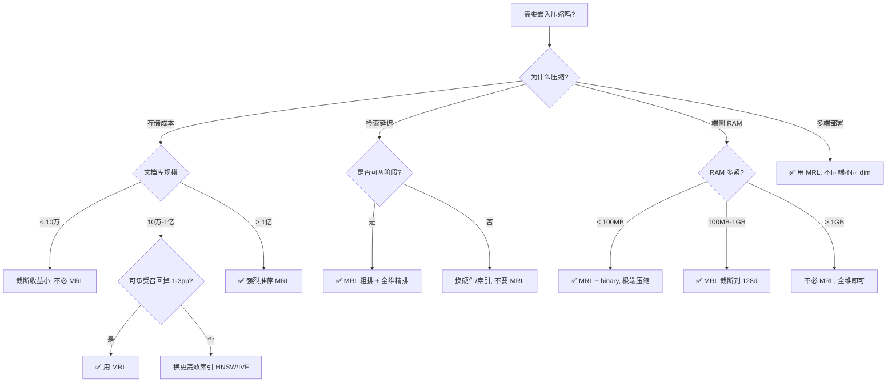

# 07 · 批判收尾：MRL 不能做什么 + 黑名单 + 决策树

> **本章核心**：把 MRL 的局限、失败模式、替代方案系统化。读完本章你会知道**什么时候不用 MRL**。

---

## 一、MRL 的根本局限（5 条）

### 局限 1：模型本身不变小

[00 章已详谈](00-开场-防误解前言.md)。MRL 不解决模型权重过大的问题——要真正缩小模型，需要量化（GPTQ/AWQ/MatQuant）或剪枝（2D-MRL/蒸馏）。

### 局限 2：截断 < 80% 时 MRL 几乎无优势

Takeshita 2026（[arXiv:2605.16608](https://arxiv.org/abs/2605.16608)）的反直觉发现（[04 章实验复核](04-反直觉实验.md)）：

> *"Unless heavily truncating embeddings (i.e., reducing their size by about 80%), truncated embeddings of non-MRL models are competitive with, and often outperform models trained with MRL."*

**工程含义**：
- 如果你只截断到一半（768→384），**任何模型都行**，没必要纠结是否 MRL
- MRL 的价值**仅在重度截断（> 80%）区**显现

### 局限 3：截断维度受训练时 matryoshka_dims 约束

embeddinggemma-300m 训练时用的 `matryoshka_dims=[128, 256, 512, 768]`：
- ✅ 截到 128/256/512：表现良好
- ⚠️ 截到 64/96/192：**与随机截断无差别**（Takeshita 论文 §4）

**含义**：截断点要选模型声明的 dim，**不能任意取**。

### 局限 4：维度有理论上限（LIMIT）

Google DeepMind LIMIT 论文（[arXiv:2508.21038](https://arxiv.org/abs/2508.21038)）证明：固定 $d$ 维下，存在数据集使任何 embedding 模型（含 MRL）无法正确返回所有 top-k 子集。

| $d$ | $n_{\text{critical}}$（自由优化上限）|
|---|---|
| 32 | ~500 |
| 128 | ~5,000 |
| 256 | ~30,000 |
| 768 | 170 万 |
| 1024 | 400 万 |
| 3072 | 1.07 亿 |
| 4096 | 2.5 亿 |

**含义**：百万级文档库**不能截断到 32 维**，理论上不够用。

### 局限 5：训练成本 +10-30%

MRL 训练要在 $|\mathcal{M}|$ 个维度上算 loss，训练时间增加。对一个 base 模型加 MRL 微调通常增加 10-30% 训练时间。

---

## 二、MRL 不适用的场景（黑名单）

### ❌ 场景 1：top-1 精排

截断后 top-1 排序极脆弱——稍一扰动就翻车。**精排必须用全维**。

### ❌ 场景 2：重排器（reranker）

重排器要从 top-50 候选里精挑细选，截断后的相似度区分度不够。

### ❌ 场景 3：细粒度聚类

截断会破坏簇结构，特别是小簇。粗筛可用 MRL，细聚类用全维。

### ❌ 场景 4：异常检测 / 密度估计

截断后密度估计失真。**异常检测不能用 MRL**。

### ❌ 场景 5：合规审计 / 100% 精确匹配

要求零假阴性的场景（合规、PII 检测），任何压缩都会引入风险。

### ❌ 场景 6：MRL + PQ 组合

SingleStore 明确警告：*"MRL with PQ indexes leads to reduced recall."* 两者互相干扰。

### ❌ 场景 7：截断不在训练 dims 里

embeddinggemma 截到 96 维（不在 [128,256,512,768]）= 与随机截断无异。

---

## 三、MRL 适用的场景（白名单）

### ✅ 场景 1：两阶段检索的粗排

用低维（32/64）快速召回 top-K，再用高维（768）精排。这是 MRL 论文的核心应用（"Adaptive Retrieval"）。

### ✅ 场景 2：端侧 RAG

手机本地知识库，存储和 RAM 都紧张。截断到 128 维 + binary 量化 = 16 字节/向量。

### ✅ 场景 3：语义去重 / 近重复检测

找近重复文档（cosine > 0.95）。截断后性能损失小，速度快 6×。

### ✅ 场景 4：聚类粗筛

大量文档先 MRL 截断聚类分桶，再精筛每个桶。

### ✅ 场景 5：成本敏感的批量检索

云端 1 亿文档库，截断节省的存储和延迟直接换算成钱。

### ✅ 场景 6：多端自适应部署

一个模型同时服务：高端服务器用全维、手机用 128 维、手表用 32 维。

---

## 四、MRL 的替代方案

### 替代 1：CSR（Contrastive Sparse Representation）

Wen ICML 2025（[PMLR v267/wen25e](https://proceedings.mlr.press/v267/wen25e.html)）。用稀疏编码替代 MRL 截断。

**优势**：在极端压缩下精度更高，训练成本更低
**劣势**：需要单独训练，社区工具少

### 替代 2：PQ（乘积量化）

经典方法，把高维向量切分成多段分别量化。

**优势**：成熟、广泛支持（FAISS/Milvus）
**劣势**：召回率掉 10-20%，**与 MRL 不兼容**

### 替代 3：PCA

线性降维。

**优势**：简单、可解释
**劣势**：对非线性结构损失大，需要单独训练投影矩阵

### 替代 4：2D-MRL（Wang SIGIR 2025）

MRL 的进化版，**同时压缩宽度和深度**。

**优势**：真正缩小模型（层数减半 + 维度减半）
**劣势**：训练复杂度高

### 替代 5：随机投影（Johnson-Lindenstrauss）

理论保证：高维空间投影到低维仍保持距离。

**优势**：理论保证、无需训练
**劣势**：常数因子大，实际效果不如 MRL

---

## 五、决策树：什么时候用 MRL

---

## 六、MRL vs 量化 vs 剪枝——什么时候用哪个

| 目标 | 推荐技术 | 章节 |
|---|---|---|
| 缩小**输出向量** | **MRL 截断** | 本系列 |
| 缩小**模型权重** | **量化**（GPTQ/AWQ/MatQuant）| [../端侧AI压缩技术/03](../端侧AI压缩技术/03-模型权重量化.md) |
| 缩小**模型架构** | **剪枝 + 2D-MRL** | [../端侧AI压缩技术/04](../端侧AI压缩技术/04-模型剪枝与层数截断.md) |
| 加速**检索** | **HNSW + MRL** | [../端侧AI压缩技术/05](../端侧AI压缩技术/05-ANN检索加速.md) |
| 加速**推理** | **量化 + 2D-MRL** | 同上 |

---

## 七、MRL 的未来（2026-2030 研究方向）

### 已出现但未成熟

- **MRL × 多模态**：MM-MATRYOSHKA 起步（[arXiv:2606.07654](https://arxiv.org/abs/2606.07654)）
- **MRL × MoE**：nomic-v2-moe 初探，专家 + 维度联合优化未深究
- **MRL × 长上下文**：几乎空白
- **CSR 与 MRL 统一**：两种范式对立，是否有更一般框架

### 理论空白

- 截断下限的可证明 bound（LIMIT 给了数据量-维度关系，但没给 MRL 特定的）
- matryoshka_dims 的最优选择理论
- MRL 在 out-of-distribution 数据上的行为

### 工程空白

- MNN / ONNX 对 MRL 的 first-class 支持（目前都要后处理）
- 动态 dim 推理（一次前向同时算多 dim 的输出，节省重复编码）
- MRL-aware 的向量数据库（索引构建时利用 MRL 结构）

---

## 八、本系列总结

| 章 | 你学到了 |
|---|---|
| 00 | MRL 是什么 / 不是什么（防误解） |
| 01 | 俄罗斯套娃的物理直觉 + renorm 几何 |
| 02 | MRL loss 数学推导 + 2D-MRL + Adaptor 推导 |
| 03 | NumPy 裸实现 + PyTorch + Matryoshka-Adaptor 完整代码 |
| 04 | 5 个反直觉发现（铁证数字）+ 复核 To MRL 论文 |
| 05 | sqlite-vec + ModelScope + MNN 端侧部署全栈 |
| 06 | 2022-2026 全部 MRL 论文一手落盘 |
| 07 | MRL 不能做什么 + 黑白名单 + 决策树 |

**一句话总结**：MRL 是一种**训练时损失函数的改造**，让嵌入向量在前 N 维就可用，部署时按需截断——**但只对重度截断（> 80%）有显著价值**，轻度截断任何模型都行。

---

## 九、相关系列

- **[端侧 AI 压缩技术](../端侧AI压缩技术/)**：把 MRL 放在更大的端侧压缩技术谱系里
- **[讲透反向传播](../讲透激活函数/01-ReLU自动微分与反向传播.md)**：理解 MRL 训练时的梯度流
- **[讲透 Transformer](../讲透基础模型/)**：理解 embedding 模型的主干

---

📌 **下一步**：
- 准备做端侧 RAG → [端侧 AI 压缩技术 07](../端侧AI压缩技术/07-端侧RAG架构实战.md)
- 想看最新论文 → [06 章前沿综述](06-前沿综述-2022-2026论文谱系.md)
- 要给 bge-small-zh 升级 → [03 章 Matryoshka-Adaptor](03-从零实现.md)
- 想自己训 MRL 模型 → [02 章数学](02-MRL数学.md) + [03 章实现](03-从零实现.md)

✍️ **毕业练习**：
1. 选一个非 MRL 中文模型（bge-small-zh-v1.5 或 bge-m3），训一个 Matryoshka-Adaptor，对比截断曲线。
2. 在 sqlite-vec 上做一个 10 万文档的端侧 RAG demo，截断到 128d + binary 量化，测延迟和 Recall。
3. 阅读 [To MRL or not to MRL](https://arxiv.org/abs/2605.16608)，回答："在什么情况下，专门训练一个 MRL 模型不如直接截断非 MRL 模型？"
