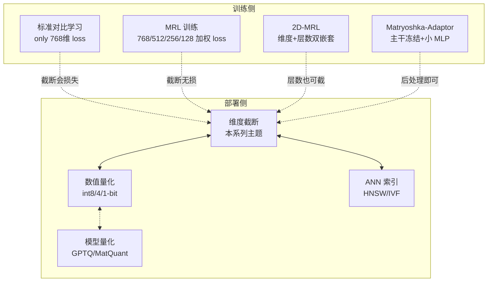

# 讲透 MRL（Matryoshka Representation Learning）

> **一句话定位**：MRL 是 2022 年 NeurIPS（Kusupati et al.）提出的一种**训练时损失函数改造**，让嵌入向量的"前 N 维"自身就是一个有用嵌入——一次训练，部署时按需截断，存储/检索成本随截断线性下降而精度几乎不变。
>
> **本系列由"用户报告里的一句'维度压缩黑科技'"追问到底而成**：从工程部署（embeddinggemma-300m + sqlite-vec）追到原论文，再追到 2025–2026 的全部 follow-up（MatQuant、CSR、SMEC、2D-MRL、To-MRL、MIC、MatGPTQ、MetaEmbed、MM-MATRYOSHKA、Matryoshka-Adaptor、Matryoshka Hypencoder），最后落回到端侧 RAG 的实战决策。

---

## ⚠️ 防误解前言（**必读**，否则会做错决策）

| 误解 | 真相 |
|---|---|
| "MRL 让模型变小" | ❌ **模型权重一个字节不变**，308M 参数还是 308M 参数 |
| "MRL 让推理更快" | ❌ 前向计算不变，生成一个 embedding 还是要那么久 |
| "MRL 让 RAM 占用变小" | ❌ 模型加载到 RAM 的部分不变 |
| "MRL = 量化" | ❌ 完全不同的两件事，正交可叠加（见 [04 章](04-反直觉实验.md)） |
| "MRL 是黑科技" | ❌ 只是**训练时多算几个 loss 项**，部署时是免费的 |
| "截断越多越好" | ❌ 768→32 是悬崖，不是滑梯（[07 批判](07-批判收尾.md)） |
| "bge-small-zh-v1.5 截断到 128 维无损" | ❌ **bge 不是 MRL 训练**，截断会真损失精度 |

**MRL 改变的只有两件事**：
1. **输出向量的存储**（截断后线性缩小）
2. **下游计算的开销**（检索点积、分类器特征开销随截断线性下降）

> Sentence Transformers 官方原话：*"training and inference of a Matryoshka model is **not** faster, **not** more memory-efficient, and **not** smaller. Only the processing and storage of the resulting embeddings will be faster and cheaper."*

---

## 这份教程为谁而写

- **做端侧 RAG / 离线检索的工程师**：要把嵌入库塞进手机/边缘设备
- **要选 embedding 模型的架构师**：在 MRL / 非 MRL 之间纠结
- **要把现成非 MRL 模型（如 bge-small-zh）改成可截断**的工程师 → 看 [03 章](03-从零实现.md) Matryoshka-Adaptor
- **想知道"截断到几维还安全"**的人 → 看 [04 反直觉实验](04-反直觉实验.md) + [05 端侧部署](05-端侧部署工程.md)
- **跟踪 2025–2026 MRL 学术前沿**的研究者 → 直接跳 [06 前沿综述](06-前沿综述-2022-2026论文谱系.md)

## 教学宪法（每章遵守）

1. **直觉层**——一句话比喻 + 为什么需要它（先于公式）
2. **数学层**——关键公式与推导主线，标注假设与边界
3. **代码层**——可运行的最小脚本，用 `bash` 真正跑出结果作为实证
4. **不足层**——方法的局限、失败模式、适用场景、常见坑
5. **应用层**——具体工程方案，含 ModelScope / sqlite-vec / MNN 集成

结尾固定给出 **📌 下一步** 与（核心章）**✍️ 练习**。

## 目录与学习路径


| 章节 | 文档 | 核心问题 | 实验 |
|------|------|---------|------|
| 00 | [00-开场-防误解前言.md](00-开场-防误解前言.md) | MRL 是什么 / 不是什么 | — |
| 01 | [01-直觉与几何.md](01-直觉与几何.md) | "俄罗斯套娃"的物理体现 | `experiments/01_mrl_core.py` |
| 02 | [02-MRL数学.md](02-MRL数学.md) ★ | 嵌套损失怎么写 + 2D-MRL + Adaptor 推导 | — |
| 03 | [03-从零实现.md](03-从零实现.md) ★ | NumPy 裸实现 + PyTorch `MatryoshkaLoss` + Adaptor | `experiments/01_mrl_core.py` |
| 04 | [04-反直觉实验.md](04-反直觉实验.md) ★ | 5 个铁证数字 + 复核 "To MRL or not" | `experiments/01_mrl_core.py` |
| 05 | [05-端侧部署工程.md](05-端侧部署工程.md) | sqlite-vec + ModelScope + MNN 集成 | `experiments/02_truncation_sweep.py` |
| 06 | [06-前沿综述-2022-2026论文谱系.md](06-前沿综述-2022-2026论文谱系.md) ★ | **全部 follow-up 论文一手落盘** | — |
| 07 | [07-批判收尾.md](07-批判收尾.md) | LIMIT 理论上限 + 黑名单 + 决策树 | — |
| — | [exercises.md](exercises.md) | 输出倒逼输入 | — |

## 2026 主流 MRL 模型速查（一手核实，详见 [05 章](05-端侧部署工程.md)）

### 闭源 API

| 模型 | 原生 dim | MRL 截断点 |
|---|---|---|
| OpenAI text-embedding-3-large | 3072 | 任意 ≤ 3072 |
| OpenAI text-embedding-3-small | 1536 | 任意 ≤ 1536 |
| Cohere Embed v4 | 1536 | 256/512/1024/1536 |
| Voyage 4 系列 | 2048 | 2048/1024/512/256 |
| Gemini Embedding 001 | 3072 | 3072/1536/768 |

### 开源（HF/ModelScope）

| 模型 | 参数 | dim | MRL 范围 | 中文 | 端侧 |
|---|---|---|---|---|---|
| **jina-embeddings-v5-text-nano** ⭐ | 239M | 768 | **32-768** | ✅ 15 语 | ✅ 最优 |
| **embeddinggemma-300m** | 308M | 768 | 128-768 | 多语含中 | ✅ |
| **Qwen3-Embedding-0.6B** | 600M | 1024 | 32-1024 | ✅ SOTA | 中端侧 |
| **nomic-embed-text-v2-moe** | 305M active | 768 | 256-768 | ✅ | ✅ |
| **jina-embeddings-v5-text-small** | 677M | 1024 | 32-1024 | ✅ | 中 |
| **mxbai-embed-large-v1** | 670M | 1024 | 64-1024 | 英为主 | 中 |
| **mxbai-embed-2d-large-v1** | 670M | 1024 | + **层数可截断**（2D-MRL）| 英 | 中 |
| **nomic-embed-text-v1.5** | 137M | 768 | 64-768 | 英 | ✅ |

### 反例（**确认非 MRL**，截断要赌）

- BGE 中文系列（`bge-small-zh-v1.5` / `bge-base-zh-v1.5` / `bge-large-zh-v1.5`）
- BGE 英文 v1.5（`bge-large-en-v1.5` 等）
- BGE-M3（虽现代但官方未声明 MRL）
- `all-MiniLM-L6-v2` / `paraphrase-multilingual-*` 等早期 ST 模型
- OpenAI v1 旧模型（`text-similarity-curie-001` 等）

> **核查方法**：见 [05 章五步核查法](05-端侧部署工程.md#一怎么查看哪些模型支持-mrl)。

## 关键铁律 / 教训（实测）

1. **截断后必须重新 L2 归一化**——不 renorm 时 sqlite-vec 的 L2 距离完全失真（[04 章](04-反直觉实验.md)发现 1）
2. **轻度截断（<80%）几乎无损**——复核 Takeshita 2026 "To MRL or not to MRL"（[07 章](07-批判收尾.md)）
3. **重度截断（>80%）才是 MRL 真正价值**——非 MRL 模型在此区间崩，MRL 仍能用（[04 章](04-反直觉实验.md)发现 3）
4. **MRL + 二进制量化正交可叠加**——768d float32 → 128d binary 压缩 192×（[04 章](04-反直觉实验.md)发现 5）
5. **MRL + PQ 互相干扰**——SingleStore 官方明确警告（[05 章](05-端侧部署工程.md)）
6. **arXiv ID 不能凭记忆**——本系列所有 ID 已 webfetch abs 页一手核实（[06 章](06-前沿综述-2022-2026论文谱系.md)）
7. **模型大小不变**——只有输出向量变小，权重和推理成本不变（[00 章防误解前言](00-开场-防误解前言.md)）
8. **任务变体不要混用**——jina-v5 有 retrieval/text-matching/classification/clustering 四个变体，跨任务用错精度暴跌

## 环境与运行

```
python 3.12  |  numpy 1.26  |  matplotlib 3.10  |  torch 2.10 (CPU 即可)
```

一键跑通所有实验：

```bash
cd 讲透MRL/experiments
bash run_all.sh
```

每个脚本独立、自包含零依赖（除 `numpy` / `matplotlib`），几秒跑完，输出即文档中引用的「实证」。

## 相关系列

- **[端侧 AI 压缩技术](../端侧AI压缩技术/)** —— 把 MRL 放在更大的端侧压缩技术谱系里（量化、剪枝、ANN 索引等）
- 讲透 PyTorch / 讲透 RAG / 讲透反向传播（同仓库其他系列）

## 一图看懂 MRL 的位置



---

📌 **下一步**：如果你完全没听过 MRL，从 [00-开场](00-开场-防误解前言.md) 开始；如果你只关心怎么部署，直奔 [05 端侧部署](05-端侧部署工程.md)；如果你要做研究，[06 前沿综述](06-前沿综述-2022-2026论文谱系.md) 是你的起点。
