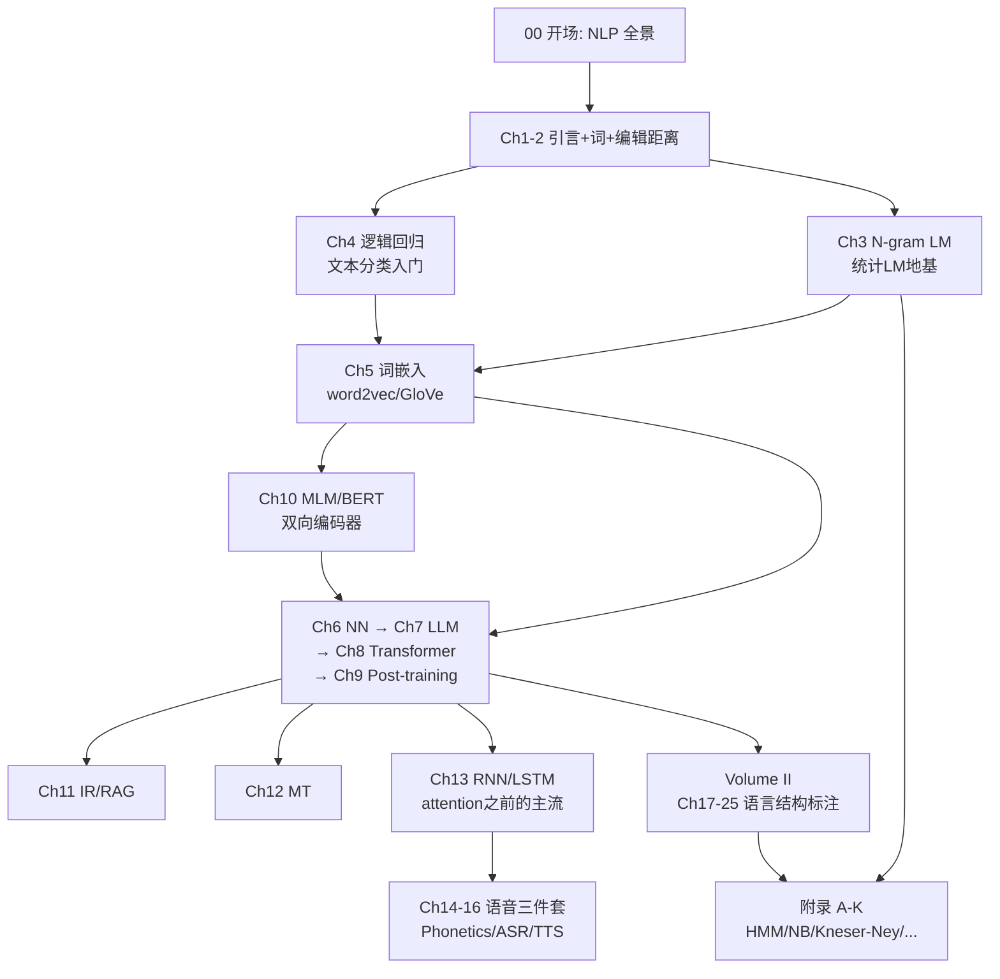

# 00 — 为什么用 SLP3 学 NLP？这场学习的总图

> 这是「讲透NLP」的开场篇。回答三个问题：**为什么选这本教材？这套「讲透」与原书什么关系？怎么走完这条路？**
>
> 没有配套实验，但有路径图。读完知道每章在解决什么问题、章节之间怎么连。

---

## 1. 为什么是 SLP3？

**SLP3 = Jurafsky & Martin《Speech and Language Processing》3rd edition**

- 官网：https://web.stanford.edu/~jurafsky/slp3/
- 当前 release：2026-01-06（持续更新，3rd edition 终稿在写）
- 作者：Dan Jurafsky（斯坦福）+ James H. Martin（Colorado）

这本书在 NLP/语音领域是什么地位？

> **过去 25 年的"圣经"。** 全球 600+ 所大学用它当教材，几乎所有 NLP 研究者的入门书。中文世界俗称 "J&M" 或 "SLP"。

为什么它独一无二：

1. **覆盖最完整**：从单词（Ch 2）到对话（Ch 25），从语音物理（Ch 14）到篇章连贯（Ch 24），从规则方法（CFG/HMM）到 LLM 时代——**一本抵十本**。
2. **兼顾历史与前沿**：每章都从经典方法（HMM、CFG、Edit Distance、N-gram）讲起，再过渡到 LLM 时代——你能看到"**为什么 LLM 是历史必然**"，而不是"凭空冒出来一个 ChatGPT"。
3. **教学一线作者**：Jurafsky 在斯坦福教 CS124/CS224N 几十年；Martin 在 Colorado 教 NLP 几十年。所有概念都经过课堂验证。
4. **免费 draft**：作者公开全部章节 PDF + slides，对学习者零门槛。
5. **更新极勤**：3rd edition 从 2020 起持续 draft，每年大改一次，2025 年版加入了 DPO、新版 ASR/TTS、Unicode，2026 年 1 月版加入了新 Transformer 图。

---

## 2. 这套「讲透NLP」做什么？

原书是好教材，但**不适合自学**：

- ❌ **太厚**：25 章 × 平均 40 页 = 1000+ 页，读到一半就累
- ❌ **没有可跑代码**：教材只讲原理，代码留给作业
- ❌ **美式英语语境**：中文/多语言例子少，中文分词、字符问题、方言完全不讲
- ❌ **数学推到一半就停**：推导细节留给作业
- ❌ **没有"反直觉发现"**：教材平铺直叙，不会告诉你"trigram 比 bigram 差""朴素贝叶斯竟然这么强"

「讲透NLP」做四件事，把上面 5 个问题全补上：

| 这套教程 | 做什么 |
|---------|--------|
| **三层讲透** | 每个概念用「直觉 → 数学 → 代码」三层呈现 |
| **每章配一个反直觉实验** | 不是"演示"，是"铁证"——能跑出让你惊讶的数字 |
| **批判性视角** | 每个方法的局限、失败模式、被 LLM 替代的程度 |
| **中文语境** | 中文 NLP 的特殊问题（分词、字符、多音字、方言）单独点出 |

---

## 3. 路径图与依赖



**三条主线**：

1. **统计 NLP 主线**（前 LLM 时代的地基）：Ch 1-5 + 附录 A/B/C/J
2. **神经 NLP 主线**（深度学习时代）：Ch 6-13 + Ch 17-23
3. **语音主线**（独立分支）：Ch 14-16

你可以按兴趣选主线。**但建议至少把 Ch 1-5 + Ch 10 + Ch 17-19 走完**——这是任何 NLP 工程师的最低共同知识。

---

## 4. 与 work4ai 其他系列的关系

| 系列 | 关系 | 互相引用 |
|------|------|---------|
| `../讲透基础模型/` | **上游**——讲深度学习基础（反向传播/attention/scaling） | 第 6/7/8 章做"导引版"，深度版在那边 |
| `../讲透Transformer/` | 第 8 章的**深度版** | 第 8 章引用过去 |
| `../讲透RAG/` | 第 11 章的**深度版** | 第 11 章引用过去 |
| `../讲透Prompt/` `../讲透微调/` | 第 9 章的**深度版** | 第 9 章引用过去 |
| `../讲透KV Cache/` `../讲透GPU与系统级/` | 第 6/7/8 章的**系统侧深度版** | 略交叉 |
| `../notes/2026-08-07-分词器创新与硬件端侧.md` | 第 2 章的**前沿延伸** | 第 2 章末尾"延伸"引用 |

**关键判断**：work4ai 已有的系列是从"模型结构/训练机制"切入；「讲透NLP」从"语言任务"切入。**两者形成互补矩阵**：

```
                  语言任务视角
                       ↓
讲透NLP (任务驱动) ──── 讲透基础模型 (模型驱动)
                       ↑
                  模型结构视角
```

---

## 5. 学完你能做什么？

走完 25 章 + 附录后：

- ✅ **看懂任何 NLP 论文**（包括 ACL/EMNLP/NAACL/COLING 最新）——所有术语都是基础概念的组合
- ✅ **自己实现核心 NLP 工具**：分词器、词嵌入、文本分类、序列标注（POS/NER）、句法分析（依存/成分）、信息抽取
- ✅ **评估和选型**：知道什么任务用什么方法（规则 vs 统计 vs 神经）——而不是无脑用 LLM
- ✅ **进入语音领域**：ASR/TTS/Pronunciation modeling——这是 NLP 但深度学习最少被讲透的子领域
- ✅ **理解 LLM 时代之前的整个 NLP 史**——为什么 attention 之前 RNN/HMM 主导，为什么 BERT 出现是分水岭，为什么 LLM 把前面所有方法都收编了

---

## 6. 学习节奏建议

按 SLP3 的章节量级，全 25 章 + 11 附录 = 36 个主题，按用户每周 10-20h（来自 `human` 记忆）的节奏：

- **每个主题**：读章节（1-2h）+ 跑实验（30min-1h）+ 做练习（1-2h）= 3-5 小时
- **总共**：约 36 × 4 = 144 小时 = **3-4 个月**走完
- **建议节奏**：每周 3 个主题，约 12 周

如果你只想"快速看懂论文"：可以跳语音三件套（Ch 14-16）和 Volume II 后半（Ch 20-25），只做 Ch 1-13 + Ch 17-19，约 16 个主题 = 6-8 周。

---

## 📌 下一步

进入 `01-导论-NLP全景.md`，从"什么是 NLP"开始。

或者按你的兴趣直接跳：
- 想直接做词嵌入 → `05-词嵌入-word2vec与GloVe.md`
- 想做句法分析 → `18-上下文无关文法与成分句法分析.md`
- 想搞清 LLM 之前的语音 → `14-语音学与特征提取.md`

## ✍️ 练习

> 开场篇没有代码练习，但有一个"心态练习"：

**练习 0.1**：列出你目前最想用 NLP 解决的 3 个具体问题（不是"学 NLP"，是"做什么用 NLP"）。带着这 3 个问题读后面的章节，你会发现每章都能映射到至少一个。

**练习 0.2**：在 SLP3 官网 https://web.stanford.edu/~jurafsky/slp3/ 浏览 25 个章节标题，标记出你"完全不知道在讲什么"的章节——这些就是你的最大学习收益区。

---

> 配套实验：无（开场篇）。姊妹章节：`01-导论-NLP全景.md`。
