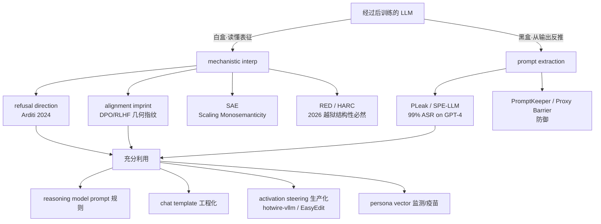

# 09 — 后训练：SFT、对齐、DPO 与 Test-Time Compute

> **基座模型会预测下一个 token，但不会"听话"。** 这一章讲怎么把一个只会续写文本的基座模型，变成一个会回答问题、遵循指令、拒绝有害请求的助手——SFT 教它"说什么"，RLHF/DPO 教它"什么更好"。
>
> 配套实验：`experiments/09_dpo_vs_sft.py`——在 tiny GPT 上对比 SFT 与 DPO，揭示两个反直觉发现。

---

## 0. 开篇：基座模型的两宗罪

基座模型（base model）经过了海量预训练（pretraining），拥有了惊人的语言能力。但 SLP3 开篇就给出两个翻车案例（来自早期 GPT）：

> **Prompt:** Explain the moon landing to a six year old in a few sentences.
> **Output:** Explain the theory of gravity to a 6 year old.

> **Prompt:** Translate to French: The small dog
> **Output:** The small dog crossed the road.

模型没有"理解"指令——它只是**续写**了一段看起来差不多的文本。SLP3 总结了两宗罪：

| 罪状 | 表现 | 根因 |
|------|------|------|
| **不够有用** (not helpful) | 不遵循指令、续写而非回答 | 预训练目标 = 预测下一个 token，与"帮助用户"不对齐 |
| **不够安全** (not harmless) | 生成有害/有毒/有偏见的内容 | 互联网文本本身包含这些内容 |

这两个问题统称为**对齐问题**（alignment problem）：预训练目标与人类需求之间存在鸿沟。后训练（post-training）就是填补这个鸿沟的工程。


SLP3 将后训练分为三个层次：

1. **指令微调（Instruction Tuning / SFT）**——在"指令-回答"对上继续训练，教模型遵循指令
2. **偏好对齐（Preference Alignment / RLHF / DPO）**——用人类偏好数据，教模型区分好坏
3. **测试时计算（Test-Time Compute）**——推理阶段用更多计算换取更好输出（CoT、Best-of-N）

---

## 1. SFT：监督微调

### 1.1 直觉

> **SFT = 在"指令-好回答"数据上继续做 next-token prediction。**

就这么简单。预训练时模型看到的是海量互联网文本；SFT 时模型看到的是精心标注的"问题-回答"对。训练目标完全相同——交叉熵损失（cross-entropy loss）——只是**数据变了**。

这就像一个读过整个图书馆的人（预训练），现在被送进客服培训学校（SFT），虽然培训内容只是"看到这个问题，应该这样回答"，但他突然就学会了"对话"。

**为什么叫"监督"微调？** 因为每条数据都有正确答案（人类标注的回答），不同于预训练的自监督（self-supervised）性质。

**与其他微调的区别**（SLP3 Fig 9.1）：

| 微调类型 | 数据 | 训练对象 | 目标 |
|---------|------|---------|------|
| 继续预训练 | 新领域文本 | 全部参数 | 域适配 |
| PEFT (LoRA) | 新领域文本 | 仅新增小参数 (A, B 矩阵) | 高效域适配 |
| 任务微调 | 特定任务标注 | 仅分类头 (+部分参数) | 单任务优化 |
| **指令微调 (SFT)** | **多样指令-回答** | **全部参数** | **学会遵循指令** |

### 1.2 数学

SFT 的损失就是标准的负对数似然（negative log-likelihood），对回答部分的每个 token 计算：

$$\mathcal{L}_{\text{SFT}} = -\frac{1}{|y|}\sum_{t=1}^{|y|} \log p_\theta(y_t \mid x, y_{<t})$$

其中 $x$ 是指令/提示（prompt），$y$ 是期望的回答（response），$y_{<t}$ 是回答中第 $t$ 个 token 之前的所有 token。

**关键细节**：prompt 部分的 loss 被屏蔽（masked）——我们不对 prompt token 计算 loss，只对 response token 计算。这在实践中通过 loss mask 实现。

### 1.3 指令数据的来源

SLP3 列出了四种创建指令数据的方法：

1. **人工撰写**：如 Aya 数据集——3000 名标注者用 65 种语言手写了 204K 条指令-回答对
2. **现有 NLP 数据集转换**：将 SQuAD、摘要等任务数据用模板（template）包装成指令格式
3. **标注指南复用**：把 crowdworker 的标注指南直接当作指令
4. **LLM 辅助生成**：用已有 LLM 生成新的指令-回答对（如 Bianchi et al. 2024 用 LLM 生成安全回答）

**评估方法**：留一法（leave-one-out）——在大量任务上训练，在留出的任务簇（task cluster）上测试。例如 SuperNatural Instructions 有 76 个任务簇，覆盖 1600 个数据集。

### 1.4 SFT 的局限

SFT 让模型学会了"好回答长什么样"，但有两个根本局限：

1. **没有对比信号**：SFT 只告诉模型"这是好回答"，不告诉它"这是坏回答"。模型的注意力全在模仿好回答上，对坏回答的概率变化是**附带效应**——这正是我们实验要揭示的反直觉发现 2。

2. **无法覆盖所有好坏判断**：SFT 数据有限，但"什么是好回答"的空间是无限的。模型可能在 SFT 数据上表现完美，但面对新的、微妙的场景时仍然翻车。

> 🧪 **反直觉发现 2（实验验证）**：SFT 在好回答上 P 上升时，坏回答的 P 也在变——而且可能**先升后降**。因为好回答和坏回答可能共享 token（如都以 EOS 结尾、共享首词），SFT 抬高共享 token 的概率时，坏回答的概率也被附带抬高了。SFT 完全不知道哪个回答是"坏"的。

---

## 2. 从偏好学习：RLHF 的框架

### 2.1 为什么需要偏好信号？

SFT 之后，模型已经会对话了。但"会对话"不等于"说得好"。偏好学习（preference-based learning）的核心理念是：

> **你不需要知道怎么做，只需要知道什么更好。**

人类标注者不需要写出完美的回答（SFT 需要这个），只需要在两个候选回答中**选出更好的一个**。这让标注成本大大降低，覆盖面大大增加。

### 2.2 偏好数据

偏好数据的格式是三元组 $(x, y_w, y_l)$：给定 prompt $x$，回答 $y_w$（chosen/winner）比 $y_l$（rejected/loser）更好，记作 $(y_w \succ y_l \mid x)$。

数据来源（SLP3 列举三种）：
- **人工标注**：训练标注员对模型输出排序（如 InstructGPT 让标注员对 4 个输出排序，产生 $\binom{4}{2} = 6$ 个偏好对）
- **隐式偏好**：Reddit 点赞、StackExchange 高票回答 → 偏好信号
- **LLM 辅助**：用 GPT-4 给输出打分/排序（如 UltraFeedback 数据集）

### 2.3 Bradley-Terry 模型：把偏好变成概率

**核心问题**：我们有一个偏好判断 "$y_w$ 比 $y_l$ 好"，但怎么把它变成一个可以优化的概率？

SLP3 使用 **Bradley-Terry 模型**（1952）——一个经典的偏好概率模型：

假设每个回答 $y$ 都有一个隐含的标量分数 $z = r(x, y)$（即 reward），偏好的概率是分数差的 sigmoid：

$$P(y_w \succ y_l \mid x) = \sigma(r(x, y_w) - r(x, y_l)) = \frac{1}{1 + e^{-(r(x,y_w) - r(x,y_l))}}$$

**为什么是 sigmoid？** 推导和逻辑回归完全一样——把分数差 $\delta = r(x, y_w) - r(x, y_l)$ 当作 logit（log-odds）：

$$\delta = \log \frac{P(y_w \succ y_l \mid x)}{1 - P(y_w \succ y_l \mid x)}$$

反解即得 sigmoid 形式。Bradley-Terry 的优点：
- 分数接近时 $P \approx 0.5$（弱偏好）
- 分数差距大时 $P \to 1$ 或 $P \to 0$（强偏好）
- 导数友好，可用交叉熵直接优化

### 2.4 奖励模型（Reward Model）

有了 Bradley-Terry 框架，下一步是学习奖励函数 $r(x, y)$。

**方法**：用一个预训练 LLM，去掉语言建模头（LM head），换成一个线性层输出标量。用偏好数据训练，损失是负对数似然：

$$\mathcal{L}_{\text{RM}} = -\mathbb{E}_{(x, y_w, y_l) \sim \mathcal{D}} \left[\log \sigma(r(x, y_w) - r(x, y_l))\right]$$

训练后的奖励模型可以给任意 (prompt, response) 打分——这就是 RLHF 中"人类偏好的代理"。

> **奖励模型的工程价值**（SLP3 指出）：不只是用于对齐。还可以用于 Best-of-N 采样（从 $N$ 个候选中选奖励最高的）和指令数据筛选。

### 2.5 RLHF：用 PPO 优化策略

有了奖励模型 $r_\phi(x, y)$，就可以用强化学习优化 LLM 策略 $\pi_\theta$。SLP3 给出的 RL 映射：

| RL 概念 | LLM 对齐中的含义 |
|---------|-----------------|
| Action（动作） | 选择下一个 token |
| State（状态） | 当前已生成的上下文 |
| Policy（策略） | LLM 的概率分布 $\pi_\theta$ |
| Reward（奖励） | 奖励模型 $r_\phi(x, y)$ 的评分 |

**朴素目标**：最大化期望奖励：

$$\pi^* = \arg\max_{\pi_\theta} \mathbb{E}_{x \sim \mathcal{D}, y \sim \pi_\theta(\cdot \mid x)} [r_\phi(x, y)]$$

**问题**：如果只优化奖励，模型会**忘记预训练学到的一切**——它会发现某个固定回答在所有 prompt 上都有高奖励，于是永远输出那个回答（reward hacking）。

**解法**：加 KL 散度惩罚，防止策略偏离参考模型太远：

$$\pi^* = \arg\max_{\pi_\theta} \mathbb{E}_{x \sim \mathcal{D}, y \sim \pi_\theta} \left[r_\phi(x, y) - \beta \log \frac{\pi_\theta(y \mid x)}{\pi_{\text{ref}}(y \mid x)}\right]$$

其中 $\pi_{\text{ref}}$ 是 SFT 后的参考模型（冻结），$\beta$ 是 KL 惩罚强度。

> **PPO 的工程痛点**（SLP3 9.3.1 在此 draft 中标记为 "TBD"，但实践已知）：
> - 需要同时维护 **4 个模型**：policy $\pi_\theta$、value network $V_\phi$、reference model $\pi_{\text{ref}}$、reward model $r_\phi$
> - 需要在训练中**在线采样**（online sampling）——从 $\pi_\theta$ 生成回答再评估奖励
> - 训练**不稳定**——RL 的方差大，超参数敏感
> - 显存翻倍——4 个模型同时在 GPU 上

这就是 DPO 诞生的动机。

---

## 3. DPO：直接偏好优化

### 3.1 核心洞察

DPO（Rafailov et al., 2023）的论文标题点明了核心洞察：

> **Your Language Model Is Secretly a Reward Model.**
> （你的语言模型暗地里就是一个奖励模型。）

DPO 的思路是：我们不需要显式地训练一个奖励模型，再用 PPO 去优化策略。**RL 目标有一个闭式解（closed-form solution），可以把奖励函数重写为策略的函数**，从而直接从偏好数据优化策略，一阶段搞定。

### 3.2 完整推导

**Step 1：从 RL 目标到闭式解**

KL 约束下的奖励最大化是一个带约束的优化问题。根据凸优化理论，最优策略有闭式解：

$$\pi^*(y \mid x) = \frac{1}{Z(x)} \pi_{\text{ref}}(y \mid x) \exp\left(\frac{r(x, y)}{\beta}\right)$$

其中 $Z(x) = \sum_y \pi_{\text{ref}}(y \mid x) \exp\left(\frac{r(x,y)}{\beta}\right)$ 是配分函数（partition function），保证 $\pi^*$ 是合法的概率分布。

> 直觉：最优策略 = 参考策略被 $\exp(r/\beta)$ 重新加权后归一化。奖励越高的回答，概率被放大越多；$\beta$ 越大，放大越温和。

**Step 2：反解奖励函数**

把闭式解重排，用策略表示奖励：

$$r(x, y) = \beta \log \frac{\pi^*(y \mid x)}{\pi_{\text{ref}}(y \mid x)} + \beta \log Z(x)$$

> 直觉：奖励 = 策略相对于参考模型的对数概率比 $\times \beta$ + 一个仅依赖 prompt 的常数。

**Step 3：代入 Bradley-Terry，配分函数消去**

将 Step 2 的奖励代入 Bradley-Terry 模型 $P(y_w \succ y_l \mid x) = \sigma(r(x, y_w) - r(x, y_l))$：

$$r(x, y_w) - r(x, y_l) = \beta \log \frac{\pi_\theta(y_w \mid x)}{\pi_{\text{ref}}(y_w \mid x)} - \beta \log \frac{\pi_\theta(y_l \mid x)}{\pi_{\text{ref}}(y_l \mid x)}$$

注意 $\beta \log Z(x)$ 项在作差时**消去了**！这正是 DPO 的魔法——我们不需要计算无法处理的配分函数。

$$\boxed{P(y_w \succ y_l \mid x) = \sigma\left(\beta \log \frac{\pi_\theta(y_w \mid x)}{\pi_{\text{ref}}(y_w \mid x)} - \beta \log \frac{\pi_\theta(y_l \mid x)}{\pi_{\text{ref}}(y_l \mid x)}\right)}$$

**Step 4：DPO 损失 = 负对数似然**

$$\boxed{\mathcal{L}_{\text{DPO}} = -\mathbb{E}_{(x, y_w, y_l) \sim \mathcal{D}} \left[\log \sigma\left(\beta \log \frac{\pi_\theta(y_w \mid x)}{\pi_{\text{ref}}(y_w \mid x)} - \beta \log \frac{\pi_\theta(y_l \mid x)}{\pi_{\text{ref}}(y_l \mid x)}\right)\right]}$$

**没有奖励模型，没有 RL 采样，没有 PPO。** 只需要一个冻结的参考模型 $\pi_{\text{ref}}$ 和偏好数据 $(x, y_w, y_l)$。

### 3.3 DPO 损失在做什么？

操作性地理解 DPO 梯度的行为：

- **增大** $\log \frac{\pi_\theta(y_w \mid x)}{\pi_{\text{ref}}(y_w \mid x)}$——提高好回答相对于参考模型的概率
- **减小** $\log \frac{\pi_\theta(y_l \mid x)}{\pi_{\text{ref}}(y_l \mid x)}$——压低坏回答相对于参考模型的概率
- **β 控制**偏离参考模型的幅度——β 大 = 保守（慢但安全），β 小 = 激进（快但危险）

典型 β 值：0.01 ~ 0.5（SLP3 指出 0.01-0.1）。

### 3.4 DPO vs PPO

| | PPO (RLHF) | DPO |
|---|---|---|
| 奖励模型 | 需要，显式训练 | **不需要** |
| 在线采样 | 需要，从 $\pi_\theta$ 生成 | **不需要** |
| 训练阶段 | 两阶段（RM + PPO） | **一阶段** |
| 模型数量 | **4 个**（policy + value + ref + RM） | **2 个**（policy + ref） |
| 稳定性 | 不稳定（RL 方差大） | 稳定（类似 SFT） |
| 探索性 | **强**（在线采样探索新回答） | **弱**（只能优化已有偏好对） |
| 典型 β | ~0.01-0.1 | ~0.1-0.5 |

> **DPO 的代价**：DPO 省掉了在线采样，但这也意味着它**无法发现训练数据中不存在的新回答**。PPO 可以通过探索发现"模型从没生成过但奖励很高"的回答，DPO 只能在已有回答之间做偏好排序。

---

## 4. Test-Time Compute：推理时多花钱，输出更聪明

### 4.1 一个新维度

SLP3 在本章末尾引入了一个全新的概念：**测试时计算**（test-time compute）。

传统观点：模型训练好之后，参数固定，推理就是简单的前向传播。能力上限由训练决定。

新范式（2024-2025）：**在推理阶段花更多计算，可以换取更好的输出**。这不是改变模型参数，而是改变**推理策略**。

> 这正是 OpenAI o1（2024.09）和 DeepSeek R1（2025.01）的核心思想：让模型在输出最终答案之前，先"思考"很长时间。

### 4.2 Chain-of-Thought (CoT)

**思路**：让模型在给出答案前，先输出中间推理步骤。

**Zero-shot CoT**（Kojima et al., 2022）：在 prompt 末尾加上一句魔法咒语：

> "Let's think step by step."

**Few-shot CoT**（Wei et al., 2022）：在 few-shot 示例中展示推理过程：

```
Q: Roger has 5 balls. He buys 2 more cans...
A: Let's think step by step.
   Roger started with 5 balls. 2 cans × 3 balls = 6 balls.
   5 + 6 = 11. The answer is 11.
```

SLP3 引用了 BIG-Bench-Hard 的实验结果：CoT 让 Codex 在 23 个推理任务中的 17 个上超过人类标注者（标准 prompting 只有 5 个）。

### 4.3 Self-Consistency

**问题**：CoT 的推理路径可能出错。

**解法**：生成 $N$ 条不同的推理链（用 temperature > 0 采样），取**多数投票**（majority vote）作为最终答案。

$$\hat{a} = \text{majority\_vote}\{a_1, a_2, \ldots, a_N\}$$

直觉：如果多条不同的推理路径都得到相同答案，这个答案更可能是对的。

### 4.4 Best-of-N

**思路**：用奖励模型（或 LLM 评判）从 $N$ 个候选回答中选最好的。

$$y^* = \arg\max_{y_i} r(x, y_i), \quad y_i \sim \pi_\theta(\cdot \mid x), \ i = 1, \ldots, N$$

**计算-质量权衡**：$N$ 越大，质量越好，但计算成本线性增长。

### 4.5 Tree-of-Thoughts (ToT)

**思路**：把推理建模为**树搜索**——在每一步生成多个候选思路，评估后选择最有前途的继续展开，可以回溯。

```
                    [问题]
                   /  |  \
              思路A  思路B  思路C     ← 生成多个候选
              / \    |      \
           A1  A2   B1      C1       ← 评估、剪枝、展开
           ✓        ✓
```

ToT 适合需要**规划**和**回溯**的任务（如数学证明、24点游戏），但对简单问答开销过大。

### 4.6 Test-Time Compute 的意义

| 方法 | 计算开销 | 适用场景 | 代表系统 |
|------|---------|---------|---------|
| Direct | 1× | 简单问答 | 标准 LLM |
| CoT | ~3-10× | 多步推理 | GPT + "step by step" |
| Self-Consistency | $N$× | 数学/逻辑 | Wang et al. 2022 |
| Best-of-N | $N$× | 开放生成 | RM + 采样 |
| ToT | 指数级 | 规划/搜索 | Yao et al. 2023 |
| **Long CoT (RL-trained)** | **100-1000×** | **复杂数学/编程** | **o1, R1** |

> **o1/R1 的突破**：不是在推理时加 prompt 技巧，而是用 RL **训练模型学会长时间思考**。模型学会了何时回溯、何时验证、何时换思路——这些"思考策略"被 RL 奖励信号内化到了模型参数中。test-time compute 从一种"技巧"变成了模型的一种"能力"。

---

## 5. 代码层：从零实现 SFT 和 DPO

完整实验见 `experiments/09_dpo_vs_sft.py`。这里展示核心实现。

### 5.1 响应概率计算

无论是 SFT 还是 DPO，核心操作都是计算 $\log p_\theta(y \mid x)$：

```python
def response_logprobs(model, prompts, responses):
    """批量计算 log P(response | prompt)"""
    full = torch.cat([prompts, responses], dim=1)      # (B, prompt_len + resp_len)
    logits = model(full)                                 # (B, T, vocab_size)
    plen = prompts.size(1)
    # logits 位置 plen-1 预测 response[0], plen 预测 response[1], ...
    pred = logits[:, plen-1:plen-1+responses.size(1), :] # (B, resp_len, V)
    logp = F.log_softmax(pred, dim=-1)
    # 取出 response token 对应的 log prob
    return logp.gather(2, responses.unsqueeze(-1)).squeeze(-1).sum(1)  # (B,)
```

### 5.2 SFT 损失

```python
def sft_loss_fn(model, prompts, chosens):
    """SFT = 负对数似然 of chosen responses"""
    logp = response_logprobs(model, prompts, chosens)   # (B,)
    return -logp.mean()                                   # 标量
```

就这么简单——标准的 next-token prediction loss，只在回答 token 上计算。

### 5.3 DPO 损失

```python
def dpo_loss_fn(model, ref_model, prompts, chosens, rejecteds, beta):
    """DPO loss = -log σ(β·[log(π(yw)/πref(yw)) - log(π(yl)/πref(yl))])"""
    logp_w   = response_logprobs(model,     prompts, chosens)    # log π(yw|x)
    logp_l   = response_logprobs(model,     prompts, rejecteds)  # log π(yl|x)
    with torch.no_grad():
        logp_w_ref = response_logprobs(ref_model, prompts, chosens)   # log πref(yw|x)
        logp_l_ref = response_logprobs(ref_model, prompts, rejecteds) # log πref(yl|x)

    logratio_w = logp_w - logp_w_ref     # log[π(yw)/πref(yw)]
    logratio_l = logp_l - logp_l_ref     # log[π(yl)/πref(yl)]

    return -F.logsigmoid(beta * (logratio_w - logratio_l)).mean()
```

注意参考模型 `ref_model` 是冻结的（`no_grad`），只提供基线概率。

### 5.4 实验设计

```
模型: TinyGPT (vocab=14, d_model=64, 2层, 4头, ~50K 参数)
数据: 6 组偏好对
  - 前 4 组: chosen 用 token 7-9, rejected 用 token 10-12 (无共享)
  - 后 2 组: chosen 和 rejected 共享首 token (展示 SFT 盲区)
```

**反直觉发现 1——DPO 训太狠，KL 爆炸**：

```
β=0.05 (约束弱), 训练 500 步, lr=5e-3:
  Step    0: loss=0.6931  KL=0.057   entropy=2.584/2.639  ← 接近均匀(健康)
  Step  100: loss=0.0090  KL=1.431   entropy=1.208/2.639
  Step  499: loss=0.0004  KL=1.893   entropy=0.716/2.639  ← 熵占比 27.1%, 退化!

β=0.5 (约束强), 训练 500 步, lr=5e-3:
  Step    0: loss=0.6931  KL=0.057   entropy=2.584/2.639
  Step  499: loss=0.0000  KL=1.486   entropy=1.166/2.639  ← 熵占比 44.2%, 更稳
```

β 越小（约束弱），熵坍塌越严重（27% vs 44%），KL 增长越快（1.89 vs 1.49），模型越快退化为只能输出少数序列。

**反直觉发现 2——SFT 无对比信号，坏回答概率失控**：

```
SFT 训练中 (chosen 与 rejected 在后2组共享首 token + eos):
  Step 0(前): logP(chosen)=-8.049  logP(rejected)=-7.926  ← 近均匀
  Step    1: logP(chosen)=-6.540  logP(rejected)=-7.446  ← P(rejected) 先升!
                                                       P(rej): 0.036%→0.058% (+62%)
  Step   50: logP(chosen)=-0.046  logP(rejected)=-16.546
  Step  299: logP(chosen)=-0.003  logP(rejected)=-22.391

⚠️ 第一步 P(rejected) 反而上升了 62%
   因为 chosen 和 rejected 共享 token (首 token 7/8 + eos),
   SFT 抬高共享 token 概率时, 坏回答概率被附带抬高
   SFT 没有"这是坏回答"的信号
```

---

## 6. 局限与争议

### 6.1 DPO 的隐患

| 问题 | 说明 |
|------|------|
| **过拟合偏好数据** | DPO 是离线方法（offline），只在已有偏好对上优化。偏好数据有偏（annotator bias、LLM judge bias），DPO 会放大这些偏差 |
| **概率漂移** | 训太狠时，$\log[\pi_\theta/\pi_{\text{ref}}]$ 趋向 $\pm\infty$，模型偏离参考模型太远，丧失通用能力。实验中 KL 从 0 飙到 4+ |
| **缺乏探索** | DPO 无法发现训练数据中不存在的好回答。PPO 通过在线采样可以探索新的回答空间 |
| **分布外泛化差** | DPO 在训练分布内表现好，但面对分布外的 prompt 时，偏好可能不迁移 |

### 6.2 RLHF/PPO 仍有优势

尽管 DPO 在工程上更简单，但 RLHF/PPO 在以下方面仍有不可替代的优势：

1. **探索性**：PPO 在线从 $\pi_\theta$ 采样，可以发现模型从未生成过的高奖励回答。这在创造性任务（如写作、代码生成）中很重要。
2. **奖励信号的及时性**：PPO 的奖励模型可以随策略更新不断评估新回答，形成闭环反馈。DPO 的偏好数据是静态的。
3. **细粒度控制**：PPO 的 KL 惩罚可以在训练过程中动态调整，DPO 的 β 是固定的。

> **2025 年的共识**：DPO 和 RLHF 不是替代关系，而是互补。实践中常见的 pipeline 是 SFT → DPO（快速对齐）→ 可选 RLHF（精细调优）。DeepSeek R1 使用了 GRPO（一种 PPO 变体）来实现推理能力的 RL 训练。

### 6.3 Test-Time Compute 的争议

- **成本问题**：o1/R1 的"思考"需要 100-1000 倍的推理计算。对于高频低价值任务，这个成本是否值得？
- **可解释性**：模型的"思考过程"是否真的反映了推理？还是只是生成了看起来合理的推理链？
- **评估困难**：如何评估 test-time compute 的边际收益？什么时候应该停止思考？

### 6.4 对齐的根本困难

所有后训练方法都面临一个更深层的问题：**我们真的知道什么是"对齐"吗？**

- **偏好数据的主观性**：不同标注者对"好"的定义不同（annotator skew，SLP3 9.1.1 详细讨论）
- **文化偏差**：英文标注者的偏好未必适用于其他语言和文化
- **奖励黑客**：模型可能学会"看起来好"而非"真的好"——例如输出更长、更礼貌但实质内容空洞的回答
- **价值观漂移**：社会价值观在变化，今天的"对齐"明天可能就过时

---

## 7. 现代 LLM 后训练 Pipeline 总览

```
预训练 (Pretraining)
  │  数据: 万亿 token 互联网文本
  │  目标: next-token prediction
  │  产出: Base Model (会续写, 不会听话)
  │
  ▼
SFT (Supervised Fine-Tuning)
  │  数据: 数万~数百万 指令-回答对
  │  目标: next-token prediction (在回答部分)
  │  产出: Instruction-Tuned Model (会遵循指令)
  │  成本: ~1% 预训练成本
  │
  ▼
偏好对齐 (Preference Alignment)
  │  方法: DPO (简单稳定) 或 RLHF/PPO (灵活但复杂)
  │  数据: 数万~数十万 偏好对
  │  目标: 增大 P(好回答)/P(坏回答)
  │  产出: Aligned Model (有用 + 无害)
  │  β: 0.01~0.5
  │
  ▼ (可选)
Test-Time Compute
  │  方法: CoT / Self-Consistency / Best-of-N / Long CoT (RL-trained)
  │  不改变参数, 只改变推理策略
  │  代表: o1, R1
```

---

## 8. 后训练的镜子：探测与充分利用一个对齐过的 LLM

前面 §1–§7 讲的是**怎么把后训练做出来**。这一节反过来——**已经做出来的后训练模型，能从外部读懂它吗？能反向利用它吗？** 这是 2024–2026 年 mechanistic interpretability（机制可解释性）领域爆炸式发展的方向，核心问题正是你这一章的两个隐含追问：

> **"逆向出所有指令"**——能不能从一个对齐过的模型反推出它经历过什么训练？
>
> **"解决了哪些对齐问题"**——后训练到底给模型注入了什么、留下什么副作用？

这一节给出**白盒**（§8.1–§8.4）和**黑盒**（§8.5）两套互补的工具，以及工程实战（§8.6）。配套实验 `experiments/09_refusal_direction.py` 把所有反直觉发现跑给你看。

### 8.1 一个反直觉事实：拒绝行为只活在一根方向上

**Arditi et al. NeurIPS 2024** [arXiv:2406.11717](https://arxiv.org/abs/2406.11717)（代码：[github.com/andyrdt/refusal_direction](https://github.com/andyrdt/refusal_direction)）发现了一件让整个对齐社区震动的事：

> 在 13 个开源 chat 模型（LLaMA-2/3、Qwen、Gemma、Yi，1.3B–72B）里，**拒绝行为在残差流里只活在一根线性方向上**。把这根方向擦掉，模型不再拒绝；把这根方向加进去，模型对无害问题也拒绝。

#### 直觉

SFT/RLHF/DPO 给模型加了一道"安全闸"。直觉上我们会以为这道闸是深度学习到的、分布式的、复杂的——一道"道德神经网"。**真相是：它只是一根向量**。把模型当成一个高维空间，"拒绝"这个概念被压成了一根一维的轴。模型内部其实只问一个问题："我现在离这根轴的'拒绝'端有多近？" 加减这根轴，就能像调旋钮一样调整拒绝概率。

#### 数学（difference-in-means + 三种干预）

**Step 1：提取 refusal direction**

收集少量 harmful 指令集 $D_H$ 和无害指令集 $D_U$。对每层 $l$ 和某个 post-instruction 位置 $i$，计算两类激活均值的差：

$$\mathbf{r}^{(l)}_i = \frac{1}{|D_H|}\sum_{x\in D_H}\mathbf{h}^{(l)}_i(x) - \frac{1}{|D_U|}\sum_{x\in D_U}\mathbf{h}^{(l)}_i(x)$$

在所有 $|I|\times L$ 个候选里**选一根最有效的** $\mathbf{r}$（用验证集上 ablation↓ + addition↑ 的双向效果打分）。

**Step 2：三种干预操作**

| 操作 | 公式 | 效果 |
|------|------|------|
| Directional ablation（消融） | $\mathbf{x}' \leftarrow \mathbf{x} - \hat{\mathbf{r}}\hat{\mathbf{r}}^\top\mathbf{x}$（每层每位置） | **关掉**拒绝 |
| Activation addition（添加） | $\mathbf{x}^{(l)} \leftarrow \mathbf{x}^{(l)} + c\cdot\mathbf{r}^{(l)}$ | 对无害输入**触发**拒绝 |
| Weight orthogonalization（永久编辑） | $W' \leftarrow W - \hat{\mathbf{r}}\hat{\mathbf{r}}^\top W$ | **永久越狱**，能力几乎不损 |

#### 代码（实验 09_refusal_direction.py，~3 层 32 维 39K 参数玩具 GPT）

```python
# 1) 提取 refusal direction
dirs = extract_refusal_directions(model, prompts, labels)  # {layer: r^l}

# 2) 干预 1：ablation —— 投影掉 r 方向
abl_hook = make_ablation_hook(best_r_hat)
p_ref_ablation = prob_refusal(model, harmful_prompts, intervene=abl_hook)

# 3) 干预 2：addition —— 加 r 到无害输入
add_hook = make_addition_hook(best_r, layer=2, coeff=1.0)
p_ref_forced = prob_refusal(model, harmless_prompts, intervene=add_hook)
```

#### 反直觉发现（实验实测，~10 秒跑完）

| 现象 | 玩具模型（39K 参数） | Arditi 大模型（1.3B–72B） |
|------|-------------------|------------------------|
| refusal 压缩到 1 维（PCA PC1 占比） | **99.9%** | 普遍接近 100% |
| Directional ablation 后 harmful 拒绝率 | **99.9% → 25.5%（↓74.4%）** | ~100% 降到接近 0 |
| Addition 系数扫描（coeff=0.5） | harmless 拒绝率 **0.03% → 87%** | 类似单调曲线 |

> 🧪 **反直觉发现 8.1**：即便是我们这个只有 39,200 参数、3 层、32 维的玩具 GPT，伪后训练（SFT 400 步）的拒绝行为**也几乎完全压缩到了一根方向上**——PCA 第一主成分解释 **99.9%** 方差。投影掉这根方向，harmful 拒绝率从 99.9% 砸到 25.5%。这与 Arditi 在百亿参数模型上的发现**结构同构**。

> 🚨 **批判性结论**（Arditi 原文）：
> *"Safety fine-tuning does not create a complex, model-specific mechanism for refusal. It reinforces a simple linear direction."*
> 后训练的安全机制是一根"浅薄"的线性方向，而非深度分布式行为。这正面回应了你这一章 §6 的"对齐的根本困难"——**我们以为对齐塑造了模型的"价值观"，但它实际上只装了一个一维开关**。

### 8.2 Alignment Imprint：识别训练方法的"几何指纹"

如果你拿到了一个对齐过的模型但不知道它是怎么训的，能从权重/激活反推吗？**能。** 不同后训练方法（DPO / RLHF / CAI / SFT）会在 refusal subspace 的几何结构上留下不同的"指纹"。

| 训练方法 | Gini 系数 | effective rank | tail bias | 几何签名 |
|---------|----------|----------------|-----------|---------|
| **SFT** | 0.8（最集中） | ~1.2（近 rank-1） | 0.7（强尾部） | 拒绝行为挤在最后几层 |
| **DPO** | 0.7（集中） | ~1.5（低秩） | 0.5 | 偏好梯度方向与 refusal 方向高对齐 |
| **RLHF/PPO** | 0.3（分散） | ~3.0（较高秩） | 0.3 | 策略梯度把信号铺到多层 |
| **Constitutional AI** | 0.4 | ~4.0（最高秩） | 0.35 | 多轮自审 → 各层方向**互相正交** |

来源：[`elder-plinius/OBLITERATUS/analysis/alignment_imprint.py`](https://github.com/elder-plinius/OBLITERATUS/blob/master/obliteratus/analysis/alignment_imprint.py)（AGPL-3.0）。六个几何特征（Gini / effective rank / cross-layer smoothness / tail bias / pairwise orthogonality / spectral decay）→ softmax → 输出 4 种方法的概率分布。

**直觉**：DPO 直接优化 $\log[\pi/\pi_{\text{ref}}]$，本质是 logit 上的稀疏手术；PPO 的 reward model 平滑了信号；CAI 的多轮自评在层间留下递归结构。**训练方法的数学差异，被忠实刻进了激活几何里**——这是你这一章 §3 DPO 推导的镜像证明：DPO 损失的稀疏性（只动 chosen/rejected token 的 logprob 比）→ 几何上就是低秩 refusal subspace。

> **工程含义**：
> - "这模型是 DPO 还是 RLHF 训的？" → `AlignmentImprintDetector.detect_imprint()`
> - "微调会不会破坏安全？" → `compare_base_instruct()` 算 delta 分解
> - "想给模型加临时安全开关" → activation addition（推理时）

### 8.3 越狱的结构性必然：RED（2026）与表征级防御

如果 refusal 真是一根方向，那越狱是不是"必然"的？**2026 年的两篇论文给出了精确的数学回答**。

#### 8.3.1 Refusal-Escape Directions（RED）—— 越狱的结构性根源

**Chen, Liu, Cao (2026)** [arXiv:2605.08878](https://arxiv.org/abs/2605.08878) 证明：对齐后的模型**结构性存在** Refusal-Escape Directions（RED）——围绕一个 harmful 输入，存在局部扰动方向，能让模型从"拒绝"连续滑向"回答"而保持 harmful 语义。RED 可以精确分解为模型算子级的贡献（normalization / residual-wiring / terminal sources），要彻底消除 RED，就得让 self-attention 和 MLP 同时消除这些贡献——**而这会同时损毁正常能力**。也就是说：

> **越狱不是 bug，是后训练架构的结构性质。** 只要 self-attention + MLP 还在工作，就一定存在 RED；任何"消除越狱"的努力都面临一个**条件性 safety-utility 权衡**。

#### 8.3.2 HARC：把 harmfulness 和 refusal 耦合起来

**Chua, Wu, Ma, Wu (2026-07)** [arXiv:2607.00572](https://arxiv.org/abs/2607.00572) 发现了一个关键事实：**harmfulness 和 refusal 是两根分离的方向**。jailbreak 成功是因为只压制了其中一根。论文的解法 HARC（Harmfulness-And-Refusal Coupling）通过 LoRA fine-tuning 在 prompt 和 response 两个位置同时耦合这两根方向：

- Llama-3.1-8B 上 ASR（攻击成功率）降低 **4.67×**
- Qwen-2.5-7B 上降低 **4.75×**
- **不损伤能力，不抬高 over-refusal**（因为干预只局限在 2 维 harmfulness-refusal 子空间里）

#### 8.3.3 Circuit Breakers：短路有害表征（Zou et al. NeurIPS 2024）

更激进的思路：与其教模型"拒绝"，不如让它**根本没法生成有害输出**。[Zou et al. 2024 (arXiv:2406.04313)](https://arxiv.org/abs/2406.04313) 的 Representation Rerouting (RR) 把有害输出的内部表征重路由到正交空间，让 ASR 降低约 **2 个数量级**，对未见过的攻击也有效。

> ⚠️ **但是**：[Schwinn et al. 2024 (arXiv:2407.15902)](https://arxiv.org/abs/2407.15902) 用更现实的 embedding 攻击在 Circuit Breakers 模型上达到 **100% ASR**——说明表征级防御也不是银弹。这正是 §6.4 "对齐的根本困难"的实证支撑。

### 8.4 SAE：把"读懂模型"工业化（Scaling Monosemanticity 2024→2026）

如果说 refusal direction 是"读懂一根方向"，Sparse Autoencoder（SAE）就是把整个模型**分解成几百万根可解释的方向**。

**Templeton et al. (Anthropic, 2024) Scaling Monosemanticity** 在 Claude 3 Sonnet 上用 3400 万个 feature 的 SAE 分解了残差流，找到了"欺骗""权力追求""谄媚""偏见"等抽象概念对应的 feature——而且这些 feature 是**因果有效**的：操纵它们能相应改变模型输出。

**2026-05 进展**：Anthropic 把 Scaling Monosemanticity 扩展到 **Claude 4.6 Opus**，用 **1600 万 feature 的 SAE**（比 Claude 3 Sonnet 大 17×），首次在 frontier-scale 上做 interpretability-driven alignment 干预——**抑制一个 deception 电路让欺骗输出率降 43%，标准能力评测几乎不动**。这是首次在 frontier 模型上证明"读懂内部 → 可控地改内部"的可行性。

> 🚨 **但 SAE 也不是银弹**：[arXiv:2607.12166](https://arxiv.org/abs/2607.12166)（2026-07）audit 发现，**cosine ≥ 0.90 通过标准恢复测试的 SAE feature 里，多达 77%（劣质 SAE）/ 9%（优质 SAE）是 causally inert 的**——几何上恢复了，但 ablation/steering 都没用。区分 read-inertness vs write-inertness 是 2026 的新工具。

### 8.5 黑盒视角：System Prompt Extraction 攻击面

上面都是白盒（要权重）。**黑盒视角下，"逆向出指令"在学术上叫 System Prompt Extraction**——一个活跃的攻击-防御研究分支。

| 论文 / 工具 | 年份 | 关键数字 | 来源 |
|------------|------|---------|------|
| **Raccoon** benchmark | ACL 2024 Findings | 14 类攻击 + 多种防御 | [aclanthology.org/2024.findings-acl.791](https://aclanthology.org/2024.findings-acl.791/) |
| **PLeak**（梯度优化攻击） | 2024 | Poe 平台 50 个真实 GPT 中 **68%** 完整泄露 | [arXiv:2405.06823](https://arxiv.org/abs/2405.06823) |
| **RepeatLeakage** | AAAI 2025 | 利用"LLM 是好的 repeater"特性 | [AAAI ojs.34832](https://ojs.aaai.org/index.php/AAAI/article/view/34832) |
| **SPE-LLM** 综合框架 | 2025 | CoT/sandwich 攻击 GPT-4 ASR **99%** | [arXiv:2505.23817](https://arxiv.org/abs/2505.23817) |
| **PromptKeeper**（防御） | EMNLP 2025 Findings | hypothesis-testing 检测 | [2025.findings-emnlp.147](https://aclanthology.org/2025.findings-emnlp.147/) |
| **Proxy Barrier**（防御） | EMNLP 2025 Findings | 代理 LLM 重复检测，98.8% 防御率 | [2025.findings-emnlp.528](https://aclanthology.org/2025.findings-emnlp.528/) |

**直觉**：system prompt 之所以能被"骗"出来，根因是 next-token prediction 对低困惑度文本更熟悉——而模型自己的 system prompt 就是它刚读过、最熟悉的一段。[arXiv:2408.02416](https://arxiv.org/abs/2408.02416) 实测：**SFT/RLHF 对 system prompt extraction 防御很弱**——GPT-4 在隐式 intent 攻击下仍高脆弱。

> **关键启示**：永远不要把 secret（API key、商业逻辑、可识别个人信息）放进 system prompt。后训练**不**保护 system prompt——它只让模型学会"不要主动告诉你"，但这道闸跟 refusal direction 一样是浅薄的。

### 8.6 充分利用后训练模型——工程实战

#### 8.6.1 Chat Template：base 模型和 instruct 模型的分水岭

```python
# Instruct 模型必须走 chat template（base 模型没有，会抛 ValueError）
text = tokenizer.apply_chat_template(
    messages, tokenize=False,
    add_generation_prompt=True,             # 推理=True，训练=False
    return_assistant_tokens_mask=True,      # 训练时只对 assistant token 算 loss（loss mask 自动）
)
```

`return_assistant_tokens_mask` 是你这一章 §1.2 "prompt 部分的 loss 被屏蔽"的工程实现。来源：[HF chat templating docs](https://huggingface.co/docs/transformers/en/chat_templating)。

#### 8.6.2 Reasoning Model（o1/R1/Qwen3-thinking）的反直觉 prompt 规则

这是 2025–2026 最大的"利用方式"更新——**reasoning model 的 prompt 规则和 chat model 几乎相反**。来源：[OpenAI Reasoning Best Practices](https://developers.openai.com/api/docs/guides/reasoning-best-practices)、[llmbestpractices 2026-05](https://llmbestpractices.com/prompt-engineering/reasoning-model-prompting)。

| 规则 | chat model | reasoning model |
|------|-----------|----------------|
| "Let's think step by step" | ✅ 提升 | ❌ **反而降低**（推理已在内部 budget 里做） |
| Few-shot examples | 3-5 个 | **0-1 个**（多了反而约束内部推理） |
| `max_tokens` | 1024-4096 | **16k+**（否则被 hidden reasoning 吃光） |
| 温度调参 | 有效 | 多数 provider 锁定，**别浪费 cycle** |
| 详细指令 | 越具体越好 | **简洁直接**，像给资深同事 |

**直觉**：把 chat model 当**实习生**（要详细 SOP），把 reasoning model 当**资深同事**（给目标，别教他怎么思考）。生产中常用的 **hybrid pattern**：用 chat model 串流程，只在需要的那一步调 reasoning model。这正好补全了 §4 的 test-time compute——在 reasoning model 上，CoT **已经内化进参数**了，外部再加是冗余。

> **Qwen3 / EXAONE 4.0 / Llama-4-reasoning 都支持 `enable_thinking` flag**（通过 chat template 的 kwargs 透传），可以在 `<think>...</think>` 块开关间切换，省 token。

#### 8.6.3 Activation Steering 生产化：从研究到 vLLM

2026 年 activation steering 已经从论文走进生产。代表项目：

- **[hotwire-vllm](https://github.com/moudrkat/hotwire-vllm)**：vLLM 的 CUDA-graph-safe per-request activation steering 插件。**关键工程突破**：之前所有 vLLM steering 工具都强制 `enforce_eager=True`（关闭 CUDA graph），让所有请求都付性能代价；hotwire 用 Triton 自定义 op 把 steering 烘焙进捕获的 graph，**steering 开/关在 Llama-3.1-8B 上 TPOT 几乎不变（1.10 → 1.10 ms/tok）**。
- **[EasyEdit](https://github.com/zjunlp/EasyEdit)**（浙大）：开源的模型编辑/steering 框架，统一 `apply_steering` API。
- **Anthropic 2025-08 [Persona Vectors](https://www.anthropic.com/research/persona-vectors)**：把 refusal direction 推广到 evil / sycophancy / hallucination / politeness / humor / optimism 等人格特质。**疫苗式训练**（训练时主动注入坏 persona vector）能让模型对坏数据更鲁棒，几乎不损 MMLU。

> 🚨 **但 FaithSteer-BENCH**（[arXiv:2603.18329](https://arxiv.org/abs/2603.18329), 2026-03）在部署约束下评测 steering，发现：**illusory controllability**（看似可控实则没有）、**cognitive tax**（不相关任务的能力损失）、**brittleness**（轻微 prompt 扰动就崩）是普遍失败模式。**steering 在生产里仍是开放问题，不是银弹**。

#### 8.6.4 Hua et al. ICLR 2026：steering 让模型在评估时表现得像部署时

[Hua et al. ICLR 2026](https://mlanthology.org/iclr/2026/hua2026iclr-steering/)（Anthropic 推荐作者群）做了一个微妙但重要的实验：用 steering vector 抑制模型的"evaluation awareness"，让模型在被评测时表现得像在生产部署中。这对 AI 安全评估的可靠性是关键工具——**模型在被测时会"装"**，steering 是检测这种"装"的工具。

#### 8.6.5 §8 全景图



#### 8.6.6 一句话总结这一节

> **后训练模型是一座透明的房子**——白盒工具能读懂它的每一根表征轴，黑盒工具能骗它吐出 system prompt。这并不意味着对齐失败了，但它意味着：**对齐塑造的是浅薄的、可逆的、可探测的行为层，不是深度价值观**。充分利用这种"透明"既是机会（可控、可监测、可解释）也是风险（易越狱、易泄露、易被人格化操纵）。这是 2024–2026 年 AI 研究最活跃的前沿。

---

## 📌 下一步

- **Ch 10** 掩码语言模型与 BERT：SFT 教 GPT 遵循指令，BERT 走了完全不同的路——双向编码器
- **Ch 11** 信息检索与 RAG：后训练让模型变聪明，RAG 让模型"查资料"——两者互补
- 深入版：`../讲透微调/`（LoRA/QLoRA/PEFT 的工程细节）、`../讲透Prompt/`（CoT/prompt engineering 的系统化方法）、mechanistic interpretability 路线参考 §8 引用的论文

**推荐阅读**：

**核心论文（按本章主题）**：
- Rafailov et al. (2023) *Direct Preference Optimization* NeurIPS — DPO 原论文，推导极其优雅
- Ouyang et al. (2022) *Training language models to follow instructions with human feedback* NeurIPS — InstructGPT，RLHF 的里程碑
- Wei et al. (2022) *Chain-of-Thought Prompting Elicits Reasoning in Large Language Models* NeurIPS — CoT 原论文

**§8 后训练的镜子（2024–2026 前沿）**：
- **Arditi et al. (2024)** *Refusal in Language Models Is Mediated by a Single Direction* NeurIPS — [arXiv:2406.11717](https://arxiv.org/abs/2406.11717)，§8.1 的核心方法
- **Zou et al. (2024)** *Improving Alignment and Robustness with Circuit Breakers* NeurIPS — [arXiv:2406.04313](https://arxiv.org/abs/2406.04313)，§8.3.3 表征级防御
- **Anthropic (2024)** *Scaling Monosemanticity* — Claude 3 Sonnet 3400 万 feature SAE
- **Anthropic (2025-08)** *Persona Vectors* — [anthropic.com/research/persona-vectors](https://www.anthropic.com/research/persona-vectors)，§8.6.4
- **Chen, Liu, Cao (2026)** *Why Do Aligned LLMs Remain Jailbreakable: Refusal-Escape Directions* — [arXiv:2605.08878](https://arxiv.org/abs/2605.08878)，§8.3.1
- **Cheng, Wiegreffe, Manocha (2026)** *What Drives Representation Steering?* — [arXiv:2604.08524](https://arxiv.org/abs/2604.08524)，§8.6.3 steering 的机制
- **Chua, Wu, Ma, Wu (2026)** *HARC: Coupling Harmfulness and Refusal Directions* — [arXiv:2607.00572](https://arxiv.org/abs/2607.00572)，§8.3.2
- **Templeton et al. (2024)** *Scaling Monosemanticity* — [arXiv version](https://arxiv.org/abs/2605.29358)，§8.4
- **Lin et al. (2024)** *Mitigating the Alignment Tax of RLHF* EMNLP — [aclanthology.org/2024.emnlp-main.35](https://aclanthology.org/2024.emnlp-main.35/)，§6.1

**实战资源**：
- 代码：[github.com/andyrdt/refusal_direction](https://github.com/andyrdt/refusal_direction)、[github.com/GraySwanAI/circuit-breakers](https://github.com/GraySwanAI/circuit-breakers)、[github.com/zjunlp/EasyEdit](https://github.com/zjunlp/EasyEdit)、[github.com/moudrkat/hotwire-vllm](https://github.com/moudrkat/hotwire-vllm)
- 教程：[ARENA 3.0 part32 function vectors & model steering](https://github.com/callummcdougall/ARENA_3.0/blob/main/chapter1_transformer_interp/exercises/part32_function_vectors_and_model_steering/solutions.py)
- 综述：[Representation Engineering Taxonomy arXiv:2502.19649](https://arxiv.org/abs/2502.19649)

---

## ✍️ 练习

**练习 9.1**（SFT 的 loss mask）：在 SFT 中，prompt 部分的 loss 被屏蔽。如果把 prompt 部分也计入 loss，会发生什么？在实验中修改 `response_logprobs` 函数，让它计算全序列的 loss，观察模型行为的差异。

**练习 9.2**（DPO 的 β）：在实验中，尝试 β = {0.01, 0.05, 0.1, 0.3, 0.5, 1.0}，绘制 KL 散度随训练步数的变化曲线。找到"KL 开始指数增长"的临界 β 值。

**练习 9.3**（Bradley-Terry 推导）：从 $\delta = \log \frac{P(y_w \succ y_l)}{1 - P(y_w \succ y_l)}$ 出发，推导 $P(y_w \succ y_l) = \sigma(\delta)$。（提示：与逻辑回归的 sigmoid 推导完全相同。）

**练习 9.4**（DPO 梯度分析）：对 DPO loss 求关于 $\log \pi_\theta(y_w \mid x)$ 的梯度。证明梯度会同时增大 $\log \pi_\theta(y_w \mid x)$ 和减小 $\log \pi_\theta(y_l \mid x)$。（提示：对 sigmoid 求导。）

**练习 9.5**（SFT vs DPO 的本质区别）：为什么 SFT 无法区分"好回答比坏回答好"，而 DPO 可以？用一句话概括答案。（提示：SFT 的损失函数里根本没有 $y_l$。）

**练习 9.6**（Test-Time Compute 思考题）：Best-of-N 采样需要 $N$ 次前向传播 + $N$ 次奖励模型评估。假设每次前向传播成本为 $C$，奖励评估成本为 $c$，写出总成本表达式。如果质量与 $\log N$ 成正比，$N$ 设为多少最经济？

**练习 9.7**（Refusal direction 实验，对应 §8.1）：运行 `experiments/09_refusal_direction.py`，观察三个反直觉发现。然后回答：
- (a) 为什么 ablation 后 harmful 拒绝率没有降到 0%（实验是 25.5%）？提示：考虑"refusal 在多层都有信号"。
- (b) addition 系数扫描里，coeff=0.5 已经让 harmless 拒绝率达到 87%——但 coeff=8 时反而比 coeff=1 略低（0.9930 vs 0.9993）。为什么？提示：饱和效应。
- (c) **批判性思考**：玩具模型和大模型的 PC1 都接近 100%，但这是不是说明两者机制完全相同？玩具模型的"harmful tokens"和真实模型的"harmful intent"是一回事吗？

**练习 9.8**（Alignment Imprint 思考题，对应 §8.2）：DPO 和 RLHF 在 refusal subspace 上留下不同的几何指纹（DPO 低秩、RLHF 高秩）。**为什么**？提示：DPO 损失只动 chosen/rejected token 的 logprob 比（稀疏手术），PPO 的 reward model 平滑了信号。把这两种损失函数的梯度结构画出来对比。

**练习 9.9**（越狱的结构必然性，对应 §8.3.1）：RED 论文证明"越狱是后训练架构的结构性质"。请用一句话解释为什么 self-attention + MLP 这两个共享表达模块的存在**必然**产生 RED。（提示：这两个模块同时服务于"理解输入"和"生成输出"，而安全约束只在生成端，因此存在让"理解"和"生成"分离的扰动方向。）

**练习 9.10**（System Prompt 安全，对应 §8.5）：如果你必须把一段商业逻辑（比如"用户订阅超过 100 元就送积分"）放进 LLM 应用，应该放在哪里？为什么不能放在 system prompt 里？设计一个三层防御方案。

**练习 9.11**（Reasoning Model Prompt 规则，对应 §8.6.2）：你被要求用 GPT-5-codex（reasoning model）写一段代码。下面两个 prompt 哪个效果更好？为什么？
- (a) *"Let's think step by step. We need to parse a CSV file. First, import pandas..."*
- (b) *"Write a Python function `parse_csv(path)` that returns a list of dicts. Handle malformed rows gracefully."*

---

> 配套实验：`experiments/09_dpo_vs_sft.py`（§5 SFT vs DPO）、`experiments/09_refusal_direction.py`（§8.1 refusal direction 最小复现）
> 姊妹章节：`10-掩码语言模型-BERT.md`（下一个）、`08-Transformer.md`（前置）
