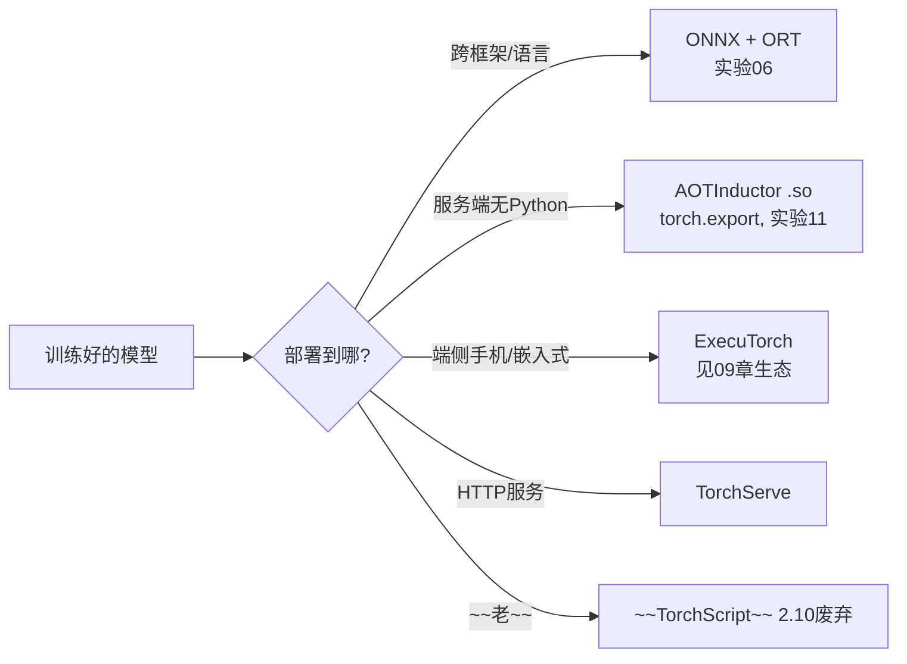

# 07 · 性能与部署

> 从"能训练"到"能上线"。本章串起三条线：**自定义算子（接入 autograd）→ 导出/部署（ONNX/export）→ 量化（省内存/加速）**。这正是你做过 ONNX Runtime EP 的那条链路。

---

## 一、自定义 autograd.Function（写自己的算子）

当内置算子不够（CUDA kernel / ONNX EP 不支持的算子），用 `Function` 接入 autograd：

```python
class MyLeakyReLU(torch.autograd.Function):
    @staticmethod
    def forward(ctx, x, alpha):
        ctx.save_for_backward(x); ctx.alpha = alpha      # 缓存反向要用的
        return torch.where(x>0, x, alpha*x)
    @staticmethod
    def backward(ctx, grad_out):
        x, = ctx.saved_tensors
        grad_in = torch.where(x>0, torch.ones_like(x), alpha*torch.ones_like(x))
        return grad_in * grad_out, None

y = MyLeakyReLU.apply(x, 0.1)   # 用法: Function.apply(...)
```

`ctx.save_for_backward`（缓存）+ `forward` + `backward`（链式），与手写版（实验01）一一对应。实验05 实测与内置 `leaky_relu` **完全一致**。

---

## 二、部署方案全景（老新交接）



### ONNX 导出（实验06 实证）
```python
torch.onnx.export(model, dummy, "m.onnx", dynamic_axes={"input":{0:"batch"}})
# 用 ONNX Runtime 推理
sess = ort.InferenceSession("m.onnx")
out = sess.run(None, {"input": x})
```
实验06 实测：PyTorch vs ORT 数值差 1.8e-7，**ORT 比 eager 快 242×**（小模型上 Python 开销占比大）。

### torch.export + AOTInductor（实验11 实证）
PyTorch 原生闭环，无需第三方 runtime。详见 [08-现代PyTorch](08-现代PyTorch(2.x特性).md).md).md).md).md)。

---

## 三、量化（省内存/加速，衔接激活函数04章）

三种方式：
| 方式 | 特点 |
|------|------|
| **动态 PTQ** | 权重 int8，激活 fp32，无需数据（最简单）|
| **静态 PTQ** | 权重+激活都 int8，需校准数据（最快）|
| **QAT** | 训练时模拟量化（精度最高，需重训）|

实验10 实测动态量化：模型压缩 ~4×，精度损失极小。**但 CPU 小模型可能变慢**（反量化开销 > 收益），大模型/GPU 才真香。

> 现代量化用 **torchao**（int4/MXFP，面向 LLM），见 [09-生态](09-PyTorch生态全景.md)。老的 `torch.quantization` 偏经典 CV。

---

## 四、整条部署链（你的主场）
```
训练(PyTorch) → 自定义算子(Function) → 导出(ONNX/export) → 量化(PTQ/QAT/torchao) → 部署(ORT/ExecuTorch/AOTInductor)
```
你做 Execution Provider 时打通的正是这条链：torch 侧的 Function/量化 → ONNX 节点 → ORT EP 执行。

---

## 📌 下一步
- 跑 `experiments/05_custom_function_compile.py`、`06_onnx_export.py`、`10_quantization.py`。
- compile 深入 → [06-编译与图模式](06-编译与图模式.md)。
- 现代部署 → [08-现代PyTorch](08-现代PyTorch(2.x特性).md).md).md).md).md)。

## ✍️ 练习
1. 自定义 Function 的 `ctx.save_for_backward` 对应手写 autograd（实验01）里的什么？
2. ONNX 导出为何比直接用 PyTorch 部署更适合跨语言场景？
3. 动态量化为何在 CPU 小模型上可能变慢？
4. （进阶）torchao 的 int4 量化相比老 torch.quantization 的 int8 有何优势？
