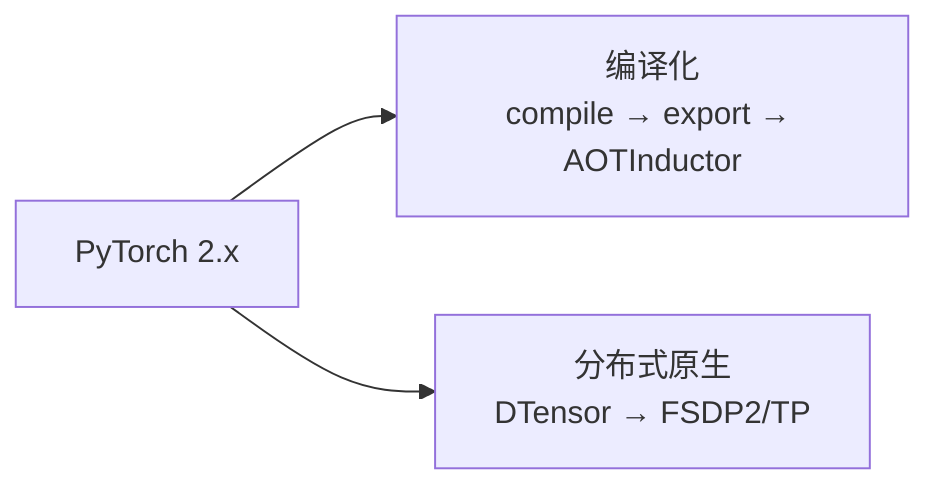

# 08 · 现代 PyTorch（2.x 特性）

> 这章把 PyTorch 2.x 这几年新增的、且最容易在"经典教程"里漏掉的**核心特性**讲透。它们不是生态库（那在 [09](09-PyTorch生态全景.md)），而是 **torch core 内的现代能力**。环境 torch 2.10，实验11/12 已实证可跑的部分标注。

---

## 2.x 两条主线



> 老范式（TorchScript / 手写分布式通信）在退场；新范式（export + DTensor）是现代 PyTorch 的必修课。

---

## 一、SDPA：scaled_dot_product_attention（2.0 稳定）

### 是什么
Transformer 注意力的官方一行实现，内部**自动选最快后端**（FlashAttention / memory-efficient / cuDNN）。

### 为什么必须用
手写注意力要先物化 $N \times N$ 的 attention 矩阵（显存 $O(N^2)$，序列长就爆）。SDPA/FlashAttention 是 $O(N)$ 显存，且 fused。

### 实验11 实证
```python
# 一行, 内部自动 FlashAttention, 还支持 is_causal
out = F.scaled_dot_product_attention(q, k, v, is_causal=True)
# 与手写 softmax(QK^T/√d) 数值一致, 但显存/速度天差地别
```

> 2.5 起在 H100+ 上默认用 cuDNN 后端进一步加速。2.10 新增 `varlen_attn` 处理变长/打包序列。

---

## 二、FlexAttention（2.5 prototype）

### 是什么
用**几行普通 PyTorch** 写一个 `score_modify` 函数定义任意注意力（sliding window / causal / prefix-LM 的复合 mask），FlexAttention 经 compile 自动生成 **fused FlashAttention kernel**。

### 价值
不用手写 Triton/CUDA attention kernel，就能高效实现各种 attention 变体（长序列/文档模型的稀疏 mask）。

### 与 SDPA 的区别
- **SDPA**：内置几种固定 mask（causal 等）。
- **FlexAttention**：任意可编程 mask，且稀疏 mask 还能跳过计算加速。

> 实验12 确认可 import（运行需 compile + GPU）。

---

## 三、torch.export（2.1 prototype → 稳定）：取代 TorchScript

### 是什么
**sound 的全图捕获**机制。基于 PT2 编译栈，把模型捕获成不依赖 Python 的 `ExportedProgram`。

### 为什么取代 TorchScript
TorchScript（`torch.jit`）用 trace/script，**脆弱**、动态控制流难处理。**2.10 正式废弃 TorchScript**，改推 `torch.export`。

### 实验11 实证
```python
ep = torch.export.export(model, (x,))      # 捕获成图(7个节点)
out = ep.module()(x)                        # 运行, 与 eager 0 误差
# 支持动态形状:
ep_dyn = torch.export.export(model, (x,), dynamic_shapes=({0: Dim("b")},))
ep_dyn.module()(torch.randn(20, 8))         # 动态 batch OK
```

---

## 四、AOTInductor（2.3+）：export → .so 部署

### 是什么
`torch.export` 捕获图后，AOTInductor **提前编译成 `.so` 共享库**，可脱离 Python 运行。

### 部署三选一
| 方案 | 特点 |
|------|------|
| ~~TorchScript~~ | 2.10 废弃 |
| ONNX + ORT | 跨框架，但需第三方 runtime |
| **AOTInductor (.so)** | PyTorch 原生，保留优化，无需 Python |

### 实验11 实证
`torch._export.aot_compile(model, (x,), options={"aot_inductor.output_path": path})` 成功生成 `.so`。

### 整条部署闭环
```
训练(PyTorch) → torch.export(捕获图) → AOTInductor(编译.so) → 部署(无Python)
```

---

## 五、DTensor（2.5 稳定）：分布式张量抽象

### 是什么
`DTensor = 本地 tensor + placements`，描述张量如何分布在设备网格上。

### 三种 placement
| placement | 含义 |
|-----------|------|
| `Replicate` | 每个 GPU 一份副本 |
| `Shard(dim)` | 按某维度切分到各 GPU |
| `Partial` | 部分和（待 all-reduce 规约）|

### 价值
用 DTensor 写代码，**它自动处理 all-gather/all-reduce 等集合通信**。分布式编程从"手写通信原语"变成"声明 placement"。上层 FSDP2/TP 都建立在 DTensor 上。

> 实验12 确认可 import；真正运行需多进程 `init_process_group`。

---

## 六、FSDP2（fully_shard）与张量并行 TP

### FSDP2（2.5+）
基于 DTensor **重写的全新 FSDP**，取代 FSDP1（`FullyShardedDataParallel`）。
- 更易组合（可对任意子模块 shard）
- 更易调试、原生支持 HSDP（混合分片）
- 用法：`fully_shard(module)` 一行

### Tensor Parallelism（TP，2.3+）
把**单层**（如 Linear/attention）的权重切到多 GPU 并行算（Megatron 风格）。

### 选型
- 单卡放不下大模型 → **FSDP2**
- 单层算太慢/太大 → **TP**
- LLM 训练常 **FSDP2 + TP 组合**

---

## 七、torchao（独立库）：现代量化

取代老的 `torch.quantization`（偏经典 CV/XNNPACK）。torchao 面向 **LLM/GPU**：
- `int4_weight_only` / `int8_weight_only`（LLM 推理主力）
- **MXFP**（微缩浮点 8/4-bit，比 int 精度好，H100+ 原生）
- 与 compile/export 深度集成

> 环境 `pip install torchao`（实验12 确认本机未装）。详见「讲透激活函数 04 章」量化的数学基础。

---

## 八、版本演进时间线（官方 release blog 核实）

| 版本 | 标志性特性 |
|------|-----------|
| 2.0 (2023.3) | torch.compile, SDPA — 2.x 起点 |
| 2.1 (2023.10) | torch.export prototype, 动态形状, distributed.checkpoint |
| 2.3 (2024.4) | Triton kernels in compile, TP, AOTInductor |
| 2.5 (2024.10) | FlexAttention, cuDNN SDPA, FSDP2, DTensor 稳定, Compiled Autograd |
| 2.10 (2026.1) | TorchScript 废弃, varlen_attn, DebugMode/tlparse, combo-kernels |

---

## 九、批判性视角

- **现代特性很多是 prototype/beta**。FlexAttention、Compiled Autograd 标 prototype，API 可能变。生产用要跟版本。
- **强依赖 GPU**。SDPA 后端、FlexAttention、Triton、CUDA Graphs 都要 GPU；CPU 上这些特性的"性能价值"大打折扣（实验05/10 印证）。
- **分布式特性需真集群**。DTensor/FSDP2/TP 单机单卡只能理解抽象，没法验证性能。
- **学习曲线**。从 eager 转到"编译思维"（动态 shape / graph break）有陡坡，但这是现代 PyTorch 的必修课。

---

## 📌 下一步

- 跑 `experiments/11_sdpa_export.py`（SDPA + export + AOTInductor，CPU 全可跑）+ `12_modern_overview.py`（FlexAttention/DTensor 概览）。
- 生态库（torchvision/torchao/ExecuTorch/HF…）→ [09-PyTorch生态全景](09-PyTorch生态全景.md)。
- compile 深入 → [06-编译与图模式](06-编译与图模式.md)。

## 🔬 深度阅读（现代特性的内核 + 演进动态）

**DTensor/分布式是 2.x 演进最剧烈的部分，ezyang 2026 的 SPMD 系列揭示了它正在被重构——强烈推荐：**
- **ezyang "Global vs Local SPMD"** + **"Computing sharding with einsum"**（blog.ezyang.com）— DTensor sharding 推导机制（用 einsum 下标推 sharding）。
- **ezyang "The JAX sharding type system"** — DTensor 重新设计的理论参照（对比 JAX）。
- **ezyang "DTensor erasure"** — **重磅**：DTensor 在 eager 下有 35–60% 训练 slowdown，正在通过 sharding-in-types + 运行时擦除来解决。这是 DTensor 未来方向的内部动态。
- **ezyang "Replicate Forwards, Partial Backwards"** — DTensor 反向推导（前向 replicate ↔ 反向 partial），DP+TP gated MLP 实例。

**SDPA/FlexAttention：**
- **PyTorch 官方 FlexAttention 教程**（docs.pytorch.org/tutorials）— 用 score_modify 实现各种 attention mask。
- **dev-discuss.pytorch.org** — varlen_attn / SDPA cuDNN 后端的设计讨论。

**torch.export / AOTInductor：**
- **docs.pytorch.org → torch.export** — 官方导出文档（含 dynamic_shapes、控制流原语 cond/while_loop）。

## ✍️ 练习

1. SDPA 为什么比手写 `softmax(QK^T/√d)` 省显存？（提示：FlashAttention 不物化 N×N 矩阵）
2. torch.export 相比 TorchScript 的优势是什么？为何 2.10 废弃 TorchScript？
3. DTensor 的三种 placement 分别对应什么集合通信？
4. FSDP2 和 TP 各解决什么问题？训 LLM 为何要组合？
5. （进阶）为什么 compile 在 GPU 大模型才显著加速，CPU 小模型反而变慢？（回到 06 章算子融合的本质）
