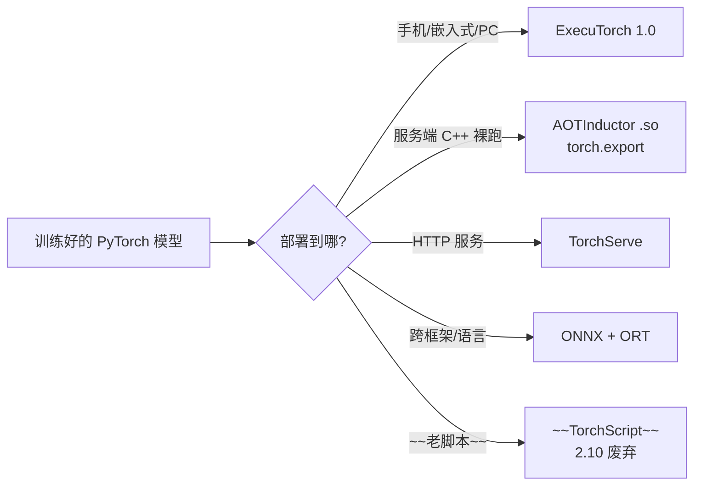
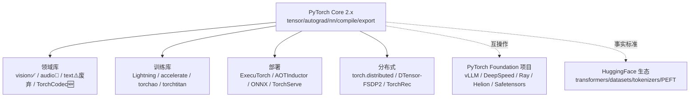

# 09 · PyTorch 生态全景

> PyTorch core 只是地基。真正"用 PyTorch 干活"——做 CV、训 LLM、部署到手机、分布式训千亿模型——靠的是**生态库**。本章把这些库分类、定位、选型讲清楚，并**诚实标注废弃/维护/新晋**（生态变化快，2024–2026 已有多个库退场）。
>
> 本文不做实验（生态库大多需单独安装，且多数不在本 CPU 环境）。目标是给你一张**准确的导航地图**和**选型清单**。

> ℹ️ 以下状态基于 2026-07 官方仓库/release 核实，非记忆。

---

## 一、领域库（Domain Libraries）

PyTorch 官方维护的"按数据类型"分库。**注意：它们的命运正在分化。**

| 库 | 定位 | 状态(2026-07) | 何时用 / 替代 |
|----|------|--------------|--------------|
| **torchvision** | CV：数据集、预训练模型(ResNet/ViT...)、图像 transforms | ✅ 活跃（随 torch 版本对齐，2.10→0.25）| 做 CV 的标配 |
| **torchaudio** | 音频信号处理、数据集、模型 | 🔧 **维护期**（2.8 起 maintenance，编解码 API 已移除）| 信号处理仍可用；**编解码改用 TorchCodec** |
| **torchtext** | NLP：分词、词表、数据集 | ⚠️ **已废弃**（0.18 是最后稳定版，2024.4 停止开发）| **别用了**，改用 HuggingFace `tokenizers` + `transformers` |
| **TorchCodec** | 🆕 音视频编解码 | 新库，承接 torchaudio 的编解码 | 读音频/视频文件用它 |

> 🎯 **核心教训**：NLP 不要再用 torchtext（它停在 2024）。今天 NLP/LLM 的事实标准是 **HuggingFace transformers + tokenizers + datasets**，不是 PyTorch 官方栈。这是生态格局的最大变化。

---

## 二、训练、微调与优化

| 库 | 定位 | 状态 | 何时用 |
|----|------|------|--------|
| **torchao** | 量化/低比特/优化（int4/MXFP/稀疏）| ✅ 活跃 | LLM 推理量化首选，与 compile/export 深度集成 |
| **torchtune** | LLM 微调（LoRA/QLoRA/蒸馏/GRPO）| ⚠️ **2025 停止积极维护**（转社区）| 历史参考；**新项目用 lit-gpt / HF accelerate** |
| **torchtitan** | 大规模预训练参考实现（FSDP2/TP）| ✅ 活跃 | 学分布式 LLM 训练的最佳"可读源码" |
| **torchtnt** | 训练框架（train/eval loop 单元）| 维护 | 中等规模训练脚手架 |
| **PyTorch Lightning** | 高级训练框架（封装训练循环/分布式/日志）| ✅ 社区主流 | 想少写样板代码、专注模型本身 |
| **HuggingFace accelerate** | 统一分布式/混合精度/设备管理 API | ✅ 事实标准 | 几行代码让训练脚本跑单机/多机/TPU |
| **HuggingFace transformers** | 预训练模型库（10万+模型）| ✅ 事实标准 | NLP/多模态必备，不是可选 |

> 🎯 **微调 LLM 现状**：torchtune 退场后，主流是 **HF accelerate + PEFT(LoRA) + transformers** 或 **lit-gpt**。torchtune 的"可 hack 性"思想被 lit-gpt 继承。

---

## 三、部署（Deployment）

部署是 PyTorch 2.x 重构最剧烈的领域，**新老范式正在交接**：

| 方案 | 定位 | 状态 | 何时用 |
|------|------|------|--------|
| **ExecuTorch** | 🆕 端侧部署（手机/嵌入式/PC，支持 NPU/DSP）| ✅ **1.0 生产就绪**（Meta 全家桶在用）| 端侧推理首选，**取代老的 torch.mobile** |
| **torch.export + AOTInductor** | 服务端：export→AOT 编译→.so 裸部署 | ✅ 2.x 主推 | 无 Python 环境的服务端推理（见实验11）|
| **TorchServe** | 服务端模型服务（REST/gRPC）| ✅ 维护 | 生产 HTTP 推理服务 |
| **libtorch** | C++ PyTorch（无 Python）| ✅ 稳定 | C++ 生产环境 |
| **ONNX + ONNX Runtime** | 跨框架（C++/C#/JS）| ✅ 通用 | 需要跨后端/跨语言（见实验06）|
| ~~TorchScript (torch.jit)~~ | 老的脚本化部署 | ⚠️ **2.10 废弃** | **别用了**，改用 torch.export |

---

## 四、分布式训练

| 库/工具 | 定位 | 状态 |
|--------|------|------|
| **torch.distributed** | 分布式基础（DDP/FSDP/RPC/...）| ✅ core 内置 |
| **torchrun** | 分布式启动器（多机多卡启动）| ✅ 必用 |
| **DTensor / FSDP2(fully_shard) / TP** | 2.5+ 新分布式范式（基于 DTensor）| beta，LLM 训练新标准 |
| **TorchRec** | 推荐系统分布式（巨型嵌入表分片）| ✅ 活跃 |
| **torch.distributed.checkpoint** | 分布式断点（支持拓扑变化 reshard）| ✅ 2.1+ |
| **DeepSpeed**（Foundation）| ZeRO 优化、大模型训练 | ✅ 主流 |
| **Ray Train**（Foundation）| 分布式计算框架 | ✅ 主流 |
| **Helion**（Foundation）| HuggingFace 新训练库 | 🆕 |

> 🎯 **分布式选型**：单机多卡→DDP；模型放不下→FSDP2；单层太大→TP；通常 **FSDP2 + TP 组合**训 LLM。老 FSDP1 在被 FSDP2 取代。

---

## 五、模型库（拿来即用）

| 库 | 内容 | 何时用 |
|----|------|--------|
| **HuggingFace transformers** | 10 万+ 预训练模型（NLP/多模态/LLM）| NLP/LLM/Prompt 首选 |
| **timm** | CV 模型全集（数百架构）| CV 研究/比赛必备 |
| **torchvision.models** | 经典 CV 预训练（ResNet/EfficientNet/ViT）| CV 入门/生产 |
| **diffusers** | 扩散模型（SD/FLUX...）| 图像/视频生成 |

---

## 六、数据

| 库 | 定位 |
|----|------|
| **HuggingFace datasets** | NLP/多模态数据集事实标准 |
| **TorchData** | DataLoader2 / DataPipes（流式数据处理）|
| **webdataset** | 大规模 shard 数据（适合分布式）|

---

## 七、调试、可视化与可解释

| 工具 | 定位 |
|------|------|
| **torch.utils.tensorboard** | 训练曲线可视化（经典）|
| **torch.profiler** + **tlparse** | 性能/数值剖析（tlparse 是 2.10 新调试利器）|
| **DebugMode** | 2.10 数值发散定位（两模型结果为何不同）|
| **Captum** | 模型可解释性（归因/注意力可视化）|
| **torchlens** | 一行代码可视化计算图 |

---

## 八、专业领域

| 库 | 领域 |
|----|------|
| **PyTorch Geometric (PyG)** | 图神经网络（GNN）事实标准 |
| **torchrl** | 强化学习（RL）|
| **torchgeo** | 遥感/地理空间 |
| **escnn** | 等变神经网络 |
| **skorch** | 让 PyTorch 兼容 scikit-learn API |

---

## 九、PyTorch Foundation 托管项目（生态外延）

这些是 PyTorch 基金会托管的大型项目，**不是 core 也不是领域库**，但属于官方生态：

| 项目 | 定位 |
|------|------|
| **vLLM** | LLM 高吞吐推理（PagedAttention）|
| **DeepSpeed** | 大模型训练优化（ZeRO/Offload）|
| **Ray** | 通用分布式计算 + 训练 |
| **Helion** | HuggingFace 新训练库 |
| **Safetensors** | 安全快速的张量序列化（**取代 pickle，事实标准**）|

---

## 十、选型速查（按"我要做什么"）

| 我要做 | 用什么 |
|--------|--------|
| 图像分类/检测 | torchvision + timm |
| 文本分类/NLP | **HuggingFace transformers**（不用 torchtext）|
| 微调 LLM | HF accelerate + PEFT / lit-gpt（不用 torchtune）|
| 量化 LLM 推理 | torchao（int4/MXFP）|
| 大模型分布式训练 | FSDP2 + TP（torch.distributed）/ torchtitan 参考 |
| 部署到手机/嵌入式 | **ExecuTorch** |
| 服务端无 Python 部署 | torch.export + AOTInductor |
| 跨语言/框架部署 | ONNX + ONNX Runtime |
| HTTP 推理服务 | TorchServe |
| 图神经网络 | PyTorch Geometric |
| 强化学习 | torchrl |
| 训练可视化 | tensorboard / W&B |
| 安全保存权重 | **Safetensors**（不 pickle）|

---

## 十一、废弃/维护警示（避坑）

> 这些是 2024–2026 退场的，**新项目别选**：

| 已退场 | 替代 |
|--------|------|
| ⚠️ **torchtext** | HuggingFace tokenizers + transformers |
| ⚠️ **torchaudio 的编解码** | TorchCodec |
| ⚠️ **torchtune**（停止维护）| lit-gpt / HF accelerate + PEFT |
| ⚠️ **TorchScript (torch.jit)** | torch.export |
| ⚠️ **torch.mobile** | ExecuTorch |
| ⚠️ **老 torch.quantization（经典 CV 流）** | torchao（现代 LLM 量化）|
| ⚠️ **FSDP1 (FullyShardedDataParallel)** | FSDP2 (fully_shard) |

> 🎯 **趋势**：PyTorch 在主动"瘦身"——把维护负担重的老库（text/tune/mobile/script）退役，集中力量到 **core 2.x（compile/export/DTensor）+ 关键新库（torchao/ExecuTorch/TorchCodec）**。生态从"大而散"走向"精而强"。

---

## 十二、生态与 core 的关系图

> 两个"外部但事实标准"的存在：**HuggingFace**（NLP/LLM 模型与数据）和 **Safetensors**（权重序列化）。它们虽非 PyTorch 官方，但已成为 PyTorch 工作流的默认组件。

---

📌 **下一步**：
- 这份全景是**地图**。具体某个库怎么用，看其官方文档（生态库更新快，文档比任何教程都准）。
- 选型记住三句话：**NLP/LLM 找 HuggingFace；部署看 ExecuTorch/AOTInductor；量化用 torchao**。
- 回到 core：[01-Autograd](01-Autograd与计算图.md)（backward 本质）、[06-编译](06-编译与图模式.md)（compile）、[08-现代2.x特性](08-现代PyTorch(2.x特性).md)（export/SDPA/分布式）是理解所有生态库如何接 core 的钥匙。
