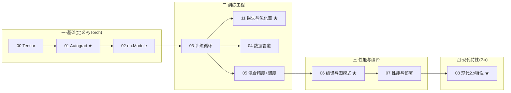

# 讲透 PyTorch

> 从「跑过教程、但没独立搭过模型」到「独立搭模型 + 懂底层机制 + 跟上 2.x 现代特性」。这份教程不教你抄代码，而是讲透 **Tensor → Autograd → Module → 训练工程 → 编译/部署 → 2.x 现代特性** 的完整链路，每个结论都用 bash 跑通的实验验证。
>
> 环境是 torch **2.10.0**（2026-01 GA）。本教程**特别覆盖 PyTorch 2.x 的现代特性**（torch.compile / torch.export / SDPA / FlexAttention / DTensor-FSDP2 / torchao），因为这是大多数"经典教程"漏掉、却又是今天 PyTorch 主体的部分。

---

## 这份教程为谁而写

- **跑过官方 60 分钟入门、但自己搭不起模型**的人。
- 想搞懂 `loss.backward()` 在框架层到底干了什么的人。
- **系统/底层工程师**（你做过 ONNX Runtime EP）—— autograd/计算图/compile/export/量化这条线是你的主场。
- 想知道 PyTorch 2.x 这几年到底新增了什么、老东西（TorchScript）为何退场的人。

## 与前两个项目的关系

```
讲透激活函数  →  网络能否训练（Dead ReLU/梯度消失，反传里每层局部导数）
讲透泛化      →  训练好为何对新数据有效（隐式正则/双层下降）
讲透 PyTorch  →  上面这一切在框架层如何实现 + 怎么工程化用起来  ★你在这里
```

> **注**：原独立的「讲透反向传播」「讲透损失函数」「讲透优化器」三个系列已**整合进本教程**——反传数学本质并入 [01-Autograd](01-Autograd与计算图.md)，故障/梯度全景并入 [03-训练循环](03-训练循环.md)，mutation 边界/反传未来并入 [10-内核精读](10-PyTorch内核精读.md)，损失+优化器合成 [11-损失函数与优化器](11-损失函数与优化器.md)。三者原本单薄（各 2 章无 README），合并后成为完整训练链。

本教程会让前面所有理论（ReLU 反向、梯度消失、泛化）在 PyTorch 代码里**落地可见**——你终于能看到 `loss.backward()` 如何驱动那些数学。

## 教学宪法

每章三层：**直觉（比喻）→ 机制（API/原理）→ 代码（bash 跑通的实证）**。诚实标注哪些是稳定 API、哪些是 prototype、哪些受 CPU/GPU 限制跑不出收益。

---

## PyTorch 2.x 版本演进（基于官方 release blog 核实）

| 版本 | 时间 | 标志性特性 | 状态(2.10) |
|------|------|-----------|-----------|
| 2.0 | 2023.3 | **torch.compile**(Dynamo+Inductor+Triton)、**SDPA** | 稳定 |
| 2.1 | 2023.10 | **torch.export** prototype、动态形状、distributed.checkpoint | 稳定 |
| 2.3 | 2024.4 | Triton kernels in compile、**TP**、**AOTInductor** | — |
| 2.5 | 2024.10 | **FlexAttention**、cuDNN SDPA、**FSDP2**(fully_shard)、**DTensor** 稳定、Compiled Autograd | beta |
| 2.10 | 2026.1 | **TorchScript 废弃**→torch.export、varlen_attn、DebugMode/tlparse、combo-kernels | 当前环境 |

> 主线：**编译化**（compile → export → AOTInductor）+ **分布式原生**（DTensor → FSDP2/TP）。老范式（TorchScript / 手写分布式通信）在退场。

---

## 全景目录与学习路径



| 章节 | 文档 | 核心问题 | 实验 |
|------|------|---------|------|
| 00 | 00-Tensor基础.md | Tensor 不只是 numpy，view/广播/device | `00_tensor_basics` |
| 01 | **01-Autograd与计算图.md ★** | 反传数学本质(VJP/m≪n/O(N)) + `backward()`底层 | `01_autograd_from_scratch` `02_autograd_internals` `13_numerical_vs_backprop` `14_vjp_and_shapes` `15_mlp_by_hand` `16_gradient_check` |
| 02 | 02-nnModule与参数管理.md | 所有模型如何组织 | `04_module_hooks` |
| 03 | 03-训练循环.md | 黄金5步 + 常见bug + 故障(消失/爆炸) + 梯度全景 | `03_training_loop` `09_amp_scheduler` `17_vanishing_exploding` `18_optimizer_gradients` |
| 04 | 04-数据管道.md | Dataset/DataLoader/Sampler/collate | `08_data_pipeline` |
| 05 | 05-混合精度AMP.md | autocast+GradScaler | `09_amp_scheduler` |
| 06 | **06-编译与图模式.md ★** | torch.compile 三段流水线/算子融合 | `05_custom_function_compile` `07_compile_deep` |
| 07 | 07-性能与部署.md | 自定义Function/ONNX/量化 | `05` `06_onnx_export` `10_quantization` |
| 08 | **08-现代PyTorch(2.x).md ★** | export/SDPA/FlexAttention/DTensor/FSDP2/torchao | `11_sdpa_export` `12_modern_overview` |
| 09 | **09-PyTorch生态全景.md ★** | 生态库分类/选型/废弃警示 | （纯文档,无实验）|
| 10 | **10-PyTorch内核精读.md ★★★** | 精读 ezyang 源:dispatcher主线串架构/调度/autograd+mutation边界/编译栈/DTensor/反传边界与未来 | `19_mutation_views` |
| 11 | **11-损失函数与优化器.md ★** | 损失怎么选(MLE统一/CE为何胜MSE) + 优化器怎么选(SGD→AdamW演化) | `20_loss_overview` `21_optimizer_overview` |

## 环境与运行

```
torch 2.10.0 (CPU)  |  onnx 1.17 / onnxruntime 1.21  |  python 3.12
缺: GPU / triton / torchao (相关实验诚实标注原理)
```

```bash
cd 讲透PyTorch/experiments && bash run_all.sh    # 一键跑通全部 21 个实验
```

## 实证速览（全部 bash 跑通）

| 实验 | 关键数字 | 说明 |
|------|---------|------|
| 01 手写autograd | 与 torch 对拍 0 误差 + 训练MLP loss 0.22→0.059 | 90行复刻 PyTorch 灵魂 |
| 05 自定义Function | 自写LeakyReLU vs 内置 完全一致 | 接入autograd的标准方式 |
| 06 ONNX导出 | PyTorch vs ORT 差 1.8e-7，**ORT 快 242×** | 部署闭环 |
| 07 compile深入 | profiler 算子调用 120→85（融合生效） | compile 价值在算子融合 |
| 09 梯度裁剪 | gnorm 0.15→0.05（真实裁剪） | 训练稳定性 |
| 10 量化 | 模型压缩 ~4×（CPU小模型速度反降，诚实标注） | 动态PTQ |
| 11 SDPA+export | SDPA=手写attention；export捕获7节点图；AOTInductor生成.so | 2.x部署新范式 |
| 12 现代概览 | FlexAttention/DTensor/FSDP2/TP/torchao 原理+API可达 | 2.x全景 |
| 13 数值vs反传 | 1000参数数值微分慢 200×，反传几乎不变 | O(n) vs O(1) 渐近阶胜利 |
| 14 VJP与形状 | VJP 自动与输入同形；JVP 要跑 n 次 | m≪n 不对称实证 |
| 15 手算MLP反传 | 手算 vs autograd 最大差 2.6e-6 | 链式法则逐层落地 |
| 16 梯度检查 | gradcheck 抓出写错的 backward | 数值验证解析梯度 |
| 17 消失爆炸 | sigmoid 浅层 3.6e-15；ReLU 高 8 数量级；残差救场 | 连乘诅咒实证 |
| 18 优化器加工 | 同一梯度，Momentum/Adam 更新天差地别 | 反传输出只是原料 |
| 19 mutation边界 | version counter 报错；CopySlices 正确处理 view | 数学→工程鸿沟 |
| 20 损失函数 | MSE 被离群点拉飞(1.818)；MAE 稳(1.111)；softmax+CE 梯度=p-y | MLE 统一视角 |
| 21 优化器 | SGD 震荡；Momentum 完美命中；Adam 对 lr 宽容 | SGD→AdamW 演化 |

---

---

## 📚 权威深度资源索引（讲 PyTorch 核心机制的源头）

本教程讲"是什么 + 怎么用"。想挖到**框架内核为什么这么设计**，读下面这些由 PyTorch 核心开发者/官方写的深度资源。它们是本教程各章机制的"源头活水"。

### 一、核心开发者博客（最高权威）

**Edward Yang (ezyang)** — PyTorch 核心开发者，他的博客是讲 PyTorch 内部机制最权威的源。blog.ezyang.com

*经典篇（机制地基，必读）*
- **PyTorch internals**（综述）— 一篇讲清 PyTorch 整体架构。配 [00-Tensor](00-Tensor基础.md) / [01-Autograd](01-Autograd与计算图.md)。
- **Let's talk about the PyTorch dispatcher** — dispatcher 机制（算子如何路由到 CPU/CUDA kernel）。配 [00](00-Tensor基础.md) / [06-编译](06-编译与图模式.md)。
- **A brief taxonomy of PyTorch operators by shape behavior** — 算子按 shape 行为分类。

*2026 新系列（DTensor/SPMD 重构，最新动态）— 揭示 DTensor 正在被重新设计*
- **Autograd and Mutation** — autograd 如何处理 in-place mutation 与 view aliasing（CopySlices / rebase history）。配 [01-Autograd](01-Autograd与计算图.md)。
- **Global vs Local SPMD** + **Computing sharding with einsum** — DTensor sharding 推导机制。配 [08-现代](08-现代PyTorch(2.x特性).md)。
- **The JAX sharding type system** + **DTensor erasure** + **Replicate Forwards, Partial Backwards** — DTensor 基于 JAX sharding-in-types 的重构（消除 eager 派发开销，实测 35–60% slowdown 的根因）。配 [08-现代](08-现代PyTorch(2.x特性).md)。
- **Megatron via shard_map** — 用 local-SPMD 实现 Megatron 张量并行。

### 二、PyTorch Developer Podcast
ezyang 主持的播客，每集一个 PyTorch 内部主题（codegen / native_functions.yaml / dispatcher / autograd ...）。**通勤听，建立直觉**。覆盖 [00](00-Tensor基础.md)–[08](08-现代PyTorch(2.x特性).md) 全部。

### 三、PyTorch 官方深度文档
- **A Tour of PyTorch Internals (Part I)** + **Part II - The Build System**（2017 官方）— 官方版内部导览。配 [00](00-Tensor基础.md)。
- **docs.pytorch.org**：`torch.compiler_internals`（compile 内部）、`export` 文档。配 [06](06-编译与图模式.md) / [08](08-现代PyTorch(2.x特性).md)。

### 四、社区深度源码博客
- **Kieran Didi — How does PyTorch implement a linear layer?** — 从源码追踪 `addmm`：dispatcher → `native_functions.yaml` → codegen → structured kernels → CPU/CUDA 实现。**读源码的入门钥匙**。配 [00](00-Tensor基础.md) / [02-Module](02-nnModule与参数管理.md)。
- **Christian Perone — PyTorch 2 Internals** — PyTorch 2.x 编译栈架构。配 [06-编译](06-编译与图模式.md)。

### 五、设计讨论
- **dev-discuss.pytorch.org** — PyTorch 设计/RFC 讨论（每个特性为何这么定）。

### 六、论文
- **PyTorch: An Imperative Style, High-Performance DL Library** (NeurIPS 2019) — eager/动态图的设计哲学。
- **TorchDynamo** — compile 的字节码跟踪机制。

### 📖 按主题速查

| 我想搞懂 | 先读 |
|---------|------|
| PyTorch 整体怎么搭的 | ezyang "PyTorch internals" + 官方 "A Tour" |
| `loss.backward()` 内部 | ezyang "Autograd and Mutation" + 本教程 [01](01-Autograd与计算图.md) |
| 算子怎么路由到 CPU/GPU | ezyang "Let's talk about dispatcher" + Kieran Didi |
| torch.compile 怎么工作 | Christian Perone "PyTorch 2 Internals" + 本教程 [06](06-编译与图模式.md) |
| DTensor/FSDP2 怎么演进 | ezyang 2026 SPMD 系列（含重构动态）+ 本教程 [08](08-现代PyTorch(2.x特性).md) |
| 一个算子源码长啥样 | Kieran Didi "linear layer" + PyTorch Developer Podcast |

---

📌 **下一步**：
- 完全新手 → 从 [00-Tensor基础](00-Tensor基础.md) 开始。
- 想搞懂 backward → 直奔 [01-Autograd](01-Autograd与计算图.md)（先跑 `experiments/01_autograd_from_scratch.py`，90 行看穿计算图）。
- 想跟上 2.x 现代 → 直奔 [08-现代PyTorch](08-现代PyTorch(2.x特性).md)（export/SDPA/FlexAttention/分布式）。
- 系统工程师/部署 → [06 编译](06-编译与图模式.md) + [07 性能与部署](07-性能与部署.md) + [08](08-现代PyTorch(2.x特性).md)。
- **想挖到框架内核** → 上面「权威深度资源索引」，按主题速查表入门。
