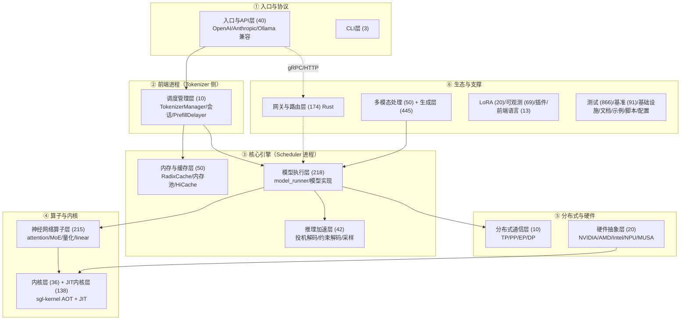
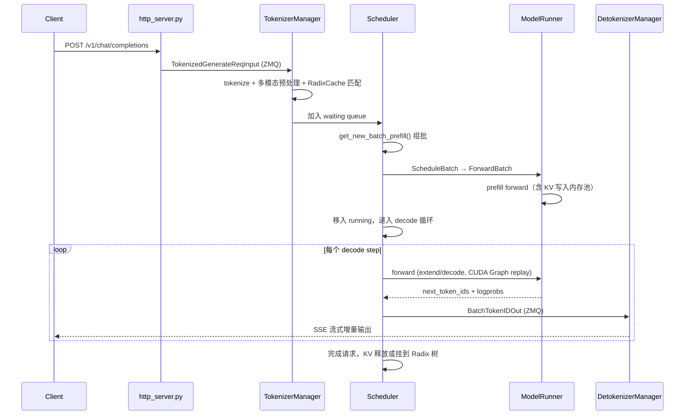

# SGLang 新人上手指南（ONBOARDING）

> 生成方式：`/understand --language zh` 知识图谱（5652 节点 / 12950 边 / 27 层 / 12 步导览）+ DeepWiki 24 章结构交叉验证
> 锚定 commit：`ec075d8bc`（2026-09，DeepWiki 索引 94183a8d / 2026-08-27，两者高度接近）
> 配套：`../deepwiki/`（110 页全量中文抓取）、`../explain/`（核心文件深度解析）、`../knowledge-graph/`

---

## 1. 项目概览

**SGLang** 是一个高性能的大语言模型（LLM）/视觉语言模型（VLM）服务框架，核心卖点：

| 特性 | 一句话解释 |
|------|-----------|
| **RadixAttention** | 用 Radix 树做自动前缀缓存（prefix caching），多轮对话/批量共享 prompt 时几乎零成本复用 KV Cache |
| **零开销调度** | CPU 侧调度 + continuous batching，配合 CUDA Graph 把 decode 阶段 CPU 开销压到最低 |
| **投机解码** | EAGLE/EAGLE3/Ngram/DFlash 等 draft-verify 范式，一次 forward 出多个 token |
| **分离式推理** | Prefill-Decode 分离（PD disaggregation），可跨节点迁移 KV Cache |
| **全维度并行** | TP / PP / EP / DP（含 DP Attention）全支持，跑得动 DeepSeek V3/R1 级 MoE |
| **多模态与扩散** | VLM（LLaVA/Qwen-VL 系）+ 扩散模型 runtime（DiT/FLUX 级 multimodal_gen） |
| **Rust 数据面** | sgl-router（KV-aware 路由）+ sgl-model-gateway（负载均衡/WASM 中间件） |

**语言构成**：Python（srt 运行时主体）、Rust（router/gateway）、CUDA/C++（sgl-kernel AOT 内核）、少量 Go/JS。
**核心依赖**：PyTorch、FlashInfer、Triton、FastAPI（HTTP 层）、Tokio/Axum/gRPC（Rust 数据面）。

---

## 2. 架构分层总览（27 层 → 归并为 6 大板块）

知识图谱把仓库切成 27 层。新人先记住 6 大板块，再逐层下钻：



### 各层一句话职责

| 层 | 节点数 | 职责 |
|----|-------|------|
| 入口与API层 | 40 | HTTP 服务、OpenAI/Anthropic/Ollama 协议转换、serving 路由 |
| 调度管理层 | 10 | TokenizerManager（tokenize/请求簿记）、会话管理、Prefill 延迟控制 |
| 模型执行层 | 218 | model_runner、200+ 模型实现（Llama/DeepSeek/Qwen…）、权重加载 |
| 神经网络算子层 | 215 | attention backends、MoE（TopK 路由/FusedMoE）、量化、linear、激活 |
| 推理加速层 | 42 | 投机解码（EAGLE 系）、约束解码、采样器、CUDA Graph、状态捕获 |
| 内存与缓存层 | 50 | KV Cache 内存池（页级分配）、RadixCache 前缀树、HiCache 多级存储 |
| 分布式通信层 | 10 | TP/PP/EP/DP 进程编排、custom all-reduce、EPLB 专家均衡 |
| 硬件抽象层 | 20 | 多平台适配（CUDA/ROCm/XPU/CPU/NPU/MUSA） |
| 内核层（AOT） | 36 | sgl-kernel 预编译高性能 CUDA/C++ 内核 |
| JIT内核层 | 138 | 运行时即时编译内核（flash attention、量化算子） |
| 网关与路由层 | 174 | Rust：sgl-router（cache-aware 路由）+ sgl-model-gateway（负载均衡/WASM） |
| 多模态处理层 | 50 | 图像/视频/音频输入、视觉编码、跨模态嵌入 |
| 多模态生成层 | 445 | 扩散模型推理框架：DiT/VAE/Encoder、图像/视频/3D 生成 pipeline |
| LoRA适配层 | 20 | LoRA 权重管理、动态加载、推理集成 |
| 可观测性层 | 69 | Prometheus 指标、链路追踪、标签转换 |
| 插件层 | 1 | 运行时插件系统 |
| 前端语言层 | 13 | SGLang DSL：IR 定义、tracer、解释器、后端抽象 |
| CLI层 | 3 | `sglang serve/generate` 子命令 |
| 核心工具层 | 10 | 全局配置、版本、环境检查 |
| SRT运行时工具层 | 37 | 运行时内部辅助函数 |
| 测试层 | 866 | 单元/集成/CI 测试（仓库近 1/4 文件是测试） |
| 基准测试层 | 91 | bench_serving 等性能脚本 |
| 基础设施层 | 26 | Docker/K8s/CI 脚本 |
| 文档层 | 80 | docs/（含中文 docs_new/） |
| 示例层 | 12 | examples/ |
| 脚本层 | 5 | 开发运维脚本 |
| 配置层 | 8 | 根级 lint/format/CI 配置 |

---

## 3. 核心概念（先懂这 8 个，再看代码）

1. **多进程架构**：Engine（编排）→ TokenizerManager（前端 tokenize，asyncio+uvloop）→ Scheduler（调度+GPU 执行，内含 ModelRunner）→ DetokenizerManager（流式 detokenize），进程间走 **ZeroMQ IPC**（`io_struct.py` 定义全部消息结构）。
2. **ScheduleBatch vs ForwardBatch**：前者是 CPU 侧请求元数据批，后者是 GPU 张量批（token ids/位置/attention 掩码）。`schedule_batch.py` 是理解调度的主钥匙。
3. **RadixAttention 前缀缓存**：请求的 token 序列按 radix 树组织，公共前缀的 KV Cache 直接复用；`radix_cache.py` + `memory_pool.py`（`ReqToTokenPool` / `TokenToKVPoolAllocator`）。
4. **continuous batching**：每步动态组批，prefill 与 decode 混跑（`scheduler.py` 的 event loop：`recv_requests → process_input_requests → get_new_batch → run_batch → process_batch_result`）。
5. **CUDA Graph**：decode 阶段固定 batch size 捕获计算图，重放消除 kernel launch 开销（`cuda_graph_runner.py`）。
6. **投机解码（EAGLE）**：draft 模型自回归猜 k 个 token → target 模型一次 forward 树验证 → 接受最长正确前缀（`speculative/eagle_worker.py`）。
7. **多维并行**：TP 切权重矩阵、PP 切层、EP 切 MoE 专家、DP 复制整个实例（DP Attention 场景 DP 切 attention 序列维）；PD 分离把 prefill/decode 放不同节点。
8. **两条 Rust 数据面**：sgl-router（请求级路由，cache-aware 选 worker）与 sgl-model-gateway（worker 管理+负载均衡+WASM 工作流），都在主仓 `rust/` 目录。

---

## 4. 一次请求的生命周期（把 6 大板块串起来）



---

## 5. 关键文件地图（按学习顺序）

### 第一梯队：主干数据流（必读）
| 文件 | 行数级别 | 一句话 |
|------|---------|-------|
| `python/sglang/srt/server_args.py` | 大 | 全部服务器参数（TP/DP/EP/PP/内存/投机/量化/LoRA/分离），入口总开关 |
| `python/sglang/srt/entrypoints/engine.py` | 中 | Engine 类：子进程编排与生命周期 |
| `python/sglang/srt/entrypoints/http_server.py` | 中 | HTTP 主入口，REST 路由到各 serving 模块 |
| `python/sglang/srt/managers/io_struct.py` | 中 | **IPC 消息圣经**：进程间所有数据结构 |
| `python/sglang/srt/managers/tokenizer_manager.py` | 大 | 前端核心：tokenize/簿记/异步转发 |
| `python/sglang/srt/managers/scheduler.py` | **超大** | 调度器心脏：event loop + 组批策略 |
| `python/sglang/srt/managers/schedule_batch.py` | 大 | ScheduleBatch/ForwardBatch/Req 数据结构 |
| `python/sglang/srt/model_executor/model_runner.py` | 大 | 推理执行器：KV 管理+前向+采样全流程 |
| `python/sglang/srt/model_executor/forward_batch_info.py` | 中 | ForwardBatch：GPU 张量批的元数据 |

### 第二梯队：三大招牌技术
| 文件 | 招牌 |
|------|------|
| `python/sglang/srt/mem_cache/radix_cache.py` | RadixAttention 前缀树 |
| `python/sglang/srt/mem_cache/memory_pool.py` | KV Cache 页级内存池 |
| `python/sglang/srt/model_executor/cuda_graph_runner.py` | CUDA Graph 捕获/重放 |
| `python/sglang/srt/speculative/eagle_worker.py` + `eagle_info.py` | EAGLE 投机解码 |
| `python/sglang/srt/layers/dp_attention.py` | DP Attention 通信组 |
| `python/sglang/srt/layers/moe/topk.py` | MoE TopK 路由（含 EPLB/Noisy Router） |

### 第三梯队：协议与生态
| 文件 | 主题 |
|------|------|
| `python/sglang/srt/entrypoints/openai/protocol.py` | OpenAI 兼容协议 |
| `python/sglang/srt/entrypoints/openai/serving_chat.py` | chat completions 实现 |
| `python/sglang/srt/configs/model_config.py` | ModelConfig 加载链 |
| `python/sglang/srt/model_executor/models/llama.py` | 模型实现样板（先读它再读 DeepSeek） |
| `python/sglang/srt/environ.py` | 环境变量集中登记处 |
| `rust/`（sgl-router + sgl-model-gateway） | Rust 数据面 |

---

## 6. 复杂度热点（谨慎进入区）

图谱中 3238 个 file 节点：**577 个 complex / 2009 moderate / 652 simple**。新人最容易迷路的 5 个超热点：

1. **`managers/scheduler.py`** —— 万行级巨类，调度策略 + 分布式 + 分离式推理全部耦合在此。建议只追主 event loop，别试图一次读完。
2. **`model_executor/model_runner.py`** —— 推理全流程协调者，与 CUDA Graph/内存池/投机解码双向耦合。
3. **`server_args.py`** —— 参数即架构：读懂参数分组就读懂了 SGLang 的能力面。
4. **`layers/moe/` + `layers/quantization/`** —— 算子迷宫，配合 DeepWiki 第 8/9/11 章下钻。
5. **`mem_cache/`** —— radix_cache 与 hybrid pool 组合（全注意力+滑窗混合），缓存一致性逻辑微妙。

---

## 7. 推荐学习路径（14 天）

**第 1-2 天：跑起来**
- `docs/` 快速开始 → `python -m sglang.launch_server --model <small> --port 30000` → curl OpenAI API
- 读 DeepWiki 第 1 章（Overview）+ 1.2（数据流）

**第 3-4 天：请求主干**
- 沿第 5 节第一梯队顺序读：engine → http_server → tokenizer_manager → io_struct → scheduler 主循环 → schedule_batch → model_runner → forward_batch_info
- 对照本指南第 4 节时序图，画出自己的调用链

**第 5-6 天：内存与缓存**
- memory_pool → radix_cache →（可选）hiradix_cache/HiCache
- DeepWiki 第 5 章（5.1-5.4）

**第 7-8 天：算子与内核**
- layers/attention（backend 选择逻辑）→ moe/topk → quantization/base_config
- sgl-kernel 目录 + DeepWiki 第 10/11 章

**第 9-10 天：分布式**
- dp_attention → tp_worker →（可选）custom_all_reduce、PD 分离
- DeepWiki 第 6 章

**第 11 天：投机解码**
- speculative/spec_info → eagle_info → eagle_worker
- DeepWiki 第 12 章

**第 12 天：协议与 API**
- openai/protocol → serving_chat → serving_completions → gRPC 入口
- DeepWiki 第 13 章

**第 13 天：Rust 数据面**
- rust/sgl-router（cache_aware 路由）→ sgl-model-gateway（worker_manager/负载均衡）
- DeepWiki 第 20/21 章

**第 14 天：查漏补缺**
- 按需：多模态（18 章）、扩散生成（22 章）、前端语言（23 章）、LoRA（19.1）、约束输出（19.2）
- 跑通 `test/` 里一个 smoke test，试着改一个参数看行为变化

---

## 8. 上手调试技巧

```bash
# 启动并观察日志（ZMQ 端口/内存池初始化/CUDA Graph 捕获条数）
python -m sglang.launch_server --model meta-llama/Llama-3.1-8B-Instruct --log-level info

# 只跑单条请求的最小引擎（不起 HTTP）
python -c "from sglang import Engine; e=Engine(model_path='...'); print(e.generate(['你好'])['text'])"

# 环境变量集中查询（environ.py 是唯一权威）
grep -r "SGLANG_" python/sglang/srt/environ.py

# 单测快速入口
cd test && pytest registered/unit/ -x -q
```

- **看不懂调度行为**：打开 `--log-level debug` 看 scheduler 每步组批日志（`#new-seq #new-token #cached-token` 三元组是前缀缓存命中率的直接证据）。
- **性能问题**：先看 `benchmark/bench_serving.py` 复现，再用 `--enable-profile` 导出 trace。
- **分布式 hang**：参考仓内 `.claude/skills/debug-distributed-hang/` 的方法论（py-spy 定位分歧 rank）。

---

## 9. 术语表（速查）

| 术语 | 含义 |
|------|------|
| SRT | SGLang RunTime（python/sglang/srt/） |
| RadixAttention | radix 树组织的自动前缀缓存 |
| HiCache | KV Cache 多级存储（GPU→CPU→SSD） |
| PD 分离 | Prefill 与 Decode 部署在不同 worker/节点 |
| EAGLE | 投机解码算法（draft-verify 树验证） |
| DP Attention | attention 序列维数据并行（MoE 场景配合 EP） |
| EPLB | Expert Parallelism Load Balancer |
| MLA | Multi-head Latent Attention（DeepSeek 系） |
| sgl-kernel | AOT 预编译 CUDA 内核包 |
| sgl-router / gateway | Rust 路由器 / 模型网关 |
| Forward Mode | prefill / decode / extend / mixed / idle |
| Chunked prefill | 长 prefill 切块，避免阻塞 decode |

> 更全术语见 `../deepwiki/24-glossary*.md`（运行时/调度/内存 + 分布式/量化/多模态/网关两页）。

---

*本指南由知识图谱自动生成 + 人工审校，改动核心架构后建议重新运行 `/understand-onboard` 刷新。*
