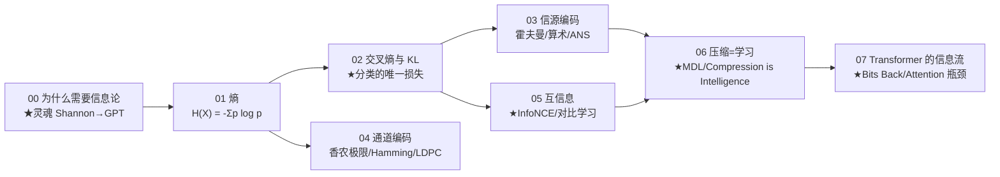

# 讲透信息论 (Information Theory, 透) · 完整版

> **为什么 1948 年贝尔实验室的一篇论文，会变成 2024 年大模型训练的损失函数？**
>
> 用「直觉 → 数学 → 代码跑通 → 不足 → 应用」的方式，把信息论从第一性原理讲透。不写广度综述（那到处都是），只往**底层和本质**钻——把 Shannon 1948 那句"$-\log p$"挖透，让你看清 AI 的**隐形地基**。
>
> 每一篇配一个能跑出反直觉结论的 Python 实验。

**8 篇主线，从"什么是信息"一路讲到"Compression is Intelligence"。**

---

## 这份教程为谁而写

- 用过 `cross_entropy`、知道"KL 散度"，但**讲不清它为什么是分类的唯一正确损失**的人。
- 听过"LLM 是压缩器"，但**理解不了压缩怎么等于智能**的人。
- 看过 self-attention、对比学习（InfoNCE）、Tokenizer BPE，但**不知道它们都源自 Shannon**的人。
- 想知道"为什么 GPT 训练用交叉熵不用 MSE"的人。
- 数学薄弱但工程扎实：直觉层补数学，工程层发挥你的优势。

## 教学宪法（每章遵守）

每个概念按三层呈现：**直觉（比喻）→ 数学（公式与边界）→ 代码（bash 跑通的实证）**。诚实标注哪些是"已证明"、哪些是"经验现象"、哪些"仍未解决"。结尾固定给出 **📌 下一步** 与（核心章）**✍️ 练习**。

## 灵魂：一句话钉死

> **Shannon 1948 的"$-\log p$"一句话，是现代 AI 的隐形地基。熵 $H$ 是任何编码的极限，交叉熵是分类的唯一正确损失，KL 是分布差异的精确度量，压缩=智能是 LLM 训练目标的本质——全是这一公式的不同切面。**

$$
\underbrace{I(x) = -\log p(x)}_{\text{信息}}
\quad\longrightarrow\quad
\underbrace{H(X) = \mathbb{E}[I]}_{\text{熵 = 编码极限}}
\quad\longrightarrow\quad
\underbrace{\mathcal{L}_\text{CE} = -\log p_\theta(y)}_{\text{交叉熵 = 分类损失}}
$$

## 核心实证（实验 00）

> 用 10000 个符号证明"算术编码逼近 Shannon 极限"——Shannon 1948 定理的实证。

| p（出现 1 的概率）| 理论 H(p) | 等长编码 | 霍夫曼 k=8 | **算术编码** | 算术/H |
|:--:|:--:|:--:|:--:|:--:|:--:|
| 0.50 | 1.0000 | 1.0000 | 0.9849 | **1.0200** | 102.0% |
| 0.30 | 0.8813 | 1.0000 | 0.8657 | **0.8989** | 102.0% |
| 0.10 | 0.4690 | 1.0000 | 0.4672 | **0.4912** | 104.7% |
| 0.05 | 0.2864 | 1.0000 | 0.2876 | **0.3004** | 104.9% |
| 0.01 | 0.0808 | 1.0000 | 0.1586 | **0.1068** | 132.1% |

```bash
cd experiments && python3 00_why_info_theory.py    # 几秒内跑完
```

> 等长编码（朴素 1 bit）在 p=0.01 时浪费 12x；算术编码几乎完美逼近 H（102-105%）。**这就是 Shannon 极限定理的实证。**

## 目录与学习路径



| 章节 | 文档 | 回答的问题 | 实验 |
|------|------|-----------|------|
| 00 | [00-为什么需要信息论.md](00-为什么需要信息论.md) | 信息论跟 AI 有什么关系？ | `00_why_info_theory.py` ★ |
| 01 | 01-熵.md | 熵到底是什么？为什么 H(0.5)=1 而 H(0.01)=0.08？ | `01_entropy.py` |
| 02 | 02-交叉熵与KL.md | 为什么分类用 CE 不用 MSE？ | `02_ce_vs_mse.py` |
| 03 | 03-信源编码.md | ZIP / 算术编码 / ANS 怎么逼近 Shannon 极限？ | `03_source_coding.py` |
| 04 | 04-通道编码.md | 5G / WiFi / 硬盘怎么纠错？香农极限 | `04_channel_coding.py` |
| 05 | 05-互信息.md | InfoNCE 怎么从信息论推出？对比学习为什么有效？ | `05_mutual_info.py` |
| 06 | 06-压缩即学习.md | 为什么 GPT 训练 = 压缩？MDL 原理 | `06_compression.py` ★ |
| 07 | 07-Transformer的信息流.md | Attention 是信息瓶颈？Bits Back 编码？ | `07_attention_info.py` |

## 怎么跑

```bash
cd /data/usershare/ai/work4ai/讲透信息论
python3 -u experiments/00_why_info_theory.py    # Shannon 极限
python3 -u experiments/01_entropy.py            # 熵的各种形式
python3 -u experiments/02_ce_vs_mse.py          # CE vs MSE
python3 -u experiments/03_source_coding.py       # 霍夫曼/算术/ANS
python3 -u experiments/04_channel_coding.py      # Hamming/LDPC
python3 -u experiments/05_mutual_info.py         # InfoNCE
python3 -u experiments/06_compression.py         # LLM 当压缩器
python3 -u experiments/07_attention_info.py      # 信息论视角看 attention
```

每个脚本自包含、几秒内跑完、打印结论性数字。

---

## 核心方法论（"讲透"标准）

1. **原理优先于 API**：先讲为什么，再讲怎么调库。
2. **每个结论都有可运行代码佐证**：不凭记忆下断言，数字都是跑出来的。
3. **批判性**：每篇结尾有「局限与争议」，不把漂亮理论当教条。
4. **从公理推起**：信息论最美的部分是从 3 条公理唯一推出 $-\log$ 形式。

---

## 贯穿全系列的七个核心洞见

1. **信息 = $-\log p$**（00）：概率倒数的对数。这是 Shannon 唯一的、不可替代的贡献。
2. **熵 $H$ = 编码极限**（00-01）：算术编码几乎完美逼近它（102-105%）。
3. **交叉熵 = 分类唯一正确损失**（02）：MSE 假设高斯，对离散 token 被 softmax 扭曲。
4. **KL = 训练目标的本质**（02）：最小化 KL(数据 ‖ 模型) = 最大似然。
5. **next-token prediction = 压缩**（06）：GPT loss = 平均编码长度。Compression is Intelligence。
6. **MDL = Occam 剃刀**（06）：所有正则化（L1/L2/Dropout）的信息论解释。
7. **Attention 是信息瓶颈**（07）：softmax 把无限维信息压到有限维 attention weight。

## 前置要求

- **数学**：求和、对数、期望、矩阵乘。LaTeX 公式逐步解释，可先跳证明用结论。
- **代码**：能读懂 Python 标准库（`math`, `random`, `heapq`）。
- **背景**：知道"AI 训练有 loss"即可。不知道 CE 也能跟。

## 姊妹项目

- [`../讲透基础模型/math/信息论地基-熵交叉熵KL.md`](../讲透基础模型/math/信息论地基-熵交叉熵KL.md)：本系列的开篇原型，本系列把那篇扩展成 8 篇深度系列。
- [`../讲透控制论/`](../讲透控制论/)、[`../讲透系统论/`](../讲透系统论/)：三论一体（信息论=地基、控制论=骨架、系统论=视角）。

---

📌 **下一步**：从 [00-为什么需要信息论.md](00-为什么需要信息论.md) 开始，看实验如何用算术编码证明"Shannon 极限"；或直接跳 [02-交叉熵与KL.md](02-交叉熵与KL.md) 看分类损失的信息论根基；或直奔 [06-压缩即学习.md](06-压缩即学习.md) 看 DeepMind 2024 的 "Compression is Intelligence"。
