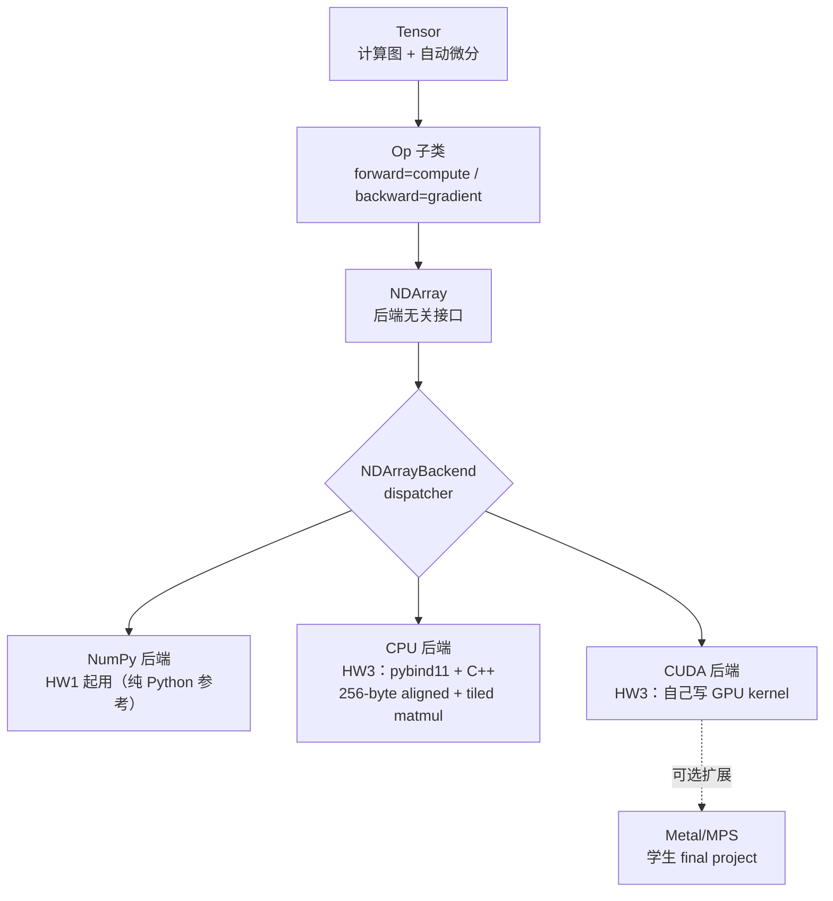
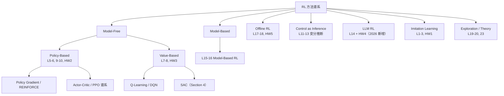
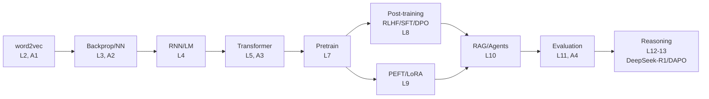
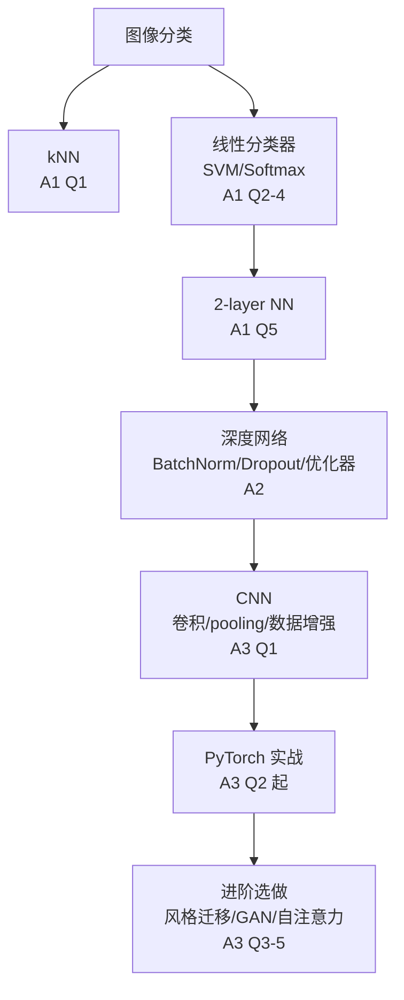

# 讲透公开课 · 01 - 前沿课实时清单

> 姊妹篇：[`02-数理计算机神课清单`](./02-数理计算机神课清单.md)（数学/物理/CS）｜ [`03-AI Infra 源码导读`](<./03-AI Infra 源码导读清单.md>)（开源项目）｜ [`04-全领域学习路径总览`](./04-全领域学习路径总览.md)（路线图）。
>
> 一份「近 12 个月内核对过最新状态」的 AI 神课清单。不是广度堆砌，是按「**先地基 → 后系统 → 再前沿**」的学习路径挑出来的硬通货，每门都标了最新版本、讲师、链接、前置、以及和本仓库「讲透 XXX」系列的对应关系。
>
> **核对日期**：2026-08-04（**第三轮·DLSys 单点深核**：在第二轮讲座级基础上拓 Needle 架构图 + 双 instructor 分工表 + HW 题面 + 过时边界；前两轮重点核李宏毅 2026 春 / Karpathy Eureka Labs / fast.ai Part2 / CS285 final project）
> **窗口**：近 12 个月 ≈ 2025-08 ~ 2026-07
> **方法**：2026-07-31 首轮联网实抓官网 syllabus；2026-08-03 第二轮用本地 firecrawl self-host 深度拓到**讲座级**；2026-08-04 第三轮针对 DLSys 单点深核（拓 lectures/assignments 页 + HW1/HW2 源码题面 + 学生实现仓库 Marcus Alenius/PKUFlyingPig）。
> **图例**：🟢 = 近 12 个月内有新一期且视频/资料公开　🟡 = 经典稳定、值得看但近期未大改　🔴 = 已归档/未发布/需特别注意

---

## 一、速览表（先看这一张）

| # | 课 | 机构/讲师 | **最新版本** | 视频 | 状态 | 对应「讲透」系列 |
|---|---|---|---|---|---|---|
| 1 | **Neural Networks: Zero to Hero** | Karpathy | 2022–23（已完结，8 讲） | ✅ YouTube | 🟢 永远推荐 | 反向传播 / 激活函数 / 基础模型 / Transformer |
| 2 | **CS224n: NLP with Deep Learning** | Stanford · Diyi Yang, Yejin Choi | **Winter 2026** | ✅ 2024 公开版 | 🟢 | 基础模型 / 微调 / Prompt / RAG / Agent |
| 3 | **CS231n: DL for Computer Vision** | Stanford · Fei-Fei Li, Justin Johnson… | **Spring 2026** | ✅ 往年 YouTube | 🟢 | 反向传播（手写）/ 基础模型（CNN）|
| 4 | **MIT 6.S191: Intro to Deep Learning** | MIT · Amini 兄妹 | **2026 春** | ✅ 全开源（MIT License） | 🟢 | 全系列入门导览 |
| 5 | **李宏毅 Machine Learning** | 台大 · 李宏毅 | **2026春完整 11 讲已发** | ✅ YouTube/B站 | 🟢 中文最佳 | 全系列（**2026 重头 AI Agent + Self-Improving**）|
| 6 | **DLSys (CMU 10-414/714)** | CMU · Dettmers + 陈天奇 | **Fall 2025** | 2022 YouTube（金标准） | 🟢 | PyTorch / GPU系统 / 优化器 / 反向传播 |
| 7 | **CS285: Deep Reinforcement Learning** | UC Berkeley · Sergey Levine | **Spring 2026** | 2023 YouTube | 🟢 新增 LLM RL | RL（待做）/ 微调（RLHF）|
| 8 | **fast.ai: Practical DL** | Jeremy Howard | Part1 2022 + **Part2（17讲）** | ✅ 全免费 | 🟢 | 生成模型 / 反向传播 / 优化器 / Transformer |
| 9 | **LLM101n (Storyteller)** | Karpathy / Eureka Labs | **未发布，仓库已归档** | ❌ | 🔴 | — |
| 10 | **Full Stack Deep Learning** | The Full Stack | LLM Bootcamp + DL 2022 | ✅ 免费 | 🟡 偏工程 | RAG/Agent 的工程落地补充 |

---

## 二、核心「⚠️ 未抓 → 已核对」三门详解

### 1. DLSys (CMU 10-414/714) · Deep Learning Systems — 🟢 Fall 2025

> **核对要点（2026-08-04 三轮深核）**：官网首页仍是 **Fall 2025**（首课 2025-08-26，TR 11:00 DH 2315）；CMU CSD Fall 2026 课程页与全校课表 PDF（Run Date 2026-08-03）**仍未挂 Fall 2026 期**，下一期预计 8 月底更新。讲师 **Tim Dettmers（dettmers@）+ 陈天奇（tqchen@）**；公开录像仍是 **2022 版**（lectures 页表头明确写 "Video (2022 version)"）。本轮用 firecrawl 拓到讲座级：18+ 讲完整 schedule + HW0–HW4 题面 + Needle 源码架构。

**一句话定位**：全球唯一一门**从 autograd 一路自己造到 CUDA/GPU 后端**的公开课。Karpathy 的 micrograd 教你"autograd 原理"，这门课教你"怎么造一个真能跑 CNN/Transformer 的 PyTorch 微缩版"。

#### 身份卡
- **官网 / schedule / 作业**：https://dlsyscourse.org/ ｜ [lectures](https://dlsyscourse.org/lectures/) ｜ [assignments](https://dlsyscourse.org/assignments/)
- **最新版本**：Fall 2025（下一期 Fall 2026，预计 2026-08 底挂出）
- **讲师**（双 instructor，强项精确叠加）：
  - **Tim Dettmers**（前半程建模层 + 后段 CNN/RNN/Transformer 实现）— **QLoRA / bitsandbytes / 8-bit optimizers** 作者，专精高效训练与量化
  - **陈天奇 Tianqi Chen**（中段系统层 + 末段大模型/部署）— **TVM / MXNet / XGBoost / MLC-LLM** 作者，专精编译器与 ML 系统
- **⚠️ 课程历史（避坑）**：2022 首版由 **Zico Kolter + 陈天奇** 创立；Zico 现 OpenAI 董事会成员，授课交棒 Dettmers。**很多老博客（2023–24）仍写"Zico Kolter"主讲**，别被误导——2025 起实际授课是 Dettmers。
- **你要造的东西**：一个叫 **Needle**（**Ne**cessary **E**lements of **D**eep **Le**arning）的深度学习库，5 个 HW 增量搭成，final project 再给它加新特性。

#### Needle 架构（这门课的核心价值，不讲这个等于没讲）

Needle 的分层 dispatcher 设计，就是 **PyTorch 的 `Tensor → aten::Tensor → backend` 架构的微缩版**：



- **关键洞察**：`compute()` 操作**裸 NDArray**（前向），`gradient()` 操作 **Tensor**（反向，且本身也建图——所以**高阶导数免费**）。
- **代码路径**：`python/needle/autograd.py`（计算图核心）→ `ops/ops_mathematic.py`（算子）→ `nn/nn_basic.py`（NN 模块）→ `init/`（初始化）→ `backend_cpu.cc` / CUDA kernels。
- **final project 真实天花板**：学生 Marcus Alenius 加 Metal 后端，matmul 比 CPU 快 **22×**、MPS 达 PyTorch MPS 性能 **86%**；PKUFlyingPig 加 Apple M1 支持。

#### 双 instructor 分工（Fall 2025 真实 schedule，D=Dettmers 建模层 / C=陈天奇 系统层）

| # | 讲座 | 谁 | 你学到什么 |
|---|---|---|---|
| 1–3 | Intro / Softmax / **手写 NN + Backprop** | D | 不用框架，纯 numpy 手搓前向反向 |
| 4–5 | **Autodiff 理论 + 实现** | C | 反向模式 AD、计算图、拓扑排序 |
| 6 | Optimization | D | SGD/Adam/权重初始化 |
| 7,9 | **NN Library 抽象 + 实现** | C | Module/Parameter/Dataset/DataLoader |
| 8 | Normalization, Dropout | D | LayerNorm/BatchNorm/Dropout |
| 10,14 | ConvNets + 实现 | D | im2col、卷积手写 |
| **11–13** | **Hardware / GPU / 实现** | C | **全课最硬核三讲**：tiled matmul、memory coalescing、自己写 CUDA kernel |
| 15–16 | RNN + 实现 | D | vanilla RNN / LSTM / GRU |
| 17–18 | **Transformers + 实现** | D | 自注意力、位置编码、用 Needle 拼出 Transformer |
| 19 | **Training Large Models** | C | 分布式训练视角（⚠️ 见下方局限） |
| 20–21 | Generative Models + GAN 实现 | C | GAN/扩散入门 |
| 22–23 | Customize Pretrained / Deployment | C | LoRA 思路 + 部署 |

**分工的深意**：Dettmers 懂"模型长什么样"，Chen 懂"模型怎么跑得快"——**上层建模 + 下层系统完美互补**，这正是 "full stack DL systems" 的本意。

#### 作业 HW0–HW4（每个 HW 你实际要造什么）

| HW | 造什么 | 对应 PyTorch | 难度 | 核心考点 |
|---|---|---|---|---|
| HW0 | softmax 回归（裸 numpy） | — | ⭐ 自测 | 确认线代/Python 地基，**建议裸做不用 AI** |
| HW1 | **autograd 框架**：Value/Op/Tensor/TensorOp + 算子（MatMul/Sum/Reshape/…）+ 拓扑排序 + 反向 AD | `torch.autograd` | ⭐⭐⭐ | `compute()` 对 NDArray、`gradient()` 对 Tensor |
| HW2 | **nn 模块 + 优化器**：Xavier/Kaiming 初始化、Linear/LayerNorm/激活/损失、SGD/Adam，训 MLPResNet on MNIST | `torch.nn` + `torch.optim` | ⭐⭐⭐ | 初始化顺序（weight 先 bias 后）、Needle **不隐式 broadcast** |
| HW3 | **NDArray 库（CPU + CUDA）**：pybind11 包 C++（256-byte aligned + tiled matmul）+ 自己写 CUDA kernel | `torch.cuda` / `aten` | ⭐⭐⭐⭐⭐ 最难 | **全课灵魂，也是它区别于所有竞品的地方** |
| HW4 | Conv / RNN / 高级架构 | `torch.nn.Conv2d` / `RNN` | ⭐⭐⭐ | im2col、序列模型 |

- **评测**：[mugrade](https://github.com/dlsyscourse/mugrade) 自动批改，可多次提交。
- **教学设计**：HW1 先用 numpy 做 backend，HW3 起换成自己造的 NDArray——"先会用别人的，再造自己的"。

#### 视频与「过时」边界（诚实评估，这部分原清单漏了）

- **2022 完整 playlist**：https://www.youtube.com/playlist?list=PLGzYMymX8amNyGPuJ35YWdq59eQ5jYCZ1 （CMU DL Systems Course 官方频道，全 23 讲）
- **2025 录像不公开**：lectures 页表头明确写 "Video (2022 version)"，Fall 2025 课堂虽录像但只给校内 Canvas。
- **⚠️ 课程不教什么**（2022→2026 已变天的东西，学完别以为就懂"PyTorch 内部"了）：
  - **PyTorch 2.x / torch.compile / Inductor**——Needle 没有图编译
  - **FSDP / ZeRO / 流水线并行 / 序列并行**——L19 只到概念，不实操
  - **FlashAttention / KV Cache / PagedAttention**——全不在
  - **MoE / 混合精度（bf16/fp8）/ 推理优化**——不在
- **为什么仍然值得**：这些"新东西"都长在 **Needle 教你的地基之上**——不懂 autograd / CUDA kernel / dispatcher 分层，看 torch.compile 源码就是天书。DLSys 教的是**不变的地基**，上面长什么模型是会变的。

#### 前置与学习路径
- **前置**：系统编程（CMU 15-213 级别）、线代、Python **和 C++**（HW3 必须）、基础 ML。HW0 是自测，做不动说明前置不够。
- **和 Karpathy micrograd 的关系**（互补，不是替代）：
  - **micrograd**（150 行 Python）：理解 autograd **原理**的最佳入门，但只到 MLP，没有 NN 库 / CUDA / Transformer。
  - **DLSys**：从 autograd 一路到能跑 Transformer 的 CUDA 后端。看完 micrograd 再上 DLSys，HW1 会顺很多。
- **中文资源**：[PKUFlyingPig/CMU10-714](https://github.com/PKUFlyingPig/CMU10-714)（完整中文笔记 + HW 实现 + M1 final project）。
- **配置**：用 Google Colab GPU runtime（官方推荐），别自己折腾 CUDA 环境。

#### 对应「讲透」系列
- `讲透PyTorch`（自己造框架 = 理解 PyTorch 内部最直接的路径）
- `讲透GPU与系统级`（L11–13 + HW3 的 CUDA）
- `讲透优化器`（L6 + HW2 的 Adam 实现）
- `讲透反向传播`（L3–5 + HW1 的 autodiff）
- `讲透Transformer`（L17–18，用 Needle 拼出 Transformer）

- **一句话**：想知道「PyTorch 内部到底怎么跑的」、想真正懂 autograd/CUDA、想做 ML infra 而不是调 API——这是全球唯一一门从零造到 GPU 后端的课。但要清楚：它教的是**地基**，PyTorch 2.x 的 compile/分布式得另学。

---

### 2. CS285 (UC Berkeley) · Deep Reinforcement Learning — 🟢 Spring 2026

> **核对要点（2026-08-04 三轮深核）**：确认最新一期是 **Spring 2026**（邮箱 `cs285-staff-sp2026`，1 月 19 日开课，Wed/Fri Hearst Annex A1）。本轮拓到**讲座+作业级**：完整 25 讲 + 9 个 Section slides 全挂在官网，**HW4 = LLM RL** 确认（第 7 周发布），最终项目两个默认选项 PDF 已公开（**Offline-to-Online RL** + **LLM RL**）。公开录像仍是 **Fall 2023**（2026 录像仅校内）。

**一句话定位**：全球 RL 第一课。Sergey Levine 用一套**理论推导极严谨**的讲法，把从模仿学习到 Offline RL 的完整谱系铺一遍，2026 版还塞进了 LLM RL——想搞 RLHF/Agent/机器人，这是绕不开的地基。

#### 身份卡
- **官网 / schedule / syllabus**：https://rail.eecs.berkeley.edu/deeprlcourse/ ｜ [calendar](https://rail.eecs.berkeley.edu/deeprlcourse/calendar) ｜ [syllabus](https://rail.eecs.berkeley.edu/deeprlcourse/syllabus)
- **最新版本**：**Spring 2026**（14 周 / 25 讲 / 9 个讨论 Section）
- **讲师**：**Sergey Levine**（UC Berkeley）— **offline RL、model-based RL 开创者之一**，Berkeley DeepDrive 创立者，Google DeepMind 顾问；授课风格是**每讲都推完整数学**，作业工程量大。
- **GSI 团队**：Head GSI Seohong Park + Vivek Myers / Kevin Black / Pranav Atreya / Mitsuhiko Nakamoto / Catherine Glossop（Robotics / RL 方向活跃研究者）。
- **算力**：[Modal](https://modal.com) 赞助在校生计算。

#### RL 方法谱系（CS285 覆盖什么，一图看懂）



- **关键洞察**：CS285 的独特价值是**把 RL 当作一个完整理论体系来教**——不是"教你调 PPO 库"，而是从伯努利分布、策略梯度推导、KL 散度约束一路推到 SAC/DPO 的数学统一。Levine 的 [slides](https://rail.eecs.berkeley.edu/deeprlcourse/) 每页都是手推公式。
- **2026 版最大变化**：L14 + HW4 塞进 **LLM RL**——这意味着 RLHF/GRPO 被正式纳入 RL 主线（而非 NLP 课的附属），是从 RL 视角理解对齐的最佳入口。

#### 完整 schedule（25 讲，按主题模块分组）

| 模块 | 讲座 | 你学到什么 |
|---|---|---|
| **入门 + 模仿**（W1-2） | L1 Intro / L2-3 Behavioral Cloning / L4 RL Basics | BC 为什么会 distributional shift（Section 2-2 专讲）|
| **Policy-based**（W3-5） | L5 Policy Gradients / L6 Actor-Critic / L7 Value-Based / L8 Q-learning / **L9-10 Advanced PG** | 策略梯度推导、A2C、DQN、SAC（Section 4）|
| **变分推断 + 控制即推断**（W6-7） | L11 Variational Inference / L12 VI in RL / L13 Control as Inference / **L14 LLM RL** ⭐ | 把 RL 理解成概率推断（Levine 的招牌视角），**L14 是 2026 新增** |
| **Model-Based + Offline**（W8-9） | L15-16 Model-Based RL / L17-18 Offline RL | 学世界模型、离线数据训练（Levine 本行）|
| **理论 + 进阶**（W10-12） | L19 Exploration / L20 RL Theory / L21-22 Midterm Review / L23 Advanced Exploration / L24 Multi-task | 探索-利用、样本复杂度、多任务迁移 |
| **收尾**（W13-14） | L25 Challenges and Open Problems / Final Guest | Levine 亲讲 RL 未解问题 |

- **讨论 Section（9 个）**：每个都配 slides，**Section 1 是 PyTorch Tutorial**（不会 PyTorch 先看这个），Section 7 专门讲 **IRL and LLM RL**。

#### 作业 HW1–HW5（每个 HW 你实际做什么）

| HW | 主题 | 难度 | 核心考点 |
|---|---|---|---|
| HW1 | **Imitation Learning**（BC） | ⭐⭐ | 行为克隆、distributional shift，先训个 agent 看它怎么崩 |
| HW2 | **Policy Gradients** | ⭐⭐⭐⭐ | REINFORCE → Actor-Critic，自己推梯度、自己调方差 |
| HW3 | **Q-Learning and Actor Critic** | ⭐⭐⭐⭐ | DQN + SAC，这是全课工程量巅峰之一 |
| **HW4** | **LLM RL** ⭐（2026 新增） | ⭐⭐⭐⭐ | RLHF/GRPO 谱系，用 RL 训 LLM——**这是全课跟前沿最紧的一环** |
| HW5 | **Offline RL** | ⭐⭐⭐⭐ | 离线数据训练（Levine 本行），CQL/IQL 思路 |

- **为什么 HW4 关键**：2023 版没有这一项，看 2023 录像的人**会漏掉 LLM RL**——必须配合 2026 的 L14 slides + HW4 handout 自己补。

#### 最终项目（两个默认选项 + 自选）
- **Default 1: Offline-to-Online RL**（[PDF](https://rail.eecs.berkeley.edu/deeprlcourse/static/misc/offline_to_online_rl_default_final_project.pdf)）— 离线数据起步，逐步上线探索
- **Default 2: LLM RL**（[PDF](https://rail.eecs.berkeley.edu/deeprlcourse/static/misc/llm_rl_default_final_project.pdf)）— 用 RL 微调 LLM，**这是 2026 新增**
- **Custom**：自选题目（过去有 diffusion policy、world model、robotics 等）
- **outline**：[final_project_outline.pdf](https://rail.eecs.berkeley.edu/deeprlcourse/static/misc/final_project_outline.pdf)

#### 视频与「过时」边界（诚实评估）
- **Fall 2023 完整 playlist**：https://www.youtube.com/playlist?list=PL_iWQOsE6TfVYGEGiAOMaOzzv41Jfm_Ps （2026 版不公开）
- **⚠️ 2023 录像没有 L14 LLM RL**（那是 2026 新增）——看 2023 录像必须**配合 2026 的 L14 slides + HW4** 自己补 LLM RL。
- **⚠️ 课程不教什么**（2023→2026 RL 已变天的东西）：
  - **GRPO / DAPO**（DeepSeek-R1 / 字节那套 LLM RL 新方法）— L14 可能提到但不深
  - **Decision Transformer / Trajectory Model**（把 RL 变成 sequence modeling）— 不在主线
  - **Diffusion Policy**（机器人 + diffusion）— 不在
  - **DreamerV3 / World Model**（Levine 自己的学生做的，但课程只讲 model-based 基础）
  - **基于 LLM 的 reward design**（LLM 当 reward model）— 不在
- **为什么仍然值得**：这些"新东西"都是**在 CS285 教的地基之上**——不懂 policy gradient / KL 约束 / offline RL，看 GRPO 论文就是天书。CS285 教的是**RL 的数学骨架**，上面长什么 agent 是会变的。

#### 前置与学习路径
- **前置**：概率（必须有）、线代、会 PyTorch。**Section 1 有 PyTorch tutorial**，不够就先补。
- **配套资源**：
  - **Sutton & Barto《Reinforcement Learning》**（[免费全文](http://incompleteideas.net/book/RLbook2020.pdf)）— 理论底子，CS285 假定你懂前 5 章
  - **OpenAI Spinning Up**（[openai.com/research/spinning-up-open-source](https://spinningup.openai.com/)）— 工程实现入门，比 CS285 作业简单，适合先练手
  - **David Silver 的 RL 课**（DeepMind，2015）— 老但经典，和 Levine 互补
- **LLM RL 怎么补**（2023 录像缺的部分）：2026 L14 slides + HW4 + 本仓库未来的 `讲透RL`（待做）+ 直接读 [DeepSeek-R1](https://arxiv.org/abs/2501.12948) / [DAPO](https://arxiv.org/abs/2503.14476) 论文。

#### 对应「讲透」系列
- 未来 `讲透RL`（待做，主线对应）
- `讲透微调`（RLHF/DPO/GRPO 部分，对应 L14 + HW4）
- 未来 `讲透世界模型`（对应 L15-16 Model-Based RL）

- **一句话**：想搞 RLHF/Agent 决策/机器人，这是全球 RL 第一课，且 2026 版已把 LLM RL 正式纳入主线。但要清楚：2023 录像缺 LLM RL，得自己用 2026 slides 补；GRPO/Decision Transformer 这些新枝蔓得另学。

---

### 3. Karpathy 的课 — 分两种状态

#### 3a. **Neural Networks: Zero to Hero** — 🟢 永远推荐（已完结）

**一句话定位**：全网「从零手写 GPT」的范本，没有之一。Karpathy 的教学法是「先陪你手写一遍，再回头讲为什么」，每讲 1-2.5 小时，代码全在 Jupyter notebook 里——甚至 Copilot（本身是个 GPT）帮 Karpathy 写 GPT（meta :D）。

- **YouTube playlist**：https://www.youtube.com/playlist?list=PLAqhIrjkxbuWI23v9cThsA9GvCAUhRvKZ
- **官网**：https://karpathy.ai/zero-to-hero.html
- **GitHub**（聚合 notebook）：[`karpathy/nn-zero-to-hero`](https://github.com/karpathy/nn-zero-to-hero)
- **版本**：2022-08 ~ 2023-02，共 **8 讲**（⚠️ 很多二手资料误传"10 讲"），已完结
- **风格**：每讲都「从空文件开始，最后跑出能用的模型」，**每讲视频描述里都附练习题**

##### 完整 8 讲表（你实际造什么）

| # | 讲座 | 你造什么 | GitHub repo | 难度 | 对应「讲透」|
|---|---|---|---|---|---|
| 1 | **micrograd** | ~100 行 Python 的 autograd（反向传播原理）| [micrograd](https://github.com/karpathy/micrograd) | ⭐ | 讲透反向传播 |
| 2 | **makemore: Bigrams** | bigram 字符级语言模型 + `torch.Tensor` 入门 | [makemore](https://github.com/karpathy/makemore) | ⭐⭐ | 讲透基础模型 |
| 3 | **makemore: MLP** | 多层感知机 + train/dev/test + 过/欠拟合 | makemore | ⭐⭐ | 基础模型 / 过拟合 |
| 4 | **makemore: Activations & Gradients, BatchNorm** | 激活/梯度诊断/BatchNorm（死 neuron 分析）| makemore | ⭐⭐⭐ | 讲透激活函数 |
| 5 | **makemore: Becoming a Backprop Ninja** | 手写反向传播（**不用 autograd**）| makemore | ⭐⭐⭐⭐ | 讲透反向传播 |
| 6 | **makemore: WaveNet** | WaveNet 分层卷积语言模型 | makemore | ⭐⭐⭐ | 讲透基础模型 |
| 7 | **Let's build GPT** ⭐ | 从零搭 GPT（Attention is All You Need + GPT-2/3）| [ng-video-lecture](https://github.com/karpathy/ng-video-lecture) | ⭐⭐⭐⭐ | 讲透Transformer |
| 8 | **Let's build the GPT Tokenizer** | BPE tokenizer（minBPE）| [minBPE](https://github.com/karpathy/minBPE) | ⭐⭐⭐ | 讲透基础模型 |

**进度路线**：micrograd（第 1 讲）是入口，纯 Python 不用 PyTorch，理解反向传播；makemore 5 讲（第 2–6）是核心，把语言建模 / ML 基础 / 激活梯度 / BatchNorm / WaveNet 全过一遍；第 7 讲搭出 GPT；第 8 讲补 tokenizer（很多人忽略的一环，但 BPE 是 LLM 的隐藏复杂度）。

##### ⚠️ 过时边界（2022→2026 已变天的东西）
- **nanoGPT 不在 playlist 里**：[`karpathy/nanoGPT`](https://github.com/karpathy/nanoGPT) 是独立项目（production-ready 的 GPT 训练），是第 7 讲的「进阶版」——第 7 讲教原理，nanoGPT 教怎么真训练（分布式、复现 GPT-2 124M）。
- **算力门槛已降**：第 7 讲当时用单卡 A100，现在 4090 / Mac MPS 也能跑；但**教学逻辑没变**，仍然是从论文一行行敲。
- **不教什么**：分布式训练、混合精度、FlashAttention、KV Cache、MoE、RLHF——这些在第 7/8 讲之后得另学（→ CS224n L7-8 Post-training / DLSys L19 Training Large Models）。

##### 🆕 2026-02 新动态
Karpathy 发了博客 [**microgpt**](https://karpathy.github.io/2026/02/12/microgpt/)（200 行 Python 训 GPT）——可看作第 7 讲的「2026 极简复习版」，想快速重拾 GPT 架构看这个。

##### 和本仓库其他课的配合（三者互补）
- 先看 **第 1 讲 micrograd** 再上 **DLSys** → HW1 autograd 会顺很多（DLSys 的 Needle HW1 就是放大版 micrograd）
- 先看 **第 7 讲 Let's build GPT** 再上 **CS224n** → Transformer 部分（L5）秒懂
- **Zero to Hero = 原理直觉**　|　**DLSys = 系统实现**　|　**CS224n = 前沿全貌**——不要只看一个

**对应「讲透」系列**：`讲透反向传播`（1+5）+ `讲透激活函数`（4）+ `讲透基础模型`（2-3, 6, 8）+ `讲透Transformer`（7）+ `讲透过拟合`（3）

#### 3b. **LLM101n: Let's build a Storyteller** — 🔴 未发布，仓库已归档

> **核对要点（重要）**：GitHub 仓库 `karpathy/LLM101n` **已于 2024-08-01 被 owner 归档（read-only）**，README 明确写：
> > *"this course does not yet exist. It is current being developed by Eureka Labs. Until it is ready I am archiving this repo."*

> **🆕 2026-08-03 二次核对**（firecrawl 实拓 eurekalabs.ai 与 github.com/karpathy/LLM101n）：
> - **Eureka Labs 官网首页最新公告仍是 2024-07-16 的 "Introducing Eureka Labs"** —— **2 年没发新公告，公司动态成谜**。
> - **LLM101n 仓库仍 archived，但已积累 37.5k stars / 2.1k fork**——即使归档，仍是社区高关注的"未发布大作"。
> - **建议**：别死等。学 Karpathy 直接看他的 [Zero to Hero](https://www.youtube.com/playlist?list=PLAqhIrjkxbuWI23v9cThsA9GvCAUhRvKZ) + 2026-02 新博客 [microgpt](https://karpathy.github.io/2026/02/12/microgpt/)（200 行 Python 训 GPT）。Eureka Labs 一旦发课，AK / Karpathy 的 X 会第一时间宣布。

- **GitHub**：https://github.com/karpathy/LLM101n（archived，仅留 17 章 syllabus 大纲）
- **新家**：https://eurekalabs.ai/（Karpathy 创办的 AI 教育公司，正在开发正式课；**但 2 年未发新动态**）
- **结论**：**别再等 LLM101n 了**。想跟 Karpathy 学，现在就看 **Zero to Hero**；想等正式版，盯 Eureka Labs（但要有"可能还要再等"的心理准备）。
- **大纲预览**（17 章）：Bigram → Micrograd → MLP → Attention → Transformer → Tokenization → Optimization → Device → Precision → Distributed → Datasets → KV-Cache → Quantization → SFT/LoRA → RLHF/DPO → Deployment → Multimodal

---

## 三、其他必收「神课」（已核对）

### 4. CS224n (Stanford) · NLP with Deep Learning — 🟢 Winter 2026

> **核对要点（2026-08-04 三轮深核）**：确认 **Winter 2026**（`win2526`，2026-01-06 ~ 03-12，NVIDIA Auditorium，DiYi Yang + Yejin Choi）。本轮拓到**讲座级**：完整 10 周 schedule + A1-A4 全部 handout + Final Project（default 改成实现 **GPT-2**）+ **4 个重磅 guest lecture**（含 John Schulman 讲 LoRA！）。公开录像仍是 **Spring 2024 playlist**。

**一句话定位**：NLP/LLM 方向全球标杆。2026 版从 word2vec 一路讲到 DeepSeek-R1/test-time compute，是公开课里**覆盖 LLM 全栈最深**的一门——从词向量到 reasoning，一条线打通。

#### 身份卡
- **官网 / schedule / project**：https://web.stanford.edu/class/cs224n/ ｜ [final projects](https://web.stanford.edu/class/cs224n/project.html)
- **最新版本**：Winter 2026（10 周，2026-01-06 ~ 03-12）
- **讲师**：**DiYi Yang**（CMU 博士、Stanford 助理教授，对话系统/社会计算）+ **Yejin Choi**（华盛顿大学，Commonsense reasoning、CoT 奠基者之一）
- **算力赞助**：Google / Kimi / Modal / Qwen（final project 给 credits）
- **公开视频**：[Spring 2024 YouTube playlist](https://www.youtube.com/playlist?list=PLoROMvodv4rOaMFbaqxPDoLWjDaRAdP9D)（2026 版仅校内 Canvas）

#### LLM 技术栈（CS224n 覆盖什么，一图看懂）



- **关键洞察**：CS224n 的独特价值是**把 LLM 当作一个完整技术栈来教**——不是只讲 Transformer 架构，而是从预训练 → 后训练 → 高效适配 → RAG/Agent → 评测 → Reasoning 的全链条。2026 版新增的 L12-13 Reasoning 是紧跟 DeepSeek-R1（2025-01）的最新内容。

#### 完整 schedule（10 周，按主题模块）

| 模块 | 周 | 讲座 | 你学到什么 |
|---|---|---|---|
| **基础** | W1 | L1 History / **L2 Word Vectors**（word2vec/GloVe） | NLP 简史 + 词嵌入（A1 出）|
| | W2 | L3 **Backprop & NN Basics** / L4 **RNN & Language Models** | 反向传播 + vanishing gradient（A2 出，A1 due）|
| | W3 | **L5 Transformers** / L6 Final Project Tips | Attention is All You Need（A3 出，A2 due）|
| **LLM 核心** | W4 | **L7 Pretraining**（Scaling/Data/Systems）/ **L8 Post-training**（RLHF/SFT/DPO） | BERT/Llama3 + Alpaca/DPO |
| | W5 | **L9 PEFT**（LoRA/Prompting/CoT）/ **L10 RAG & Agents**（ReAct/Toolformer） | 高效适配 + Agent（A4 出，A3 due）|
| **前沿** | W6 | **L11 Evaluation**（HELM/MMLU/AlpacaEval）/ **L12 Reasoning 1**（DeepSeek-R1/DAPO） | 评测 + reasoning 起步 |
| | W7 | **L13 Reasoning 2**（test-time compute/RoPE/Speculative decoding） | Process reward / 推理时算力 |
| **Guest** | W7-9 | Julie Kallini（Tokenization）/ Been Kim（Interpretability）/ Luke Zettlemoyer（Multimodality）/ **John Schulman（LoRA Without Regret）** | 见下方专表 |
| **收尾** | W10 | L19 Open Questions in NLP 2026 | DiYi Yang 亲讲未解问题 |

#### 作业 A1–A4 + Final Project（48% + 49%）

| 项 | 占比 | 主题 | 你做什么 | 难度 |
|---|---|---|---|---|
| A1 | 6% | **Word Vectors** | 实现 word2vec/GloVe，探索词向量性质 | ⭐⭐ |
| A2 | 14% | **NN Foundations + Dependency Parsing** | 手推 tensor 导数 + 神经网络依存句法分析器 | ⭐⭐⭐ |
| A3 | 14% | **Self-attention & Transformers** | 从零实现 self-attention + Transformer | ⭐⭐⭐⭐ |
| **A4** | 14% | **LLM Benchmarking & Evaluation** ⭐ | 评测 LLM（HELM/MMLU 思路）——**2026 新增**，紧跟 eval 时代 | ⭐⭐⭐ |
| **Final** | 49% | **实现 GPT-2**（default）/ 自选 | default：实现 GPT-2 架构 + 3 个下游任务；custom：自选（团队 ≤3）| ⭐⭐⭐⭐ |

- **Default Final Project 变化**：2024 版是实现 BERT，**2026 改成 GPT-2**（decoder-only 成为 LLM 主流的体现）。
- **Final Project 流程**：proposal(8%) → milestone(6%) → poster(3%) → report(32%)，custom 项目有 mentor。
- **算力**：Google/Kimi/Modal/Qwen 赞助 credits。

#### 4 个重磅 Guest Lecture（2026 版亮点）

| Guest | 主题 | 为什么值得盯 |
|---|---|---|
| **John Schulman**（Anthropic，前 OpenAI）| **Tinker and LoRA Without Regret** | **PPO 作者**来讲 LoRA！ChatGPT RLHF 的核心人物，讲 LoRA 的"无悔"用法 |
| **Been Kim**（Google DeepMind）| Interpretability | Agentic interpretability、人机知识鸿沟 |
| **Luke Zettlemoyer**（华盛顿大学/Allen AI）| Multimodality | Chameleon/Transfusion/Mixture-of-Transformers（多模态早融合）|
| **Julie Kallini**（Stanford，Head TA）| Tokenization & Multilinguality | BPE 的隐藏代价——不同语言 token 成本不均 |

#### 视频与「过时」边界（诚实评估）
- **Spring 2024 完整 playlist**：https://www.youtube.com/playlist?list=PLoROMvodv4rOaMFbaqxPDoLWjDaRAdP9D （2026 版不公开）
- **⚠️ 2024 录像 vs 2026 版的关键差异**（看 2024 要自己补的部分）：
  - **L12-13 Reasoning 是 2026 新增**（DeepSeek-R1 是 2025-01 发的，2024 版没有）→ 看 2024 录像必须配合 2026 的 L12-13 slides 补 reasoning
  - **A4 评测是 2026 新增** → 2024 版没有这个作业
  - **Final Project 2024 是 BERT，2026 是 GPT-2** → 用 2026 的 handout
  - **L8 Post-training** 2024 版可能没覆盖 DPO（2023-05 论文），2026 版有
- **课程不教什么**（即便 2026 版也覆盖不到的）：
  - **GRPO/DAPO 深挖**——L12 会提，但真正深的是 **CS285 HW4 LLM RL**
  - **MoE / 混合专家**——不在
  - **分布式训练工程**——L7 提到 scaling 但不实操（深的是 DLSys L19）
  - **多模态只有 1 讲**（Zettlemoyer guest），想深学得看专门课

#### 前置与学习路径
- **前置**：Python/NumPy/PyTorch、微积分、线代、概率、ML 基础（CS221/229/230 级别）。W1 有 Python review，W2 有 PyTorch tutorial。
- **参考书**（全免费）：Jurafsky & Martin [SLP3](https://web.stanford.edu/~jurafsky/slp3/)（2024 版）、Eisenstein [NLP notes](https://github.com/jacobeisenstein/gt-nlp-class/blob/master/notes/eisenstein-nlp-notes.pdf)、Tunstall 等 [NLP with Transformers](https://transformersbook.com/)
- **和其他课的配合**：
  - 先看 **Karpathy Zero to Hero 第 7 讲（Let's build GPT）** → CS224n L5 Transformer 秒懂
  - CS224n L8 Post-training + **CS285 L14/HW4 LLM RL** = RLHF 全套（CS224n 讲 NLP 视角，CS285 讲 RL 数学视角）
  - CS224n L9 PEFT ↔ 本仓库 `讲透复用权重`（LoRA/QLoRA 已写）

#### 对应「讲透」系列
- `讲透基础模型`（L2-5 词向量→Transformer）+ `讲透微调`（L8 Post-training RLHF/DPO + L9 PEFT/LoRA）+ `讲透Prompt`（L9 CoT/Prompting + L12-13 Reasoning）+ `讲透RAG`（L10 RAG/Agents）+ 未来 `讲透评测`（L11+A4）

- **一句话**：NLP/LLM 方向全球标杆，2026 版从 word2vec 一路讲到 DeepSeek-R1，外加 PPO 作者 John Schulman 来讲 LoRA。看 2024 录像要记得用 2026 的 L12-13 slides 补 reasoning。

---

### 5. CS231n (Stanford) · DL for Computer Vision — 🟢 Spring 2026

> **核对要点（2026-08-04 三轮深核）**：确认 **Spring 2026**（`spr26`，TR 12:00 NVIDIA Auditorium，5 个 instructor）。⚠️ 旧地址 `web.stanford.edu/class/cs231n/` 已空，**正确地址 `cs231n.stanford.edu`**。公开视频仍是往年 YouTube playlist（2026 仅校内 Canvas）。算力赞助 Modal + AWS + GCP。

**一句话定位**：CV 第一课。从 kNN 一路手写到 CNN，**A1-A2 全部纯 numpy 手写前向反向**——这是它和"调 PyTorch 库"课的根本区别。外加 Justin Johnson 的 [cs231n.github.io](https://cs231n.github.io/) 笔记，**至今是全网最清晰的 backprop 教材**。

#### 身份卡
- **官网 / assignments / 笔记**：https://cs231n.stanford.edu/ ｜ [assignments](https://cs231n.stanford.edu/assignments.html) ｜ **[cs231n.github.io](https://cs231n.github.io/)**（Justin Johnson 笔记，独立资产）
- **最新版本**：Spring 2026（10 周）
- **讲师**（5 人）：**Fei-Fei Li**（ImageNet 创立者）+ **Justin Johnson**（ViT/NeRF，现密歇根大学）+ Ehsan Adeli + Zane Durante + Tiange Xiang
- **评分**：Assignment 45% + Midterm 20% + Final Project 35%（+3% participation extra）
- **算力**：Modal + AWS + GCP credits

#### CV 方法谱系（CS231n 的渐进路径）



- **关键洞察**：CS231n 的灵魂是 **A1-A2 全部纯 numpy 手写**——不用任何框架，自己写 kNN、SVM loss、Softmax loss、反向传播、BatchNorm、Dropout。**直到 A3 Q2 才允许用 PyTorch**。"先懂原理再用工具"的典范。

#### 作业 A1–A3（每个 HW 你做什么）

| HW | 主题 | 你手写什么 | 难度 |
|---|---|---|---|
| **A1** | **Image Classification** | kNN → SVM → Softmax → **2-layer NN**（全纯 numpy，自己写前向反向）| ⭐⭐⭐ |
| **A2** | **Deep Neural Networks** | BatchNorm / Dropout / 优化器（SGD+Momentum/Adam）/ 梯度检查（**仍纯 numpy**）| ⭐⭐⭐⭐ |
| **A3** | **ConvNets + PyTorch** | Q1 手写 CNN（numpy）→ **Q2 起用 PyTorch** 训 ResNet → Q3-5 风格迁移/自注意力/GAN（选做）| ⭐⭐⭐⭐ |
| **Final** | **自选 CV 任务**（35%）| 团队 ≤3，自选（分类/检测/分割/生成/3D）| ⭐⭐⭐⭐ |

- **为什么 A1-A2 纯 numpy 是核心价值**：这正是本仓库"三层讲透"宪法里的"代码层"——不自己写一遍反向传播，看 PyTorch 的 `.backward()` 就是黑箱。

#### cs231n.github.io 笔记（Justin Johnson，独立于课程的宝藏）

> 即便不上 CS231n，这套笔记也值得单独读。特别是 **optimization-2（反向传播）**，是全网被引用最多的 backprop 教材。

| 笔记 | 你学到什么 |
|---|---|
| [python-numpy-tutorial](https://cs231n.github.io/python-numpy-tutorial/) | NumPy 广播/向量化（A1 前置）|
| [classification](https://cs231n.github.io/classification/) | kNN vs 线性分类器，为什么不用 kNN |
| [optimization-1](https://cs231n.github.io/optimization-1/) | 梯度下降、学习率、数值梯度检查 |
| **[optimization-2](https://cs231n.github.io/optimization-2/)** ⭐ | **反向传播**——模式流、Jacobian、向量化梯度，**全网最清晰** |
| [neural-networks-1](https://cs231n.github.io/neural-networks-1/) | 神经元、激活、架构 |
| [neural-networks-2](https://cs231n.github.io/neural-networks-2/) | 数据/预处理/正则化/损失函数 |
| [neural-networks-3](https://cs231n.github.io/neural-networks-3/) | 学习/评估/梯度检查 |
| [convolutional-networks](https://cs231n.github.io/convolutional-networks/) | CNN 原理 |
| [understanding-cnn](https://cs231n.github.io/understanding-cnn/) | CNN 可视化 |

#### 视频与「过时」边界
- **公开 YouTube playlist**：https://www.youtube.com/playlist?list=PLoROMvodv4rOmsNzYBMe0gJY2XS8AQg16 （往年版；**2017 Justin Johnson 版**至今被推荐，因为讲的是地基）
- **⚠️ 课程偏经典 CNN**：主线是 ResNet/VGG/Inception 时代的 CV，2026 的前沿（ViT/diffusion/多模态）覆盖有限——Justin Johnson 现在研究 ViT/NeRF，2026 版可能加 lecture，但 **A1-A3 仍是经典 CNN 手写**。
- **课程不教什么**：
  - **diffusion 模型**——生成模型看 fast.ai Part 2
  - **NeRF / 3D CV / Gaussian Splatting**——Justin Johnson 本行但课程覆盖有限
  - **多模态 / VLM**——CS224n 有 Zettlemoyer guest
  - **自监督（MAE/DINO）**——可能有 lecture 但不深
- **为什么仍然值得**：CNN/卷积/反向传播是**不变的地基**，ViT 也建立在 attention 之上——不懂 CNN 的感受野/pooling，看 ViT 论文 ablation 会困惑。

#### 前置与学习路径
- **前置**：Python/NumPy、微积分、线代、概率。比 CS224n 前置略低（不需要 ML 基础）。
- **和 Karpathy 的渊源**：Karpathy 原来就是 CS231n 的 TA（2015-16），他的 Zero to Hero 第 5 讲（Backprop Ninja）继承了 cs231n.github.io optimization-2 的精神。
- **配套读**：[cs231n.github.io](https://cs231n.github.io/) 笔记（即便不看视频也值得通读）。

#### 对应「讲透」系列
- `讲透基础模型`（CNN/注意力）+ `讲透反向传播`（A1-A2 手写 + optimization-2 笔记）+ `讲透激活函数`（A2 BatchNorm）+ `讲透生成模型`（A3 风格迁移）

- **一句话**：CV 第一课，A1-A2 全纯 numpy 手写反向传播是它的灵魂，Justin Johnson 的 cs231n.github.io（特别是 optimization-2）至今是全网 backprop 最清晰教材。但别指望学到 2026 的 ViT/diffusion 前沿。

---

### 6. MIT 6.S191 · Introduction to Deep Learning — 🟢 2026 春

> **核对要点（2026-08-04 三轮深核）**：确认 **2026 春**（2026-03-30 ~ 05-25，每周一 10am ET，MIT 32-123）。本轮拓到**讲座级**：9 讲完整标题 + 3 个 Software Lab + 3 个 guest（Chris Bishop / Mathias Lechner / Douglas Blank）。**MIT License 全开源**，2026 线下课已完成，线上每周一发。

**一句话定位**：对零基础最友好的 DL 入门 bootcamp。8 周从"矩阵乘法是什么"到"微调 LLM"，节奏快、全免费、MIT License（最宽松），是最好的**第一门课**。

#### 身份卡
- **官网 / GitHub**：http://introtodeeplearning.com/ ｜ [MITDeepLearning/introtodeeplearning](https://github.com/MITDeepLearning/introtodeeplearning)
- **最新版本**：2026 春（9 讲 + 3 Lab，03-30 ~ 05-25）
- **讲师**：**Alexander Amini + Ava Amini**（Amini 兄妹，MIT）
- **许可**：**MIT License**（slides + labs + code 全开源，可商用/教学，需署名）——**全清单最宽松**
- **评分**：P/D/F（基于 project proposal）
- **赞助**：Google / IBM / NVIDIA / Microsoft / Amazon / LambdaLabs / Tencent AI

#### 完整 9 讲 + 3 Lab（2026 版）

| # | 讲座 | 日期 | 你学到什么 |
|---|---|---|---|
| L1 | **Intro to Deep Learning** | 3/30 | 感知机 → MLP → 反向传播（最简入口）|
| L2 | **Deep Sequence Modeling** | 4/6 | RNN/LSTM/Attention |
| L3 | **Deep Computer Vision** | 4/13 | CNN/卷积/检测 |
| L4 | **Deep Generative Modeling** | 4/20 | GAN/VAE/扩散入门 |
| L5 | **Deep Reinforcement Learning** | 4/27 | RL 基础（CS285 的入门版）|
| L6 | **New Frontiers** | 5/4 | 前沿概览（每年变）|
| L7 | **The Three Laws of AI**（guest）| 5/11 | Douglas Blank（Comet ML）— AI 安全/伦理，Asimov 三定律现代版 |
| L8 | **AI for Science**（guest）| 5/18 | **Chris Bishop**（Microsoft Technical Fellow）— 大气建模/材料/药物发现 |
| L9 | **Secrets to Massively Parallel Training**（guest）| 5/25 | **Mathias Lechner**（Liquid AI CTO）— 数据/张量/流水线/序列并行、ZeRO/FSDP、MoE |

#### 3 个 Software Lab（全部开源）

| Lab | 主题 | 你做什么 | 对应讲透 |
|---|---|---|---|
| **Lab 1** | **DL in Python + 音乐生成** | 从零写 NN + LSTM 生成音乐 | 讲透基础模型 |
| **Lab 2** | **Facial Detection + 公平性** | 训人脸检测器 + **算法偏见分析**（配 AAAI 论文）| 讲透泛化（公平性）|
| **Lab 3** | **Fine-Tune an LLM, You Must!** ⭐ | **微调 LLM**（尤达梗命名）——2026 最实用的 Lab | 讲透复用权重/微调 |

- **Lab 3 的价值**：2026 版新加，8 周内就能微调 LLM——其他入门课做不到。

#### 视频与「过时」边界
- **YouTube playlist**：https://www.youtube.com/playlist?list=PLtBw6njQRU-rwp5__7C0oIVt26ZgjG9NI （每周一新发，全开源）
- **⚠️ 广度课，不是深度课**：9 讲覆盖 DL 全领域（CV/NLP/RL/生成），**每讲 ~1 小时**，深度远不如 CS224n/CS231n/CS285。
- **课程不教什么**：
  - **从零造框架**——用 Keras/PyTorch 调库，不自己写 autograd（深的是 DLSys）
  - **数学推导**——只给直觉，不推公式（深的是 CS224n/CS231n）
  - **LLM RL / RLHF**——L5 只讲 RL 基础（深的是 CS285）
- **🤫 L9 是隐藏宝藏**：Mathias Lechner（Liquid AI CTO）讲大规模并行训练（ZeRO/FSDP/张量并行/序列并行/MoE）——**这是其他入门课完全没有的内容**，直接对标工业级训练，含 LFM2 case study。

#### 前置与学习路径
- **前置**：会矩阵乘法、求导、链式法则；Python 有帮助但非必需。**全清单前置最低**。
- **定位**：**第一门课**。看完 6.S191 再上 CS224n/CS231n/DLSys/CS285 任意一门深挖。
- **和本仓库的关系**：6.S191 = "入门导览"，本仓库"讲透"系列 = "单点深挖"——交叉使用。

#### 对应「讲透」系列
- 全系列**入门导览**：`讲透基础模型`（L1-3）+ `讲透生成模型`（L4）+ 未来 `讲透RL`（L5）+ `讲透复用权重`（Lab 3）

- **一句话**：8 周从零到能微调 LLM，节奏快、全免费、MIT License 最宽松，全清单前置最低——最好的**第一门课**。L9 的大规模并行训练是隐藏宝藏。

---

### 7. 李宏毅 Machine Learning（台大） — 🟢 ✅2026 春完整 11 讲已发

> **核对要点**（2026-08-03 深度拓到）：2026 春课程已进入期末（作业 10 已公布 2026-06），**11+ 讲全部围绕 2026 前沿热点**。课程从上一年的「LLM 原理」重心转向「AI Agent + 推论优化 + Self-Improving」，**这是中文 AI 课程跟前沿最紧的一次**。

- **官网**：https://speech.ee.ntu.edu.tw/~hylee/ml/2026-spring.php（2026 春）｜ …/ml/2025-spring.php（2025 春）
- **讲师**：李宏毅（**中文课程天花板**，B 站/YouTube 同步）
- **2026 春完整 schedule**（本轮 firecrawl 实拓的讲座级清单）：
  | Date | 主题 | 重点 |
  |---|---|---|
  | 3/06 | **AI Agent - 1** | **「解剖小龙蝦—以 OpenClaw 为例介绍 AI Agent 的运作原理」**（对应 Lex Fridman 2026 那期 Peter Steinberger 的爆火项目 OpenClaw）|
  | 3/13 | **AI Agent - 2** | **Context Engineering 基本概念**、AI Agent 之间的互动、对工作冲击 |
  | 3/20 | 加快模型推论速度 | **Flash Attention** + **KV Cache** |
  | 3/27 | 超长输入处理 | **Positional Embedding** |
  | 4/10 | 如何教育模型 - 1 | **Harness Engineering** |
  | 4/24 | 如何教育模型 - 2 | **Self-Correction** |
  | 5/08 | 模型的自我成长 - 1 | **Self-Improving** |
  | 5/15 | Appier Research 团队演讲 | 产业 |
  | 5/22 | 模型的自我成长 - 2 | **Self-Improving -2 / Self-Evolving Agent** |
  | 5/29 | Spoken LM TALK | 杨书文、杨智凯同学演讲 |
  | 6/05 | 陈暐教授演讲 | |
  | 6 月 | **作业 10 公布** | 课程进入期末 |
- **2025 春 HW 全套**（10 个作业，可作为实战练习）：

  | HW | 主题 | 对应「讲透」 |
  |---|---|---|
  | HW1-2 | AI Agent / RAG | 讲透Agent / 讲透RAG |
  | HW3 | 剖析 LLM 内部 | 讲透基础模型 |
  | HW4 | Mamba | 讲透基础模型 |
  | HW5 | Pretrain-Alignment | 讲透基础模型 |
  | HW6 | Post-training & Forgetting | 讲透微调 |
  | HW7 | **RLHF** | 讲透微调 |
  | HW8 | Reasoning | 讲透Prompt |
  | HW9 | Model Editing / Merging | 讲透复用权重 |
  | HW10 | **Diffusion** | 讲透生成模型 |
- **中文资源**：[B 站官方账号](https://space.bilibili.com/183186852)（搜「李宏毅」）、YouTube 同步；GitHub 有[学生笔记合集](https://github.com/FafaChang/ML2022)（2022 版，HW 思路通用）。
- **新分支**：**GenAI-ML 2025 秋**（…/GenAI-ML/2025-fall.php，本轮反爬超时未核）
- **前置**：几乎无门槛，中文讲解 + 完整作业 + Kaggle 评测
- **对应「讲透」系列**：**`讲透Agent`**（3/6 OpenClaw + 3/13 Context Engineering）｜ `讲透优化器`/`讲透PyTorch`（3/20 Flash Attention + KV Cache）｜ `讲透微调`（4/10 Harness + 4/24 Self-Correction）｜ 未来 `讲透世界模型`/`讲透RSI`（5/8 + 5/22 Self-Improving）
- **一句话**：中文学习者首选；**2026 春这轮是全球首个「以 OpenClaw 讲 AI Agent」的公开课**，跟前沿紧到出乎意料。

---

### 8. fast.ai · Practical Deep Learning for Coders — 🟢

> **核对要点（2026-08-04 三轮深核）**：确认 Part 1（8 讲 + bonus）+ **Part 2（17 讲 L9-L25，>30 小时）**。Part 2 是 2024-2025 录制的「从零造 Stable Diffusion」课，官网明确和 **Stability.ai / Hugging Face（Diffusers 团队）** 合作。

**一句话定位**：自上而下教学法的鼻祖。Part 1「先能用再讲原理」，Part 2「从矩阵乘法手写一路造到 Stable Diffusion」——**想从零手搓 SD，Part 2 是全球唯一一门**。

#### 身份卡
- **官网**：https://course.fast.ai/ ｜ [Part 1](https://course.fast.ai/) ｜ [Part 2](https://course.fast.ai/Lessons/part2.html)
- **讲师**：**Jeremy Howard**（fastai 创始人、前 Kaggle 总裁）
- **配套书**：《Deep Learning for Coders with fastai & PyTorch》[全免费在线](https://github.com/fastai/fastbook)
- **前置**：会写代码（一年经验）；**不要自己配 GPU**（用 Kaggle/Paperspace）

#### Part 1（8 讲 + bonus，2022）「先能用再讲原理」

| # | 讲座 | 你做什么 |
|---|---|---|
| 1 | Getting started | 训第一个模型（图像分类）|
| 2 | Deployment | 部署成 web app |
| 3 | Neural net foundations | 从零写训练循环 |
| 4 | NLP | 微调语言模型（ULMFiT）|
| 5 | From-scratch model | 不用 fastai，纯 PyTorch |
| 6 | Random forests | 表格数据 |
| 7 | Collaborative filtering | 推荐系统 |
| 8 | CNNs | 卷积深入 |
| Bonus | Data ethics | 数据伦理 |

#### Part 2（17 讲 L9-L25，>30h）「从零造 Stable Diffusion」⭐

> 2024-2025 最硬核的「从零造扩散模型」公开课，覆盖**比 SD 本身更新的技术**（含 SD 后发的论文，如 Karras 2022）。

从零造 SD 的路径（L9→L25）：

```mermaid
flowchart LR
    APP["L9 SD 应用"] --> DEEP["L10 深入"]
    DEEP --> MM["L11 矩阵乘法<br/>手写"]
    MM --> BP["L13-14 反向传播<br/>手写"]
    BP --> AE["L15 自编码器"]
    AE --> FW["L16 miniai 框架<br/>自己造"]
    FW --> RES["L18 ResNet"]
    RES --> DDPM["L19 DDPM"]
    DDPM --> DDIM["L21 DDIM"]
    DDIM --> KAR["L22 Karras<br/>2022 论文"]
    KAR --> ATT["L24 Attention<br/>Transformer"]
    ATT --> LAT["L25 潜空间扩散<br/>完整 SD"]
```



| 模块 | 讲座 | 你造什么 |
|---|---|---|
| **SD 应用入门** | L9-10 | 先用 Diffusers 库跑 SD，理解杀手应用 |
| **地基手写** | L11 矩阵乘法 / L12 mean-shift / L13-14 反向传播 | 纯 Python + Numba 手写，不用 PyTorch |
| **生成架构** | L15 自编码器 / L18 ResNet / L24 Attention+Transformer | VAE / ResNet / U-Net / CLIP |
| **miniai 框架** | L16 The Learner | **自己造一个 mini 深度学习框架**（类似 DLSys 的 Needle，但更轻；callbacks / MetricsCB / DeviceCB）|
| **扩散核心** | L19 DDPM / L20 混合精度 / L21 DDIM / L22 Karras | DDPM → DDIM → Karras 系列改进 |
| **完整 SD** | L23 超分 / L25 潜空间扩散 | 拼出完整 Stable Diffusion |

- **关键洞察**：Part 2 教学法是「先看 SD 多牛（L9），再拆开从矩阵乘法一层层造回去（L11-25）」——和 Karpathy「先手写再讲为什么」互补。
- **miniai**（L16）：理解 PyTorch/fastai 内部设计的最佳实践，和 DLSys 的 Needle 异曲同工（一个偏 CUDA 后端，一个偏应用框架）。

#### 视频与「过时」边界
- **视频**：全免费，YouTube + course.fast.ai
- **⚠️ Part 2 录于 2024-2025**：扩散领域更新快，但 Jeremy 特意覆盖 SD 后发的论文（Karras 2022、DDIM），**比 SD 本身还新**。
- **课程不教什么**：
  - **Flow Matching / Rectified Flow**（SD3 用的，2024 后）——不在
  - **LLM / RLHF**——Part 1 L4 有 NLP 入门，但非重点（深的是 CS224n）
  - **分布式训练**——L20 混合精度但不分布式（深的是 6.S191 L9）
- **为什么仍然值得**：扩散模型的核心数学（DDPM/DDIM/Karras/score matching）**已稳定**，本仓库 `讲透生成模型` 系列的横评也证明三大范式已定型。

#### 对应「讲透」系列
- `讲透生成模型`（Part 2 直接对应，三大范式 × 五大家族）+ `讲透反向传播`（L13-14）+ `讲透优化器`（L18）+ `讲透基础模型`（L24 Transformer）

- **一句话**：自上而下教学法的鼻祖；Part 2 是全球唯一一门从矩阵乘法手写造到 Stable Diffusion 的课，还附带自己造一个叫 miniai 的框架。

---

## 四、值得收藏的「工程化 / 补充」课

### 9. Full Stack Deep Learning (FSDL) — 🟡 工程视角独一份

> **核对要点（2026-08-04 三轮深核）**：确认 FSDL 现属 "The Full Stack" 品牌（[github.com/the-full-stack/website](https://github.com/the-full-stack/website)），内容分两块：**LLM Bootcamp（Spring 2023，11 讲）** + **DL Course 2022（9 讲 + 8 Labs）**。内容偏老但「AI 工程全栈」视角至今无竞品。

**一句话定位**：不是教你怎么训模型，而是**怎么把模型做成产品**。从问题定义、GPU/模型选择到部署、持续学习、UX、团队管理——全清单唯一一门「软件工程视角」的 AI 课。

#### 身份卡
- **官网**：https://fullstackdeeplearning.com/ ｜ [LLM Bootcamp](https://fullstackdeeplearning.com/llm-bootcamp/) ｜ [DL Course 2022](https://fullstackdeeplearning.com/course/2022/)
- **品牌**：The Full Stack（社区 + 课程 + blog）
- **状态**：🟡 内容偏老（2022-23），但「工程全栈」视角独一份

#### 两块内容

**① LLM Bootcamp（Spring 2023，11 讲）**

| 讲座 | 你学到什么 |
|---|---|
| Launch an LLM App in One Hour | 1 小时搭一个 LLM 应用 |
| LLM Foundations | LLM 原理基础 |
| Prompt Engineering | 提示工程 |
| Augmented Language Models | 增强语言模型（RAG / 工具）|
| askFSDL Walkthrough | 项目实战走查 |
| **UX for Language User Interfaces** | **LLM 应用的 UX**（全清单独家）|
| LLMOps | LLM 运维 |
| Train Your Own LLM（Reza Shabani）| 训自己的 LLM |
| **Agents（Harrison Chase）** | **LangChain 创始人讲 Agent** |
| Fireside Chat（Peter Welinder）| OpenAI 副总裁闲聊 |

**② DL Course 2022（9 讲 + 8 Labs）**

| 讲座 | 你学到什么 |
|---|---|
| L1 When to Use ML | **什么时候该用/不该用 ML**（独家视角）|
| L2 Infrastructure & Tooling | 开发基础设施 |
| **L3 Troubleshooting & Testing** | **测试 ML 系统**（独家）|
| L4 Data Management | 数据管理 + 标注（Lab 6）|
| L5 Deployment | 部署（Lab 7 Web Deployment）|
| L6 Continual Learning | 持续学习 + 监控（Lab 8）|
| L7 Foundation Models | 基础模型 |
| **L8 ML Teams & PM** | **团队管理 + 项目管理**（独家）|
| L9 Ethics | AI 伦理 |

#### 视频与「过时」边界
- **⚠️ 内容偏老**：LLM Bootcamp 是 2023 春，那时 RAG/Agent 刚起步，**没有 LangGraph / function calling 标准化 / GRPO**。
- **但「工程视角」至今无竞品**：没有第二门课系统讲「ML 系统怎么测试 / 怎么标注 / 怎么部署 / 团队怎么管」。
- **课程不教什么**：模型训练本身（用 CS224n/CS231n）、LLM 前沿（用 CS224n 2026）。
- **新动态**：The Full Stack 在办[新的线下 LLM workshop](https://www.scale.bythebay.io/llm-workshop)，可关注。

#### 对应「讲透」系列
- 补充 `讲透RAG` / `讲透Agent` 的**工程落地**短板（UX / LLMOps / 测试 / 部署 / 团队）

- **一句话**：想做 AI 产品而非发论文，这是必修的「软件工程视角」课——内容偏老（2022-23），但「ML 系统怎么测试/部署/管团队」至今没有第二门课系统讲。

### 10. 其他经典地基（变化小，列参考，不再逐项核对）

| 课 | 用途 | 链接 | 特点 |
|---|---|---|---|
| **CS229 (Stanford)** | ML 经典地基（吴恩达） | [cs229.stanford.edu](https://cs229.stanford.edu/) | 数学最严的 ML 入门；YouTube 有 2018 秋完整版 |
| **Andrew Ng DL Specialization** | Coursera 入门第一站 | [deeplearning.ai](https://www.deeplearning.ai/courses/deep-learning-specialization/) | 5 门课打包，最适合纯零基础；付费但有助学金 |
| **Hugging Face Course** | Transformers/LLM 实战 | [huggingface.co/learn](https://huggingface.co/learn) | 免费直接上手 HF 库；NLP + Audio + RL 三轨 |
| **CS25 Transformers United (Stanford)** | 前沿 seminar | [web.stanford.edu/class/cs25/](https://web.stanford.edu/class/cs25/) | 行业大佬讲座（Transformer 原作者 + 各公司）|
| **CMU 11-711 Advanced NLP (Neubig)** | 研究生 NLP | [phontron.com/nlp-class.html](https://phontron.com/nlp-class.html) | Graham Neubig，比 CS224n 更偏研究/实现 |
| **OpenAI Spinning Up** | RL 工程入门 | [spinningup.openai.com](https://spinningup.openai.com/) | CS285 之前最佳练手；2018 后停更但代码仍可用 |
| **Sutton & Barto RL 书** | RL 理论地基 | [incompleteideas.net/book](http://incompleteideas.net/book/RLbook2020.pdf) | 免费全文，CS285 假定你懂前 5 章 |
| **CS 系统地基（OS/分布式/DB/网络/架构）** | AI infra 工程师硬核地基 | 见 [`02-数理计算机清单`](./02-数理计算机神课清单.md) 第四章 | DLSys 的前置（CMU 15-213 OS 等）|

---

## 五、推荐学习路径（串到本仓库「讲透」系列）

本仓库已有 **5 个已完成的讲透系列**（激活函数 / 泛化 / 基础模型 / 生成模型 / 复用权重）+ 多个计划中。下面是「**公开课 ↔ 讲透系列**」怎么配合最高效（✅=已写好，🔜=待做）：

```
零基础入门
  ├─ MIT 6.S191 (2026)        → 全系列导览，8 周建立直觉
  └─ 李宏毅 ML (2025春)        → 中文配套，作业跟前沿
        │
        ▼
打地基（往底层钻，对应本仓库系列）
  ├─ ✅讲透激活函数   ← Karpathy Zero to Hero L4 + CS231n A2
  ├─ ✅讲透泛化      ← CS231n A2 BatchNorm/Dropout + 6.S191 Lab2 公平性
  ├─ 🔜讲透反向传播   ← Karpathy micrograd(L1) + CS231n A1-A2 手写 + cs231n.github.io/optimization-2
  ├─ ✅讲透基础模型   ← CS224n Winter 2026 L2-5 + 李宏毅 Pretrain
  └─ 🔜讲透PyTorch/GPU ← DLSys (Fall 2025) HW1-HW3（Needle 框架）
        │
        ▼
调能力 / 用能力（后训练 + 推理时）
  ├─ 🔜讲透微调      ← CS224n L8 Post-training(RLHF/DPO) + 李宏毅 HW5-7 + CS285 HW4 LLM RL
  ├─ 🔜讲透Prompt    ← CS224n L9 PEFT + L12-13 Reasoning(DeepSeek-R1)
  ├─ 🔜讲透RAG       ← CS224n L10 Agents/RAG + 李宏毅 HW1-2
  └─ 🔜讲透Agent     ← CS285 Spring 2026 LLM RL + 李宏毅 2026 AI Agent
        │
        ▼
深水区（自己造轮子）
  ├─ 🔜讲透优化器     ← DLSys HW2 + fast.ai Part 2 L18
  ├─ ✅讲透生成模型   ← fast.ai Part 2（DDPM→DDIM→Karras→Stable Diffusion）
  ├─ ✅讲透复用权重   ← CS224n L9 PEFT/LoRA + 6.S191 Lab3 微调 LLM
  └─ 🔜讲透Transformer ← Karpathy nanoGPT + CS224n L5 + fast.ai L24
```

**一句话策略**：公开课负责**广度和前沿更新**，本仓库「讲透」系列负责**把单个概念往底层钻透**。两者交叉验证，不要只看一个。

**时间预算**（每门课大概多久）：
- MIT 6.S191：8 周 × 2h ≈ **16h**（最快入门）
- Karpathy Zero to Hero：8 讲 × 2h ≈ **16h**（必看，性价比最高）
- 李宏毅 ML：一学期 ≈ **40h**（中文配套）
- CS224n / CS231n：一学期 ≈ **60–80h**（含作业）
- DLSys：一学期 ≈ **100h+**（含 HW3 CUDA，全清单最重）
- CS285：一学期 ≈ **80h**（含 HW4 LLM RL）
- fast.ai Part 2：17 讲 × 2h ≈ **34h**（+ 造 SD 的时间）

---

## 六、维护说明

- **下次重核对建议**：每年 2 月（春季课 syllabus 出齐）和 9 月（秋季课开课）各跑一次联网核对。
- **易变项**：CS224n / CS231n / 6.S191 每年换讲师和 reading；CS285 / DLSys 录像滞后 1–2 年；Karpathy Eureka Labs 随时可能发布。
- **本清单口径**：只收「**能免费看到视频或完整资料**」的课；付费证书版（如 XCS224N）只在备注里提一句。
- **核对日志**：
  - **2026-08-04（第三轮·全条目深核 + 统一标准重写）**：对清单 **9 个主要条目**（DLSys / CS285 / Karpathy / CS224n / CS231n / 6.S191 / 李宏毅 / fast.ai / FSDL）全部按统一标准重写——每条加：①架构/方法谱系 mermaid 图 ②完整 schedule 讲座表 ③作业 HW 细节表 ④视频直链 + **过时边界**（诚实标出"不教什么"）⑤学习路径 + 竞品对比 ⑥对应讲透系列。**关键发现**：CS285 确认 HW4=LLM RL + 两个 default final project（Offline-to-Online + LLM RL）；CS224n 确认 A4=LLM benchmarking + Final 改 **GPT-2** + **John Schulman 讲 LoRA** guest；Karpathy Zero to Hero 实为 **8 讲**（修正原"10 讲"错误）+ 2026-02 新发 [microgpt](https://karpathy.github.io/2026/02/12/microgpt/) 博客；fast.ai Part 2 实为 **17 讲（L9-L25）** + 自造 miniai 框架；6.S191 **L9 是隐藏宝藏**（Liquid AI CTO 讲 ZeRO/FSDP/张量并行/MoE）；CS231n A1-A2 **全纯 numpy 手写**是核心价值；FSDL 含 Harrison Chase（LangChain 创始人）讲 Agent。
  - **2026-08-03（第二轮·讲座级深度核对）**：用本地 firecrawl self-host（5 个 docker 容器 + systemd user unit，详见 [`firecrawl-self-host` 记忆]）拓每门课的讲座级页面。**关键发现**：
    - **李宏毅 ML 2026春**已完整发布 11+ 讲，**全面 AI Agent 化**：3/6 用 OpenClaw 解剖小龙蝦讲 Agent、3/13 Context Engineering、3/20 Flash Attention+KV Cache、4/10 Harness Engineering、4/24 Self-Correction、5/8+5/22 Self-Improving/Self-Evolving Agent、6月 HW10 已公布（课程进入期末）。**这是中文 AI 课程跟前沿最紧的一次**。
    - **Karpathy Eureka Labs**：官网 eurekalabs.ai 最新公告仍是 2024-07-16 "Introducing"，**2 年未发新动态**；LLM101n GitHub 仍 archived（37.5k stars / 2.1k fork，社区高关注但无进展）。
    - **CS285 Spring 2026**：确认仍在 Spring 2026 期，**最终项目默认选项 PDF 已公开**（Offline-to-Online RL + LLM RL 两个）；录像仍指 Fall 2023。
    - **DLSys**：Fall 2025 仍是最新一期（CMU 全校课表 PDF Run Date 2026-08-03 仍未挂 Fall 2026，预计 8 月底更新）。**2026-08-04 单点深核**：拓到讲座级 18+ 讲 schedule + HW0–HW4 题面 + Needle 源码架构，确认双 instructor 分工（Dettmers 管建模层 L1-3/6/8/10/14-18、陈天奇管系统层 L4/5/7/9/11-13/19-23），公开录像确仍是 2022 playlist。
    - **fast.ai Part2**：仍是 >30 小时 Stable Diffusion 从零实现课（2024-2025 录制，与清单一致）。
    - **CS224n Winter 2026 / CS231n Spring 2026 / MIT 6.S191 2026春**：均确认当前学期活跃，与首轮核对一致，无重大变化。
    - **反爬未拓到**：李宏毅 GenAI-ML 2025秋（超时）、Karpathy 个人站 karpathy.ai（超时）。
  - 2026-07-31（首轮·全量核对 syllabus）：确认 CS224n Winter 2026 / CS231n Spring 2026 / CS285 Spring 2026（新增 LLM RL）/ MIT 6.S191 2026 / DLSys Fall 2025 / 李宏毅 2025春+2026春已挂 / fast.ai Part2 新发 / Karpathy LLM101n 已归档未发布。

---

📌 **下一步**
1. 想从哪门开始？告诉我你的**当前水平 + 目标**（入门 / 转 LLM / 搞 Agent / 造框架），我给你挑一门 + 配上本仓库对应的「讲透」篇。
2. 需要的话，我可以把这份清单的**英文版**或**精简单页版**也落盘（比如给 README.md 加个「公开课入口」章节）。
3. 等 Karpathy Eureka Labs / 李宏毅 2026春正式出内容，我再单独核对增量。
