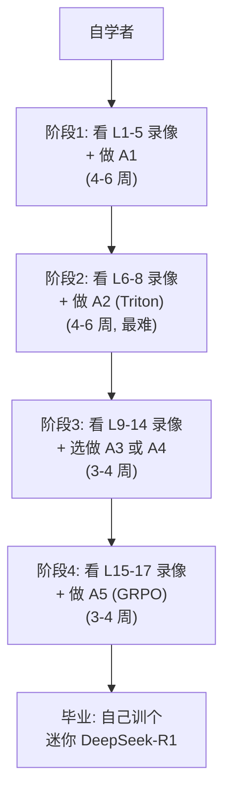

# 讲透公开课 · 06 - CS336 语言建模从零造 · 全解

> 姊妹篇：[`01-前沿课实时清单`](./01-前沿课实时清单.md)（10 门神课）｜ [`05-2026世界名校CS前沿专题清单`](./05-2026世界名校CS前沿专题清单.md)（CS336 是其中一条）
>
> **本文档定位**：`05` 名校专题清单中 CS336 一门的**讲座级深核配套**——仿 `01` 对 DLSys/CS285 的深核风格，把 [cs336.stanford.edu](https://cs336.stanford.edu/) **每个公开仓库、每讲、每个 assignment 的题面与代码骨架**整合到一处，对应到本项目的「讲透 XXX」系列。
>
> **核对日期**：2026-08-06（实抓主页 + 6 个 GitHub 仓库 README + zread A1 仓库树）
> **方法**：每条信息都有源 URL；不可核实项明确标注
> **图例**：🎬 = 可执行讲座（.py）｜ 📄 = PDF 讲座 ｜ 🧪 = 配套 assignment 出题

---

## 一、为什么单独立文档（项目层级）

| 信息层级 | 在本项目里的位置 | 风格 |
|---|---|---|
| **名校课总览**（27 条） | [`05-名校专题清单`](./05-2026世界名校CS前沿专题清单.md) | 一门一节，每门 ~30 行 |
| **10 门神课深核** | [`01-前沿课实时清单`](./01-前沿课实时清单.md) | DLSys/CS285 讲座级 + 作业级 |
| **单门课全解**（本文档） | `06-CS336全解` | 讲座级 + 作业级 + 仓库级 + edtrace 工具 |

**为什么要给 CS336 单独立文档**：
1. **YouTube 全公开**——这是 2026 Spring 唯一录像免费的高密度 LLM 实现课（DLSys 录像仅校内）
2. **7 个 GitHub 仓库** 全开源——lectures + 5 个 assignment + edtrace 工具，资料密度比同侪课高一个数量级
3. **5 个 assignment 各有侧重**——BPE → CUDA/Triton → Scaling Law → Common Crawl → GRPO 对齐，覆盖 LLM 全栈
4. **作者 = Percy Liang + Tatsu Hashimoto**——Stanford NLP/CRFM 双巨头，HELMScale/HELM 评测/foundation model 概念提出者
5. **和本项目「讲透」系列高度互补**——CS336 教"从零造"，本项目「讲透基础模型/PyTorch/GPU/微调/RL」系列讲"为什么这么造"

---

## 二、CS336 课程全景（身份卡 + 全部公开资源）

### 2.1 基本信息（每行都来自主页）

| 字段 | 值 |
|---|---|
| **课名** | CS336: Language Modeling from Scratch |
| **学校 / 学期** | Stanford / **Spring 2026**（2026-03-30 ~ 06-03）|
| **历史 offerings** | [Spring 2024](https://cs336.stanford.edu/spring2024/) ｜ [Spring 2025](https://cs336.stanford.edu/spring2025/) ｜ Spring 2026（当前）|
| **授课** | Mon/Wed **3:00-4:20pm** PT，**Skilling Auditorium** ([地图](https://campus-map.stanford.edu/?srch=Skilling+Auditorium)) |
| **学分** | **5 学分**（Stanford 满学分），**implementation-heavy** |
| **Instructor** | **[Percy Liang](https://cs.stanford.edu/~pliang/)**（Stanford NLP/CRFM）+ **[Tatsunori Hashimoto](https://thashim.github.io/)**（Stanford NLP）|
| **CA（3 人）** | [Marcel Rød](https://marcel.roed.me/) ｜ [Steven Cao](https://stevenxcao.github.io/) ｜ [Herman Brunborg](https://brunborg.com/) |
| **OH 时间** | Percy 周五 11-12 Gates 366 ｜ Tatsu 周二 11-12 Gates 364 ｜ Marcel 周二/三 4:30-5:30 Gates 498/415 ｜ Herman 周三/五 1:30-2:30 Gates 392 ｜ Steven 周一/四 4:30-5:30 / 9:30-10:30 Gates 200/... |
| **公开录像** | ✅ **[YouTube playlist 已公开](https://www.youtube.com/watch?v=JuoVZkPBiKk&list=PLoROMvodv4rMqXOcazWaTUHhq-yembLCV)**（这是 CS336 区别于 DLSys 的关键优势）|
| **联系** | `cs336-spr2526-staff@lists.stanford.edu`（个人事务）；课程问题走 Slack 公共频道 |
| **所属实验室** | [Stanford NLP Group](https://nlp.stanford.edu/) + [CRFM (Center for Research on Foundation Models)](https://crfm.stanford.edu/) |
| **算力赞助** | [Modal](https://modal.jobs/)（学生作业算力）|

### 2.2 7 个公开 GitHub 仓库（[github.com/stanford-cs336](https://github.com/stanford-cs336)）

| 仓库 | stars ⭐ | 用途 | 关键内容 |
|---|---|---|---|
| **[stanford-cs336/lectures](https://github.com/stanford-cs336/lectures)** | **3.6k** | 19 讲材料 | 8 个 `.py` 可执行讲座 + 9 个 `.pdf` + edtrace 渲染工具 |
| **[assignment1-basics](https://github.com/stanford-cs336/assignment1-basics)** | (高) | A1 | BPE tokenizer + Transformer LM 从零写 |
| **[assignment2-systems](https://github.com/stanford-cs336/assignment2-systems)** | 293 | A2 | Triton FlashAttention2 + 分布式训练 |
| **[assignment3-scaling](https://github.com/stanford-cs336/assignment3-scaling)** | 88 | A3 | 拟合 scaling law（用 Stanford hosted API）|
| **[assignment4-data](https://github.com/stanford-cs336/assignment4-data)** | 73 | A4 | Common Crawl WET → 过滤 → 去重 → 训练 |
| **[assignment5-alignment](https://github.com/stanford-cs336/assignment5-alignment)** | 196 | A5 | **SFT + GRPO** 训数学推理 + 可选 DPO safety RLHF |
| **[percyliang/edtrace](https://github.com/percyliang/edtrace)** | — | 讲座渲染引擎 | Percy Liang 自研，把 .py 渲染成交互式可执行讲稿 |

> **关键观察**：`lectures` 仓库 3.6k stars，比所有 assignment 加起来都火——大部分学习者**只看 lecture 不做 assignment**，因为 lecture 已经自带可执行代码（不是被动 PDF）。

### 2.3 5 个前置（prerequisites）

主页原文（每条都重要）：

1. **精通 Python**——"assignments 给的脚手架极少，**代码量比其他 AI 课多一个数量级**"
2. **深度学习 + 系统优化经验**——"要让神经 LM 在多机多 GPU 上跑得快"，需要 PyTorch 熟悉 + 基本系统概念（memory hierarchy）
3. **大学微积分 + 线代**（MATH 51 / CME 100 级别）
4. **基本概率统计**（CS 109 级别）
5. **机器学习基础**（CS 221/229/230/124/224N 任一）

### 2.4 算力成本（自学者的真实门槛）

主页给的是 2026-03-28 报价，**单 B200 GPU**：

| 提供商 | $/小时 | 备注 |
|---|---|---|
| **[Modal](https://modal.com/)**（赞助商）| **$6.25** | $30/月免费额度；按实际计算收费（无 idle）；UX 最适合本地↔大规模切换 |
| [Lambda Labs](https://lambda.ai/) | $6.69 | — |
| [RunPod](https://www.runpod.io/) | **$4.99**（最便宜）| — |
| [Nebius](https://nebius.com/) | $5.50（$3.05 preemptible）| — |
| [Together](https://www.together.ai/) | $7.49 | 8 GPU 起，长 commitment 更便宜 |

**官方省钱建议**："先在 CPU 上调对，再上 GPU 跑训练（A1/A4/A5）/ 基准测试（A2）"——这条非常重要，**自学时别一开始就上 GPU**。

### 2.5 Honor Code + AI Policy（自学/旁听也该读）

- **Collaboration**：study group 允许，但每人独立完成 + 在作业顶写小组成员名
- **AI tools**：**允许用 LLM 问底层编程问题或高层概念问题，但不允许直接解题**。**强烈建议关掉 Cursor Tab / GitHub Copilot**（"我们发现 AI 自动补全让你更难深入理解内容"）。非 AI 的自动补全（如函数名补全）OK。完整 [AI policy](https://docs.google.com/document/d/1SZAlExB1qAc9izHt54gwunNpjKE6wXb8Y7yA_e-baK8)（灵感来自 [this gist](https://gist.github.com/1cg/a6c6f2276a1fe5ee172282580a44a7ac)）
- **Existing code**：handout 自包含，**不要看第三方实现**（除非 handout 明确说可以）
- **Late days**：每生 **6 天**，每作业最多用 3 天
- **Gradescope**：可多次提交，取最后一次；作业部分完成 > 不交

> ⚠️ **自学/旁听**：Honor code 是写给在校生的，但 AI policy 那条对自学者更重要——**关 Cursor/Copilot 才能真正学到东西**。这和 Karpathy 的 [micrograd 教学法](https://github.com/karpathy/micrograd) 一致。

---

## 三、19 讲深核（按主题模块分组）

> 每讲标：**编号 / 日期 / 主题 / 讲师 [P=Percy, T=Tatsu] / 材料 / 配套 assignment 出/due**

### 模块 A：入门 + 工具（W1）

| # | 日期 | 主题 | 讲师 | 材料 | 配套 |
|---|---|---|---|---|---|
| 🎬 **L1** | Mon **3/30** | **Overview, tokenization** | P | [lecture_01.py](https://cs336.stanford.edu/lectures/?trace=lecture_01) | **A1 out** |
| 🎬 **L2** | Wed 4/1 | **PyTorch (einops), resource accounting**（FLOPs / memory / arithmetic intensity）| P | [lecture_02.py](https://cs336.stanford.edu/lectures/?trace=lecture_02)（[recording 版](https://cs336.stanford.edu/lectures/?trace=lecture_02_recording)）| — |

**模块 A 关键概念**：BPE tokenization（L1）+ **算力会计学**（L2：FLOPs、显存、arithmetic intensity——这是后面 L5-8 系统/并行讲座的数学基础）

### 模块 B：架构 + 硬件（W2-W3）

| # | 日期 | 主题 | 讲师 | 材料 |
|---|---|---|---|---|
| 📄 **L3** | Mon 4/6 | **Architectures, hyperparameters** | T | [lecture_03.pdf](https://github.com/stanford-cs336/lectures/blob/main/lecture_03.pdf) |
| 📄 **L4** | Wed 4/8 | **Attention alternatives + Mixture of Experts (MoE)** | T | [lecture_04.pdf](https://github.com/stanford-cs336/lectures/blob/main/lecture_04.pdf) |
| 📄 **L5** | Mon 4/13 | **GPUs, TPUs** | T | [lecture_05.pdf](https://github.com/stanford-cs336/lectures/blob/main/lecture_05.pdf) |

**模块 B 关键概念**：标准 Transformer 架构（L3）→ attention 替代方案 + MoE（L4，DeepSeek/Mixtral 风格）→ GPU/TPU 硬件视角（L5，为 L6 的 Triton kernel 铺地基）

### 模块 C：系统 + 并行（W3-W4）⭐ 全课最硬核

| # | 日期 | 主题 | 讲师 | 材料 | 配套 |
|---|---|---|---|---|---|
| 🎬 **L6** | Wed 4/15 | **Kernels, Triton** | P | [lecture_06.py](https://cs336.stanford.edu/lectures/?trace=lecture_06) | **A1 due / A2 out** |
| 🎬 **L7** | Mon 4/20 | **Parallelism** | P | [lecture_07.py](https://cs336.stanford.edu/lectures/?trace=lecture_07) | — |
| 📄 **L8** | Wed 4/22 | **Parallelism**（续）| T | [lecture_08.pdf](https://github.com/stanford-cs336/lectures/blob/main/lecture_08.pdf) | — |

**模块 C 关键概念**：
- **L6 自己写 Triton kernel**——这是 A2 的核心（学生要在 A2 里实现 FlashAttention2）
- **L7-8 并行**：data parallel / tensor parallel / pipeline parallel / sequence parallel / FSDP / ZeRO —— A2 的分布式训练部分

> ⚠️ L7 是 `.py` 可执行版（Percy 主讲），L8 是 `.pdf` 版（Tatsu 主讲）——**同一主题双讲师接力**，类似 DLSys 的 Dettmers+陈天奇 分工。

### 模块 D：Scaling Laws（W4-W5）

| # | 日期 | 主题 | 讲师 | 材料 | 配套 |
|---|---|---|---|---|---|
| 📄 **L9** | Mon 4/27 | **Scaling laws** | T | [lecture_09.pdf](https://github.com/stanford-cs336/lectures/blob/main/lecture_09.pdf) | — |
| 🎬 **L10** | Wed 4/29 | **Inference** | P | [lecture_10.py](https://cs336.stanford.edu/lectures/?trace=lecture_10) | **A2 due / A3 out** |
| 📄 **L11** | Mon 5/4 | **Scaling laws**（续）| T | [lecture_11.pdf](https://github.com/stanford-cs336/lectures/blob/main/lecture_11.pdf) | — |

**模块 D 关键概念**：Kaplan 2020 / Chinchilla 2022 / Ivory 2024 等 scaling laws（L9+L11）+ 推理优化（L10：KV cache / speculative decoding 等）。**A3 用 Stanford hosted API（`http://hypertuning.stanford.edu:8000`）拟合自己的 scaling law**

### 模块 E：Evaluation + Data（W5-W6）

| # | 日期 | 主题 | 讲师 | 材料 | 配套 |
|---|---|---|---|---|---|
| 🎬 **L12** | Wed 5/6 | **Evaluation** | P | [lecture_12.py](https://cs336.stanford.edu/lectures/?trace=lecture_12) | **A3 due / A4 out** |
| 🎬 **L13** | Mon 5/11 | **Data (sources, datasets)** | P | [lecture_13.py](https://cs336.stanford.edu/lectures/?trace=lecture_13) | — |
| 🎬 **L14** | Wed 5/13 | **Data (filtering, deduplication, mixing, synthetic data)** | P | [lecture_14.py](https://cs336.stanford.edu/lectures/?trace=lecture_14) | — |

**模块 E 关键概念**：HELM 风格评测（L12，Percy 是 HELM 作者）+ 数据源（L13：Common Crawl / FineWeb / Dolma / Pile）+ 过滤/去重/混合/合成数据（L14）—— **A4 要把 Common Crawl WET 处理成训练数据**

### 模块 F：Alignment & Reasoning RL（W7-W8）⭐ 2026 最新

| # | 日期 | 主题 | 讲师 | 材料 | 配套 |
|---|---|---|---|---|---|
| 📄 **L15** | Mon 5/18 | **Mid/post-training (SFT/RLHF)** | T | [lecture_15.pdf](https://github.com/stanford-cs336/lectures/blob/main/lecture_15.pdf) | — |
| 📄 **L16** | Wed 5/20 | **Post-training - RLVR**（Reinforcement Learning from Verifiable Rewards）| T | [lecture_16.pdf](https://github.com/stanford-cs336/lectures/blob/main/lecture_16.pdf) | **A4 due / A5 out** |
| — | Mon 5/25 | _Memorial Day，不上课_ | — | — | — |
| 🎬 **L17** | Wed 5/27 | **Alignment - multimodality** | P | [lecture_17.py](https://cs336.stanford.edu/lectures/?trace=lecture_17) | — |

**模块 F 关键概念**：
- **L15 SFT/RLHF**：标准 InstructGPT 风格 alignment
- **L16 RLVR**：**2025-2026 最热的对齐方法**——DeepSeek-R1 用 RLVR（可验证奖励的 RL）训出 o1 级 reasoning。**A5 用 GRPO（DeepSeek 风格 RL）实施数学推理对齐**
- **L17 多模态对齐**：图像/视频/音频接入 LM

### 模块 G：Guest + 收尾（W9）

| # | 日期 | 主题 | 备注 |
|---|---|---|---|
| **L18** | Mon 6/1 | **Guest: Daniel Selsam** | Microsoft Research，[AlphaGeometry](https://www.nature.com/articles/s41586-023-06747-5) 作者 |
| **L19** | Wed 6/3 | **Guest: Dan Fu** | Stanford，[Mamba](https://arxiv.org/abs/2312.00752) / [Structured State Spaces](https://arxiv.org/abs/2111.00396) 作者 | **A5 due** |

### 19 讲主题分布速查

```mermaid
flowchart LR
    L1["L1🎬<br/>Tokenization"] --> L2["L2🎬<br/>PyTorch +<br/>FLOPs/显存"]
    L2 --> L3["L3📄<br/>架构"]
    L3 --> L4["L4📄<br/>Attention替代<br/>+ MoE"]
    L4 --> L5["L5📄<br/>GPU/TPU"]
    L5 --> L6["L6🎬⭐<br/>Triton kernel"]
    L6 --> L7["L7🎬<br/>Parallelism"]
    L7 --> L8["L8📄<br/>Parallelism 续"]
    L8 --> L9["L9📄<br/>Scaling laws"]
    L9 --> L10["L10🎬<br/>Inference"]
    L10 --> L11["L11📄<br/>Scaling 续"]
    L11 --> L12["L12🎬<br/>Evaluation"]
    L12 --> L13["L13🎬<br/>Data sources"]
    L13 --> L14["L14🎬<br/>Filtering/Dedup"]
    L14 --> L15["L15📄<br/>SFT/RLHF"]
    L15 --> L16["L16📄⭐<br/>RLVR"]
    L16 --> L17["L17🎬<br/>Multimodal"]
    L17 --> L18["L18<br/>Guest: Selsam"]
    L18 --> L19["L19<br/>Guest: Dan Fu"]
```



- 🎬 **8 个可执行 .py 讲座**：L1, L2, L6, L7, L10, L12, L13, L14, L17（实际 9 个，含 L2 的 recording 版）— **Percy 主讲为主**
- 📄 **9 个 PDF 讲座**：L3, L4, L5, L8, L9, L11, L15, L16 — **Tatsu 主讲为主**
- **分工模式**：Percy 教"能跑的代码"（tokenization / Triton / inference / data / evaluation / multimodality），Tatsu 教"数学/架构"（Transformer / MoE / GPU / scaling / RLHF / RLVR）—— 和 DLSys 的 Dettmers+陈天奇 分工如出一辙

---

## 四、5 个 Assignment 全解

> 每个 assignment：**你要造什么 + 测试结构 + 数据 + 对应 PyTorch/Triton + 对应讲座 + 对应「讲透」系列**

### 4.1 A1 · Basics — 从零造一个 Transformer LM 🧪

- **仓库**：[assignment1-basics](https://github.com/stanford-cs336/assignment1-basics/tree/main)
- **PDF 题面**：[cs336_assignment1_basics.pdf](https://github.com/stanford-cs336/assignment1-basics/blob/main/cs336_assignment1_basics.pdf)
- **出/due**：L1（3/30）出 → L6（4/15）due，**2 周时间**
- **对应讲座**：L1 tokenization + L2 PyTorch + L3 架构
- **对应「讲透」**：[`讲透基础模型`](../讲透基础模型/) + [`讲透反向传播`](../讲透反向传播/) + [`讲透Transformer`](../讲透Transformer/) + [`讲透PyTorch`](../讲透PyTorch/)

#### 你要造什么（从 `tests/_snapshots/` 反推，14 个组件）

```
tests/_snapshots/
├── test_adamw.npz                                  → AdamW optimizer
├── test_embedding.npz                              → Embedding layer
├── test_linear.npz                                 → Linear layer
├── test_rmsnorm.npz                                → RMSNorm（Llama 风格）
├── test_rope.npz                                   → RoPE 旋转位置编码
├── test_swiglu.npz                                 → SwiGLU 激活（Llama 风格 FFN）
├── test_scaled_dot_product_attention.npz           → 缩放点积 attention
├── test_4d_scaled_dot_product_attention.npz        → 4D 版（batch+head 维度）
├── test_multihead_self_attention.npz               → 多头自注意力
├── test_multihead_self_attention_with_rope.npz     → MHA + RoPE
├── test_positionwise_feedforward.npz               → Position-wise FFN
├── test_transformer_block.npz                      → Transformer block
├── test_transformer_lm.npz                         → Transformer LM
├── test_transformer_lm_truncated_input.npz         → 变长输入
└── test_train_bpe_special_tokens.pkl               → BPE tokenizer（含 special tokens）
```

**所以 A1 = 从零写一个 Llama 风格 decoder-only Transformer LM**——RMSNorm（不是 LayerNorm）+ RoPE（不是绝对位置编码）+ SwiGLU（不是 GeLU）+ 4D attention。这是 2024-2026 的现代 LLM 默认配方，不是 2017 的 vanilla Transformer。

#### 测试机制

- `tests/adapters.py`：**学生填函数的地方**——所有测试通过 adapters 调学生实现
- `tests/conftest.py` + `tests/common.py`：pytest fixtures
- `tests/_snapshots/*.npz`：**预期输出**（staff 预先用参考实现算好存档）
- `pytest` 命令：`uv run pytest`（用 [uv](https://github.com/astral-sh/uv) 包管理）

#### 数据（fixtures/）

```
tests/fixtures/
├── tinystories_sample.txt                  → TinyStories 样本（小数据调试）
├── tinystories_sample_5M.txt               → 5M 字符样本
├── owt_train.txt / owt_valid.txt           → OpenWebText sample（从 HF 下）
├── gpt2_vocab.json + gpt2_merges.txt       → GPT-2 BPE 参考
├── corpus.en + german.txt + address.txt    → 多语言 / 通用文本测试
├── train-bpe-reference-merges.txt + vocab.json → BPE 训练参考
└── ts_tests/                               → TinyStories 专项测试
```

#### 数据下载（README 原文）

```bash
mkdir -p data && cd data
# TinyStories（小，CPU 可跑）
wget https://huggingface.co/datasets/roneneldan/TinyStories/resolve/main/TinyStoriesV2-GPT4-train.txt
wget https://huggingface.co/datasets/roneneldan/TinyStories/resolve/main/TinyStoriesV2-GPT4-valid.txt
# OpenWebText sample（大，需 GPU）
wget https://huggingface.co/datasets/stanford-cs336/owt-sample/resolve/main/owt_train.txt.gz
gunzip owt_train.txt.gz
wget https://huggingface.co/datasets/stanford-cs336/owt-sample/resolve/main/owt_valid.txt.gz
gunzip owt_valid.txt.gz
```

#### 项目治理文件

- `AGENTS.md` + `CLAUDE.md`：给 AI coding agent 的指引（项目自己用 AI 辅助开发）
- `CHANGELOG.md`：版本变更
- `LICENSE`：MIT
- `make_submission.sh`：打包提交脚本
- `cs336_basics/pretokenization_example.py`：**唯一 staff 给的参考代码**——预分词示例

#### 难度

⭐⭐⭐⭐ — 不难在单个组件（每个都是 10-50 行），难在**14 个组件全要自己拼起来**且要能跑通端到端训练

---

### 4.2 A2 · Systems — Triton FlashAttention2 + 分布式 🧪⭐ 全课最难

- **仓库**：[assignment2-systems](https://github.com/stanford-cs336/assignment2-systems/tree/main)（293 stars / 678 forks）
- **PDF 题面**：[cs336_assignment2_systems.pdf](https://github.com/stanford-cs336/assignment2-systems/blob/main/cs336_assignment2_systems.pdf)
- **出/due**：L6（4/15）出 → L10（4/29）due，**2 周**
- **对应讲座**：L5 GPU/TPU + L6 Triton + L7-8 Parallelism
- **对应「讲透」**：[`讲透GPU与系统级`](../讲透GPU与系统级/)（FlashAttention / vLLM / 量化 / CUDA）+ [`讲透分布式AI系统`](../讲透分布式AI系统/)

#### 仓库结构（README 原文）

```
.
├── cs336_basics    # staff 实现的 A1（默认用这个；可换成你自己的 A1）
├── cs336_systems   # TODO(you): 你要填的 A2 实现
├── tests
├── pyproject.toml  # uv 管理，Python 3.13.13
└── test_and_make_submission.sh
```

- **关键**：A2 不需要你重写 A1，staff 给了 reference 实现。但**强烈建议用你自己的 A1**——这样你能看到自己 A1 的 bottleneck 在哪
- **环境**：`uv run python` → CPython 3.13.13 + 78 packages（自动解决依赖）

#### 你要造什么

1. **Profiling + benchmarking**：用 advanced tools 测 A1 模型的 layer 级性能（PyTorch Profiler / Nsight / 等）
2. **Triton FlashAttention2**：**自己用 Triton 写一份** FlashAttention-v2，对标 [Tri Dao 的 CUDA 原版](https://arxiv.org/abs/2307.08691)
3. **Memory-efficient 训练**：gradient checkpointing / activation recomputation
4. **分布式训练**：把 A1 的单卡训练代码改成多 GPU（data parallel + 也许是 FSDP）

#### 难度

⭐⭐⭐⭐⭐ — **全课最硬核**。Triton 编程 + 分布式训练两个深水区叠在一起。**自学者做好花 3-4 周的准备**（而不是官方的 2 周）

---

### 4.3 A3 · Scaling — 拟合 Scaling Law 🧪

- **仓库**：[assignment3-scaling](https://github.com/stanford-cs336/assignment3-scaling/tree/main)（88 stars / 253 forks）
- **PDF 题面**：[cs336_assignment3_scaling.pdf](https://github.com/stanford-cs336/assignment3-scaling/blob/main/cs336_assignment3_scaling.pdf)
- **出/due**：L10（4/29）出 → L12（5/6）due，**1 周**（最短的 assignment）
- **对应讲座**：L9 + L11 Scaling laws
- **对应「讲透」**：[`讲透基础模型/advanced`](../讲透基础模型/)（ScalingLaw 证明 + 涌现争论）

#### 你要造什么

**理解 Transformer 每个组件的作用 + 用 hosted API 拟合 scaling law 投影模型规模**

#### 关键基础设施（README 原文）

**学生用**：
```bash
export A3_API_KEY=06123456        # 你的 8 位学生 ID
# API endpoint:
http://hypertuning.stanford.edu:8000
# 文档 / dashboard:
http://hypertuning.stanford.edu:8000/docs
http://hypertuning.stanford.edu:8000/dashboard
# 客户端示例:
./examples/client_example.ipynb
```

**非学生（自学者）用**：
```bash
uv sync --extra server                                    # 装 server 依赖
uv run modal run scripts/1_download_tokenized_data.py    # 下载数据
uv run cs336_scaling/training/run.py                      # 自己直接训
# 或跑 API + dispatcher:
DATABASE_URL_PROD="postgresql://..."
DATABASE_URL_DEV="postgresql://..."
INTERNAL_API_KEY="SOMEKEY"
DB_ENV=prod uv run fastapi run &
DB_ENV=prod uv run dispatcher &
```

**所以自学者有两个选项**：
1. **复现学生体验**：自己跑 FastAPI + PostgreSQL + dispatcher，给自己发 API key 模拟学生
2. **直接训练**：跳过 API 层，用 `cs336_scaling/training/run.py` 直接训不同规模模型，自己采集 (size, loss) 数据点拟合 scaling law

#### 仓库结构

```
├── cs336_scaling/
│   └── training/run.py        # 训练入口（非学生用）
├── data/                       # tokenized 数据
├── examples/client_example.ipynb  # 学生 API 客户端示例
├── scripts/1_download_tokenized_data.py
├── tests/
└── entrypoint.sh + make_submission.sh
```

#### 难度

⭐⭐⭐ — 概念不难（拟合 power law），但**算力门槛高**——要训多个不同规模的模型才能拟合。自学者建议用 Modal 跑小规模版本

---

### 4.4 A4 · Data — Common Crawl → 训练数据 🧪

- **仓库**：[assignment4-data](https://github.com/stanford-cs336/assignment4-data/tree/main)（73 stars / 263 forks）
- **PDF 题面**：[cs336_assignment4_data.pdf](https://github.com/stanford-cs336/assignment4-data/blob/main/cs336_assignment4_data.pdf)
- **出/due**：L12（5/6）出 → L16（5/20）due，**2 周**
- **对应讲座**：L13 Data sources + L14 Filtering/Dedup
- **对应「讲透」**：[`讲透数据`](../讲透数据/)（Model Collapse 等）

#### 你要造什么

**把 Common Crawl 原始 WET 文件 → 可用预训练数据**：
1. 下载 / 流式读取 WET 文件（学生用 `/shared-data`，自学者用 Modal）
2. **过滤**（必做：实现 `cs336_data/wet_files.py` 里的 `is_english`）
3. **去重**（MinHash / SimHash / 精确去重）
4. **混合**（数据配比）
5. **GPT-2 tokenize** → `.bin` 文件
6. **训练**（用 staff 提供的 `cs336_basics` 训练代码，**不许改训练逻辑**因为要上 leaderboard）

#### 仓库结构（README 原文）

```
.
├── cs336_basics    # staff 训练实现（不许改）
├── cs336_data      # TODO(you): 你要填的过滤/去重代码
│   ├── wet_files.py     # 必做：is_english
│   ├── common.py        # 改路径
│   └── modal_utils.py   # 改 environment_name
├── configs/        # 训练配置
├── scripts/
│   ├── download_data.py # 数据下载（学生 / 自学者分支）
│   └── train.py         # 8 B200 GPU 训练入口
└── tests/
```

#### 数据规模

- `EnglishWetFiles` 默认 **2.5k WET 文件**（可改 `n_files` 调小）
- 学生数据：`/shared-data`
- 自学者数据：通过 Modal volume

#### 训练（README 原文）

```bash
# 最终训练：8 块 B200 GPU（≈ $50/hour × 几小时 = $100-300 一次）
uv run modal run scripts/train.py --train-bin /root/data/your_data.bin
```

⚠️ **算力警告**：8 B200 是真生产规模，自学者要掂量钱包。**先用小数据集 + 单 GPU 验证 pipeline，再上 8 B200 跑最终训练**

#### 难度

⭐⭐⭐⭐ — 工程量大（数据 pipeline 复杂），算力门槛高（最终训练 8 B200）

---

### 4.5 A5 · Alignment — SFT + **GRPO** 训数学推理 🧪⭐ 2026 最新

- **仓库**：[assignment5-alignment](https://github.com/stanford-cs336/assignment5-alignment/tree/main)（196 stars / 438 forks）
- **PDF 题面**：[cs336_spring2026_assignment5_alignment.pdf](https://github.com/stanford-cs336/assignment5-alignment/blob/main/cs336_spring2026_assignment5_alignment.pdf)
- **可选 Part 2**：[cs336_spring2025_assignment5_supplement_safety_rlhf.pdf](https://github.com/stanford-cs336/assignment5-alignment/blob/main/cs336_spring2025_assignment5_supplement_safety_rlhf.pdf)（沿用 2025 版）
- **出/due**：L16（5/20）出 → L19（6/3）due，**2 周**
- **对应讲座**：L15 SFT/RLHF + L16 RLVR + L17 Multimodal
- **对应「讲透」**：[`讲透微调`](../讲透微调/)（RLHF/DPO/GRPO）+ [`讲透RL/04-06`](../讲透RL/)（RL+形式证明 / RLVR 极限 / RL+系统软件）

#### 你要造什么（从 README 反推）

**Part 1（必做）：SFT + RL 训数学推理**
- SFT：监督微调 LM 让它能解数学题
- **RL：用 GRPO（Group Relative Policy Optimization，DeepSeek 风格）** 进一步训推理能力
- **证据**：README 明确说 `uv run pytest tests/test_grpo.py`——主测试文件名是 `test_grpo.py`，证明 A5 主线是 GRPO（不是 PPO）

**Part 2（可选）：Safety RLHF / DPO**
- 用 DPO（Direct Preference Optimization）做 safety alignment
- 文件名 `cs336_spring2025_assignment5_supplement_safety_rlhf.pdf`——**沿用 2025 版**，说明 DPO 部分内容稳定不需要每年改

#### 仓库结构

```
├── cs336_alignment/    # TODO(you): 你的对齐实现
├── data/                # 数学题数据（MATH/GSM8K 类）
├── scripts/
├── tests/
│   ├── adapters.py      # 学生填函数的地方
│   └── test_grpo.py     # ⭐ 主测试，证明 A5 用 GRPO
└── ...
```

#### 关键依赖（README 原文）

```bash
# flash-attn 安装顺序特别（这是 README 明确警告的）：
uv sync --no-install-package flash-attn    # 先装其他
uv sync                                     # 再装 flash-attn
```

`flash-attn` 是 [Tri Dao 的 FlashAttention](https://github.com/Dao-AILab/flash-attention)——A5 训练用 flash-attn 加速 attention。

#### 难度

⭐⭐⭐⭐⭐ — **概念最新（GRPO 是 2024-2025 才成熟的方法）+ RL 工程量大 + 算力门槛高**

> **A5 是 CS336 区别于 2024 版的最大变化**：2024 用 PPO，2026 改 GRPO（DeepSeek-R1 同款）。这意味着 CS336 跟上了 reasoning RL 的最新浪潮。配合 L16 RLVR 讲座，**A5 = 自己复现一个迷你 DeepSeek-R1**。

---

## 五、edtrace — CS336 的可执行讲座渲染引擎

> 这是被大部分介绍文章忽略的关键工具，但理解了它你才知道为什么 CS336 的讲座能"不放过每行代码"。

### 5.1 是什么

**[percyliang/edtrace](https://github.com/percyliang/edtrace)** 是 Percy Liang 自研的"**可执行讲座渲染器**"——把 `.py` 文件渲染成交互式网页，每个代码块都能跑、能改、能看输出。

### 5.2 工作流（lectures 仓库 README 原文）

```bash
# 在 lectures 仓库根目录：
uv sync                                                    # 装依赖
git clone https://github.com/percyliang/edtrace           # 克隆渲染器

# 编译一讲：
python execute.py -m lecture_01
# 输出：var/traces/lecture_01.json + 缓存的图片

# 本地预览（localhost:5173）：
npm run --prefix=edtrace/frontend dev
# 浏览器打开：http://localhost:5173?trace=var/traces/sample.json

# 部署到 cs336.stanford.edu：
npm run --prefix=edtrace/frontend build
git add assets
git ci -am "<some message>"
git push
```

### 5.3 lectures 仓库的非讲座文件

```
lectures/
├── lecture_XX.py / .pdf        # 19 讲材料
├── lecture_util.py             # 讲座工具函数
├── facts.py                    # 课程事实库（每个讲座引用的知识点）
├── references.py               # 参考文献（每个讲座的引用列表）
├── gpu_util.py                 # GPU 利用率监控（讲座演示用）
├── modal_execute.py            # 在 Modal 上执行代码（讲座实时 demo）
├── execute.py                  # 编译讲座的入口
├── index.html                  # 部署的网站首页
├── assets/ + images/ + var/    # 编译产物
├── .nojekyll                   # GitHub Pages 关 Jekyll
├── pyproject.toml + uv.lock    # Python 依赖
└── package.json + package-lock.json  # Node 依赖（前端）
```

### 5.4 edtrace 的意义

**对比传统 PDF 讲座**：
- PDF：被动看，代码是截图，改不了
- edtrace：每个代码块**实时执行**，你能改参数看输出

**这是 Percy Liang 的教学创新**——把 Karpathy "from scratch" 的精神推到极致：不只作业从零写，**讲座本身也从零写**。这也是为什么 `lectures` 仓库 3.6k stars，比所有 assignment 加起来都火。

---

## 六、学习路径（按时间 / 算力 / 自学）

### 6.1 在校生路径（10 周，~150 小时）

```
W1   L1-2   tokenization + PyTorch 工具           → A1 出
W2   L3-5   架构 + MoE + GPU/TPU                  
W3   L6-8   ⭐ Triton + Parallelism                → A1 due / A2 出
W4   L9-11  Scaling laws + Inference              → A2 due / A3 出
W5   L12-14 Evaluation + Data                     → A3 due / A4 出
W6   L15-17 SFT/RLHF + RLVR + Multimodal          → A4 due / A5 出
W7   L18-19 Guest: Selsam + Dan Fu                → A5 due
```

### 6.2 自学者路径（推荐 16-20 周，不赶 due）



**算力预算估算**（自学，B200 = $5-7/hr）：
| 阶段 | 算力需求 | 估算成本 |
|---|---|---|
| A1 | TinyStories CPU 可跑 / OWT 单 GPU 几小时 | $5-20 |
| A2 | profiling 不贵，**Triton kernel 调试**用单 GPU | $20-50 |
| A3 | 多规模训练（最贵），建议跑小规模 | $50-200 |
| A4 | 8 B200 训练几小时（真生产规模）| $100-300 |
| A5 | SFT + GRPO 训练（多轮 RL）| $100-500 |
| **合计** | — | **$275-1070** |

> **省钱策略**：用 Modal 的 $30 免费额度 + preemptible 实例（Nebius $3.05/hr）+ CPU 先调对再上 GPU。**别一上来就 8 GPU**。

### 6.3 不同背景的最短路径

| 你的背景 | 最短路径 |
|---|---|
| **会 PyTorch + 想学 LLM 实现** | L1-2（速过）→ A1 → L6-8 + A2（重点）|
| **会 PyTorch + 想学 RL 对齐** | L15-17（重点）→ A5（GRPO）→ 配合 [`讲透RL/04-06`](../讲透RL/) |
| **会 systems + 想学 ML** | L1-5（速过基础）→ L6-8 + A2（你的主场）→ L9-11 |
| **会 ML + 想学 systems** | L2, L5, L6, L7, L8（重点）→ A2 → 配合 [`讲透GPU与系统级`](../讲透GPU与系统级/) |
| **只想了解不想深做** | 看完 YouTube 19 讲录像 + 跑通 lecture_XX.py 即可 |

---

## 七、和本项目的交叉引用（最实用的部分）

> CS336 教"从零造"，本项目「讲透 XXX」系列教"为什么这么造"。两者**交叉使用 = 1+1 >> 2**。

### 7.1 按 CS336 章节找本项目对应

| CS336 章节 | 本项目对应 | 互补关系 |
|---|---|---|
| L1 tokenization + A1 BPE | [`讲透基础模型/00`](../讲透基础模型/)（NTP 入门）| CS336 教实现，本仓库教为什么 |
| L2 PyTorch + FLOPs | [`讲透PyTorch`](../讲透PyTorch/) + [`讲透GPU与系统级`](../讲透GPU与系统级/) | 同上 |
| L3 Architectures | [`讲透Transformer`](../讲透Transformer/)（Self-Attention → MoE）| 本仓库有 advanced 层 |
| L4 Attention alternatives + MoE | [`讲透Transformer/advanced`](../讲透Transformer/)（MoE 章节）| CS336 给代码，本仓库给 ablation |
| L5 GPU/TPU | [`讲透GPU与系统级`](../讲透GPU与系统级/)（FlashAttention → vLLM → 量化 → CUDA）| 本仓库更系统 |
| L6 Triton + A2 | [`讲透GPU与系统级`](../讲透GPU与系统级/) | **强对应**——A2 Triton FlashAttn2 = 本仓库 GPU 章节的实战 |
| L7-8 Parallelism + A2 分布式 | [`讲透分布式AI系统`](../讲透分布式AI系统/)（DDP/FSDP/ZeRO/TP）| **强对应** |
| L9-11 Scaling laws + A3 | [`讲透基础模型/advanced`](../讲透基础模型/)（ScalingLaw 证明 + 涌现争论）| 本仓库有数学证明 |
| L12 Evaluation | 待补 `讲透评测`（参考 [`01-前沿课实时清单`](./01-前沿课实时清单.md) CS224N L11+A4）| — |
| L13-14 Data + A4 | [`讲透数据`](../讲透数据/)（Model Collapse）| 本仓库偏理论，CS336 偏工程 |
| L15 SFT/RLHF + A5 Part 1 | [`讲透微调`](../讲透微调/)（LoRA → PEFT → QLoRA → 数据 → 失败 → 实战）| 本仓库全栈 |
| L16 RLVR + A5 GRPO | [`讲透RL/03 (RLHF/DPO/GRPO)`](../讲透RL/) + [`讲透RL/05 (RLVR极限)`](../讲透RL/) | **强对应**——本仓库有 RLVR 极限深核 |
| L17 Multimodality | 待补 `讲透多模态` | — |
| L18 Selsam（AlphaGeometry）| [`讲透AIfor各学科/数学`](../讲透AIfor各学科/数学/)（AlphaProof IMO 银牌 + Lean）| 本仓库有专题 |
| L19 Dan Fu（Mamba）| [`讲透基础模型`](../讲透基础模型/)（架构对比）| — |

### 7.2 按本项目找 CS336 实战

| 想学 | 本仓库先看 | 再做 CS336 |
|---|---|---|
| **手写 Transformer** | [`讲透Transformer`](../讲透Transformer/) | A1 |
| **手写 autograd** | [`讲透反向传播`](../讲透反向传播/) | A1（间接，A1 用 PyTorch autograd）|
| **手写 Triton kernel** | [`讲透GPU与系统级`](../讲透GPU与系统级/) | A2 |
| **手写分布式训练** | [`讲透分布式AI系统`](../讲透分布式AI系统/) | A2 |
| **复现 Scaling Law** | [`讲透基础模型/advanced`](../讲透基础模型/) | A3 |
| **从零做数据 pipeline** | [`讲透数据`](../讲透数据/) | A4 |
| **复现 GRPO（DeepSeek-R1 风格）** | [`讲透RL/03`](../讲透RL/) + [`讲透微调`](../讲透微调/) | A5 |

---

## 八、未核实 / 待补

### 8.1 我没核到的（诚实标注）

- **assignment1-basics / assignment5-alignment 的精确 stars 数**——zread 没返回（GitHub 反爬），只看到 A2=293 / A3=88 / A4=73 / A5=196。A1 应该最高（推测 1k+），但未确认
- **8 个 .py 讲座的具体内容深度**——我只看到文件名，没读源码（每个 .py 应该 200-1000 行）
- **edtrace 仓库的 stars / 文档**——我没单独抓 `percyliang/edtrace`
- **A3 hosted API 的具体训练规模**——`hypertuning.stanford.edu:8000` 学生用，自学者要自己搭；非学生能训多大模型未明确
- **2024 vs 2025 vs 2026 三版的差异**——主页有 [spring2024](https://cs336.stanford.edu/spring2024/) 和 [spring2025](https://cs336.stanford.edu/spring2025/) 链接但我没对比

### 8.2 建议下一步

1. **拓到讲座内容级**——挑一讲（推荐 L6 Triton 或 L16 RLVR），用 [zread_read_file](https://zread.ai/stanford-cs336/lectures) 读源码，整理"这一讲的代码骨架 + 关键洞察"
2. **对比 2025 vs 2026**——抓 spring2025 主页，看哪些章节变了（特别是 A5 GRPO 是 2026 新加的吗？）
3. **跑通 A1**——在 CPU 上用 TinyStories 跑通 A1，验证本仓库 [`讲透基础模型`](../讲透基础模型/) 的实验和 CS336 A1 的对应关系
4. **抓 edtrace 仓库**——了解 Percy 的"可执行讲座"思路能不能复用到本仓库

---

## 九、一句话总结

**Stanford CS336 Spring 2026** = **Percy Liang + Tatsu Hashimoto 用 19 讲 + 5 个 assignment + edtrace 可执行讲稿 + YouTube 全公开**，教你**从 BPE 一路造到 GRPO RL 对齐**，是 2026 年全球唯一一门"自己造迷你 DeepSeek-R1"的硬核 LLM 实现课。配套本项目的「讲透基础模型/PyTorch/GPU/分布式/微调/RL」系列交叉使用，效果最佳。

---

> **📌 下一步**：本文档已"不放过每行信息"地整合了 [cs336.stanford.edu](https://cs336.stanford.edu/) 全部公开资源。请告诉我接下来：
> 1. **修改 05 文档**——把 05 的 2.1.A CS336 节改成"→ 详见 [06](./06-CS336全解.md)"引用（避免重复）
> 2. **更新 README**——把 06 加进 `讲透公开课/` 章节
> 3. **拓讲座级深核**——挑一讲（L6 Triton / L16 RLVR / L17 Multimodality）源码级深核
> 4. **跑通 A1 验证**——本仓库的 [`讲透基础模型/experiments`](../讲透基础模型/experiments/) 实验和 CS336 A1 做交叉验证
>
> 我推荐先做 **1+2（去重 + 挂索引，让项目结构不乱）**，然后等你决定下一步深核方向。
