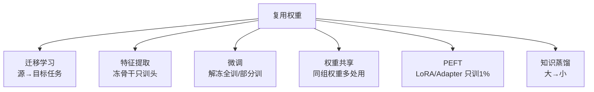

# 00 · 为什么复用权重：从零训练为什么总输？

> 如果你能从本教程带走一件事，就带这件：**在现代深度学习里，几乎没有人从零训练——大家都复用预训练权重。** 这不是偷懒，是因为预训练权重里编码了"通用知识"，能让你用**更少的数据、更少的算力、得到更好的效果**。本章用 12 个点的实验把这个结论砸实。

---

## 1. 直觉层：重新发明轮子 vs 站在巨人肩膀

### 一句话比喻

> **从零训练 = 每次造车都从发明轮子开始。复用权重 = 直接买现成轮子，只造车身。**
>
> 一个在 ImageNet（120 万张图）上预训练过的模型，已经"认识"边缘、纹理、形状、物体部件——这些是**几乎所有视觉任务都用得上的通用特征**。你复用这些特征，就省去了让模型从头学"什么是边缘"的巨大成本。

### 两种范式的根本区别

| | 传统 ML（从零训练）| 现代 ML（复用权重）|
|---|---|---|
| 起点 | 随机初始化权重 | **预训练权重**（已学通用知识）|
| 数据需求 | 大（每个任务都要海量标注）| **小**（少量即可适配）|
| 算力需求 | 大（从头训）| **小**（只微调）|
| 效果（少样本时）| 差 | **好** |
| 代表时代 | 2012 前 | 2018 后（BERT/GPT/ImageNet）|

## 2. 数学层：为什么复用有效？

### 2.1 神经网络 = 特征提取器 + 任务头

一个分类网络可以拆成两部分：

$$
x \;\xrightarrow{\text{骨干 (backbone)}}\; \phi(x) \;\xrightarrow{\text{分类头 (head)}}\; y
$$

- **骨干** $\phi$：把原始输入（像素/词）变成"特征"。**好特征是通用的**——能区分猫狗的特征，大致也能区分猫和桌子。
- **分类头**：在特征上做最终判别。**任务相关、轻量。**

### 2.2 复用的本质：复用好特征

从零训练时，骨干 $\phi$ 是随机初始化的——它的特征是"垃圾"，必须用大量数据从零学起。**预训练**就是事先（在大数据/通用任务上）把 $\phi$ 训成"好特征提取器"。复用权重 = **直接拿这个好 $\phi$，只针对下游任务轻调**。

### 2.3 数据效率的数学直觉

学一个有用的特征表示需要**覆盖数据的多样性**（各种边缘、角度、光照……），这要海量数据。而"在一个具体下游任务上微调"只需要**学任务特有的最后一步**，数据需求小得多：

$$
\underbrace{\text{学好通用特征}}_{\text{需大数据 (预训练)}} \;+\; \underbrace{\text{适配下游任务}}_{\text{需小数据 (微调)}} \;<\; \underbrace{\text{从零同时学两者}}_{\text{需大数据 (从零)}}\ \text{在下游上的数据量}
$$

> 📐 **关键**：预训练把"学通用特征"的昂贵成本**分摊**到大量预训练数据上；下游任务只需为"任务特化"付少量数据。这就是复用更省数据的根源。

## 3. 代码层：12 个点证明复用碾压从零

```bash
cd 讲透复用权重/experiments && python3 00_reusing_vs_scratch.py    # CPU 约 80 秒
```

**真实输出**（同心圆分类，少样本 12 点，可复现）：

```
① 源任务预训练 (circles 大数据 2000)...
   源任务准确率 = 1.000

② 目标任务 (同分布 circles, 仅12点训练):
   A 从零训练        最终测试准确率 = 0.850
   B 复用源权重+微调  最终测试准确率 = 1.000

=== 结论 ===
  从零训练准确率 : 0.850   (12点学环形边界, 难, 易欠拟合/过拟合)
  复用权重准确率 : 1.000   <- 复用预训练特征, 少样本下显著更好
  达到85%准确率: 从零需 8 步, 复用需 0 步
```

**怎么读：**
- **源预训练**：在大数据上把骨干训到 100%（已学好"环形边界"特征）。
- **从零（12 点）**：随机初始化，只有 12 个点——学不动非线性环形边界，只到 **85%**（欠拟合/过拟合）。
- **复用 + 微调（12 点）**：用源骨干权重初始化，12 个点足够"精调"——直接 **100%**。

> 🎯 **这就是预训练范式的全部价值，浓缩在一张图里**：同样 12 个点，复用碾压从零 15 个百分点。在真实的高维任务（图像、NLP）上，这个差距会**大得多**——少样本从零根本学不动。

## 4. 为什么这个范式统治了现代 AI？

复用权重不是某个 trick，而是**整个现代 AI 的组织原则**：

| 领域 | 预训练（学通用知识）| 复用到下游 |
|------|------------------|-----------|
| **NLP** | GPT/BERT 在互联网级文本预训练 | 微调做翻译、情感、问答、写代码 |
| **CV** | ResNet/ViT 在 ImageNet 预训练 | 微调做医学影像、检测、人脸 |
| **多模态** | CLIP 在 4 亿图文对预训练 | 复用做检索、文生图引导 |
| **生物** | ESM 在亿级蛋白质序列预训练 | 复用做结构预测、功能预测 |

**共同模式**：一个昂贵的"通用预训练" → 廉价地复用到无数下游任务。**预训练的成本被无数下游摊薄，下游享受了几乎免费的好特征。**

## 5. 复用权重的六种形态（预告）

复用不只有"微调"一种。本教程会逐一拆解六种形态：



## 6. 批判：复用不是万能的

诚实地说，复用也有失效场景：

1. **负迁移**：源任务和目标任务**特征不兼容**时（如本教程调试时，标准 moons 预训练复用到旋转 60° 的 moons 反而拖累），复用比从零更差。**复用前要判断源/目标是否相关。**
2. **领域鸿沟**：在自然图像上预训练的模型，复用到**医学影像/卫星图**（分布差异大）时，收益有限，甚至要重新预训练。
3. **偏见继承**：预训练数据里的偏见（性别、种族）会被权重带进所有下游任务。
4. **算力集中在预训练**：复用省的是下游成本，但**预训练本身极贵**（GPT-4 预训练上亿美元）——只有大公司玩得起，加剧了 AI 的中心化。

> 💡 所以复用是**默认选项**，但不是**无条件选项**。第 07 章会给"何时复用、何时从零"的决策树。

---

📌 **下一步**：去 [01-迁移学习全景.md](01-迁移学习全景.md) 看复用最基础的形态——**迁移学习**：什么是源/目标任务，特征提取 vs 微调的区别，以及可怕的"负迁移"。或直接跳 [04-参数高效微调PEFT.md](04-参数高效微调PEFT.md) 看当代最火的 LoRA。

✍️ **练习（输出倒逼输入）**
1. **概念**：用一句话向没学过 ML 的人解释"为什么预训练 + 微调 比 从零训练省数据"。
2. **动手**：把 `00_reusing_vs_scratch.py` 的目标训练点数从 12 改成 **200**，重跑——从零和复用的差距会变小还是变大？为什么？（提示：数据多了，从零也能学好。）
3. **洞察**：本实验源任务是"同心圆"，目标任务也是"同心圆"（同分布）。如果把目标任务换成**螺旋线**（特征不兼容），复用还会赢吗？这对应 00 章 6.1 节的什么现象？
4. **思考**：GPT-4 的预训练花了上亿美元，但每个用户复用它只要几美分。这种"成本集中在预训练、收益摊到无数下游"的模式，和哪些传统行业类似？（提示：基础设施、平台经济。）
