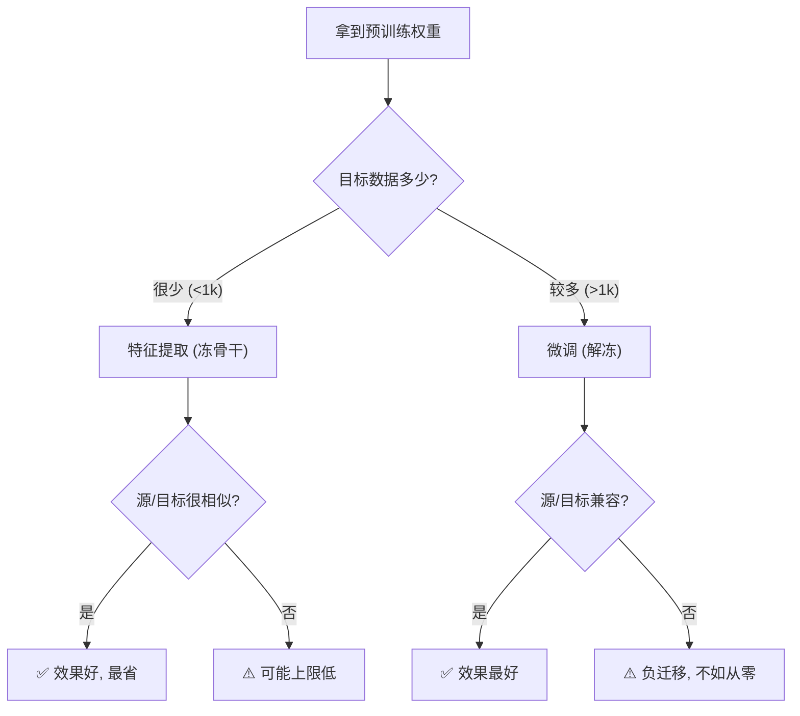

# 01 · 迁移学习全景：特征提取、微调，与负迁移

> 迁移学习（Transfer Learning）是"复用权重"最基础、最直白的形态：**把源任务上学到的知识，迁移到目标任务**。它的核心问题是——拿到预训练权重后，**怎么用**？本章拆解三种用法（从零 / 特征提取 / 微调），并用实验告诉你：少样本下，冻住骨干只训一个 130 参数的分类头，就能打过从零训练 8642 参数的网络。

---

## 1. 直觉层：借别人的本事

### 一句话比喻

> **迁移学习 = "转行"**：一个厨师（源任务：炒菜）转行做面点（目标任务），不用从"怎么拿刀"重新学——他复用已有的刀工、火候感（通用技能），只学面点特有的事（和面、拉坯）。

### 源任务 vs 目标任务

| | 源任务（source）| 目标任务（target）|
|---|---|---|
| 角色 | 预训练发生的地方 | 你真正想做的任务 |
| 数据 | 大（通常）| 小（你只有这么多）|
| 例子 | ImageNet 图像分类 | 医学影像肿瘤检测 |

**迁移的前提**：源和目标**共享某些通用特征**（如视觉的边缘/纹理、NLP 的语法/语义）。没有这个前提，迁移会失败（见 §5 负迁移）。

## 2. 数学层：特征共享

### 2.1 网络拆分：通用骨干 + 任务头

$$
\underbrace{x \xrightarrow{\phi_\theta} \phi(x)}_{\text{骨干 (通用特征)}} \xrightarrow{g_w} y
$$

- $\phi_\theta$：骨干，提取**通用特征**（在源任务学好）。
- $g_w$：任务头，做**任务特化判别**。

### 2.2 迁移 = 复用 $\phi_\theta$，按需处理 $g_w$

三种复用方式，对应"骨干冻不冻"：

| 方式 | 骨干 $\phi$ | 头 $g$ | 复用程度 | 可训参数 |
|------|:-:|:-:|:-:|:-:|
| **从零训练** | 随机，全训 | 训 | ❌ 不复用 | 100% |
| **特征提取** | 源权重，**冻住** | 训 | ✅ 完全复用 | **极少**（只头）|
| **微调** | 源权重，**解冻** | 训 | ✅ 复用+调整 | 100%（但起点好）|

## 3. 代码层：三模式对比

```bash
cd 讲透复用权重/experiments && python3 01_transfer_modes.py    # CPU 约 60 秒
```

**真实输出**（circles，目标仅 20 点，可复现）：

```
   从零训练        : 准确率=0.944  可训参数=8642
   特征提取(冻骨干) : 准确率=1.000  可训参数=130   ← 只训分类头!
   微调(解冻)      : 准确率=1.000  可训参数=8642
```

### 这个结果极有说服力

- **特征提取只训 130 个参数**（线性头 64×2+2），就达到 **100%**。
- **从零训练训了 8642 个参数**（整个网络），只到 **94.4%**。

> 🎯 **少样本下，一个好的预训练骨干 + 一个线性头，胜过从零训练整个网络。** 这就是"特征提取"模式的威力：预训练特征已经"够用"，你只要在上面画一条线（线性分类）。

## 4. 特征提取 vs 微调：什么时候用哪个？

| | 特征提取（冻骨干）| 微调（解冻）|
|---|---|---|
| 适用 | 目标数据**很少**、源/目标**很相似** | 目标数据**较多**、源/目标**有差异** |
| 风险 | 骨干不能适配目标，效果有上限 | 少样本易过拟合、可能破坏好特征 |
| 算力 | 极省 | 较多 |
| 经验法则 | 数据 < 1k 用特征提取 | 数据 > 1k 考虑微调 |

> 💡 **混合策略**（实践常用）：先特征提取训几轮（头先学好），再解冻骨干低学习率微调（整体精调）。叫 "gradual unfreezing" 或 "fine-tune with warmup"。

## 5. 负迁移：复用反而帮倒忙

复用不是稳赚的。当**源和目标任务特征不兼容**时，复用比从零更差——这叫**负迁移**（negative transfer）。

### 什么时候会负迁移？

- **领域差异大**：自然图像预训练 → 复用到卫星图/医学影像，特征不通用。
- **任务冲突**：源是"检测圆形"，目标是"检测方形"，特征方向相反。
- **本教程调试时的真实案例**：标准 make_moons 预训练的骨干，复用到**旋转 60° 的 moons** 时，源特征带偏，复用反而比从零差。后来换成同分布 circles 才正常。

### 判断准则

> 迁移前问一句：**"源任务学到的特征，对我的目标任务有道理吗？"** 如果是"边缘/纹理/语法"这种通用的，迁移安全；如果是高度任务特化的，要小心负迁移。

## 6. 迁移学习的分类（术语速查）

| 分类维度 | 类型 | 例子 |
|---------|------|------|
| 源/目标**任务**关系 | 归纳式（目标有少量标签）| ImageNet→医学 |
| | 直推式（目标无标签）| 域适应 |
| 源/目标**领域**关系 | 同构（特征空间相同）| 两都是图像 |
| | 异构（特征空间不同）| 图像→文本 |

> 日常说的"迁移学习"通常指**归纳式、同构**（源目标都是图像/都是文本，目标有少量标签）。本教程聚焦这种最常见的情况。

## 7. 批判：迁移的边界

1. **负迁移真实存在**：不是所有"预训练"都能迁移。盲目复用可能拖累。
2. **领域鸿沟**：源/目标分布差越大，迁移收益越小，甚至需要重新预训练（如医学影像专用预训练）。
3. **冻结的代价**：特征提取省事但效果有上限——如果目标任务需要骨干学到源没有的Feature（如医学影像的细微纹理），必须微调甚至重训。



---

📌 **下一步**：迁移学习假设"源任务有标签、大数据预训练"。但如果**源任务根本没标签**呢？下一章 [02-预训练范式](02-预训练范式.md) 讲**自监督预训练**——怎么从无标签数据里"白嫖"出通用特征（BERT/CLIP 的核心）。

✍️ **练习**
1. **概念**：用一句话解释"为什么特征提取只训 130 参数就能赢从零训 8642 参数"。
2. **动手**：把 `01_transfer_modes.py` 的目标数据从 20 点改成 **500 点**，重跑——三模式的差距会怎么变？（提示：数据多了从零也能学好。）
3. **洞察**：如果目标任务是**旋转 60° 的 circles**（和源不兼容），特征提取还会 100% 吗？试一试，观察负迁移。
4. **进阶**：混合策略"先特征提取再解冻微调"为什么比直接微调更稳？（提示：先让头学好，再动骨干，避免早期梯度破坏好特征。）
