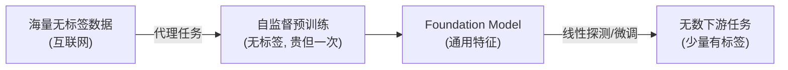

# 02 · 预训练范式：自监督与 Foundation Model

> 迁移学习有个隐含前提：源任务得有标签、有大数据。但现实是——**互联网上的文本/图片几乎都没有人工标签**。自监督预训练（self-supervised pretraining）的天才之处在于：**用数据自己构造监督信号，把"无标签"变成"有标签"**。这是 BERT、GPT、CLIP 能用全网数据预训练的根本原因，也是"Foundation Model（基础模型）"概念的基石。

---

## 1. 直觉层：数据自己当老师

### 一句话比喻

> **自监督 = 给学生出"填空题"，答案就在课本里，不用老师批改。**
>
> 把一句话挖掉一个词（"今天天气真___"），让模型猜挖掉的词——答案来自原文，**不需要任何人工标注**。模型为了填对空，被迫学会语法、语义、世界知识。这就是 BERT 的核心（MLM）。

### 为什么自监督是革命？

| 监督方式 | 数据需求 | 标注成本 | 可用数据量 |
|---------|---------|:---:|------|
| 全监督 | 有标签 | **高**（人工标注）| 少（ImageNet 120万张已是极限）|
| **自监督** | **无标签** | **≈0** | **无限**（整个互联网）|

> 自监督把可用的预训练数据从"百万级"（人工标注上限）扩到**万亿级**（互联网规模）。这是大模型能出现的**数据前提**。

## 2. 数学层：代理任务 + 特征迁移

### 2.1 代理任务（Pretext Task）

自监督设计一个**代理任务**——用数据自身构造的、无需人工标签的学习目标。模型为做好代理任务，被迫学到**对下游有用的通用特征**。

$$
\text{代理任务: }\;\min_\theta\;\mathcal L_{\text{pretext}}(x;\theta),\quad x\sim\text{无标签数据}
$$

### 2.2 三大代理任务流派

| 流派 | 思路 | 代表 | 学到的 |
|------|------|------|--------|
| **掩码预测** | 挖掉一部分，预测它 | BERT(MLM)、MAE | 上下文理解 |
| **对比学习** | 拉近相似样本，推开不同 | CLIP、SimCLR、MoCo | 区分性表示 |
| **自回归预测** | 预测下一个 | GPT(next-token) | 生成能力+理解 |

### 2.3 迁移：预训练特征 → 下游

预训练后，编码器 $\phi_\theta$ 已学好通用特征。下游只需少量有标签数据 + 线性探测/微调：

$$
\text{下游: }\;\min_w\;\mathcal L_{\text{task}}(g_w(\phi_\theta(x)),y),\quad \phi_\theta\text{ 冻住或轻调}
$$

## 3. 代码层：去噪自编码器（DAE）演示自监督

```bash
cd 讲透复用权重/experiments && python3 02_pretrain.py    # CPU 约 45 秒
```

本实验用**去噪自编码器（Denoising Autoencoder）**演示自监督思想：

- **预训练（无标签）**：给 circles 数据加噪声，让网络恢复原始——目标就是原始数据本身，**标签免费**。
- **线性探测（有标签，仅 20 点）**：冻住 DAE 编码器，只训线性头。

**真实输出**（可复现）：

```
① 自监督预训练 (去噪自编码器, 无标签)...
   预训练重构MSE=0.0174
② 线性探测 (冻编码器, 只训头, 仅20点有标签):
   随机编码器 (未预训练) : 准确率=0.944
   DAE编码器  (自监督)    : 准确率=0.994   <- 无标签预训练后特征更好
```

**怎么读**：DAE 只用了**无标签**数据（加噪恢复），却让编码器学到了"距原点距离"这类结构特征（区分内外圆的关键）。少样本线性探测，DAE（0.994）明显优于随机（0.944）。

> ⚠️ **诚实标注**：2D 玩具上差距被压缩（因为随机投影到 64 维后 circles 也接近线性可分）。在真实高维任务（图像/文本）上，自监督预训练 vs 随机的差距是**碾压性**的——这就是为什么没人从零训 BERT。

## 4. Foundation Model（基础模型）

自监督预训练催生了 **Foundation Model** 概念（Stanford HAI, 2021）：

> **一个在海量无标签数据上自监督预训练的大模型，能适配（微调/prompt）到几乎任何下游任务。**

| Foundation Model | 预训练方式 | 适配的下游 |
|------------------|-----------|-----------|
| **BERT** | 掩码语言模型 | 问答、情感、NER… |
| **GPT** | 自回归 next-token | 写作、翻译、代码… |
| **CLIP** | 图文对比学习 | 检索、文生图引导、零样本分类 |
| **ViT/MAE** | 掩码图像建模 | 检测、分割 |
| **SAM** | 掩码分割 | 任意图像分割 |

**共同模式**：一次昂贵的自监督预训练 → 廉价适配无数下游。**这就是 2026 年 AI 的标准范式。**

## 5. 为什么自监督有效？（理论直觉）

一个朴素的道理：**要让模型填对空（BERT）或预测对下一个词（GPT），它必须"理解"数据背后的规律**。

- 填对"猫有四条___"（腿），模型得懂"猫的解剖"。
- 把"一张猫的图"和"猫"的文本拉近（CLIP），模型得懂"猫长什么样 + '猫'这个词的含义"。

代理任务**逼迫**模型学习数据的内在结构——而这些结构，正是下游任务需要的通用特征。**自监督的本质是"用数据本身的规律当免费的监督信号"。**

## 6. 批判：自监督的代价与挑战

1. **算力极贵**：预训练 GPT-4 级模型需上万 GPU、上亿美元。**只有巨头玩得起**，加剧 AI 中心化。
2. **代理任务选择是艺术**：选错代理任务，学到的特征对下游无用。BERT 的 MLM、CLIP 的对比都是精心设计的。
3. **规模律的迷信**：不是越大越好——数据质量、任务匹配同样关键（Chinchilla 定律修正了"只堆参数"的误区）。
4. **偏见继承**：互联网数据的偏见（性别/种族/错误信息）会进预训练权重，带到所有下游。



---

📌 **下一步**：自监督解决了"源任务怎么训"。下一章 [03-权重共享](03-权重共享.md) 换个角度——不借别的模型，而是**让一个模型内部的权重多处复用**，用更少参数做更深网络（ALBERT、CNN、Siamese）。

✍️ **练习**
1. **概念**：为什么自监督能用"无标签"数据训练？（提示：标签从数据自身构造。）
2. **动手**：把 `02_pretrain.py` 的预训练加噪声从 0.15 改成 0.5（噪声更大），重跑——DAE 还能学好特征吗？太大噪声会怎样？
3. **洞察**：BERT 的 MLM（填空）和本实验的 DAE（去噪）都是"恢复被破坏的数据"。它们本质上是不是一回事？
4. **进阶**：CLIP 用"图文配对"做对比学习。如果训练数据里的图文配对有错（脏数据），会学到什么坏特征？
