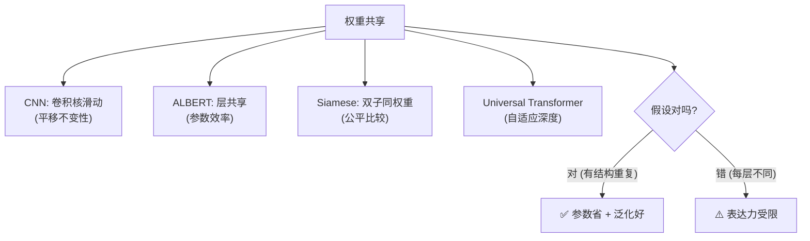

# 03 · 权重共享：同一组权重，多处复用

> 权重共享（Weight Sharing）是"复用权重"的另一种含义：**不是借用别的模型，而是让一个模型内部的同一组参数被多处复用**。它的核心收益是**参数效率**——用更少的参数实现相同的（甚至更深的）网络。CNN 的卷积核、ALBERT 的层共享、Siamese 网络的双子结构，都是这个思想。本章用实验证明：6 层网络用"1 层权重复用 6 次"，参数省 82%，效果不降。

---

## 1. 直觉层：同一套工具，干多种活

### 一句话比喻

> **权重共享 = 一个工人用同一把锤子，在不同的钉子上敲。** 不需要为每颗钉子配一把专属锤子——一把锤子复用无数次即可。

### 为什么能共享？

因为很多任务有**结构性重复**：
- 图像里，"识别猫耳"的特征在左上角和右下角**都适用** → 卷积核在整图滑动复用。
- 语言里，第 2 层和第 5 层的"语法处理"可能**相似** → 共享 Transformer 层。
- 孪生任务里，比较两个东西"像不像"，**两边用同一套特征提取**才公平 → Siamese。

## 2. 数学层：参数复用 = 更少参数，相同深度

### 2.1 独立 vs 共享

设一层权重矩阵 $W\in\mathbb R^{d\times d}$（参数 $d^2$）。

- **独立 $L$ 层**：$L$ 个不同的 $W_1,\ldots,W_L$，参数 $L\cdot d^2$。
- **共享 $L$ 层**：1 个 $W$，重复 apply $L$ 次，参数 $d^2$。

$$
\text{参数比} = \frac{d^2}{L\cdot d^2} = \frac{1}{L}
$$

> 📐 共享 $L$ 层 = 参数变 $\frac{1}{L}$。本实验 $L=6$，所以参数约 1/6（实验测得 18%，因为还有输入/输出层不共享）。

### 2.2 共享层的前向：同一个 $W$ 用多次

$$
h_0 = \phi_\text{in}(x),\quad h_l = \sigma(W\,h_{l-1}+b)\ \text{for }l=1\ldots L,\quad y = \phi_\text{out}(h_L)
$$

注意 $W$ 在所有 $l$ 中**是同一个**。

## 3. 代码层：6 层独立 vs 6 层共享

```bash
cd 讲透复用权重/experiments && python3 03_weight_sharing.py    # CPU 约 30 秒
```

**真实输出**（可复现）：

```
  独立MLP : 参数=25282  准确率=0.998
  共享MLP : 参数= 4482  准确率=1.000   <- 用 18% 的参数达到相近效果
  参数节省: 25282 → 4482 (82% 更少)
```

**怎么读**：共享 MLP 把 6 层压缩成 1 层复用 6 次，参数从 25282 降到 4482（省 82%），准确率不降反升（1.000）。**这就是权重共享的参数效率。**

## 4. 权重共享的四大经典形态

| 形态 | 共享什么 | 为什么有效 | 代表 |
|------|---------|-----------|------|
| **CNN 卷积核** | 同一个卷积核在整图滑动 | 平移不变性（猫在哪都长这样）| ResNet、ViT 前 |
| **ALBERT 层共享** | Transformer 所有层用同一组权重 | 参数大减，效果接近 | ALBERT |
| **Siamese 网络** | 两个分支用同一套权重 | 公平比较（同一标准看两边）| 人脸验证、对比学习 |
| **Universal Transformer** | 一个 block 循环复用 | 自适应深度 | UT |

### 4.1 CNN：最成功的权重共享

卷积核 $K\in\mathbb R^{k\times k}$ 在整张图上**滑动**——同一个 $K$ 被复用于图像的每个位置。这编码了"**平移不变性**"：猫在左上角和右下角，用同一组特征检测。参数从全连接的 $H\times W\times C$ 暴降到 $k^2\times C$。

> CNN 的成功，**一半归功于权重共享**（另一半是局部连接）。这是深度学习早期最关键的归纳偏置。

### 4.2 ALBERT：用共享省参数，堆更多数据

标准 BERT 有 12 层独立 Transformer，参数 110M。ALBERT 让 12 层**共享同一组权重**，参数骤降到 ~12M（1/10），却靠省下的参数堆更深更宽，效果反超。**这就是"权重共享换参数效率"的典范。**

## 5. 为什么权重共享有效？（归纳偏置视角）

权重共享本质是注入了一种**归纳偏置**（inductive bias）：假设"任务在共享维度上有重复结构"。

- 这个假设**对**时（图像有平移不变性、语言层处理相似），共享**大赚**——参数少、泛化好（少参数 = 难过拟合）。
- 这个假设**错**时（任务每层都需要不同的处理），共享**吃亏**——表达力受限。

> 权重共享是用"先验结构"换"参数效率"。**用对地方是免费午餐，用错地方是作茧自缚。**

## 6. 权重共享 vs 其他"复用"

| | 迁移学习 | 自监督预训练 | **权重共享** |
|---|---|---|---|
| 复用什么 | **别的模型**的权重 | **自己**在无标签数据上的预训练 | **自己内部**的同一组权重 |
| 复用方向 | 跨模型 | 跨数据阶段 | 跨位置/跨层 |
| 收益 | 少数据适配 | 无标签白嫖 | 参数效率 |

## 7. 批判：共享的边界

1. **表达力受限**：共享层 = 所有"层"做同样的变换，无法处理"每层需要不同处理"的任务。
2. **训练更难收敛**：共享权重要同时满足多个位置/层的需求，梯度更复杂，有时更难训。
3. **大模型时代的取舍**：现代 LLM（GPT-4、Llama）**不再共享层**——因为算力够、数据够，宁可参数多也要表达力。ALBERT 是"参数贵"时代的优化；现在参数便宜了，共享的价值下降。



---

📌 **下一步**：前面三章讲"复用别人的/自己的权重"。下一章 [04-参数高效微调PEFT](04-参数高效微调PEFT.md) 是 2023 年最火的复用技术——**LoRA**：冻住整个大模型，只插 1% 的可训参数，就能微调出一个专用模型。这是让普通人也能"微调大模型"的关键。

✍️ **练习**
1. **概念**：CNN 的卷积核在整图滑动共享。这编码了什么先验？（提示：平移不变性。）
2. **动手**：把 `03_weight_sharing.py` 的共享深度从 6 改成 12，重跑——共享版参数会变吗？准确率呢？（提示：共享版参数与深度无关，独立版翻倍。）
3. **洞察**：ALBERT 共享层后参数大减，为什么效果没大跌？（提示：省下的参数堆到更宽/更多数据。）
4. **进阶**：为什么 GPT-4 不共享 Transformer 层，而 ALBERT 共享？（提示：算力/数据足够时，宁可要表达力。）
