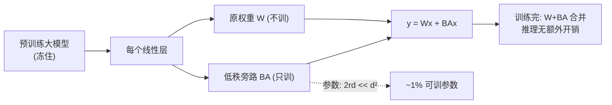

# 04 · 参数高效微调 PEFT：LoRA 与它的同伴

> **LoRA（Low-Rank Adaptation）是 2023 年最火的微调技术，也是普通人能"微调大模型"的关键。** 它的核心思想天才而简洁：**冻住整个大模型不动，只在每个线性层旁插一个"低秩补丁"** $\Delta W=BA$，只训这个极小的补丁。结果：用 1% 左右的可训参数，达到接近全量微调的效果。这是开源社区微调 LLaMA/Stable Diffusion 的事实标准。

---

## 1. 直觉层：冻大模型，贴小补丁

### 一句话比喻

> **LoRA = 给一本厚重的专家手册（大模型）不重写正文，只在每页边上贴小便利贴（低秩补丁）做个性化批注。** 用的时候"正文+便利贴"一起读。换任务只换便利贴，正文不动——省空间、易切换。

### 为什么需要 LoRA？

全量微调一个大模型（如 LLaMA-70B）：
- 要存所有参数的**梯度和优化器状态**（Adam 是 2 倍参数）→ 显存爆炸。
- 每个下游任务存一份完整微调模型 → 存储爆炸。

LoRA 把可训参数压到 **~1%**，显存和存储都骤降。**这是让 16GB 显存的消费级显卡能微调 70B 模型的魔法。**

## 2. 数学层：低秩分解

### 2.1 全量微调 vs LoRA

全量微调更新权重 $W\to W'=W+\Delta W$，其中 $\Delta W\in\mathbb R^{d\times d}$ 是满秩更新，参数 $d^2$。

LoRA 的关键假设：**$\Delta W$ 是低秩的**，可以分解成两个小矩阵：

$$
\boxed{\;\Delta W = B\,A,\quad B\in\mathbb R^{d\times r},\ A\in\mathbb R^{r\times d},\ r\ll d\;}
$$

参数量从 $d^2$ 降到 $2rd$。当 $r=2,d=64$：满秩 $4096$ → LoRA $256$（6%）。

### 2.2 前向：原权重 + 低秩旁路

$$
y = Wx + \Delta W\,x = Wx + BAx
$$

原 $W$ **冻住**（不训），只训 $A,B$。

### 2.3 天才的初始化：从原模型起步

- $A$ 初始化为小随机（$\mathcal N(0,\sigma^2)$）。
- $B$ 初始化为**零**。

于是初始 $BA=0$，$\Delta W=0$，**模型初始行为和原模型完全一致**。训练从"原模型起点"出发，逐步学补丁。这个初始化保证了 LoRA 不会一开始就破坏好模型。

### 2.4 推理：可无损合并

训练完后，$W_\text{new}=W+BA$ 可以合并成一个权重，**推理时无额外开销**（和原模型一样快）。这是 LoRA 相对 Adapter（要加额外层）的工程优势。

## 3. 代码层：全量微调 vs LoRA

```bash
cd 讲透复用权重/experiments && python3 04_lora.py    # CPU 约 60 秒
```

**真实输出**（circles，目标 30 点，可复现）：

```
  全量微调 : 可训参数=4482 (100%)   准确率=1.000
  LoRA r=2 : 可训参数= 520 (11.6%)  准确率=1.000   <- 极少参数, 接近全量
```

**怎么读**：LoRA 用 11.6% 的可训参数（520 vs 4482），达到和全量微调一样的 100%。**这是 LoRA 参数效率的直接证据。**

> ⚠️ 2D 玩具上 r=2 就够。真实大模型里，r 通常取 8–64，可训参数约 0.1%–2%，仍接近全量微调效果。

## 4. PEFT 全家桶

LoRA 只是 PEFT（Parameter-Efficient Fine-Tuning）的一种。其他同伴：

| 方法 | 怎么做 | 可训参数 | 特点 |
|------|--------|:---:|------|
| **LoRA** | 线性层插低秩旁路 | ~1% | 推理可合并，**最流行** |
| **Adapter** | 层间插小 MLP 模块 | ~1% | 推理多一层，略慢 |
| **Prefix-tuning** | 在注意力 key/value 前加可训前缀 | <1% | 不动模型参数 |
| **Prompt-tuning** | 只学连续 prompt 向量 | <0.1% | 最省，但效果上限低 |
| **BitFit** | 只训 bias | ~0.1% | 极简 |

> LoRA 胜出的原因：**推理可无损合并（不增延迟）+ 效果稳定 + 工程简单。**

## 5. 为什么 LoRA 火爆？（2023 现象级）

1. **省显存**：可训参数 1% → 优化器状态省 99%。70B 模型能在单卡 4090 上微调。
2. **易切换**：一个基座模型 + 多个 LoRA 补丁（每个任务一个），切换只换小补丁（几十 MB），不用换整个模型（几十 GB）。
3. **开源友好**：社区共享 LoRA 权重（ Civitai 上成千上万的 Stable Diffusion LoRA），下载即用。
4. **效果不输全量**：大量实验证明，LoRA 在多数任务上接近全量微调。

## 6. 为什么"低秩"假设成立？（理论直觉）

LoRA 的底气：**微调时的权重更新 $\Delta W$ 本质是低秩的。**

直觉：预训练模型已经学好"通用能力"，微调只是在某个低维子空间里做"任务特化"调整——不需要满秩的自由度。Aghajanyan (2020) 实证发现微调的 $\Delta W$ 内在维度很低。**LoRA 正是利用了这个低维性。**

## 7. 批判：LoRA 的边界

1. **表达力上限**：r 太小 → 补丁秩不够 → 学不了大幅度的任务变化。大变化要用大 r 或全量。
2. **r 的选择是经验**：r=8 通用，但复杂任务要 r=64+。没理论指南，靠试。
3. **不是万能**：某些任务（如持续学习大跨度）全量微调明显更好。
4. **QLoRA 等组合**：LoRA + 4bit 量化（QLoRA）进一步省显存，是 2023 微调大模型的标配组合。



---

📌 **下一步**：LoRA 是"冻大模型插小补丁"。下一章 [05-知识蒸馏](05-知识蒸馏.md) 反过来——**把大模型的能力压进小模型的权重**，让小模型也能用。这是部署大模型到端侧的关键技术。

✍️ **练习**
1. **概念**：为什么 LoRA 初始化 $B=0$？如果 $B$ 也随机初始化会怎样？（提示：初始就改变模型行为，破坏预训练知识。）
2. **动手**：把 `04_lora.py` 的秩 $r$ 从 2 改成 1，重跑——LoRA 还能到 100% 吗？再改成 8 呢？观察"秩 vs 效果"。
3. **洞察**：LoRA 推理时可合并 $W+BA$ 成单权重，零额外开销。Adapter 不能这么合并——为什么？（提示：Adapter 加了非线性激活，不可合并。）
4. **进阶**：QLoRA = 4bit 量化基座 + LoRA。它为什么能让"微调 70B 模型"在单卡实现？（提示：基座 4bit 存 → 显存大降；只 LoRA 反传 → 梯度省。）
