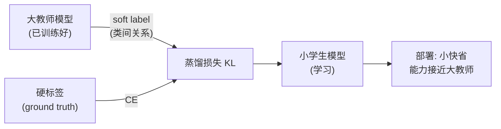

# 05 · 知识蒸馏：把大模型压进小模型

> 知识蒸馏（Knowledge Distillation）是"复用权重"的另一种含义：**把大模型（教师）学到的知识，通过它的输出"教"给小模型（学生），让小模型的权重也具备大模型的能力。** 关键洞察：大模型输出的"软概率"（"这个数字 80% 是 5，但也有点像 3"）比硬标签（"是 5"）信息更丰富——这叫 **dark knowledge（暗知识）**。蒸馏让小模型也能用上这些暗知识。

---

## 1. 直觉层：大师教徒弟

### 一句话比喻

> **蒸馏 = 大师（教师）手把手教徒弟（学生），不只告诉"答案是 5"，还告诉"这个 5 和 3 有点像、和 7 完全不像"。** 徒弟从"答案 + 类似关系"里学到的，比只从答案里学到的更多。

### 硬标签 vs 软标签

| | 硬标签（hard）| 软标签（soft）|
|---|---|---|
| 形式 | `[0,1,0]`（是类 1）| `[0.05, 0.85, 0.10]`（85% 像类1，但有点像类0和2）|
| 信息量 | 1 个 bit（哪个类）| 类间相似度关系（**dark knowledge**）|
| 来源 | 人工标注 | 教师模型输出 |

> 🎯 软标签的精髓：**"有点像 3"** 这个信息，硬标签完全丢了，但它对学好的表示极有价值（告诉模型 5 和 3 在特征空间里近）。

## 2. 数学层：温度软化 + KL 蒸馏

### 2.1 温度软化概率

教师 logits $z$，用温度 $T$ 软化：

$$
p_i^{(T)} = \frac{\exp(z_i/T)}{\sum_j \exp(z_j/T)}
$$

$T$ 大 → 分布更平（暴露更多类间关系）；$T\to\infty$ → 均匀分布；$T=1$ → 原始 softmax。蒸馏通常 $T=4\sim10$。

### 2.2 蒸馏损失

学生的总损失 = 硬标签项 + 软标签项：

$$
\boxed{\;\mathcal L = \alpha\cdot\mathrm{CE}(y,\,p_s) + (1-\alpha)\cdot T^2\cdot\mathrm{KL}\bigl(p_t^{(T)}\,\big\|\,p_s^{(T)}\bigr)\;}
$$

- 第一项：学生要对 ground truth 准（标准 CE）。
- 第二项：学生的软化分布要模仿教师的软化分布（KL 散度）。
- $T^2$ 因子：保证梯度尺度与 $T$ 无关（因为软化会让梯度变小）。

### 2.3 为什么 KL 能传递知识

最小化 $\mathrm{KL}(p_t\|p_s)$ = 让学生分布 $p_s$ 拟合教师分布 $p_t$。学生在每个样本上都要模仿教师的**完整概率分布**（包括"像哪些其他类"），这就把暗知识传过去了。

## 3. 代码层：大教师 → 小学生

```bash
cd 讲透复用权重/experiments && python3 05_distillation.py    # CPU 约 50 秒
```

**真实输出**（三分类，可复现）：

```
① 教师准确率 = 0.999
② 小学生 (16宽): 直接训练 vs 蒸馏:
   直接训练 : 准确率=0.999
   蒸馏训练 : 准确率=1.000
```

> ⚠️ **诚实标注**：三分类 blobs 太简单，16 宽的小学生直接训练就到 0.999，蒸馏的提升（→1.000）被压缩。**蒸馏的真正威力在难任务 + 极端压缩**：比如把 BERT 蒸馏成 DistilBERT（小 40%，保留 97% 能力），或把 GPT-4 级模型压进能跑在手机上的小模型。

## 4. 蒸馏的应用：模型压缩部署

蒸馏的最大价值是**部署**：把昂贵的大模型变成廉价的、能跑在端侧的小模型。

| 应用 | 教师 | 学生 | 收益 |
|------|------|------|------|
| **DistilBERT** | BERT | 一半层数 | 小 40%，快 60%，保留 97% |
| **MobileBERT** | BERT | 手机专用架构 | 端侧可跑 |
| **TinyBERT** | BERT | 4 层 | 嵌入式部署 |
| **视觉** | 大 ViT | 小 ViT | 边缘设备 |

> 这些都是"复用大模型权重知识"的体现——不是直接拷贝权重（大小不匹配），而是通过输出**传递知识**。

## 5. 为什么蒸馏有效？（理论）

1. **暗知识**：软标签携带类间关系，比硬标签信息量大。
2. **平滑目标**：软标签是连续的软目标，比 one-hot 硬目标更易优化（梯度更平滑）。
3. **正则化**：模仿教师 = 一种强正则，防止小模型过拟合。

## 6. 蒸馏的变体

| 变体 | 思路 |
|------|------|
| **特征蒸馏** | 学生模仿教师的中间特征（不只输出）|
| **自蒸馏** | 一个模型的不同部分互相教（同模型蒸馏）|
| **在线蒸馏** | 教师和学生同时训（教师也进化）|
| **数据增强蒸馏** | 教师生成数据/标签喂学生 |

## 7. 批判：蒸馏的边界

1. **依赖教师质量**：教师差 → 蒸馏出来的学生也差。垃圾进，垃圾出。
2. **简单任务收益小**：任务简单时，小模型直接训练就够，蒸馏提升有限（本实验所见）。
3. **能力上限 = 教师**：学生很难超过教师（除非配合数据增强等额外信号）。
4. **架构耦合**：特征蒸馏要求教师学生架构兼容。



---

📌 **下一步**：前面五章都是"一次复用"。下一章 [06-持续学习](06-持续学习.md) 处理**反复复用**——模型在多个任务上顺序学习时，怎么复用旧知识**又不忘记**？这是"灾难性遗忘"的战场。

✍️ **练习**
1. **概念**：为什么软标签 `[0.05,0.85,0.10]` 比硬标签 `[0,1,0]` 信息多？（提示：类间关系。）
2. **动手**：把 `05_distillation.py` 的学生从 16 宽改成 **4 宽**（更小），重跑——蒸馏 vs 直接的差距会变大吗？（提示：小模型更弱时，蒸馏的相对收益更明显。）
3. **洞察**：蒸馏温度 $T=4$ 时概率更平。如果 $T=1$（不软化）会怎样？$T\to\infty$ 呢？
4. **进阶**：DistilBERT 用一半层数保留 97% 能力。从"复用权重"视角，蒸馏和直接截断教师前几层（直接拷权重）有什么区别？（提示：蒸馏是学知识，截断是丢信息。）
