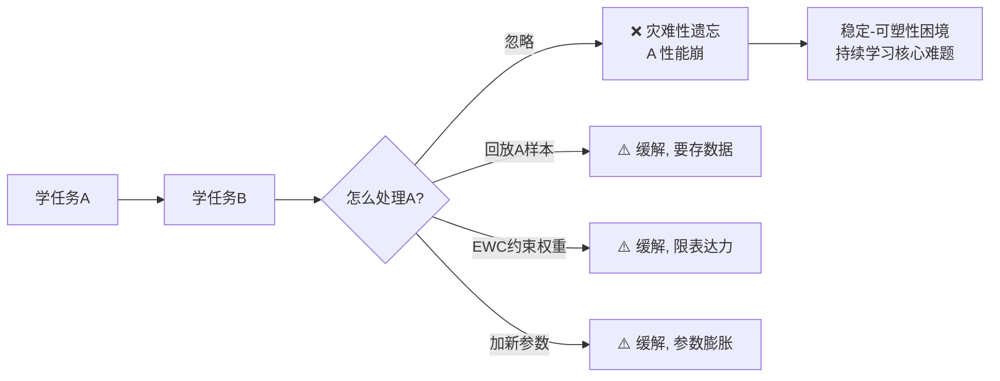

# 06 · 持续学习：学新不忘旧

> 持续学习（Continual Learning / Lifelong Learning）处理"**反复复用**"的难题：模型顺序学多个任务，怎么复用旧知识**又不忘记**？人能——你学了开车后学做饭，不会忘了怎么开车。但神经网络会：学了新任务，旧任务能力**灾难性崩溃**——这叫**灾难性遗忘**（cataastrophic forgetting）。本章用实验展示遗忘，并讲清缓解之道。

---

## 1. 直觉层：人会，神经网络不会

### 一句话比喻

> **纯顺序训练的神经网络像"黑板写满就擦"——学新任务把旧任务的笔记全擦了。** 持续学习的目标，是给它一块"擦不掉旧笔记、又能写新笔记"的魔法黑板。

### 灾难性遗忘的根源

神经网络用 SGD 学新任务时，会**修改那些对旧任务重要的权重**——旧知识被新梯度的更新"覆盖"。越深的网络、越相似的任务，遗忘越严重。

## 2. 数学层：为什么 SGD 会遗忘

设任务 A 的损失面 $\mathcal L_A(\theta)$，任务 B 的 $\mathcal L_B(\theta)$。学 A 后到 $\theta_A^*$（A 的最低点）。学 B 时，SGD 沿 $\nabla\mathcal L_B$ 更新，**离开 $\theta_A^*$**——而 $\theta_A^*$ 附近 $\mathcal L_A$ 才低，离开后 A 的 loss 上升 → A 性能下降。

$$
\theta_{t+1} = \theta_t - \eta\nabla_\theta\mathcal L_B(\theta_t)\quad\Rightarrow\quad\theta\text{ 远离 }\theta_A^*\quad\Rightarrow\quad\mathcal L_A(\theta)\uparrow
$$

> 根本矛盾：**一组权重要同时服务多个任务**，但 SGD 一次只优化一个任务，会牺牲其他。

## 3. 代码层：遗忘 vs 回放

```bash
cd 讲透复用权重/experiments && python3 06_continual.py    # CPU 约 40 秒
```

**真实输出**（任务A=circles，任务B=moons，顺序 A→B，可复现）：

```
阶段1: 学任务A      → A准确率=1.000
阶段2a: 纯顺序学B   → A准确率=0.715 (遗忘!)   B准确率=0.995
阶段2b: 回放学B     → A准确率=0.855 (保持!)   B准确率=0.905
```

**怎么读**：
- 纯顺序：学完 B，A 从 1.0 崩到 0.715——**忘了近 30%**。
- 经验回放：学 B 时每步混入少量 A 样本，A 保持 0.855——**遗忘被显著缓解**（代价是 B 略低，0.905）。

## 4. 三大缓解策略

| 策略 | 思路 | 代表 | 代价 |
|------|------|------|------|
| **回放（Replay）** | 训新任务时混入旧任务样本 | ER、A-GEM | 要存旧数据（隐私/存储）|
| **正则化** | 限制重要权重变化 | **EWC**、SI、LwF | 表达力受限 |
| **动态架构** | 给新任务分配新参数/神经元 | PNN、Progressive | 参数增长 |

### 4.1 EWC（Elastic Weight Consolidation）——最经典

EWC 给每个权重加一个"重要性"惩罚：对任务 A 越重要的权重，学 B 时越不能动。

$$
\mathcal L_\text{total} = \mathcal L_B(\theta) + \sum_i \frac{\lambda}{2} F_i (\theta_i - \theta_{A,i}^*)^2
$$

$F_i$ 是权重 $i$ 对任务 A 的"重要性"（Fisher 信息）。重要权重偏离 $\theta_A^*$ 会被重罚 → 保护旧知识。

### 4.2 经验回放——最简单有效

训新任务时，每步混入一小批旧任务的样本（或旧样本的生成版本）。本实验用的就是这种。简单粗暴但有效。

## 5. 稳定-可塑性困境（Stability-Plasticity Dilemma）

持续学习的核心张力：

- **可塑性**（plasticity）：要能学新任务 → 权重要能大改。
- **稳定性**（stability）：要不忘旧任务 → 权重要不能改。

两者天然矛盾。所有持续学习方法都在**这个谱系上找平衡**：
- 回放：偏可塑性（旧样本提醒，但仍主要学新）。
- EWC：偏稳定性（硬保护重要权重，可能学不动新任务）。

## 6. 批判：持续学习仍未解决

1. **没有完美方案**：所有方法都有 trade-off，长任务序列上仍会慢慢遗忘。
2. **任务边界假设**：多数方法假设"知道当前在哪个任务"，但真实世界任务边界模糊。
3. **规模问题**：在 LLM 级别的持续学习（如让 GPT 持续学新知识不遗忘旧能力）仍是开放难题——RLHF、持续预训练都在和遗忘斗争。



---

📌 **下一步**：六种"复用权重"形态全部讲完。最后一章 [07-选型与批判](07-选型与批判.md) 给一张决策树——**你的场景该用哪种复用、什么时候干脆从零**——并诚实交代这个领域的未解问题。

✍️ **练习**
1. **概念**：为什么 SGD 学新任务会忘旧任务？（提示：权重被新梯度覆盖。）
2. **动手**：把 `06_continual.py` 的回放样本数从 32 改成 128（回放更多 A 样本），重跑——A 会保持更好吗？B 呢？（提示：回放多→A好但B差，trade-off。）
3. **洞察**：EWC 用 Fisher 信息衡量"权重重要性"。直觉上，什么权重大概率"对旧任务重要"？（提示：旧任务 loss 对它很敏感的。）
4. **进阶**：让 GPT 持续学新知识（如 2026 的新事件）又不忘旧能力，是当前 LLM 的难题。结合本章，为什么这特别难？（提示：规模大 + 任务边界模糊 + 遗忘累积。）
