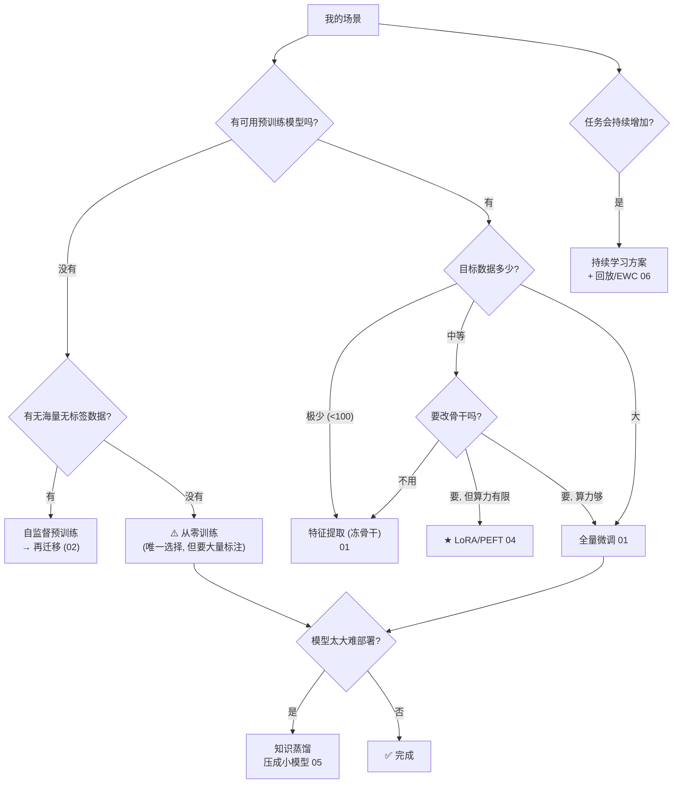
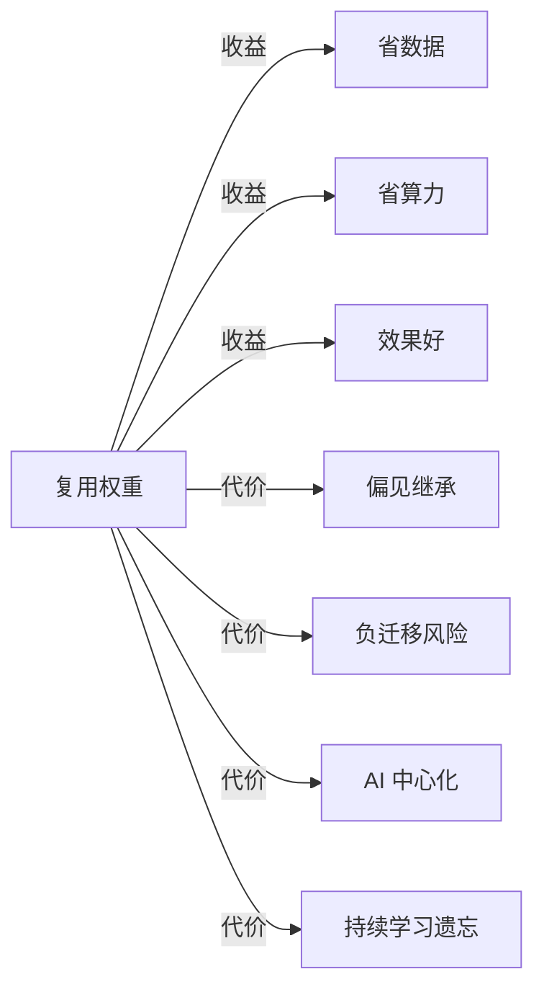

# 07 · 选型与批判：何时复用，何时从零

> 全教程收尾。六种"复用权重"形态讲完了，回到工程灵魂问题：**我的场景，该用哪种复用？什么时候干脆从零训练？** 本章给一张决策树，并诚实交代这个领域的未解问题与伦理隐忧。

---

## 1. 六种复用形态速查

| 形态 | 核心思想 | 何时用 | 章节 |
|------|---------|--------|:---:|
| **迁移学习** | 源任务权重 → 目标任务 | 有相关预训练模型 + 少量目标数据 | 01 |
| **特征提取** | 冻骨干只训头 | 目标数据极少、源目标很相似 | 01 |
| **自监督预训练** | 无标签数据白嫖特征 | 有海量无标签数据 | 02 |
| **权重共享** | 同组权重多处复用 | 任务有结构重复（平移/层相似）| 03 |
| **LoRA/PEFT** | 冻大模型插小补丁 | 微调大模型、算力/显存受限 | 04 ★ |
| **知识蒸馏** | 大模型→小模型 | 部署大模型到端侧 | 05 |
| **持续学习** | 顺序多任务不遗忘 | 模型要持续进化 | 06 |

## 2. 选型决策树

## 3. 核心决策原则

### 3.1 几乎永远先尝试复用

> **2026 年的默认选项是"复用"，不是"从零"。** 只有在以下情况才从零：
> - 任务极度特殊（无相关预训练模型，如某些科学/工业领域）。
> - 数据足够多、算力足够强，且追求极致效果。
> - 研究目的（要验证不依赖预训练的基线）。

### 3.2 数据量决定复用方式

| 目标数据量 | 推荐方式 |
|-----------|---------|
| 极少（<100）| 特征提取（冻骨干只训头）|
| 少（百~千）| LoRA 微调 |
| 中（千~万）| 全量微调 |
| 多（万+）| 可考虑从零 + 预训练 |

### 3.3 算力决定微调粒度

| 算力 | 方式 |
|------|------|
| 极限（单卡 16GB）| QLoRA（4bit基座+LoRA）|
| 普通（单卡 40-80GB）| LoRA / Adapter |
| 充足（多卡）| 全量微调 |

## 4. 全教程实验汇总（实证）

| 实验 | 关键数字 | 含义 |
|------|---------|------|
| 00 从零 vs 复用 | 0.850 vs **1.000** | 复用碾压从零 15 个百分点 |
| 01 三迁移模式 | 特征提取仅 **130 参数** = 1.000 | 预训练特征直接可用 |
| 02 自监督 DAE | 0.994 vs 随机 0.944 | 无标签白嫖特征 |
| 03 权重共享 | 4482 参数 = 独立 25282 的效果 | 省 82% 参数 |
| 04 LoRA | **11.6% 参数** = 全量效果 | PEFT 的参数效率 |
| 05 蒸馏 | 蒸馏 ≈ 直接（简单任务）| 难任务才显威（DistilBERT）|
| 06 持续学习 | 纯顺序 0.715 vs 回放 0.855 | 回放缓解遗忘 |

## 5. 批判与未解

### 5.1 偏见继承（伦理隐忧）

预训练数据里的偏见（性别、种族、地域）会被权重**继承**到所有下游任务。复用得越深，偏见传播越广。**复用不是中性的——它放大了预训练数据的社会偏见。**

### 5.2 AI 中心化

预训练极贵（GPT-4 级上亿美元），只有巨头玩得起。复用让小团队/个人能"用"大模型，但"造"大模型的能力高度集中。**复用加剧了"使用者众、创造者寡"的格局。**

### 5.3 负迁移不可忽视

复用不是稳赚。源目标不兼容时（见 01 章），复用反而帮倒忙。**盲目复用比从零更糟。**

### 5.4 持续学习仍未解决

让模型无限学习不遗忘，理论上仍是开放难题。LLM 的"持续更新知识不退能力"是 2026 的活跃研究方向。

### 5.5 "复用"的文化反思

> 当所有人都站在少数几个 Foundation Model 的肩膀上，**AI 的多样性会不会坍缩？** 所有人都用 GPT 微调，会不会所有 AI 应用都带上 GPT 的"性格"和盲点？这是复用范式带来的、尚未被充分讨论的系统性风险。

## 6. 一句话总结

> **复用权重让深度学习从"每个任务重新发明轮子"变成"站在巨人肩膀上"。这是 2026 年 AI 的组织原则，也是它效率和能力的来源。但它也带来偏见继承、中心化、负迁移、遗忘等真实代价。聪明的工程师，既要知道何时复用，也要知道复用的边界。**

---

📌 **下一步**：教程结束。回到 [README](README.md) 重看那张"范式转移"图。建议做 [exercises.md](exercises.md) 综合练习。你已经理解了现代 AI 的组织原则——预训练 + 复用——这是看懂 GPT、Stable Diffusion、LLaMA 微调生态的钥匙。

✍️ **练习**
1. **应用**：你要用 500 张医学 X 光片做肿瘤分类。按决策树，该怎么走？（提示：找医学影像预训练模型 → 数据少 → 特征提取或 LoRA。）
2. **应用**：你要把一个 70B 大模型部署到手机上。该用什么？（提示：蒸馏 + 量化。）
3. **批判**：所有 AI 应用都微调同一个 Foundation Model，有什么系统性风险？（提示：单点故障、偏见放大、多样性坍缩。）
4. **思考**：如果未来预训练成本降到人人可负担，"复用权重"的范式会被颠覆吗？（提示：可能，但"复用"作为一种工程智慧不会消失。）
