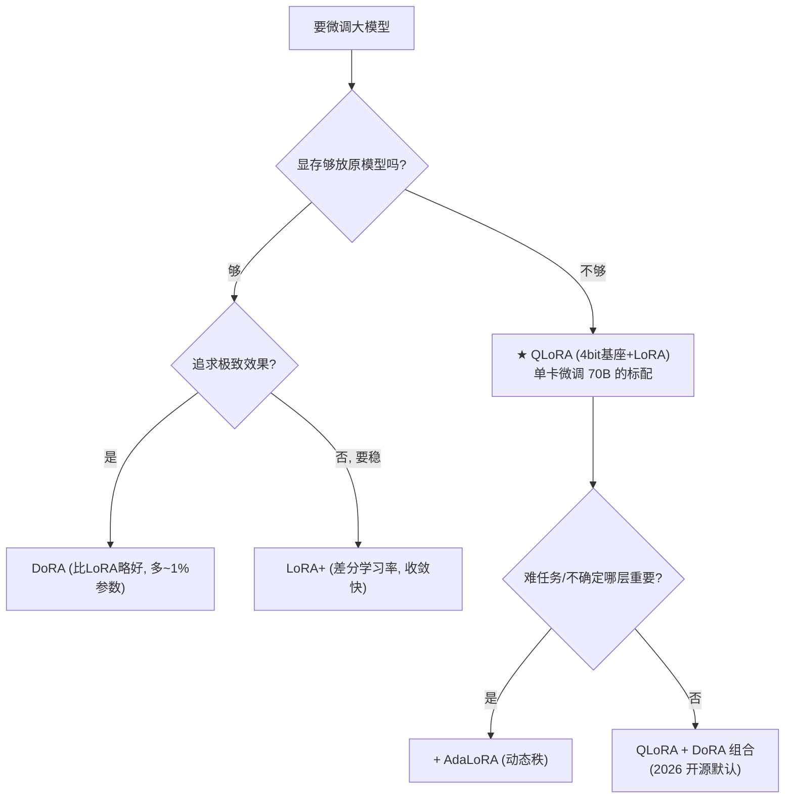

# 08 · LoRA 深水区：QLoRA / DoRA / AdaLoRA / LoRA+

> 原版 LoRA（第 04 章）只是起点。2023–2026 涌现了一批改进变体，每一个都在补原版 LoRA 的某个短板。**不懂这些变体，你在 2026 年微调 LLM 就落伍了**——开源社区（HuggingFace、LLaMA-Factory、axolotl）的默认配置早就是 QLoRA + DoRA + 差分学习率。本章把这四大变体的原理、区别、选型一次讲清。

---

## 1. 先回顾：原版 LoRA 的两个短板

原版 LoRA（$\Delta W=BA$，$B\in d\times r,A\in r\times d$）有两个公认弱点：

1. **表达力受限于"纯低秩"**：$\Delta W$ 被强制成秩 $r$，学不了"幅度（magnitude）"的变化，只能学方向。这让 LoRA 在大幅任务变化上吃亏。
2. **A/B 同等对待**：但 $B$（乘到结果上）和 $A$（先乘输入）的梯度尺度差很多，统一学习率导致收敛慢、不稳。

四大变体分别针对不同短板：

| 变体 | 解决什么 | 手法 | 章节 |
|------|---------|------|:---:|
| **DoRA** | 短板1（表达力）| 分解 magnitude + direction | §2 |
| **AdaLoRA** | 秩 $r$ 怎么选 | 动态分配秩 | §3 |
| **QLoRA** | 显存太贵 | 基座 4bit 量化 | §4 |
| **LoRA+** | 短板2（收敛慢）| A/B 差分学习率 | §5 |

## 2. DoRA：分解大小与方向（Weight-Decomposed LoRA）

### 直觉

原版 LoRA 的 $\Delta W=BA$ 同时改"方向"和"幅度"。**DoRA 的洞察：把权重分成 magnitude（多大）和 direction（朝哪）两部分，分开学**——LoRA 只负责调方向，magnitude 单独用一个向量学。这样更灵活。

### 数学

把权重矩阵按输出维度分解：

$$
W = m \odot \frac{V}{\|V\|},\quad m\in\mathbb R^d\text{（per-output magnitude）},\ V\in\mathbb R^{d\times d}\text{（方向）}
$$

DoRA 冻 $W$，用 LoRA 学方向的增量 $\Delta V=BA$，再单独学 $m$：

$$
y = m \odot \frac{(W+\Delta V)x}{\|(W+\Delta V)\|}
$$

> 参数比 LoRA 多一个 magnitude 向量（$d$ 个），换来"幅度可独立调"的灵活性。

### 代码层（实验 08）

```bash
cd 讲透复用权重/experiments && python3 08_lora_variants.py
```

```
  全量微调 : 参数=4482 (100%)  准确率=1.000
  LoRA r=2 : 参数= 520 (11.6%) 准确率=1.000
  DoRA r=2 : 参数= 650 (14.5%) 准确率=1.000   <- 多了magnitude, 更灵活
```

> ⚠️ 2D 简单任务上 LoRA/DoRA 都到 1.000（看不出差异）。**DoRA 的优势在难任务 + 大模型**：论文显示在 LLaMA 微调上，同秩时 DoRA 全面优于 LoRA，甚至能逼近全量微调。代价仅是多 ~1% 参数。

## 3. AdaLoRA：动态分配秩

### 短板：秩 $r$ 怎么选？

原版 LoRA 每层用固定 $r$。但**不同层对任务的重要性不同**——关键层该用大 $r$，次要层小 $r$ 就够。手动调每层 $r$ 是噩梦。

### AdaLO 的做法

把 $\Delta W=BA$ 的秩**变成可学的**：用奇异值分解 $\Delta W = U\Sigma V^T$，让奇异值 $\Sigma$ 可学。训练中**重要层的奇异值保留、不重要的衰减到 0**（相当于自动降秩）。最后按重要性把总参数预算分配给各层。

> 结果：自动找出"哪些层需要高秩"，省去手调。适合不确定哪层重要的复杂任务。

## 4. QLoRA：基座量化，极致省显存（单卡微调 70B 的魔法）

### 短板：大模型光加载就爆显存

微调 LLaMA-70B，光是把 70B 参数（FP16）加载进显存就要 ~140GB——多数人没有 A100 集群。

### QLoRA 的天才组合

$$
\text{QLoRA} = \underbrace{\text{基座 4-bit NF4 量化}}_{\text{显存 } \downarrow 4\times} + \underbrace{\text{LoRA (FP16) 微调}}_{\text{只反传 LoRA 参数}}
$$

- 基座用 **4-bit NormalFloat（NF4）** 量化存（70B 只需 ~35GB）。
- 只有 LoRA 的少量参数保持 FP16 反传梯度。
- 反传时梯度通过 4-bit 基座解冻回 FP16 计算，精度几乎无损。

> **效果**：70B 模型能在单张 48GB 显卡（如 A6000）上微调——这是"让普通人微调顶级大模型"的钥匙。2023 后几乎所有开源微调都默认 QLoRA。

## 5. LoRA+：A/B 差分学习率

### 短板：A/B 收敛不同步

LoRA 把 $A$（输入侧）和 $B$（输出侧）用**同一学习率**。但数学上 $B$ 的梯度更新对结果影响更大、$A$ 的影响被"稀释"，导致 **$A$ 学得慢、$B$ 学得快**，整体收敛慢。

### LoRA+ 的做法

给 $A$ 和 $B$ **不同的学习率**：$B$ 用高学习率（它本来就快），$A$ 用低学习率。论文证明这能让收敛加速、最终效果更好。

> 改动极小（就是两个学习率），却稳定提升——这是"小改动大收益"的典范。

## 6. 变体选型决策



## 7. 2026 实战默认配置

当前开源微调框架（axolotl、LLaMA-Factory、unsloth）的事实标配：

$$
\boxed{\text{QLoRA (4bit)} + \text{DoRA} + \text{LoRA+ 差分学习率} + \text{rank 8~64}}
$$

- QLoRA 省显存（基座 4bit）
- DoRA 提效果（magnitude 分解）
- LoRA+ 稳收敛（差分学习率）
- rank 经验取 8（通用）到 64（难任务）

## 8. 批判：变体值得吗？

1. **复杂度上升**：从"一个 LoRA"到"QLoRA+DoRA+LoRA+"组合，工程复杂度大增。新手容易调不动。
2. **边际收益递减**：在简单任务上，原版 LoRA 已够，变体提升微小（本实验所见）。**变体的价值在极限场景**（超大模型、极难任务、极紧算力）。
3. **可复现性**：变体组合多，不同框架默认值不同，复现论文结果变难。

> 💡 **建议**：入门用原版 LoRA 理解原理；实战上 QLoRA（省显存必选）+ DoRA（提效果低成本）的组合性价比最高。

---

📌 **下一步**：LoRA 是"把知识烧进权重"。但有些知识（如实时数据、私有文档）不该烧进权重——下一章 [09-RAG vs 微调](09-RAG与微调.md) 讲当代 LLM 应用的第一抉择：**给模型补知识，该检索（RAG）还是微调（改权重）？**

✍️ **练习**
1. **概念**：DoRA 比 LoRA 多学了什么？为什么这让它在难任务上更强？
2. **动手**：把 `08` 的 DoRA 的 magnitude 初始化从 1 改成 0（禁用 magnitude 学习），重跑——它退化成什么？
3. **洞察**：QLoRA 基座 4bit，但 LoRA 参数保持 FP16。为什么不把 LoRA 也量化？（提示：LoRA 参数少，FP16 不占多少；量化会损失梯度精度。）
4. **进阶**：LoRA+ 给 A/B 不同学习率。直觉上为什么 B 该用更高学习率？（提示：B 直接乘到输出，梯度信号更强。）
