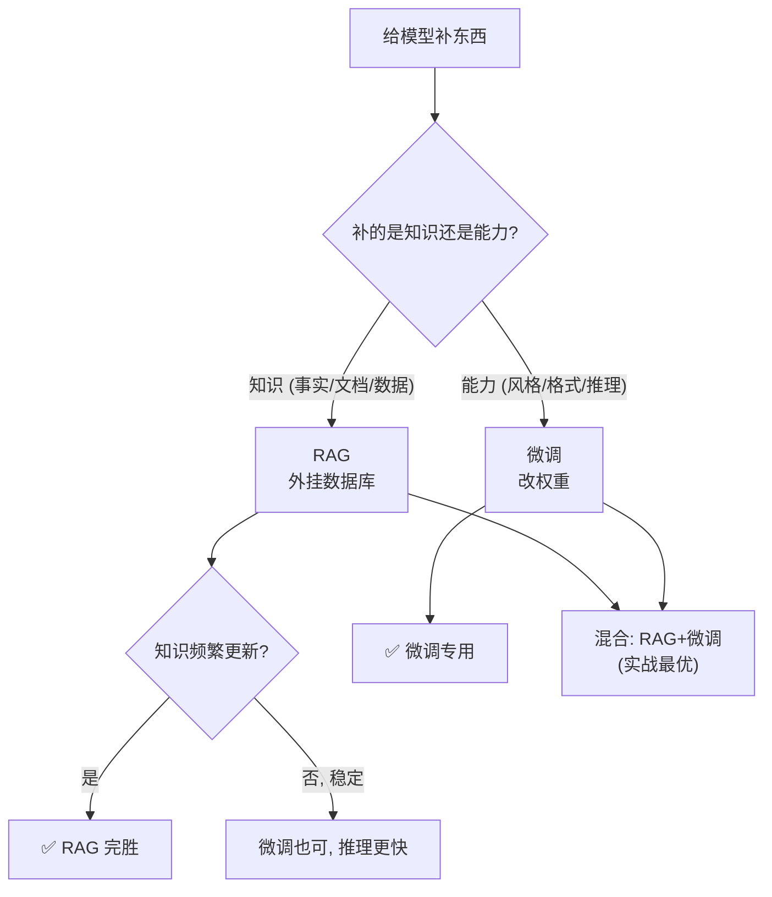

# 09 · RAG vs 微调：知识更新该检索还是改权重？

> 这是 2023 年后**每个 LLM 应用的第一抉择**：给模型补充新知识（公司文档、实时数据、私有知识库），到底该 **RAG（检索增强，外挂）** 还是 **微调（改权重，内化）**？本章用实验把这个抉择讲死——核心区分一句话：**RAG 像开卷考试（带资料查），微调像闭卷背书（记脑子里）。**

---

## 1. 直觉层：开卷 vs 闭卷

### 一句话比喻

> **微调 = 让学生把课本背下来（闭卷考试）。** 答得快，但课本一更新就得重背。
> **RAG = 让学生带课本进考场，现场翻（开卷考试）。** 课本更新只要换一本，不用重新背。

### 两种"补知识"的方式

| | 微调（finetune）| RAG（检索增强）|
|---|---|---|
| 知识在哪 | **权重里**（内化）| **外挂数据库**（外挂）|
| 怎么用 | 直接推理 | 推理前先检索相关片段 |
| 新增知识 | **必须重训**（僵化）| **加条记录即可**（灵活）|
| 准确性 | 靠泛化，可能记不准 | 见过的**精确查表** |
| 推理速度 | 快（一次前向）| 略慢（多一步检索）|

## 2. 数学层：两种知识表征

### 2.1 微调：知识 = 权重

微调把知识 $(k,v)$ 烧进权重 $\theta$：

$$
\min_\theta \sum_{(k,v)\in\text{知识库}} \mathcal L(f_\theta(k), v)
$$

知识变成了 $\theta$ 的一部分。**新增知识 = 重新优化 $\theta$**。

### 2.2 RAG：知识 = 数据库

RAG 不改模型，推理时分两步：

$$
\text{检索: } \quad \text{top-}k = \mathrm{retrieve}(q,\ \text{数据库})\quad\to\quad\text{生成: } \quad f_\theta(q,\ \text{top-}k)
$$

- **检索**：用 embedding 相似度，从数据库找出与 query $q$ 最相关的片段。
- **生成**：把检索到的片段塞进 prompt，让模型基于它回答。

知识永远在数据库，不在权重。**新增知识 = 往数据库插一条记录**，模型权重不变。

## 3. 代码层：知识更新抉择

```bash
cd 讲透复用权重/experiments && python3 09_rag_vs_finetune.py    # CPU 约 30 秒
```

**真实输出**（key→value 知识库，训练后新增 2 条知识，可复现）：

```
① 微调在【见过知识】上 MSE=0.0055        ← 学得好
   微调在【新增知识】上 MSE=3.8990        ← 没见过, 泛化失败!

② RAG(init库) 在【见过知识】上 MSE=0.0000  ← 精确查表
   RAG(+新增库) 在【新增知识】上 MSE=0.0000 ← 加条记录, 立即精确!

=== 核心对比: 对【新增知识】===
   微调       : MSE=3.899  (必须重训)
   RAG(+新库) : MSE=0.000  (零训练成本, 立即生效)
```

**怎么读**：训练后新增的知识（红星），微调完全不会（MSE 3.9，靠泛化瞎猜）；RAG 只要把新知识加进数据库，**立即精确返回（MSE 0）**。这就是 RAG 的杀手锏——**知识更新零训练成本**。

## 4. RAG vs 微调：什么时候用哪个？

| 场景 | 推荐 | 理由 |
|------|:---:|------|
| **知识频繁更新**（新闻、库存、文档）| **RAG** | 微调跟不上更新节奏 |
| **私有/机密知识** | **RAG** | 知识在可控数据库，不混进权重 |
| **需要精确引用来源** | **RAG** | 能返回"这条答案来自哪个文档" |
| **改变模型的"风格/能力"**（语气、格式）| **微调** | 这是模型行为，不是知识 |
| **小规模、稳定的知识** | **微调** | 知识少且不变，烧进权重推理更快 |
| **领域术语/行话** | **微调** | 让模型"理解"新词，而非检索 |

### 决策准则（一句话）

> **知识（事实、文档、数据）→ RAG；能力（风格、格式、推理方式）→ 微调。**
> RAG 解决"模型不知道"，微调解决"模型不会做"。

## 5. 混合策略：RAG + 微调（实战最优）

真实系统常常**两者结合**：

1. **微调**让模型学会"如何使用检索到的内容"（领域行话、回答格式）。
2. **RAG**提供实时、可更新的知识。

> 典型：用领域数据微调一个"医学问答模型"（学会医学术语和推理风格），再挂一个医学文献 RAG 库（提供最新知识）。微调管"能力"，RAG 管"知识"。

## 6. RAG 的技术栈

一个完整 RAG 系统：
- **Embedding 模型**：把文档和 query 转成向量（如 BGE、text-embedding-3）。
- **向量数据库**：存文档向量，支持相似度检索（FAISS、Milvus、Chroma）。
- **检索**：找 top-k 最相关片段。
- **生成**：LLM 基于 query + 检索片段回答。

> RAG 本质是"复用 LLM 权重 + 复用外部知识库"——它不改权重，但让模型能访问任意大的、可更新的知识。这也是一种"复用"。

## 7. 批判：两者的坑

### RAG 的坑
1. **检索质量决定上限**：检索不到正确片段，生成再好也白搭。**垃圾检索 = 垃圾回答。**
2. **幻觉仍存在**：模型可能无视检索内容，编造答案。
3. **上下文长度限制**：检索片段太多塞不进 prompt。

### 微调的坑
1. **知识更新贵**：每次新知识都要重训（本实验所见）。
2. **过拟合/遗忘**：微调新知识可能忘旧能力（见第 06 章）。
3. **不可解释**：知识在权重里，无法追溯来源。



---

📌 **下一步**：复用权重的"源头"是预训练。最后一章 [10-预训练ScalingLaws](10-预训练ScalingLaws.md) 讲**神经缩放定律**——为什么模型越大越好、Chinchilla 定律怎么算最优配比。这是看懂 GPT/Llama 训练配方的钥匙。

✍️ **练习**
1. **概念**：为什么 RAG 对"新增知识"零成本，微调却要重训？
2. **应用**：公司要做"客服机器人"，知识库是产品手册（每月更新）。RAG 还是微调？为什么？
3. **应用**：要让模型用"莎士比亚风格"写作。RAG 还是微调？（提示：这是能力不是知识。）
4. **进阶**：RAG 检索不到正确片段时，模型会怎样？怎么缓解？（提示：混合检索、重排序、让模型说"不知道"。）
