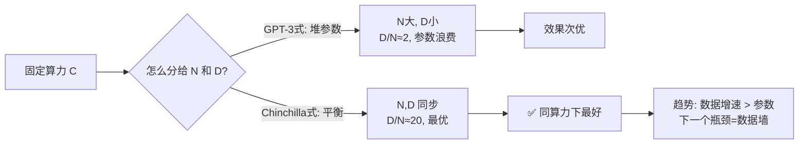
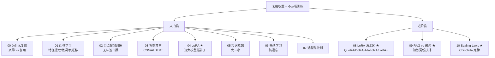

# 10 · 预训练 Scaling Laws：Chinchilla 定律与计算最优

> 复用权重的"源头"是预训练。而预训练怎么配——**模型多大、数据多少、算力怎么花**——有一套近乎"物理定律"的规律：**神经缩放定律（Neural Scaling Laws）**。它告诉你 loss 怎么随参数/数据/算力幂律下降，以及 DeepMind 2022 年的 **Chinchilla 定律**如何纠正了 GPT-3 时代"只堆参数"的误区。这是看懂 GPT/Llama 训练配方的钥匙。

---

## 1. 直觉层：AI 的"物理定律"

### 一句话比喻

> **Scaling Laws 是 AI 的"摩尔定律"**：它精确预言"模型越大、数据越多，loss 越低"的幂律关系——就像摩尔定律预言芯片密度翻倍。不同的是，Scaling Laws 还告诉你**怎么花算力最划算**。

### 核心现象

经验上（Kaplan 2020, Chinchilla 2022）：

$$
\boxed{\;L(N,D) \approx \frac{A}{N^\alpha} + \frac{B}{D^\beta} + L_\infty\;}
$$

- $L$：测试 loss
- $N$：参数量，$D$：数据量
- $\alpha,\beta\approx 0.05\sim 0.1$（幂指数，小但关键）
- $L_\infty$：不可约损失（数据本身的熵）

**loss 随 $N$、$D$ 幂律下降**——这就是"为什么大模型好"的数学根源。

## 2. 数学层：幂律 + 算力最优

### 2.1 幂律的含义

$\alpha\approx 0.1$ 意味着：参数翻 10 倍，loss 降到 $10^{-0.1}\approx 0.79$ 倍（降 21%）。看似慢，但**指数级堆参数**能持续降 loss——这正是大模型时代的动力。

### 2.2 算力约束下的最优配比（Chinchilla 核心）

给定固定算力 $C\approx 6ND$（训练总算力），怎么分配 $N$ 和 $D$ 让 loss 最低？Chinchilla 求解这个优化问题，得到惊人结论：

$$
\boxed{\;N^* \propto C^{0.5},\quad D^* \propto C^{0.5}\quad\Rightarrow\quad \frac{D^*}{N^*}\approx 20\;}
$$

> 📐 **Chinchilla 定律**：计算最优时，**每个参数配约 20 个 token**。模型和数据要**同步增长**。

### 2.3 它纠正了 GPT-3 的什么错？

GPT-3（1750 亿参数）只用了 3000 亿 token——**D/N ≈ 1.7**，远低于最优的 20。即 **GPT-3 严重"参数浪费"**：参数太多、数据太少，没喂饱。

Chinchilla（700 亿参数）用 1.4 万亿 token（D/N=20），**参数只有 GPT-3 的 40%，效果却更好**。这就是"计算最优"的威力——**不是越大越好，是配比要对。**

## 3. 代码层：玩具上拟合缩放定律

```bash
cd 讲透复用权重/experiments && python3 10_scaling_laws.py    # CPU 约 70 秒
```

**真实输出**（回归任务，扫参数 + 扫数据，可复现）：

```
① 扫参数量: 宽度8(97参,MSE=0.18) → 宽度256(66561参,MSE=0.0003)   ← 幂律下降
② 扫数据量: 数据25(MSE=0.04) → 数据3000(MSE=0.0003)              ← 幂律下降
拟合: loss ~ N^(-1.11), loss ~ D^(-0.99)   (玩具α偏大, 但幂律形状成立)

③ Chinchilla 精神 (近似等算力对比):
   大模型少数据: 256宽(66561参)+100数据 → 算力6656K  MSE=0.0046
   平衡:          64宽(4353参)+800数据   → 算力3482K  MSE=0.0026  ← 用一半算力, 更好!
```

**怎么读第③组（最关键）**：
- "大模型少数据"花了 **6656K 算力**，MSE=0.0046。
- "平衡配置"只花了 **3482K 算力**（一半！），MSE=0.0026（更好）。

> 🎯 **这就是 Chinchilla 精神的实证**：平衡配比用更少算力、得到更好效果。堆参数而不补数据 = 浪费。这正是 Chinchilla 纠正 GPT-3 的逻辑。

## 4. Chinchilla 对行业的冲击（2022–2026）

Chinchilla 定律直接改变了所有大模型的训练策略：

| 模型 | 参数 | token | D/N | 是否计算最优 |
|------|------|-------|:---:|:---:|
| GPT-3 (2020) | 175B | 300B | 1.7 | ❌ 参数浪费 |
| **Chinchilla** (2022) | 70B | 1.4T | 20 | ✅ 最优 |
| LLaMA-2 (2023) | 70B | 2T | 29 | ✅ 略超最优 |
| LLaMA-3 (2024) | 405B | 15T | 37 | ✅ 数据更充分 |

> 趋势：**数据增速超过参数增速**。业界意识到"数据墙"（高质量文本快用完）才是下一个瓶颈，而非参数。

## 5. Scaling Laws 的实践意义

1. **训练前能预测效果**：用小模型拟合缩放曲线，外推大模型的 loss——决定值不值得花大钱训。
2. **算力分配有据**：Chinchilla 告诉你该买多少卡、训多久、用多少数据。
3. **解释"涌现"争议**：某些能力是否"突然涌现"还是平滑提升，缩放定律是分析工具。

## 6. 批判：Scaling Laws 的边界

1. **幂律会饱和**：到极致规模，$\alpha$ 可能变小（边际收益递减）。无限堆参数不会无限降 loss。
2. **数据墙**：高质量文本有限（互联网就这么多）。Chinchilla 要求 D/N=20，但 10T 参数模型要 200T token——**没那么多高质量数据**。合成数据、多模态是应对方向。
3. **loss ≠ 能力**：缩降 loss 不等于能力同比例提升。某些能力（推理、长程依赖）不一定平滑缩放。
4. **只对"预训练"成立**：微调、对齐（RLHF）的缩放规律更复杂，不如预训练干净。



---

## 收官：复用权重全景回顾

至此，「讲透复用权重」入门篇（00–07）+ 进阶篇（08–10）全部讲完。一张图收束：



**一句话总结整个系列**：复用权重让深度学习从"每个任务重新发明轮子"变成"站在巨人肩膀上"——预训练（自监督 + Chinchilla 配比）造出 Foundation Model，再通过迁移/特征提取/LoRA/蒸馏/持续学习适配无数下游，用 RAG 处理可变知识。**这是 2026 年 AI 的完整组织原则。**

---

📌 **下一步**：回 [README](README.md) 重看全景图，所有箭头现在都懂了。做 [exercises.md](exercises.md) 巩固。你已经掌握了现代 AI 的两大支柱之一（另一个是生成模型）。

✍️ **练习**
1. **概念**：为什么 Chinchilla 说 GPT-3"参数浪费"？用 D/N 解释。
2. **动手**：把 `10` 的"大模型少数据"配置改成 256宽+50数据，重跑——MSE 会变多差？这模拟了"参数严重浪费"。
3. **洞察**：本实验玩具的 $\alpha\approx 1.1$，真实大模型 $\alpha\approx 0.05\sim0.1$。为什么玩具的幂指数大得多？（提示：玩具任务简单，少量参数就能大幅降 loss；大模型任务复杂，边际收益递减快。）
4. **进阶**：10T 参数模型按 Chinchilla 要 200T token。互联网高质量文本估计就 ~10T token。这个"数据墙"怎么破？（提示：合成数据、多模态、课程学习。）
