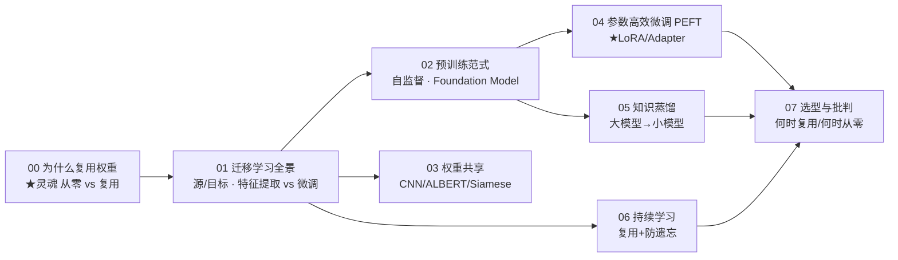
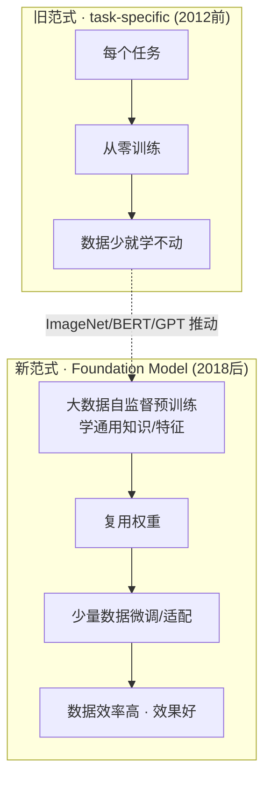

# 讲透复用权重

> **为什么 2026 年没人从零训练大模型了？**
>
> 因为"复用权重"（reusing weights）——不从零开始，而是站在已有预训练模型的肩膀上微调/适配——已经成为现代深度学习的**默认范式**。GPT、BERT、ResNet、CLIP、Stable Diffusion……你能叫出名字的模型，背后都是"大规模预训练 + 复用权重到下游"。本教程讲透这件事：**复用的是什么、怎么复用、什么时候复用、为什么它几乎总赢过从零训练。**
>
> 承接「[讲透生成模型](../讲透生成模型/）」，主题独立：生成模型回答"怎么造新数据"，复用权重回答"**怎么不浪费已有的训练成果**"。

---

## 这份教程为谁而写

- 听过"迁移学习""预训练""微调""LoRA"但**分不清它们关系**的人。
- 想搞懂"为什么 BERT/GPT 先在海量数据训，再在小任务调"的人。
- 算力有限、想用少量数据/少量算力适配大模型的人（PEFT/LoRA 受众）。
- 想知道"什么时候该从零训练、什么时候该复用"的人。
- 数学薄弱但工程扎实：直觉层补数学，工程层发挥你的优势。

## 教学宪法（每章遵守）

每个概念按三层呈现：**直觉（比喻）→ 数学（公式与边界）→ 代码（bash 跑通的实证）**。诚实标注哪些是"已证明"、哪些是"经验现象"、哪些"仍未解决"。结尾固定给出 **📌 下一步** 与（核心章）**✍️ 练习**。

## 灵魂：一句话钉死

> **复用权重 = 不从零训练，而是把"别人（或过去的自己）在大数据上学到的通用知识"拿过来，用少量数据/算力适配到自己的任务。** 它把"每个任务都重新发明轮子"变成"站在巨人的肩膀上"。

$$
\underbrace{\text{传统 ML}}_{\text{每个任务从零训练}}\quad\longrightarrow\quad
\underbrace{\text{现代 ML}}_{\text{大规模预训练} \xrightarrow{\text{复用}} \text{下游微调}}
$$

## 核心实证（实验 00）

> 用同一组数据证明"复用碾压从零"——在**少样本（12 点）**下学同心圆分类：

| 方案 | 测试准确率 | 含义 |
|------|:---:|------|
| 源任务预训练（大数据 2000）| 1.000 | 先在大数据学好"通用特征" |
| **从零训练**（仅 12 点）| **0.850** | 少样本学非线性边界，难，欠拟合 |
| **复用权重 + 微调**（仅 12 点）| **1.000** | 复用预训练特征，轻松适配 |

```bash
cd experiments && python3 00_reusing_vs_scratch.py   # CPU 约 80 秒
```

> 12 个点的少样本下，从零只能到 85%，复用直接 100%。**这就是预训练范式的全部价值——省数据、省算力、还更准。**

## 目录与学习路径



| 章节 | 文档 | 回答的问题 | 实验 |
|------|------|-----------|------|
| **入门篇** | | | |
| 00 | [00-为什么复用权重.md](00-为什么复用权重.md) | 复用权重到底为什么有用？从零为何输？ | `00_reusing_vs_scratch.py` ★ |
| 01 | [01-迁移学习全景.md](01-迁移学习全景.md) | 什么是源/目标任务？特征提取和微调区别？负迁移？ | `01_transfer_modes.py` |
| 02 | [02-预训练范式.md](02-预训练范式.md) | 自监督预训练怎么学？Foundation Model 是什么？ | `02_pretrain.py` |
| 03 | [03-权重共享.md](03-权重共享.md) | 同一组权重多处用是什么思想？CNN/ALBERT/Siamese | `03_weight_sharing.py` |
| 04 | [04-参数高效微调PEFT.md](04-参数高效微调PEFT.md) | LoRA/Adapter 怎么做到只训 1% 参数？ | `04_lora.py` ★ |
| 05 | [05-知识蒸馏.md](05-知识蒸馏.md) | 怎么把大模型压缩成小模型？soft label | `05_distillation.py` |
| 06 | [06-持续学习.md](06-持续学习.md) | 跨任务复用怎么避免灾难性遗忘？ | `06_continual.py` |
| 07 | [07-选型与批判.md](07-选型与批判.md) | 我的场景该复用还是从零？未解问题？ | — |
| **进阶篇** | | | |
| 08 | [08-LoRA深水区.md](08-LoRA深水区.md) | QLoRA/DoRA/AdaLoRA/LoRA+ 区别与选型？ | `08_lora_variants.py` ★ |
| 09 | [09-RAG与微调.md](09-RAG与微调.md) | 给模型补知识，该 RAG 还是微调？ | `09_rag_vs_finetune.py` ★ |
| 10 | [10-预训练ScalingLaws.md](10-预训练ScalingLaws.md) | 模型多大、数据多少？Chinchilla 定律 | `10_scaling_laws.py` ★ |
| — | [exercises.md](exercises.md) | 输出倒逼输入 | — |

## "复用权重"的六种主要形态（全景）

| 形态 | 核心思想 | 典型 |
|------|---------|------|
| **迁移学习** | 源任务权重 → 目标任务 | ImageNet 预训练 → 医学影像 |
| **特征提取** | 冻骨干，只训头 | 冻 ResNet + 新分类头 |
| **微调** | 解冻全部，少量更新 | BERT 微调情感分类 |
| **权重共享** | 同组权重在多处复用 | ALBERT（共享层）、CNN（共享核）、Siamese |
| **PEFT（LoRA 等）** | 冻主体，插小模块只训它 | LoRA 微调 LLaMA |
| **知识蒸馏** | 大模型知识 → 小模型权重 | DistilBERT |

> 这六种都是"复用权重"的不同侧面。本教程逐一拆解。

## 环境与运行

```
torch 2.10 (CPU 即可, 但单线程更快)  |  matplotlib 3.10  |  numpy 1.26  |  python 3.12
```

> ⚠️ 同「讲透生成模型」：本机 torch 小矩阵上多线程更慢，所有脚本内置 `torch.set_num_threads(1)`。

一键跑通：

```bash
cd 讲透复用权重/experiments
for f in 0*.py; do echo "===== $f ====="; python3 "$f"; done
```

## 一张图看懂复用权重的范式转移



---

📌 **下一步**：从 [00-为什么复用权重.md](00-为什么复用权重.md) 开始，看实验如何用 12 个点证明"复用碾压从零"；或直接跳 [04-参数高效微调PEFT.md](04-参数高效微调PEFT.md) 看当代最火的 LoRA；如果你只关心"怎么用预训练模型"，直奔 [01-迁移学习全景.md](01-迁移学习全景.md)。
