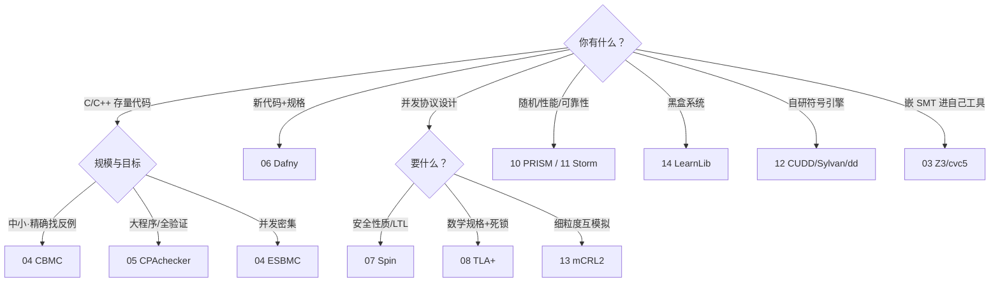
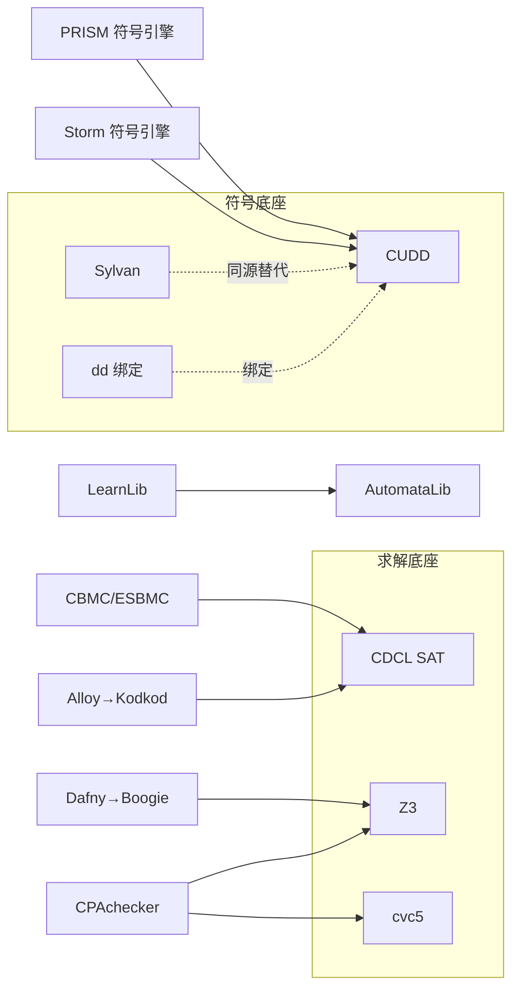

# 50 · 收尾：复杂度动物园与选型决策树

> 系列终章。03-14 章把工具逐一拆开看零件，本章把它们全部赶回笼子，只做四件事：① **合拢地图**——每章末尾那行【复杂度格】在这里对账归位，P→NP/coNP→NP∩coNP→PSPACE→不可判定五排笼子一次看全；② **识别三步法**（判定化→证书结构→归约）——明天遇到本系列没讲过的问题，自己判断它落在哪一格；③ **两件选型仪器**——两问决策树（你有什么×你要什么→从哪个工具进门）与工具依赖生态图（SAT/SMT 与 BDD 两个底座撑起所有门面）；④ **验证剧场再访**——连回卷零 [00](./00-为什么形式化+Lean4SOTA.md)：地图防不了剧场，工具不背方法的锅。本章无 lab——仪器就是这两张图。【格子定工具，边界定信任】

---

## 一、合拢地图：P→NP/coNP→NP∩coNP→PSPACE→不可判定

系列宪法（[README](./README.md)）说形式化验证是"**在可判定性边界的这一侧，为每类系统性质找到可计算的检查方法**"。全系列十五章走完（卷零三章立地基、03-14 十二章拆工具），这句话兑现成一张五排笼子的表——每格的门牌就是各章锚点行的复杂度标注，表中【】逐字摘自各章末尾：

| 复杂度格 | 代表问题 | 代表工具 | 本系列章节（锚点原句） | 这格买到什么 / 付出什么 |
|---|---|---|---|---|
| **P（多项式）** | DTMC/MDP 可达概率（线性方程组/价值迭代）、PCTL/CSL 模型检查（未单独立章的 CTL 同族）、显式状态枚举、多项式查询学习 | PRISM、Storm、TLC（枚举本体）、LearnLib | [10](./10-PRISM概率模型检测.md)【P】·[11](./11-Storm与高性能概率检查.md)【P（大输入的工程战）】·[08](./08-TLA+与TLC.md) 的 TLC 侧【TLC=显式枚举】·[14](./14-自动机学习Lstar.md)【多项式查询复杂度】 | 定量答案（"概率 ≤10⁻⁹"这种测试给不出的数）与高效算法；但模型必须先有、状态数吃内存——**P 不豁免建模** |
| **NP / coNP** | SAT（NP-完全）、固定 scope 的关系约束满足、固定 k 的 BMC 编码；无量词 SMT：sat∈NP / unsat∈coNP | CDCL SAT、Z3/cvc5、CBMC/ESBMC、Alloy→Kodkod | [03](./03-SMT求解与Z3cvc5.md)【NP/coNP】·[04](./04-有界模型检查CBMC.md)【NP】·[09](./09-Alloy关系逻辑.md)【有界=NP】 | **反例有短证书**（一次求解查询即可核验）；代价是"没有反例"只在界内成立——UNSAT 侧无短证书，证全需 k≥直径（04） |
| **NP∩coNP** | μ-演算模型检查（⟺ 奇偶博弈的均衡存在性） | mCRL2（PBES 求解管线） | [13](./13-进程代数与mCRL2.md)【交替不动点：NP∩coNP】 | 是/否**双边都有短证书**（各一个有限策略对见证）；zoo 悬案——多项式算法没人找到、NP-hard 也证不出，"可能是 P 与 NP 之间中间地带"的活展品 |
| **PSPACE** | LTL 模型检查（对公式长度 PSPACE-完全：\|TS\| 线性 × \|φ\| 指数）、TLA+ 时序性质、无穷状态集的紧致符号表示 | Spin（显式+on-the-fly）、TLC（上界侧）、CUDD/Sylvan/dd | [07](./07-LTL与Spin.md)【PSPACE-complete（公式长度）】·[08](./08-TLA+与TLC.md)【模型检查 PSPACE】·[12](./12-BDD与CUDD.md)【PSPACE 的符号化武器】 | **所有路径说话**——活性/安全的全称量词保证；指数在公式里（tableau 2^{O(\|φ\|)}）、爆炸在图里——偏序归约/符号化是解药不是解除 |
| **不可判定** | 一般程序验证（无穷状态/无界数据结构）、无界结构满足、程序终止性 | 三条出路：可靠近似（CPAchecker）、有界截断（CBMC 的 k）、义务分解+人写不变式（Dafny） | [05](./05-抽象解释与CPAchecker.md)【不可判定→可靠近似】·[06](./06-Dafny验证语言.md)【不可判定→义务分解到 NP】·[09](./09-Alloy关系逻辑.md) 无界侧【无界不可判定】 | 没有银弹：05 用假阳性换可靠、04 用界内完备换"证全"、06 用人力换无限保证——**完备性/自动化/人力三者至少牺牲一个** |

五排笼子的排列逻辑不是"难度从易到难"这么无聊——它是**证据的形态学**：P 格的答案是算出来的数；NP 格的"否"是一枚可核验的短证书；NP∩coNP 格是/否双边都有策略对作证；PSPACE 格的证明要枚举所有路径（多项式空间放得下、时间可能爆炸）；不可判定格则连"对所有输入都会停机的算法"都不存在——前四格工具的胜负是快慢，第五格工具的胜负是**你在三种代价里选哪种**（05/06 的分流正源于此）。

每格一句人话（面试可用版）：

- **P**：解方程就出答案——快，但只回答"多少"，不回答"所有"；
- **NP/coNP**：找反例快（有短证书）、证没反例难（UNSAT 无短证书）——"k 步内干净"≠"干净"；
- **NP∩coNP**：是与否都有短见证，却没人找到多项式算法——复杂度动物园的悬案展品；
- **PSPACE**：能装下所有路径的内存赢——指数在公式长度里等着你；
- **不可判定**：没有万能算法，只有三种代价明码标价的出路。

读表四注：

1. **卷序 ≠ 难度序**：卷一（03-06）先攻 NP/coNP 与不可判定的三条出路，卷二（07-09）攻 PSPACE，卷三（10-11）攻 P，卷四（12-14）下引擎室——那是"读者先遇哪格"的教学序；本表自上而下才是"格子从温顺到野"的复杂度序。
2. **一格多工具 ≠ 冗余**：同格的工具在"对象轴"上分家（§五）——10/11 同在 P 格，一个管入门一个管十万态上量（11 章自陈"不是新格子"）。
3. **08 与 09 横跨两格**：TLA+【模型检查 PSPACE；TLC=显式枚举】、Alloy【有界=NP；无界不可判定】——横跨本身就是信息：**这两个工具站在格子边界做生意**，界内界外两种货色都要标价。
4. **NP∩coNP 值得单独一排**：这排笼子里的动物之所以有名，恰恰因为我们对它**无知**——既没人把它驯进 P，也没人证明它和 NP 一样野。动物园里最贵的展品往往是围栏位置本身存疑的那只（13 章"悬案展品"的原文）。

> 🎯 **一句话**：全系列的横向主线——每章末尾那行【复杂度格】——在这张表上收拢成一个判断：**你的问题落在哪一格，决定了你能买到哪种保证、必须付出哪种代价**。

---

## 二、识别三步法：你的问题在哪一格

今天有人带着一个本系列没讲过的问题来问（原样的提问："我要验证我们的消息队列在任意丢包重传下最终一致，该用什么工具？"）。别急着报工具名——先花十分钟走三步，把问题放进格子，工具名自己会浮出来。这一节就是那根手杖。

### 第一步：判定化——把"验证 X"写成一个是/否问题

复杂度只对判定问题有意义：给定输入 (M, φ)，问"M ⊨ φ 吗？"——**存在对每个输入都停机并回答是/否的算法吗**？判定化失败的高发点要背下来：

- **无穷数据域**：任意整数、任意长消息、无界队列——状态空间无穷；
- **无穷路径**：活性（"最终""永远"）谈的是无穷行为的全称量词；
- **无界并发交织**：线程数不定，交织数先于一切爆炸。

若问题本体是"对所有程序……"，八成已站在不可判定门口——正确动作不是硬上，而是**找可判定的子问题**：固定界（→BMC）、固定 scope（→Alloy）、固定抽象域（→抽象解释）。这三招不是逃避，是 04/09/05 三章的正门。

本例：队列系统建成有限状态的丢包信道+重传协议模型，"最终一致"= 活性 ◇done——于是问题判定化为"TS ⊨ ◇done 吗"，是一/否问题，可以谈格子了。

### 第二步：证书结构——反例长什么样，格子就是什么

假设答案是"否"，反例（证书）的形状直接定格：

| 证书形状 | 落格 | 本系列实例 |
|---|---|---|
| 一条**有限轨迹** | NP | 反例=模型（04 的 SSA 赋值、09 的结构小反例、03 的 sat 骨架赋值+理论见证） |
| 一条 **lasso**（有限前缀+环）或 tableau 里的无穷路径 | PSPACE | F p 的反例=可达 ¬p 环（07 的 nested-DFS 猎物） |
| 一个**策略对**（博弈双方各一份有限策略） | NP∩coNP | 奇偶博弈的均衡见证（13 的 μ/ν 交替不动点） |
| **一个数**（线性方程组的解/迭代的几何收敛极限） | P | 可达概率（10/11） |
| 一张**观察表**（MQ/EQ 的问答账本） | 多项式学习 | 黑盒最小 DFA（14） |
| "是"的见证必须是**无穷对象**（不变式/证明） | 不可判定侧 | while 的四义务（05/06 的分界线） |

经验法则一句话：**证书长度 = 复杂度量级**——短证书落 NP；多项式空间放得下的证书落 PSPACE；是/否双边都有短证书落 NP∩coNP；而"是"的见证只能是无穷对象时，问题本体已越过可判定性边界（05/06 的三条出路在彼岸接应）。这张小表还解释了一件常被误解的事：**"工具报告了 UNSAT"不是证书**——UNSAT 的见证（空 clause 推导链/分辨率证明）可以指数长，这正是 NP 格"找反例容易、证没有反例难"的复杂度根源（03 章 sat∈NP/unsat∈coNP 的格籍）。

本例：◇done 的反例是一条 lasso（丢包环上永不收敛）——PSPACE 的证书形状。

### 第三步：归约——和已知问题比难易

最后对表入座：它**比 SAT 难**（SAT 可归约到它 ⟹ NP-hard 下界）还是**不比 LTL 检查难**（它可归约到 LTL 检查 ⟹ 继承 PSPACE 上界）？工程人不必自证归约，只需认形状：

- **k 步展开**的形状 = 04（有界一问：界内找反例）；
- **转移系统 + 时序公式** = 07/08（全路径一问：安全与活性）；
- **转移系统 + 概率转移** = 10/11（定量一问：概率与期望）；
- **关系约束 + scope 旋钮** = 09（结构一问：反例实例）；
- **源码 + 断言** = 04/05/06 三选一（按 §三的树分岔）。

本例收尾：模型 + LTL 活性 ⟹ LTL 模型检查 ⟹ **07 Spin / 08 TLA+** 进门；若信道有丢包概率上限，加一个概率维度即换格 ⟹ **10/11**；若最终要落实到 C 实现 ⟹ 先 04 找反例（NP 格短证书最快）、再 05/06 证全（不可判定格的三条出路）——**同一个人的同一个系统，三个粒度的问题住三格，用三件工具**，这不是浪费，是地图的本义：换粒度=换问题=换格子。

三步速查（把本例折成一张便签）：

```
判定化：TS ⊨ ◇done？            ← 有限模型 + 活性 = 是/否问题
证书：  反例 = lasso（丢包环）    ← PSPACE 的形状
归约：  "转移系统+时序公式"       ← LTL 检查的标准形状 → 07/08 进门
        （+概率上限 → 换格 10/11；落实到 C → 04 找反例、05/06 证全）
```

三步法的产出是**格子不是答案**：同格之内还有工程差别（显式 vs 符号、入门 vs 上量）——这正是下一节决策树管的事。

---

## 三、两问定位决策树：你有什么 × 你要什么

选型只问两问。第一问**你有什么**（工件形态：存量代码/新代码/协议设计/随机模型/黑盒/自研引擎）筛掉大多数枝——之所以先问这个，因为工件是最难改变的约束：没人为了用一个验证工具而重写存量 C 代码。第二问**你要什么**（保证形态）只在协议设计那枝分叉——因为协议人的工件相同、目标却分三副面孔（安全性质/数学规格+死锁/互模拟精化）。



读树四注：

- **树给的是进门工具，不是全程**。真实项目常是接力：04 找反例（NP 格的短证书最快）→ 05/06 证全（反例驱动的下一站，04 章锚点"BMC 的 UNSAT 之外"）。叶子是入口，不是终点站票。
- **09 Alloy 不在树上**：它的问题形态（关系结构 + scope + 找小反例）横跨"写规格"与"找反例"两枝——做结构建模、规格自查反例时走 09（§一 NP 格已给它留了座位）。
- **最后两枝是给造工具的人的**：自研符号引擎→12（BDD 底座）、往自己工具里嵌求解器→03（SMT 底座）。读者视角与工具作者视角在同一棵树的树根会合——这也是本系列"用户 + 引擎室"双视角的收束。
- **两问之外还有第三问：你愿意付哪种账**。格子的代价表（§一最右列）在这一步兑现——能容忍假阳性走 05、要界内完备走 04、肯写不变式换无限保证走 06。决策树帮你进门，账单帮你决定要不要住下。

每片叶子回放一张门牌（与 §一表格互为对账，格籍全部来自各章锚点行）：

| 叶子 | 门牌（复杂度格） |
|---|---|
| 04 CBMC / ESBMC | NP（固定 k 的编码） |
| 05 CPAchecker | 不可判定→可靠近似 |
| 06 Dafny | 不可判定→义务分解到 NP |
| 07 Spin | PSPACE-complete（公式长度） |
| 08 TLA+ | 模型检查 PSPACE；TLC=显式枚举 |
| 13 mCRL2 | 交替不动点：NP∩coNP |
| 10 PRISM / 11 Storm | P（11 是大输入的工程战） |
| 14 LearnLib | 多项式查询复杂度 |
| 12 CUDD/Sylvan/dd | PSPACE 的符号化武器 |
| 03 Z3/cvc5 | NP/coNP（sat∈NP / unsat∈coNP） |

一张树、一张表、十二行门牌——三个视图说同一件事，能对上账，选型就不会凭感觉。

---

## 四、工具依赖生态图：两个底座撑起所有门面

上层工具几乎全是门面，真正的引擎集中在两个底座：**求解底座**（CDCL SAT + SMT，03 章）管"命题骨架×理论血肉的可满足性"，**符号底座**（BDD 族，12 章）管"无穷状态集的紧致表示"。图上箭头=依赖方向：



读图六注：

1. **升级传导**：底座每快一倍，门面全线受益——CDCL/Z3 的版本升级会同时改写 CBMC/ESBMC/Dafny/Alloy/CPAchecker 的能力边界。底座是公共设施不是私人物品：给求解器提 issue 也是给自己的验证工具链提 issue。
2. **两级降维的典型**：Dafny→Boogie→Z3（06 章）是图上最长的责任链——验证语言的每条合同最终落成一次 SMT 查询；CPAchecker 画两条箭头（Z3 与 cvc5）是**底座可换**的直接证据：门面按 SMT-LIB 标准说话，底座竞价上岗。
3. **同源替代**：Sylvan 是 CUDD 的多核重生、dd 是 CUDD 的 Python 绑定——符号底座也可换、门面不换（12 章）。评估"符号引擎"时评估的是族，不是孤品。
4. **三条独立路线不在图上**：Spin（显式状态，liveness 检测自理）、TLC（显式枚举）、LearnLib 的教师（被测系统本身）——显式路线不欠两个底座的债，代价是内存与状态数同生共死（08 章锚点语）。生态图只画欠债的，这不公平但是事实。
5. **诊断学用法**：性能卡住先查底座（变量序 sifting、求解器版本、SMT 逻辑选择），再怪上层工具——**图上的箭头就是责任链**，从门面往底座逆流归因。
6. **底座的进化由竞赛驱动**：SAT 竞赛与 SMT-COMP 年复一年逼 CDCL/Z3/cvc5 互超（03 章"竞赛格局"），SV-COMP 逼 CPAchecker 常青（05 章）——你在门面看到的"今年又能多验几万行"，源头多半是底座榜单上的名次变化。

---

## 五、为什么这么多工具：四个分裂轴

19 个工具不是市场分割的偶然，是四根轴的必然张裂。任何两个"看起来功能重叠"的工具，拉开一看必有一根轴把它们分开：

1. **对象轴（被验物是什么）**：源代码（04/05/06）、设计模型与协议（07/08/13）、结构规格（09）、随机模型（10/11）、黑盒（14）。工具的语言贴着对象长——Promela 贴协议、Dafny 贴程序、Alloy 贴结构、PRISM 贴马尔可夫链；语言不贴对象，建模本身就是税。
2. **理论甜点轴（驻扎哪一格）**：NP 反例机（03/04/09）、PSPACE 全路径（07/08/12）、P 定量（10/11）、NP∩coNP 交替不动点（13）。格子不同，算法内核完全不同——CDCL、Büchi tableau、线性方程组、策略迭代之间**没有一行可以共享的代码**。
3. **语义要求轴（性质用什么语言说）**：二值线性时间（LTL→07）、数学化的行为等价+死锁（TLA+→08）、分支定量（PCTL→10）、互模拟等价（mCRL2→13）。性质语言的表达力决定落脚格——13 章那句"μ-演算 = LTL∪CTL 的公共超集"就是语义轴上溯到顶看到的风景。
4. **工程权衡轴（自动化换什么）**：全自动+容忍假阳性（05）、全自动+界内完备（04）、半自动+无限保证（06）、显式可读规格供人审（08）。**同一格内仍会沿这根轴再分裂**——格子定的是理论上限，付账方式是工程自由度。

乘起来：工具数 ≈ 格子数 × 轴组合数。"为什么没有通吃的工具"的终极答案很冷酷：**通吃 = 一般程序验证 = 不可判定**——动物园的围栏是计算复杂度砌的，不是商业竞争砌的。

轴还会**随时间移动**，这是"工具越来越多"的第二推动力：CPAchecker 用 CPA 积木把 BMC/谓词抽象/k-induction 多种策略装进一个框架（05 章——理论甜点轴上的多格经营）；Dafny 用 trigger 提示把"人写不变式"的成本逐年往下压（06 章——工程权衡轴上的迁徙）。工具沿轴挪一寸，市场上就多一个"新工具"——但格子还是那五排，围栏从不移动。

选型的一分钟答案也在这四根轴上：先报**对象**（代码/模型/黑盒），再报**性质的语言**（时序/概率/等价），落到**格子**，最后在格内按**付账偏好**挑工具——这正是 §三决策树的展开式。

---

## 六、验证剧场再访：工具不背方法的锅

卷零 [00 章 §六](./00-为什么形式化+Lean4SOTA.md) 讲过验证剧场的原始形态：**验证边界之外的部分静默失败**（Lean4 内核漏洞 #14576 的无公理伪证、libcrux 的 `lax` 属性静默吞掉 13 个漏洞）。动物园地图给了你格子感，但地图本身也能上演三种新剧场：

1. **把界内当全域**：发布"k 步无反例 = 无 bug"（BMC 的 UNSAT 只在 k 步内成立，证全需 k≥直径——04）；把 Alloy scope=3 的通过当无界定理（无界不可判定——09）；把 CPAchecker 的静默当 SAFE（05 的假报警可查，"没跑完当通过"是纯剧场）。
2. **把进门当抵达**：决策树选对工具 ≠ 验证完成——模型与被验物的 gap（没建模 DMA、中断、并发交织的那部分系统）在一切地图之外。工具验证的是模型，发布的是系统，两者之间隔着一句必须明说的假设。
3. **把生态当勋章**："我们用了 Z3/CBMC"是简历语言不是验证声明。照 00 章四问验收：验证了**什么性质**？边界**外**假设了什么？工具**版本**与配置？有无 **sorry/lax/关掉 unwinding 断言**类逃生口？

动物园版的发布前自查（对应 00 章 §6.3 的 CI 加固 checklist，换成格子的语言）：

- [ ] 声明**格子**：本验证住在哪一格（NP 界内 / PSPACE 全路径 / 可靠近似 / 义务分解），一格一词，不许含糊；
- [ ] 声明**证书**：通过的证据是什么（UNSAT 报告、不动点收敛、witness 证人），它的核验成本谁都能复现吗；
- [ ] 声明**边界外**：模型没覆盖的部分（DMA/中断/交织/浮点硬件）列成显式假设清单；
- [ ] 扫**逃生口**：`--unwind` 断言开着吗、抽象域的假阳性清单、Dafny 里有没有被 `assume` 混进来的"人肉定理"。

四项全勾，工具的成绩单才算过户到你的系统头上。

收束全系列。决策树回答"从哪进门"，动物园回答"进门后住哪格"，验证剧场提醒"**门牌不等于房契**"。回头看，每章末尾那行复杂度格，本质是作者对读者的**边界声明**——声明了格子，工具的失败才可解释、成功才可信。卷零开篇说"测试只能证明 bug 存在"，十四章后终于把另一半说完：**形式化验证能证明"某类 bug 不可能发生"——前提是你说清了"这类"的边界在哪里**。工具不背方法的锅：格子里诚实的 UNSAT，胜过剧场里辉煌的 verified。

---

**锚点行**：动物园合拢——P（10/11 概率定量、14 多项式学习、TLC 显式枚举）→ NP/coNP（03 SMT、04 BMC、09 有界 Alloy：反例=短证书，"无反例"只在界内）→ NP∩coNP（13 μ-演算⟺奇偶博弈：双边短证书的悬案活展品）→ PSPACE（07 LTL、08 TLA+、12 BDD 符号武器：所有路径说话，指数在公式里）→ 不可判定（05/06/09 无界：一般程序验证的三条出路，完备/自动/人力至少牺牲一）；识别三步法（判定化→证书结构→归约）给新问题定格，两问决策树（你有什么×你要什么）给新项目定门，生态图（SAT/SMT+BDD 双底座）给性能定责任链；验证剧场再访——格子定工具，**边界定信任**。【全系列总纲：在可判定性边界的这一侧，每格一张脸；门牌不等于房契】

🔗 卷零 [00 验证剧场](./00-为什么形式化+Lean4SOTA.md)（本章 §六的起点）｜卷一 [03](./03-SMT求解与Z3cvc5.md)·[04](./04-有界模型检查CBMC.md)·[05](./05-抽象解释与CPAchecker.md)·[06](./06-Dafny验证语言.md)｜卷二 [07](./07-LTL与Spin.md)·[08](./08-TLA+与TLC.md)·[09](./09-Alloy关系逻辑.md)｜卷三 [10](./10-PRISM概率模型检测.md)·[11](./11-Storm与高性能概率检查.md)｜卷四 [12](./12-BDD与CUDD.md)·[13](./13-进程代数与mCRL2.md)·[14](./14-自动机学习Lstar.md)｜回 [README](./README.md) 全篇目
