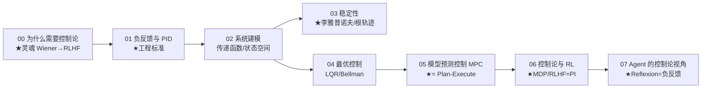

# 讲透控制论 (Cybernetics, 透) · 完整版

> **为什么 1948 年诺伯特·维纳研究"恒温器和火炮瞄准"的论文，会变成 2022 年 ChatGPT 对齐训练（RLHF）的算法骨架？**
>
> 用「直觉 → 数学 → 代码跑通 → 不足 → 应用」的方式，把控制论从第一性原理讲透。不写广度综述（那到处都是），只往**底层和本质**钻——把 Wiener 1948 那句"智能 = 负反馈"挖透，让你看清 AI 的**隐形骨架**。
>
> 每一篇配一个能跑出反直觉结论的 Python 实验。

**8 篇主线，从"恒温器"一路讲到"RLHF 与 Agent 的控制论本质"。**

---

## 这份教程为谁而写

- 用过 RLHF / PPO，但**讲不清它本质是 PI 控制**的人。
- 写过 Reflexion Agent，但**不知道它和恒温器是同一原理**的人。
- 调过梯度下降（SGD/Adam），但**没意识到 Adam 动量 ≈ 积分项**的人。
- 想知道"为什么波士顿动力机器人、特斯拉自动驾驶、SpaceX 火箭回收都用同一套理论"的人。
- 数学薄弱但工程扎实：直觉层补数学，工程层发挥你的优势。

## 教学宪法（每章遵守）

每个概念按三层呈现：**直觉（比喻）→ 数学（公式与边界）→ 代码（bash 跑通的实证）**。诚实标注哪些是"已证明"、哪些是"经验现象"、哪些"仍未解决"。结尾固定给出 **📌 下一步** 与（核心章）**✍️ 练习**。

## 灵魂：一句话钉死

> **Wiener 1948 的"智能 = 负反馈"一句话，是现代 AI 的隐形骨架。RLHF、Reflexion、梯度下降、Agent 重试、MPC——AI 的核心算法全是反馈环的不同化身。**

$$
\underbrace{e(t) = r(t) - y(t)}_{\text{误差}}
\quad\longrightarrow\quad
\underbrace{u(t) = K_p e + K_i\!\int\! e + K_d \dot{e}}_{\text{PID 控制}}
\quad\longrightarrow\quad
\underbrace{\theta \leftarrow \theta - \eta \nabla L}_{\text{SGD = 同一反馈环}}
$$

## 核心实证（实验 00）

> 用恒温器证明"负反馈让失控系统稳定"——Wiener 1948 核心洞见的实证。

| 控制策略 | 平均误差 | 绝对误差 | 误差波动 |
|---------|:------:|:------:|:------:|
| **无控制（开环）** | +7.08°C | 7.84°C | 6.82°C |
| **P 控制** (Kp=0.5) | +3.10°C | 3.52°C | 3.13°C |
| **PI 控制** (Kp=0.5, Ki=0.05) | **+0.01°C** | 2.25°C | 2.49°C |
| **PID** (Kp=0.6, Ki=0.05, Kd=0.3) | +0.00°C | 2.12°C | 2.36°C |

```bash
cd experiments && python3 00_why_cybernetics.py    # 几秒内跑完
```

> 无控制 7°C → P 3°C → PI 0°C（消除稳态误差）→ PID 减少波动。**负反馈让一个本来漂移 7°C 的系统，把误差压到 0°C。**

## 目录与学习路径



| 章节 | 文档 | 回答的问题 | 实验 |
|------|------|-----------|------|
| 00 | [00-为什么需要控制论.md](00-为什么需要控制论.md) | 控制论跟 AI 有什么关系？ | `00_why_cybernetics.py` ★ |
| 01 | 01-负反馈与PID.md | PID 三个参数各自解决什么问题？怎么整定？ | `01_pid_tuning.py` |
| 02 | 02-系统建模.md | 怎么用数学描述一个动态系统？ | `02_system_modeling.py` |
| 03 | 03-稳定性.md | 系统为什么会发散？李雅普诺夫怎么看？ | `03_stability.py` |
| 04 | 04-最优控制.md | LQR 怎么解倒立摆？Bellman 怎么联系 RL？ | `04_lqr.py` |
| 05 | 05-模型预测控制MPC.md | MPC 为什么和 Plan-Execute 同根？ | `05_mpc.py` ★ |
| 06 | 06-控制论与RL.md | RLHF 怎么从 PI 控制推出？MDP 本质是什么？ | `06_rlhf_as_pi.py` ★ |
| 07 | 07-Agent的控制论视角.md | Reflexion 收敛性怎么用控制论分析？ | `07_agent_cybernetics.py` |

## 怎么跑

```bash
cd 讲透控制论
python3 -u experiments/00_why_cybernetics.py    # PID 恒温器
python3 -u experiments/01_pid_tuning.py         # Ziegler-Nichols 整定
python3 -u experiments/02_system_modeling.py    # 传递函数/状态空间
python3 -u experiments/03_stability.py          # 李雅普诺夫
python3 -u experiments/04_lqr.py                # LQR 倒立摆
python3 -u experiments/05_mpc.py                # MPC vs ReAct
python3 -u experiments/06_rlhf_as_pi.py         # RLHF = PI 控制
python3 -u experiments/07_agent_cybernetics.py  # Reflexion 控制论
```

每个脚本自包含、几秒内跑完、打印结论性数字。

---

## 核心方法论（"讲透"标准）

1. **原理优先于 API**：先讲为什么，再讲怎么调库。
2. **每个结论都有可运行代码佐证**：不凭记忆下断言，数字都是跑出来的。
3. **批判性**：每篇结尾有「局限与争议」，不把漂亮理论当教条。
4. **AI 视角**：每个控制论概念都桥接到 AI 对应（RLHF/SGD/MPC/Agent）。

---

## 贯穿全系列的七个核心洞见

1. **智能 = 负反馈**（00）：误差驱动修正是所有"看起来智能"的系统的本质。
2. **PID 三参数各有职责**（01）：P 立即响应、I 消稳态误差、D 抑超调。
3. **稳定性是基础**（03）：发散的系统其他都白搭，李雅普诺夫是判断标准。
4. **LQR 是最优控制黄金标准**（04）：解倒立摆、平衡机器人、自动驾驶横向控制。
5. **MPC = Plan-Execute 的祖先**（05）：用环境模型预测 N 步，选最优当前动作。
6. **RLHF = 教科书级 PI 控制**（06）：误差 = 奖励 - 基线，更新 = 误差 × 梯度。
7. **Agent = 控制论系统**（07）：Reflexion 是负反馈，ReAct 是开环，Plan-Execute 是 MPC。

## 前置要求

- **数学**：微积分（导数、积分）、矩阵乘、微分方程基础。
- **代码**：能读懂 Python 标准库（`math`, `random`, `statistics`）。
- **背景**：知道"AI 用梯度下降训练"即可。不知道 RLHF 也能跟。

## 姊妹项目

- [`../讲透信息论/`](../讲透信息论/)、[`../讲透系统论/`](../讲透系统论/)：三论一体（信息论=地基、控制论=骨架、系统论=视角）。
- [`../讲透Agent/`](../讲透Agent/)：本系列 06-07 篇把 RLHF/Reflexion 还原为控制论，是 Agent 系列的"根理论"。

---

📌 **下一步**：从 [00-为什么需要控制论.md](00-为什么需要控制论.md) 开始，看实验如何用 PID 把误差从 7°C 压到 0°C；或跳 [05-模型预测控制MPC.md](05-模型预测控制MPC.md) 看它和 Agent 的 Plan-Execute 怎么同根；或直奔 [06-控制论与RL.md](06-控制论与RL.md) 看 RLHF 怎么从 PI 控制推出。

---

## 🔗 理论锚点（§12-15 横向打通）

> 本系列讲"反馈/PID/MPC"的工程直觉；这门课把"连续动力学 + 离散控制"放进**同一逻辑框架**证明：
> 枢纽：[`§12-15 整合`](../§12-15%20理论·形式化·安全·可信AI%20整合.md) §21

| 课程 | 产物 | 公理化的内容 |
|---|---|---|
| §13.4 CMU 15-414（André Platzer）| [`diff_dyn_logic.py`](../top-cs-projects/cmu-cs-projects/topic12-theory/diff_dyn_logic.py) | differential dynamic logic (dL) + Lie 导数 + barrier certificate——**barrier certificate = 连续版循环不变式**（离散 Hoare 找 I 使 I∧B→wp(body,I)；连续 dL 找 B 使 B=0→L_f(B)≥0）|

---

---

## 🎭 欺骗动力学视角：鲁棒控制 = 假设信道有诈

> 承接 [`欺骗动力学-社会进步的隐秘引擎.md`](../欺骗动力学-社会进步的隐秘引擎.md) §5。

### 三问

1. **讲透控制论 防的是什么欺骗？** → 测量信号被对手操纵（对抗性扰动）。
2. **被什么攻破？** → reward hacking = 模型欺骗奖励模型；H∞/滑模即「假设信道有诈」的设计。
3. **沉淀进哪条主链？** → 工程反诈主链——闭环系统里测量信道被对手控制 = Deceptive Alignment 的数学版。

### 一句话

> 把控制论的「误差」推广到「被欺骗量」，鲁棒控制本质就是「假设测量信道里有诈」。

## 🔗 与其他宇宙的连接

- **[`讲透复杂系统/`](../讲透复杂系统/)**：复杂系统是控制论的「多体版」：从单回路反馈到涌现失稳
