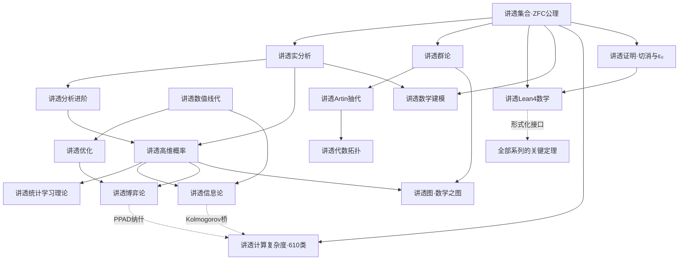

# 讲透数学 · 数学宇宙总目录

> 17 个数学系列（2026-09-06 讲透集合、讲透证明、讲透计算复杂度三刊同日），从公理地基到应用前沿，一个宇宙讲透。
>
> 这不是又一套数学教材索引——每个系列都遵循 work4ai 讲透范式
> **（直觉 → 数学 → 代码跑通 → 不足 → 应用）**，每个定理配 Python 实验、
> 关键定理配 Lean 形式化路径，铁律"每个定理一个反直觉发现"。
>
> 本 README 是宇宙**导航宪法**：分类、依赖、路径、接口。
> 各系列 README 的篇目表仍是各单元自己的目录宪法。

---

## 〇、宇宙地图：六书架 + 一个根

```
                    ┌─────────────┐
                    │  讲透集合 🆕 │  公理地基（创刊中）
                    └──────┬──────┘
        ┌──────────┬───────┼────────┬──────────┐
     分析书架    代数书架   概率书架   应用书架    形式化书架
     实分析      群论      高维概率   数值线代    Lean4数学
     分析进阶    Artin抽代 统计学习理论 信息论
                          代数拓扑           优化
                                            数学建模
                                            博弈论
                          ──────────
                          跨向：图（数学之图是五部之一）
                          跨向：计算复杂度（610 类动物园全量图鉴）
```

## 一、六书架分类表

| 书架 | 系列 | 主线 | 主教材锚点 | 状态 |
|------|------|------|-----------|------|
| 基础 | [`讲透集合/`](讲透集合/) | ZFC 公理 → 宇宙 V → 四大分支 → 六条代码走廊 | Jech / Kunen（待定） | ✅ 五章（五问模板首例） |
| 基础 | [`讲透证明/`](讲透证明/) | 三大证明系统 → 切割消去 → ε₀ 账本 → Curry–Howard → AI 证明器 | Aigner–Ziegler《数学天书》+ Arai | ✅ 五章（五问第二例） |
| 基础 | [`讲透Lean4数学/`](讲透Lean4数学/) | 用 Lean 做数学：NNG → sorry 填空 | Natural Number Game / Tao companion | 🔄 6/18 |
| 分析 | [`讲透实分析/`](讲透实分析/) | ε-δ 严格化微积分 → Lebesgue | Tao《Analysis I》+ Rudin | 🔄 6/16 |
| 分析 | [`讲透分析进阶/`](讲透分析进阶/) | Fourier → 测度 → 泛函 | Stein-Shakarchi 4 卷 | 📝 1/9 |
| 代数 | [`讲透群论/`](讲透群论/) | Sylow → 群作用 → 结构定理 | 待补（Abramson/Artin 混合） | 📝 2/8 |
| 代数 | [`讲透Artin抽代/`](讲透Artin抽代/) | 群环域一路到底 | Artin《Algebra》 | 📝 1/7 |
| 代数 | [`讲透代数拓扑/`](讲透代数拓扑/) | 基本群 → 同调 | Hatcher 前半 | 📝 2/8 |
| 概率 | [`讲透高维概率/`](讲透高维概率/) | 集中不等式 → 次高斯 → 泛化 | Vershynin《High-Dimensional Probability》 | 📝 2/9 |
| 概率 | [`讲透统计学习理论/`](讲透统计学习理论/) | VC 维 → Rademacher → PAC-Bayes | Shalev-Shwartz & Ben-David | 🔄 4 章 |
| 应用 | [`讲透数值线代/`](讲透数值线代/) | 浮点数下的线代：SVD/条件数/迭代法 | Trefethen & Bau | 📝 2/7 |
| 应用 | [`讲透数学建模/`](讲透数学建模/) | 机理→优化→概率统计→数据驱动→AI | 自编（覆盖建模全景） | ✅ 9 篇（8 章+五问X光补篇） |
| 应用 | [`讲透信息论/`](讲透信息论/) | 熵 → 编码 → 互信息 → Transformer 信息流 | Cover & Thomas | ✅ 8 章 |
| 应用 | [`讲透优化/`](讲透优化/) | 权衡的科学与工程：凸分析→在线→组合 | 三卷 52 篇（自编宪法） | ✅ 主体完成 |
| 应用 | [`讲透博弈论/`](讲透博弈论/) | 策略互动：纳什 → 机制设计 → 自博弈 AI | 五卷 20 篇（自编宪法） | ✅ 主体完成 |
| 跨向 | [`讲透图/`](讲透图/) | 图宇宙五部：数学之图是第一部 | 自编（五部全景） | ✅ 8 篇 |
| 跨向 | [`讲透计算复杂度/`](讲透计算复杂度/) | 610 类动物园：全量图鉴六卷 + 8 章讲透 + 5 实验 | complexityzoo.net（快照 2026-09-06） | ✅ 创刊（8 章+图鉴+实验） |

> 跨向说明：`讲透图/` 的重心是跨宇宙的（网络科学/GNN/自动机/知识图谱各占其部），
> 数学之图（图论/谱/组合极值）只是五部之一——它住在数学宇宙，但门朝五个方向开。

## 二、数学知识依赖图



一句话主干：**集合给语言 → 实分析+群论给严格性 → 高维概率+数值线代给现代工具 → 应用书架消费一切**。

## 三、三阶段学习路径（对齐 top-math-courses）

配套路线图：[`../top-math-courses/UNIFIED_ROADMAP.md`](../top-math-courses/UNIFIED_ROADMAP.md) ·
Lean 并行轨：[`../top-math-courses/LEAN_MATH_TRACK.md`](../top-math-courses/LEAN_MATH_TRACK.md)

**阶段 0 · 桥（数学自评 0 起点）**

如果你的微积分还是直觉级、没写过证明，**不要直接上实分析**：
1. 集合语言 + 证明语言 → 本宇宙 [`讲透集合/00-体系结构.md`](讲透集合/00-体系结构.md)
2. Spivak《Calculus》或 MIT 18.01（top-math-courses 阶段 0）
3. 最友好的严格入口：[`讲透数值线代/00-数值线代是什么.md`](讲透数值线代/00-数值线代是什么.md)（矩阵直觉你已有，借它练 ε-δ 式严谨）

**阶段 1 · 地基（3-4 月）**

`讲透实分析` 00-05 + `讲透群论` 00-03，同步 `讲透Lean4数学` 01-04（induction 到函数）。
同步纸笔：Tao Analysis I Ch 5-10 + Lean companion 填 sorry。

**阶段 2 · 支柱（4-6 月）**

`讲透分析进阶`（Fourier/测度/泛函）+ `讲透高维概率` + `讲透Artin抽代`→`讲透代数拓扑`。

**阶段 3 · 应用与前沿（按需并行）**

`讲透统计学习理论`（ML 理论地基）· `讲透优化` · `讲透信息论` · `讲透博弈论` ·
`讲透数学建模`（跨科应用）· `讲透图`（跨宇宙）· `讲透计算复杂度`（610 类图鉴常备手边）。

## 四、与其他宇宙的接口

| 接口 | 本宇宙侧 | 对面 |
|------|---------|------|
| ML 理论 | 统计学习理论 / 高维概率 | `../讲透模型/`（基础模型、微调数学层）、`../讲透PyTorch源码/` |
| 系统与性能 | 数值线代 / 优化 | `../讲透GPU与系统级/`、`../讲透vLLM/`、`../讲透高性能计算/` |
| 形式化 | Lean4数学 / 集合 02-04 章 | `../讲透形式化验证/`、`../讲透神经符号/`（AlphaProof 式闭环） |
| 决策与机制 | 博弈论 / 优化 | `../讲透Agent/`（多智能体）、管理侧应用 |
| 跨学科建模 | 数学建模 | `../实例/讲透AIfor各学科/`（各科数学层） |
| 计算复杂度 | 计算复杂度 | `../讲透形式化验证/`（模型检测=PSPACE 实战，对面 50 章已架反向桥）、`../讲透Agent/` |

## 五、分支X光五问（新系列入场宪法）

任何新数学系列入场，先回答这五问作为章目骨架——`讲透集合` 是首例：

1. **体系结构**：这个分支的整体大厦长什么样？（公理/主干定理/子分支地图）
2. **近五年创新方向**：2021-2026 这个分支在动什么？（不是教材共识，是活的）
3. **语言特征**：表达力（能说什么不能说什么）· 逻辑性质（完备/一致/可判定）· 规范化程度（公理化到哪一级）
4. **可构造性与结构**：哪些对象可构造？结构刚性从哪来？
5. **问题→代码转换**：这个分支的问题怎么变成 code 问题？（可机械化/不可机械化的边界）

> 五问的设计意图：前两问管"知识地图"，中间两问管"数学品味"，最后一问管"工程落点"——
> 与 work4ai 讲透范式（直觉→数学→代码→不足→应用）一一对齐。

## 六、治理

- 本 README = 导航宪法（分类/依赖/路径/接口）；**各系列 README 篇目表 = 各单元宪法**，增删给理由
- 新卡必须挂网：宇宙内新文件必须出现在本 README 或所在系列 README 的篇目表（孤儿 = 死亡内容）
- 合并历史：2026-09-06 由 14 个根目录系列物理合并而来（设计文档：
  [`../docs/superpowers/specs/2026-09-06-讲透数学宇宙合并-design.md`](../docs/superpowers/specs/2026-09-06-讲透数学宇宙合并-design.md)），
  兄弟系列互链 `../X/` 语法在合并中天然免疫
