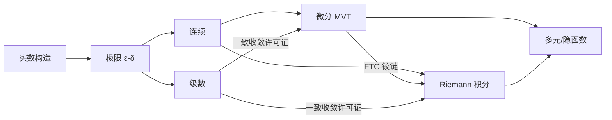

# 00 · 体系结构：从实数到级数——严格微积分的主干地图

> **本章回答五问之一（本支：讲透数学分析）。**
> 数学分析的整座大厦只做一件事：把「会算」升级为「会证」。
> 地基只有一块砖（实数系 ℝ），机器只有一台（ε-δ），五个部件（极限/连续/微分/积分/级数），
> 一条统治权（一致收敛）。

---

## 一、地基：实数系的三种构造

ℚ 会算但漏极限（{1, 1.4, 1.41, …} 在 ℚ 里没有家）。补洞的三条路殊途同归：

| 构造 | 一个实数是什么 | 直觉 | 代价 |
|------|--------------|------|------|
| **Dedekind 切** | 把 ℚ 劈成两半的一刀 (A,B) | "左右分类"=身份证 | 序好定义，运算繁琐 |
| **Cauchy 列** | 柯西序列的等价类 | "精度供应合同"（〔03 章〕的主角） | 运算好定义，序绕一圈 |
| **无穷小数** | 一串嵌套闭区间（区间套） | 直观、计算器友好 | 进位陷阱（0.999…=1） |

三条路的**唯一性定理**是本支规范化的第一课：任何满足「完备有序域」公理的系统
都同构于 ℝ——实数不是被发明的，是被**钉死**的。

> **反直觉发现 #1**：0.999… = 1 不是近似，是**同一个实数的两种身份证**
> （区间套 [0,1]∩[0.9,1]∩[0.99,1]∩… 与 [0,1]∩[1,1] 的交都是 {1}）。
> 「差一点」在 ℝ 里没有户口——完备性就是消灭「差一点」。

## 二、机器：ε-δ 量词游戏（本支的 CPU）

```
lim_{x→a} f(x) = L :  ∀ε>0 ∃δ>0 ∀x ( 0<|x−a|<δ ⟹ |f(x)−L|<ε )
```

本支全部定义都是这一行的**量词重排**（家族层
[`../02-语言特征.md`](../02-语言特征.md) 已给全景表，本支只强调一条）：
数学分析的入门之痛不在计算，在**量词顺序不可交换**——δ 可以依赖 ε 但不得依赖 x，
交换即换定理（逐点 vs 一致）。

## 三、五大件：主干定理链

```
极限 ──► 连续 ──► 微分 ──► 积分 ──► 级数
        (介值/最值)  (MVT引擎)  (FTC=桥梁)  (一致收敛统治)
```

| 部件 | 存在性支柱 | 招牌定理 | 一句话意义 |
|------|-----------|---------|-----------|
| 极限 | 完备性（每个好序列有家） | Bolzano–Weierstrass | 有界必有点积聚 |
| 连续 | 紧性（闭区间=紧集） | 介值/最值定理 | 闭区间上连续函数「行为良好」 |
| 微分 | 可导⟹连续（单行道） | 中值定理 MVT | 把导数不等式翻译成函数不等式的唯一接口 |
| 积分 | Darboux 上下和逼近 | 微积分基本定理 FTC | 微分与积分互逆——两章书合成一门课的铰链 |
| 级数 | 部分和序列的极限 | 判别法体系 | 把无穷加法**定义**成极限过程（〔04 章〕实验） |

> **反直觉发现 #2**：MVT 在向量值函数上**失效**——
> f(t) = (cos t, sin t) 从 t=0 到 2π 回到原点，f(b)−f(a) = 0，
> 但 f′(t) = (−sin t, cos t) 永远长度为 1，没有一处导数为零。
> 标量 MVT 靠的是「高度差 ⟹ 水平切点」的有序性；ℝⁿ 没有这种序。
> 拯救它的不是等式而是**不等式版**（|f(b)−f(a)| ≤ M·|b−a|）——
> 分析的推广常常是从等式退到不等式。

## 四、统治权：一致收敛——交换极限的许可证

五大件各自良定义后，真正的主题只剩一个：**两个极限过程何时可交换**。

| 交换 | 需要的许可证 | 失效时的学费 |
|------|------------|-------------|
| lim 与 ∫ | 一致收敛（+区间紧） | 极限函数的积分 ≠ 积分的极限 |
| lim 与 d/dx | 导数级数一致收敛（不是函数级数！） | 逐项求导出错误答案 |
| lim 与连续 | 一致收敛 | 连续函数的逐点极限可以不连续 |
| 二重级数 | 绝对收敛 | Fubini 失效，重排改变求和（Riemann 重排定理） |

> **反直觉发现 #3**：Weierstrass 函数 W(x)=∑aⁿcos(bⁿπx)（ab>1+3π/2）
> 处处连续、**处处不可微**——每一项都光滑，和却处处长角。
> 连续性在一致收敛下保值（上面第三行），**可微性不保值**：
> 光滑是会丢失的财产。这直接宣判「逐项求导」需要额外许可证。

## 五、多元：同一台机器换剧场

偏导（逐方向的单变量戏）→ 全微分（线性主部，真正的主角）→
链式法则（树的自动机，〔04 章〕AD 的理论出生证）→
隐函数定理（用压缩映射把「解的存在」变「解的构造」，预演
[`../讲透泛函分析/`](../讲透泛函分析/) 的不动点文明）→
反函数定理（局部双射=导数可逆，非线性世界的局部线性化）。

一句话：多元分析 = 一元的 ε-δ + 线性代数工具箱。向量值 MVT 的失效（#2）
已经预告：**维数升高，等式让位给不等式，显式解让位给存在性**。

## 六、依赖图（本支内部的学习顺序）



## Python 层

```bash
python3 experiments/series_convergence_decision.py
# 级数判别法决策树：比式→根式→p/交错逐级裁决 + ∑1/n² vs π²/6 数值收口
```

## 不足层

1. Riemann 积分对极限不友好（需要一致收敛这种重许可证）——这正是通往
   [`../讲透实分析/`](../讲透实分析/) Lebesgue 积分的动机，不是技术缺陷是设计边界
2. 本支语言谈「单个函数」;谈「函数空间」要等泛函
3. 数值判别会失明：实验里交错调和的比式判别因通项变号而数值失明——
   判别法体系是数学定理，不是算法的万能钥匙

## ✍️ 练习

✋ 1. 用区间套构造证明 0.999…=1（三行），再解释为什么 0.0999…=0.1 不构成反例
✋ 2. 证明向量值 MVT 的不等式版 |f(b)−f(a)| ≤ sup‖f′‖·|b−a|
   （提示：对标量 g(t)=⟨f(t), u⟩ 用 MVT，再对 u 取上确界）
✋ 3. 构造连续函数列逐点收敛到不连续极限的显式例子（尖峰滑动），指出一致收敛在哪里失效
🐍 4. 扩展实验：给判别树加 Dirichlet 判别（∑aₙbₙ），用 aₙ=1/n, bₙ=cos n 验证
📖 5. Spivak《Calculus》第 5 版 Part III（极限）+ Part V（级数）——本支地图的纸笔版

---

## 📌 收束

**一块砖（ℝ）、一台机器（ε-δ）、五个部件、一条统治权（一致收敛）。**
下一章 [`01-近五年创新.md`](01-近五年创新.md)：这台三百年老机器
在 2021-2026 被两台新机器（证明助手与 AI）重新上油。
