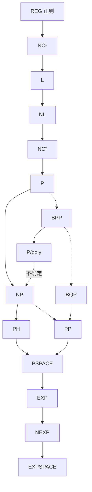

# 00 · 复杂度动物园地图

> 资源轴：全部 · 本文是《讲透计算复杂度》的入口章——在走进任何一间兽舍之前，先看一眼整座动物园的平面图。
> 全系列配套[图鉴](图鉴/00-总目与口径.md)：610 个复杂度类的全量中文化词条（快照自 [complexityzoo.net](https://complexityzoo.net/)）。

---

## 1 直觉：为什么会有 610 个复杂度类？

第一次打开 Complexity Zoo 的人都会被吓到：六百多个类，从 `0-1-NP_C` 到 `ZQP`，几乎每个字母都被开发殆尽。这不是数学家的命名癖发作，而是一个简单乘法的后果——

**一个复杂度类 = (计算模型) × (受限资源) × (答案约定) 的组合。**

三个维度各自展开：

| 维度 | 取值举例 |
|------|---------|
| 计算模型 | 确定图灵机 / 非确定 / 概率 / 量子 / 交替 / 多证明者交互 / 电路（非一致）/ 分支程序 / 单向随机带…… |
| 资源与预算 | 时间（n / poly / quasi-poly / subexp / exp / tower）/ 空间（log / polylog / poly）/ 电路深度与大小 / 通信位数 / 轮数…… |
| 答案约定 | 精确 / 单侧误差 / 双侧有界误差 / 无界误差 / 唯一证据 / 奇偶计数 / 中间位 / 承诺问题…… |

3×3 的组合已经需要 9 个名字，而这个乘法空间的真实维度是十几个。再叠加"算子闭包"（BP·、∃·、/poly、^oracle 这类类变换），类名就像化学式一样生长：`BQP/qpoly`、`P^NP[log]`、`AW[t]`、`ModPH`……610 只是这个乘法空间里**有人认真研究过**的角落数量。

### 动物园简史

- **2002**：Scott Aaronson（"Zookeeper"）建立 Complexity Zoo——最初是他个人维护的网页名录；
- **2005**：转为 wiki（社区可编辑）；Greg Kuperberg 任 "Veterinarian"（兽医——负责纠错）；
- **2012–2020**：滑铁卢大学托管；
- **今**：LessWrong 社区（Oliver Habryka）出资维护，官网自述 547 类——实际按字母页解析已有 **610** 个（计数器失修，见[总目与口径](图鉴/00-总目与口径.md)）。

动物园的姊妹设施：Petting Zoo（入门精选）、Complexity Garden（问题侧）、Complexity Dojo（定理集）、Special Exhibit（量子态与分布的"类"）。

### 本系列的读法

8 章主题章按**资源轴**切分动物园（时间/空间/电路/随机与量子/交互与计数/参数化），每章只深讲 10–20 个"明星物种"，其余 500 多个类住在[图鉴](图鉴/00-总目与口径.md)六卷里，随时可查。主题章读到哪个类，就去图鉴看它的户口。

---

## 2 数学：类是什么，以及主干地图

### 2.1 形式化：类 = 三元组

严格说，一个复杂度类 C 是：

> 一组**语言**（L ⊆ {0,1}*）的集合，其成员资格由如下三元组刻画：
> (机器模型 M, 资源上界 R, 接受条件 A)——
> L ∈ C ⟺ 存在模型 M 的机器，在资源 ≤ R 内运行，且按条件 A 接受恰好在 L 上的输入。

例：**NP** = (非确定图灵机, 多项式时间, "存在接受路径")；**BQP** = (量子图灵机, 多项式时间, "接受概率 ≥2/3")；**P/poly** = (多项式大小电路族, ——, "输出 1")。

这个定义的工程价值：**换掉三元组中任何一格，就得到一个新类**。610 个类就是 610 个被证明"值得单独挂牌"的三元组。

### 2.2 主干包含图（先背下来这张）



实线是**已知包含**（绝大多数不知是否严格）；虚线是已知包含但位置微妙者。这条主干链 `L ⊆ NL ⊆ P ⊆ NP ⊆ PH ⊆ PSPACE ⊆ EXP ⊆ …` 上，**只有 2 之后的飞跃是确定严格的**（P ⊊ EXP 由时间谱系定理保证）——其余每一环都可能是等号。复杂度理论的中心戏剧就在这张图的"缝隙"里。

### 2.3 定理与反直觉：Fagin 定理

**定理（Fagin 1974）**：NP 恰好是可用**存在二阶逻辑**（∃SO）定义的语言类。

```
NP = ∃SO      coNP = ∀SO      PH = SO（量词交替层数对应 PH 层级）
P = SO(Horn) = FO(LFP)        NL = SO(Krom) = FO(TC)        L = FO(DTC)
```

> **反直觉发现**：复杂度类的分层——P、NP、coNP、PH——竟然**原封不动地长在逻辑语法树上**。
> "多项式时间可解"这种看似算法论的性质，与"量词怎么摆"这种看似纯逻辑的性质，是同一个东西的两张脸。这解释了为什么描述复杂度（descriptive complexity）能当数据库查询语言（SQL）的复杂度显微镜用：**查询语言的语法限制 = 查询求值的复杂度上界**。图鉴 [卷3](图鉴/卷3-F至L.md) 的 FO/FO(TC)/FO(LFP) 系列词条与 [卷6](图鉴/卷6-R至Z.md) 的 SO 家族词条是这一定理的全景展开。

### 2.4 一张"户口分布"统计

用 `experiments/00_zoo_pipeline.py` 解析字母页得到的 610 类，按主题章归属粗分：

| 资源家族 | 代表类 | 图鉴分布 |
|---------|--------|---------|
| 时间 | P, NP, PH, EXP, NEXP, E, TOWER | 卷2/卷5 |
| 空间 | L, NL, SL, PSPACE, SC, DET | 卷3/卷5/卷6 |
| 电路（非一致） | AC⁰, TC⁰, NC, P/poly, VP | 卷1/卷4/卷5/卷6 |
| 随机 | RP, ZPP, BPP, PP | 卷1/卷6 |
| 量子 | BQP, QMA, QIP, QNC⁰/🐱 | 卷1/卷2/卷4/卷5 |
| 交互证明 | IP, MIP, MIP*, PCP, SZK | 卷3/卷4/卷5 |
| 计数 | #P, ⊕P, GapP, CH | 符号区/卷2/卷3 |
| 参数化与优化 | FPT, W[t], APX, PPAD | 卷3/卷5/卷6 |

---

## 3 Python：把动物园变成数据

本系列的第一个实验 `experiments/00_zoo_pipeline.py` 干的事，就是本章的方法论化身：

> **一个 wiki 的 27 个字母页 raw wikitext → 610 个结构化词条 → 权威清单 + 分卷方案。**

代码走读（完整版见文件，此处骨架）：

```python
# 每个类在 wikitext 里是一段：
#   ===== <span id="p" ...>P</span>: Polynomial-Time =====
#   定义与包含关系原文……
#   ----
HEAD = re.compile(r'<span id="([^"]+)"[^>]*>(.*?)</span>\s*:?\s*(.*?)\s*=+', re.S)

# 按 "===== " 切块 → 正则抽 id/类名/全称 → 去标签 → 按 span id 去重
```

三条设计决策值得记住（它们在任何"百科→数据"管线里都通用）：

1. **以结构锚点（span id）为权威键**，不以链接文本为键——主页上 `NPC`、`PR` 出现两次、`O2P` 链接已死，全靠锚点去重与对账；
2. **保留原文片段**（body 字段）而非当场摘要——词条写作时再蒸馏，随时可回溯核对（本系列图鉴的铁律"定义锚定原文"由此可执行）；
3. **切分参数（分卷）交给确定性算法**（字母序连续切分、极小化卷差）——不拍脑袋。

这正呼应 07 章的主题：**复杂度理论的核心动作"归约"，在工程上就是"数据变换管线的组合"**。

---

## 4 不足：为什么我们还证不出 P ≠ NP

在动物园里逛一圈，你会发现几乎所有的"严格分离"都集中在**指数级以上**（谱系定理）或**常数深度电路**（AC⁰ 下界）两个极端。中间广袤的 polynomial 地带寸步难行，原因被总结为三大障碍：

| 障碍 | 一句话 | 主战场 |
|------|--------|--------|
| **相对化**（Baker-Gill-Solovay 1975） | 存在 oracle 使 P=NP、也存在 oracle 使 P≠NP——**一切相对化的证明技术（对角化）注定失败** | 01 章 |
| **自然证明**（Razborov-Rudich 1997） | 证明电路下界的多数"自然"方法，同时会构造出可破解的伪随机生成器——**方法本身自毁** | 03 章 |
| **代数化**（Aaronson-Wigderson 2008） | 即使非相对化的算术化技术（IP=PSPACE 的功臣），在带代数 oracle 的世界也失效 | 05 章 |

> **反直觉发现**：三大障碍全是"自指式"的——不是"我们不够聪明"，而是**这类证明如果存在，会顺带证明别的不可能成立的东西**。数学史上这类"不可能证明某类证明"的元定理（哥德尔不完备、停机问题）总是最深的那批。详见各章。

另一个不足是**类的命名通胀**本身：YACC（"Yet Another Complexity Class"）作为讥讽被动物园自嘲式收录（[卷6](图鉴/卷6-R至Z.md)）。610 个类里真正"该背下来"的不到 50 个——本系列 8 章就是这 50 个的筛选器。

---

## 5 应用：怎么用这座动物园

**查类**：[总目](图鉴/00-总目与口径.md)按 id 排序 → 跳卷 → 词条含定义/关键关系/原文链接。

**配兄弟系列**：

| 你在学 | 接口 |
|--------|------|
| [讲透信息论](../讲透信息论/) | Kolmogorov 复杂度 oracle（`P^K` 含 PSPACE，`BPP^KT` 可分解整数——图鉴卷1/卷5词条）；熵与 #P 计数的渊源 |
| [讲透博弈论](../讲透博弈论/) | 纳什均衡计算 = PPAD-完全（DGP05，图鉴卷5）；RG 裁判博弈（卷6） |
| [讲透优化](../讲透优化/) | APX/PTAS/松弛舍入（06 章）；线性的规划的复杂度位置（P，Kha79） |
| [讲透图](../讲透图/) | 图同构的复杂度户口（GI ⊆ NP∩coAM，卷3）；3SUM/细粒度（06 章） |
| [讲透形式化验证](../../讲透形式化验证/) | 模型检测 = PSPACE/EXPTIME 实战（02 章）；TLA+/BDD 是空间类的工程化身 |
| [讲透Lean4数学](../讲透Lean4数学/) | 计算理论在 Mathlib 的形式化现状（07 章展望） |

**AI 时代的适用性判词**（对本仓读者）：LLM 推理链长度 ≈ 串行时间；注意力层固定深度 ≈ 电路深度常数；CoT 展开正在把"深度换长度"——这与 NC（并行）vs P（串行）的经典权衡同构。复杂度动物园不是古生物学，是 AI 系统的资源图谱。（此话题在 07 章以代码视角展开。）

---

## 6 练习

**✋ 手算**

1. 用三元组（模型/资源/约定）写出 BPP、#P、P/poly 的定义，并各指出一个"换一格得到的新类"。
2. 在主干包含图上标出：哪些包含是谱系定理保证严格的？哪些等号没被排除？
3. Fagin 定理说 NP = ∃SO。写出"图 k-可着色"的 ∃SO 句子（存在一个颜色函数使得……）。

**🐍 编程**

4. 跑 `experiments/00_zoo_pipeline.py`（raw 缓存就位时），改 `volumes()` 的目标卷数为 8，观察分卷方案变化——并解释为什么 P 区（87 条）注定独占一卷。
5. 统计六卷图鉴里含"oracle"字样的词条数，与总数对比——相对化在复杂度话语里的密度。

**⚡ 进阶**

6. 读 Baker-Gill-Solovay 1975 的构造概要（可从图鉴 NPC 词条的引用出发），回答：为什么"P=NP 的对角化证明"与"P≠NP 的对角化证明"都不可能成功？
7. Complexity Zoo 的计数器为什么停在 547 而实际有 610？给出一个 wiki 治理机制的解释，并对比 NIST 数据库或 OEIS 的类似漂移案例。

---

*下一章：[01 · 时间类](01-时间类.md)——从 P 到 NP 到 PH，复杂度理论最著名的那些"缝隙"。*
