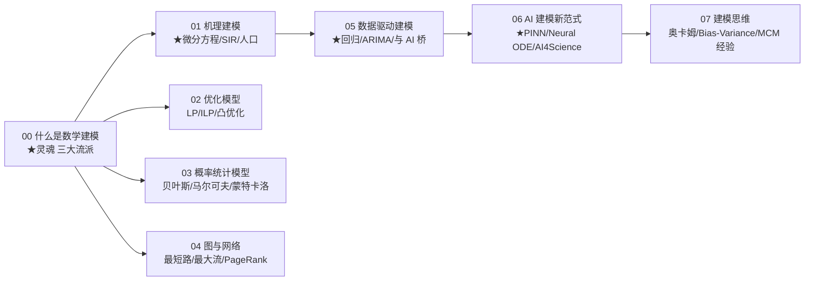

# 讲透数学建模 (Mathematical Modeling, 透) · 完整版

> **数学建模 = 把现实问题翻译成数学的能力。** AI 工程师最该补的基础之一。本系列从经典建模（微分方程/优化/统计/图）到现代 AI 建模（神经网络/PINN/Neural ODE），讲透三大流派的取舍——以及为什么 AlphaFold、PINN、AI4Science 是数学建模的"文艺复兴"。

**8 篇主线，从"什么是建模"一路讲到 AI4Science 的前沿。**

---

## 这份教程为谁而写

- 用过神经网络，但**遇到非 AI 的现实问题就懵了**（如：怎么用数学描述一个供应链？一个传染病？一个股票市场？）的人。
- 听过 SIR 模型、线性规划、马尔可夫链，但**不知道它们与 AI 是什么关系**的人。
- 想参加数学建模竞赛（MCM/ICM/CUMCM）但**没系统学过建模思维**的人。
- 做过 AI4Science，但**不理解机理建模和 AI 建模怎么融合**（PINN/Neural ODE）的人。
- 想知道"为什么 AI 不是万能的"——什么时候该用 AI，什么时候该用经典建模。

## 教学宪法（每章遵守）

每个概念按三层呈现：**直觉（比喻）→ 数学（公式与边界）→ 代码（bash 跑通的实证）**。诚实标注哪些是"已证明"、哪些是"经验现象"、哪些"仍未解决"。结尾固定给出 **📌 下一步** 与（核心章）**✍️ 练习**。

## 灵魂：三大建模流派

> **数学建模有三大流派：机理建模（用物理/化学/生物规律列方程）、统计建模（从数据拟合关系）、AI 建模（用神经网络学函数）。三者各有优劣——机理可解释但难算、统计简单但外推差、AI 强大但黑箱。现代趋势是三者融合（PINN、Neural ODE、AI4Science）。**

$$
\underbrace{\text{机理建模}}_{\text{白箱 · 可解释}}
\quad+\quad
\underbrace{\text{统计建模}}_{\text{灰箱 · 简单}}
\quad+\quad
\underbrace{\text{AI 建模}}_{\text{黑箱 · 强大}}
\;\longrightarrow\;
\text{混合建模 (PINN/Neural ODE/AI4Science)}
$$

## 核心实证（实验 00）

> 用同一个真实问题（传染病传播），对比三种建模方法。

| 方法 | 拐点预测 | 数据需求 | 可解释性 | 外推能力 |
|------|:------:|:------:|:------:|:------:|
| **SIR 微分方程** | ✅ 准确 | 低（参数少）| ✅ 完全白箱 | ✅ 强 |
| 多项式拟合 | ❌ 不行 | 中 | 灰箱 | ❌ 差 |
| 神经网络拟合 | △ 拟合好 | 高（大数据）| ❌ 黑箱 | ❌ 差 |

**结论**：AI 不是万能的。**机理已知时**（如传染病有 SIR 方程），机理建模完胜 AI。**机理未知时**（如图像识别、自然语言），AI 唯一可行。**部分已知时**（如流体力学有 Navier-Stokes），用 PINN 融合。

## 目录与学习路径



| 章节 | 文档 | 回答的问题 | 实验 |
|------|------|-----------|------|
| 00 | [00-什么是数学建模.md](00-什么是数学建模.md) | 三大流派的区别？AI 是建模吗？ | `00_what_is_modeling.py` ★ |
| 01 | 01-机理建模.md | 微分方程怎么建模？SIR/Logistic？ | `01_mechanistic.py` ★ |
| 02 | 02-优化模型.md | LP/ILP/凸优化？什么时候用？ | `02_optimization.py` |
| 03 | 03-概率统计模型.md | 贝叶斯/马尔可夫/蒙特卡洛？ | `03_stochastic.py` |
| 04 | 04-图与网络.md | 最短路/最大流/PageRank？ | `04_graph.py` |
| 05 | 05-数据驱动建模.md | 回归/ARIMA 与 AI 的关系？ | `05_data_driven.py` ★ |
| 06 | 06-AI建模新范式.md | PINN/Neural ODE/AI4Science？ | `06_ai_modeling.py` ★ |
| 07 | 07-建模思维.md | 奥卡姆/Bias-Variance/MCM 经验？ | （理论）|

## 怎么跑

```bash
cd /data/usershare/ai/work4ai/讲透数学建模
python3 -u experiments/00_what_is_modeling.py    # 三大流派对比
python3 -u experiments/01_mechanistic.py          # SIR 传染病
python3 -u experiments/02_optimization.py         # LP 生产计划
python3 -u experiments/03_stochastic.py           # 蒙特卡洛
python3 -u experiments/04_graph.py                # PageRank
python3 -u experiments/05_data_driven.py          # 回归 vs AI
python3 -u experiments/06_ai_modeling.py          # PINN demo
```

每个脚本自包含、几秒内跑完、打印结论性数字。

---

## 核心方法论（"讲透"标准）

1. **原理优先于 API**：先讲为什么，再讲怎么调库。
2. **每个结论都有可运行代码佐证**：不凭记忆下断言，数字都是跑出来的。
3. **批判性**：每篇结尾有「局限与争议」，不把漂亮理论当教条。
4. **跨流派对比**：每个问题都用三大流派分别建模，让读者看清取舍。

---

## 贯穿全系列的七个核心洞见

1. **三大流派各有优劣**（00）：机理白箱难算，统计简单外推差，AI 强大黑箱。
2. **微分方程是机理建模的核心**（01）：SIR 预测传染病拐点，Logistic 预测种群上限。
3. **优化模型无处不在**（02）：供应链、调度、推荐排序都是优化。
4. **随机性是现实本质**（03）：蒙特卡洛用采样解决高维问题。
5. **图论是关系建模**（04）：PageRank、社交网络、知识图谱。
6. **AI 是建模的"通用逼近器"**（05）：但代价是黑箱 + 数据饥渴。
7. **混合建模是未来**（06）：PINN 把机理方程塞进神经网络 loss，鱼与熊掌兼得。

## 前置要求

- **数学**：求和、求导、矩阵、概率基础。微分方程概念逐步解释。
- **代码**：能读懂 Python + NumPy。
- **背景**：知道"AI 训练有 loss"即可。

## 与其他系列的关系

- [`../讲透模型/`](../讲透模型/)：本系列 00 把"AI 模型"放在更大的"数学建模"框架里看。
- [`../讲透控制论/`](../讲透控制论/)：控制论 = 动态系统建模 + 反馈控制，本系列 01 是其前置。
- [`../讲透信息论/`](../讲透信息论/)：信息论 = 数据建模的概率工具，本系列 03 与之互补。
- [`../讲透系统论/`](../讲透系统论/)：系统论 = 复杂系统建模，本系列 04 与之桥接。
- [`../讲透AI应用全景/01-AI4Science.md`](../讲透AI应用全景/01-AI4Science.md)：本系列 06 是其理论基础。

---

📌 **下一步**：从 [00-什么是数学建模.md](00-什么是数学建模.md) 开始，看实验如何用同一个传染病问题对比三大流派；或跳 [01-机理建模.md](01-机理建模.md) 看 SIR 模型怎么预测拐点；或直奔 [06-AI建模新范式.md](06-AI建模新范式.md) 看 PINN 怎么融合机理和 AI。
