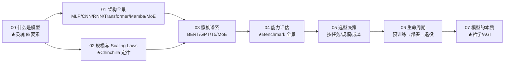

# 讲透模型 (Models, 透) · 完整版

> **"模型"是 AI 里被滥用最多的词。** 参数？架构？权重？能力？产品？本系列从 8 个维度把它彻底讲透——什么是模型、架构全景、Scaling Laws、家族谱系、能力评估、选型决策、生命周期、本质哲学。
>
> 用「直觉 → 数学 → 代码跑通 → 不足 → 应用」的方式。每一篇配一个能跑出反直觉结论的 Python 实验。

**8 篇主线，从"什么是模型"一路讲到"模型的本质"。**

---

## 这份教程为谁而写

- 听过 GPT/Llama/Qwen/DeepSeek/Mistral，但**分不清它们的设计哲学差异**的人。
- 知道"模型有参数"，但**讲不清参数、架构、权重的区别**的人。
- 选模型时只会"用最大的"，但**不知道按什么维度选**的人。
- 用过 HuggingFace，但**不理解模型生命周期的工程考虑**的人。
- 想知道"模型到底懂了什么"——不只是调 API，而是看懂 AI 本质的人。

## 教学宪法（每章遵守）

每个概念按三层呈现：**直觉（比喻）→ 数学（公式与边界）→ 代码（bash 跑通的实证）**。诚实标注哪些是"已证明"、哪些是"经验现象"、哪些"仍未解决"。结尾固定给出 **📌 下一步** 与（核心章）**✍️ 练习**。

## 灵魂：一句话钉死

> **模型 = 架构（怎么算）+ 参数（算什么）+ 权重（具体值）+ 训练目标（学什么）。四个维度共同决定模型能做什么。改变任意一个，就是不同的模型。**

$$
\underbrace{\text{Architecture}}_{\text{怎么算}} \times
\underbrace{\text{Parameters}}_{\text{算什么}} \times
\underbrace{\text{Weights}}_{\text{具体值}} \times
\underbrace{\text{Objective}}_{\text{学什么}} = \text{Model}
$$

**关键**：同一个架构（Transformer）+ 同一个规模（70B）+ 不同训练目标（base/instruct/code），是**三个完全不同的模型**。

## 目录与学习路径



| 章节 | 文档 | 回答的问题 | 实验 |
|------|------|-----------|------|
| 00 | [00-什么是模型.md](00-什么是模型.md) | 模型到底是什么？参数/架构/权重/目标四要素？ | `00_what_is_model.py` ★ |
| 01 | 01-架构全景.md | MLP/CNN/RNN/Transformer/Mamba/MoE 各自的归纳偏置？ | `01_architectures.py` |
| 02 | 02-规模与ScalingLaws.md | 为什么越大越准？Chinchilla 定律？ | `02_scaling.py` ★ |
| 03 | 03-家族谱系.md | BERT/GPT/T5/MoE 设计哲学差异？ | `03_families.py` |
| 04 | 04-能力评估.md | 怎么衡量模型能力？Benchmark 陷阱？ | `04_eval.py` ★ |
| 05 | 05-选型决策.md | 我的场景该选哪个模型？决策树？ | `05_selection.py` |
| 06 | 06-生命周期.md | 预训练→对齐→部署→监控→退役，每步做什么？ | `06_lifecycle.py` |
| 07 | 07-模型的本质.md | 模型"懂"了什么？AGI？世界模型？ | （理论）|

## 怎么跑

```bash
cd /data/usershare/ai/work4ai/讲透模型
python3 -u experiments/00_what_is_model.py    # 四要素实证
python3 -u experiments/01_architectures.py     # 架构对比
python3 -u experiments/02_scaling.py           # Scaling Laws
python3 -u experiments/03_families.py          # 家族对比
python3 -u experiments/04_eval.py              # Benchmark 陷阱
python3 -u experiments/05_selection.py         # 选型决策
python3 -u experiments/06_lifecycle.py         # 生命周期成本
```

每个脚本自包含、几秒内跑完、打印结论性数字。

---

## 核心方法论（"讲透"标准）

1. **原理优先于 API**：先讲为什么，再讲怎么调库。
2. **每个结论都有可运行代码佐证**：不凭记忆下断言，数字都是跑出来的。
3. **批判性**：每篇结尾有「局限与争议」，不把漂亮理论当教条。
4. **多维度**：模型不是单一概念，本系列从 8 个维度讲透。

---

## 贯穿全系列的八个核心洞见

1. **模型 = 架构 + 参数 + 权重 + 目标**（00）：四个要素，缺一不可，改一个就是不同模型。
2. **架构 = 归纳偏置**（01）：CNN 假设平移不变，RNN 假设时序，Transformer 假设全连接。
3. **Scaling Laws 是经验幂律**（02）：loss ∝ 参数量^−0.05，可外推预测。
4. **家族差异在训练目标**（03）：BERT 用 mask，GPT 用 next-token，T5 用 seq2seq，MoE 用稀疏激活。
5. **评估比训练更难**（04）：data contamination、benchmark gaming 让"分数高"≠"能力强"。
6. **选型 = 任务 × 规模 × 成本**（05）：没有银弹，按场景三维权衡。
7. **生命周期 = 工程全局**（06）：预训练贵、对齐难、部署要快、监控要稳、退役要早。
8. **"懂"是哲学问题**（07）：模型是否真理解？AGI 路径？这是本系列的开放结尾。

## 前置要求

- **数学**：矩阵乘、softmax、概率基础。
- **代码**：能读懂 PyTorch / NumPy。
- **背景**：知道"AI 要训练"即可。

## 与其他系列的关系

- [`../讲透基础模型/`](../讲透基础模型/)：本系列 00 与之互补——基础模型讲"为什么预测下一个词产生智能"，本系列讲"模型本身是什么"。
- [`../讲透Transformer/`](../讲透Transformer/)：本系列 01 篇把 Transformer 放在架构演进史里看。
- [`../讲透微调/`](../讲透微调/)：本系列 06 篇覆盖生命周期的"对齐"阶段。
- [`../讲透世界模型/`](../讲透世界模型/)：本系列 07 篇与世界模型对应——Yann LeCun 推的世界模型是模型本质的一种回答。

---

📌 **下一步**：从 [00-什么是模型.md](00-什么是模型.md) 开始，看实验如何用同一份数据证明"架构+参数+权重+目标"四要素的差异；或直接跳 [02-规模与ScalingLaws.md](02-规模与ScalingLaws.md) 看 Chinchilla 定律；或直奔 [05-选型决策.md](05-选型决策.md) 看实战选型决策树。
