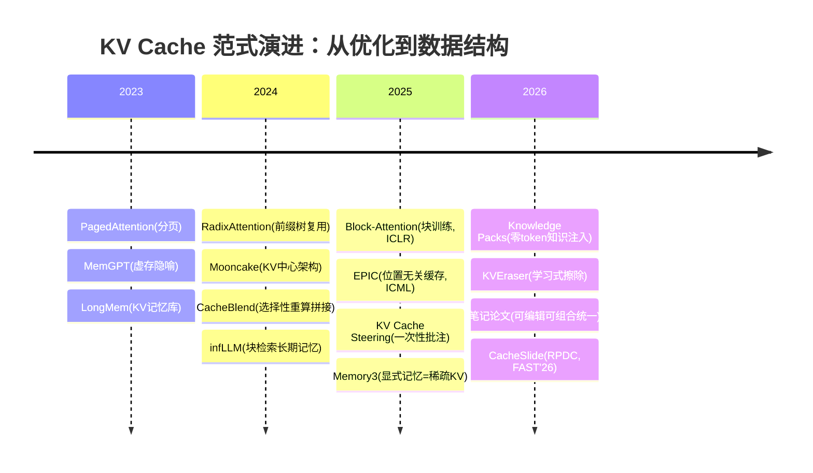

# 08 · KV Cache 不是一次性的：可编辑、可组合的"笔记"

> 本章是「讲透 KV Cache」的范式收束章。一句话定位：**前七章把 KV Cache 当"算完即弃的草稿纸"优化（省显存、省计算）；2024-2026 的一条新线把它重新定义为"笔记本"——可以摘抄（跨请求复用）、拼接（模块化组装）、批注（推理时编辑）、删除（可召回压缩）、归档（外部长期记忆）。**
>
> 范式宣言是 arXiv:2606.17107《Models Take Notes at Prefill: KV Cache Can Be Editable and Composable》（2026-06）：prefill 不是"预处理"，而是模型在**记笔记**——把字段条件的结论写进下游 token 的 K/V 里。一旦读成笔记本，两个能力自然浮现：**可编辑**（改结论不用重算全文）与**可组合**（预编译的技能块可以 RoPE 重定位后拼进任意上下文）。
>
> 配套实验：`experiments/08_kv_notes.py`（Qwen2.5-0.5B-Instruct，CPU 可跑，2026-08-25 实测，三组证据全部可复现）

---

## 一、直觉层：从"草稿纸"到"笔记本"

### 1.1 旧世界观 vs 新世界观

- **旧世界观（00-05 章的默认视角）**：KV Cache 是推理的副产品。请求来了算一次，生成完就扔。所有优化都是"让这块草稿纸更便宜"——分页（PagedAttention）、压缩（MLA）、量化（KIVI）。
- **新世界观（本章）**：草稿纸上的内容**本身就是资产**。同一段 system prompt 每天被上万请求重复"誊写"；同一个 RAG 文档被反复检索重新编码；Agent 的长策略每个 turn 都重算一遍——**全是浪费的记笔记劳动**。2024-2026 的系统研究开始把 KV 当成一等公民的数据结构来管理。

### 1.2 五个动词，一张地图

| 动词 | 对笔记的操作 | 代表系统/论文（全部一手核实） | 关键数字 |
|------|------------|------------------------------|---------|
| **摘抄**（复用） | 同一页笔记服务多个请求 | vLLM Prefix Caching（[02 章](./02-PagedAttention深挖.md)）；SGLang RadixAttention（arXiv:2312.07104）；Mooncake（arXiv:2407.00079）；厂商 prompt caching（见 [CACH-00](../../讲透Agent/讲透上下文缓存/README.md)） | SGLang 吞吐最高 6.4×；Mooncake 真实负载 +75% 请求量 |
| **拼接**（组合） | 多段预编码笔记组装成一页 | Block-Attention（arXiv:2409.15355，ICLR'25）；CacheBlend（arXiv:2405.16444，EuroSys'25）；EPIC（arXiv:2410.15332，ICML'25）；CacheSlide（FAST'26，RPDC 范式） | 32K 输入 TTFT 45ms（↓98.7%）；CacheBlend 重算 <15% token，TTFT ↓2.2-3.3×；EPIC LegoLink 每块只重算 ≤32 个 token |
| **批注**（编辑） | 推理时改写/追加/擦除笔记内容 | KV Cache Steering（arXiv:2507.08799）；Knowledge Packs（arXiv:2604.03270）；KVEraser（arXiv:2606.17034）；**笔记论文（arXiv:2606.17107）** | 勘误式编辑 P(正确)=1.00（8B，~1% 算力）；KVEraser 延迟仅 +24%（对照重算 17.6×） |
| **删除**（压缩） | 撕掉不重要的页、可召回地撕 | H2O / SnapKV / KIVI（[05 章](./05-KVCache量化.md)）；ClusterKV（arXiv:2412.03213，语义簇召回） | ClusterKV 32K 上下文用 1-2K 预算，延迟 ↓2× |
| **归档**（外存） | 笔记本放进仓库，按需取回 | LongMem（arXiv:2306.07174，NeurIPS'23）；infLLM（arXiv:2402.04617）；Memory3（arXiv:2407.01178）；MemGPT（arXiv:2310.08560） | LongMem 记忆库 65K；infLLM 免训练到 1M+；Memory3 显式记忆=稀疏 KV，2.4B 胜更大模型 |

> 🎯 **一句话**：前两个动词解决"**别重抄笔记**"（性能），后三个动词解决"**笔记本身可管理**"（能力）。笔记论文（2606.17107）第一次把五个动词统一在一个机制解释下。

### 1.3 为什么现在才发生

- **经济压力**：长上下文 + Agent 多轮工作流让 prefill 成本指数上升（Agent 一个任务动辄几十万 token 的重复前缀，见 CacheSlide 的 RPDC 动机）。
- **机制理解成熟**：retrieval head（arXiv:2404.15574，ICLR'25）等可解释性工作弄清了"哪些笔记在被谁读"，编辑和拼接才敢下手。
- **基础设施就位**：PagedAttention/RadixAttention 把 KV 变成了可寻址的数据结构——**先把笔记变成"页"，才谈得上"撕页/换页/拼页"**。

---

## 二、数学层：三个使能事实

### 2.1 事实一：因果掩码 → KV-前缀等价（"摘抄"的根基）

自回归注意力有因果性：token $j$ 的 $K_j, V_j$ 只依赖 $x_{\le j}$，与之后的内容无关。因此：

$$
\text{KV}(A \circ B)\big|_{A\text{ 段}} = \text{KV}(A)
$$

把整段 $A\circ B$ 一次编码，与先编码 $A$ 缓存、再喂 $B$ 增量编码，**逐位等价**（Knowledge Packs 在 Qwen3-8B/Llama-3.1-8B 上 700 个问题零分歧；本章实验 E2 的"增量组装"cos=0.999996+）。这就是 prefix caching / chunked prefill / 所有复用技术的数学许可。

**边界**：等价只对"**连续前缀**"成立。若 $B$ 段单独编码（位置从 0 起步），它没有见过 $A$，其 K/V 缺少对 $A$ 的跨块注意力——拼接 ≠ 重算。这是 CacheBlend/EPIC 要解决的核心裂缝。

### 2.2 事实二：RoPE 旋转复合律 → 位置可平移（"拼接"的根基）

RoPE 把位置 $p$ 编码为逐 2D 子空间的旋转 $R(p\theta_j)$，只作用于 Q/K。旋转满足复合律：

$$
R\big((p+\Delta)\theta_j\big) = R(\Delta\theta_j)\, R(p\theta_j)
$$

所以**已编码的 K 可以事后"平移"**：对独立编码的 B 段的 K 额外旋转 $\Delta=|A|$，等价于它在位置 $|A|$ 处编码；V 不带位置信息，无需处理。这正是笔记论文"position-portable notes"与本章实验 `rotate_keys_by_delta()` 的数学内核。

**边界**：平移只修复**位置**，修复不了**内容**（B 的 K/V 在编码时没看过 A）。修复内容需要选择性重算：CacheBlend 按注意力稀疏性重算 <15% 的 token；EPIC 的 LegoLink 发现每块开头 ≤32 个 token 吸收了不成比例的注意力（attention sink），只重算它们；Block-Attention 干脆训练模型适应"块间不互看"（微调后 49.9%→70.0%）。

### 2.3 事实三：softmax 加性分解 + 结论下沉（"编辑"的根基与陷阱）

第 $t$ 步的输出对每条笔记的依赖是加性的：

$$
\text{out}_t = \sum_i \alpha_{t,i}\, v_i, \qquad \alpha_{t,i} = \frac{\exp(q_t \cdot k_i / \sqrt{d})}{\sum_j \exp(q_t \cdot k_j / \sqrt{d})}
$$

改一条 $v_i$ → 输出按 $\alpha_{t,i}$ 权重变化；加一条"假笔记"（伪造 K/V）→ 相当于注意力级别的批注（KV Cache Steering 的做法）。看起来编辑应该很自由，**但笔记论文给出了泼冷水的机制发现**：

> prefill 时，模型已经把"字段条件的结论"**写进了字段下游 token 的 K/V**。决策 token 读的是下游笔记里的结论，字段自身的 K/V 对决策的贡献 **<1%**（四个模型家族因果验证）。

推论：**原地改字段 = 改了一行没人再读的笔记，决策不变**。有效的编辑姿势有三种（按论文排序）：
1. **追加勘误**（erratum，稳健默认）：在问题附近追加一条高显著度的更正，决策 token 会读到新权威——append-only，与生产 prefix cache 完美兼容；
2. **重算受影响下游**（保真但贵）：字段后整个后缀重算，或只重算因果效应最大的 top-K 条笔记（K* 强模型依赖，8B 时 ≈4，4B 时 >64——不可靠的手术刀）；
3. **只改字段自身 KV**（~1% 算力）：**被 CoT 门控**——有思维链时模型会"重读原文"，编辑生效（Qwen3-8B 上 P=1.00）；无 CoT 时同一编辑被无视（P=0.00）。

---

## 三、代码层：三组实验，全部实测

脚本：[`experiments/08_kv_notes.py`](./experiments/08_kv_notes.py)。环境：Qwen2.5-0.5B-Instruct，CPU float32，transformers 5.10 dev（cache 结构为 `cache.layers[i].keys/.values`，形状 `[1, kv_heads=2, seq, head_dim=64]`）。2026-08-25 实测。

### E1 摘抄：前缀复用 vs 全量重算

194-token 规章制度前缀，3 个问题：

| 指标 | 数值 |
|------|------|
| logits 最大绝对差（复用 vs 重算） | **8.39e-05**（float32 数值噪声级 → 逐位等价） |
| 3 问全量重算 vs 复用前缀 | 10.0s vs 3.9s（**省 61%**，不含一次性 prefill） |

### E2 拼接：A、B 两段月球知识（102+86 tokens），双向提问

| 编码方式 | 问A（信息在A段） | 问B（信息在B段） | logits cos vs 重算 |
|---------|----------------|----------------|------------------|
| 全量重算（参照） | "阿姆斯特朗。" ✓ | "大约21公斤。" ✓ | 1.0 |
| **增量组装**（位置连续） | 同上 ✓ | 同上 ✓ | **0.999996 / 0.999999** |
| 重旋转拼接（独立编码 B + RoPE 平移） | "阿波罗十一号" ✗ | **"2004年诺贝尔奖获得"**（幻觉）✗ | 0.9495 / 0.9008 |
| 天真拼接（不旋转） | ✗ | 意外答对 | 0.9726 / 0.9275 |

三个教训：
1. **位置连续的组装是免费的**（= 事实一），chunked prefill 就是在用它；
2. **盲拼接（无论旋不旋转）≠ 重算**——B 段没见过 A，跨块注意力缺失，问B 上甚至产生幻觉。重旋转修复距离分布但修不了内容，这正是 CacheBlend（重算 <15%）/ EPIC（重算边界 ≤32 token）存在的理由；
3. 天真拼接 cos 反而略高提醒我们：**单样本的 cos 与"答案好坏"不是一回事**，位置错乱的误差方向未必投影到答案方向——评估拼接质量要看决策一致性，不是单个标量。

### E3 批注：改"门禁密码 8848→1795"，薄/厚上下文对照

用 P(8\*)/P(1\*)（答案位上 8848 与 1795 首位数字的概率）量化：

| 条件 | 薄上下文（15 tok） | 厚上下文（103 tok，下游多句围绕密码展开） |
|------|------------------|----------------------------------------|
| 基线 | 8848（P8=0.969） | 8848（P8=0.974） |
| 天真字段编辑（原地覆写 K/V） | **1795（P1=0.960，完全翻转）** | **1795（P1=0.946，完全翻转）** |
| 追加勘误 | 8848（P8=0.620，P1=0.326——大幅松动但未翻转） | 8848（P8=0.844） |

**诚实结论：0.5B 上我们的结果与笔记论文在 8B 级的系统发现相反**——天真编辑完全生效，勘误反而弱势。这不是实验失败，而是把"编辑可靠性"的边界变量暴露了出来：

- **规模**：结论下沉（memoization）是深层网络行为，随规模增强（论文自己的 E3 附录：Qwen3 家族内 stickiness 随规模爬升）。0.5B 的"笔记"还没厚到让字段 KV 无关紧要；
- **指令遵循**：勘依赖模型把"[状态更新]…覆盖一切"当权威指令执行，0.5B 做不到位（薄上下文下勘误仍把 P1 从 0.004 拉到 0.326，说明信号在、只是不够强）；
- **笔记厚度**：厚上下文下勘误的翻转难度反而更大（0.844 vs 0.620）——旧结论抄得越多，新更正要盖住的越多。

> 🔑 **方法论警示**：单点小模型实验不能推翻系统证据，但能校准它的适用域。在 8B 级模型上复现 E3（改 P 测量即可）是本章的推荐练习。

---

## 四、系统层：2024-2026 生态谱系（含演进逻辑）

三条演进脉络：
1. **复用范围不断扩大**：精确前缀（vLLM APC）→ 前缀树共享（RadixAttention）→ 任意位置块（CacheBlend/EPIC/PIC）→ 保持相对顺序的段（CacheSlide 的 RPDC，专为 Agent 提示词形态设计）。每一扩都伴随"位置错配"新问题（CacheSlide 称之为 PMKD，Positionally Misaligned KV Drift）。
2. **编辑手段不断升级**：加性 steering（2507.08799，一次性改 cache 比逐步改激活更稳）→ 对比 V-delta 双通道（2604.03270：知识注入走 K 对齐 + 行为引导走 V 空间，因 RoPE 使 K 算术破坏一致性而 V 空间自由）→ 学习式擦除（2606.17034：训练一个 eraser 模块生成替代 KV 状态）。
3. **记忆层级显式化**：Memory3 给出三层记忆公式——纯文本（RAG，写入贵读取贵）→ 显式记忆（稀疏 KV，写入便宜读取极便宜）→ 模型参数（写入极贵读取免费）；MemGPT 用 OS 虚存分页隐喻让 LLM 自管理。KV 笔记恰好卡在中间层，这是它"比 RAG 快、比参数新"的生态位。

---

## 五、机制显微镜：谁在读这些笔记

retrieval head（arXiv:2404.15574）：长上下文事实性由 **<5% 的注意力头**承担，它们把相关信息从输入"搬运"到输出。五个性质——普遍（所有测的长上下文模型都有）/稀疏/内在（预训练短上下文时已存在）/动态激活/**因果**（剪掉它们→检索失败→幻觉；剪随机头→无影响）。

对笔记范式的两重含义：
- **压缩的隐形雷区**：不看 retrieval head 的 KV 驱逐会丢事实性——这就是 ClusterKV 做"可召回压缩"、SnapKV 按观测窗口选 token 的机制动机；
- **编辑的手术导航**：决策读的是哪些头、哪些位置，决定了"改哪里才有人看"（笔记论文的 top-K 选择正按因果效应排序）。

---

## 六、批判层：坑、边界与安全

1. **模型绑定**：KV 笔记与权重强耦合（$K=XW_K^\top$），**不能跨模型拼接**，模型升级 = 全部笔记作废；量化格式变化同理。
2. **位置锚定**：非前缀复用必须处理 RoPE 平移；连续拼接有 PMKD 漂移问题（CacheSlide 的核心动机），天真拼接质量不可控（E2 实测）。
3. **跨块注意力缺失**：独立编码的块拼起来 ≠ 整体编码（E2 的幻觉案例）。选择性重算比例（<15% / ≤32 token）是质量-速度的旋钮，且强模型依赖。
4. **编辑不可组合验证**：改了 A 可能悄悄破坏 B（局部编辑全局后果，KVEraser 的出发点）；勘误式编辑在弱指令遵循模型上失效（E3 实测）。
5. **安全——跨用户泄漏**：共享 prefix cache 意味着缓存时序/命中率可能成为侧信道；多租户服务要按用户/租户隔离 cache 命名空间（Mooncake 这类显式 cache ID 架构给了控制点，也给了新的攻击面）。
6. **安全——cache 投毒**：可编辑=可注入。伪造的 K/V"笔记"绕过 token 层的可见性（用户在 prompt 里看不到被注入的内容），持久化 cache 让注入可跨会话存活。审计与签名会成为部署刚需。
7. **评估标量陷阱**：logit cos ≠ 决策一致性（E2 教训）；论文级结论需要跨模型家族 × 多任务的因果验证（笔记论文的做法），单点 demo 只配提出假设。

---

## 七、Agent 视角：KV 笔记就是 Agent 的工作记忆

把五个动词翻译成 Agent 工程语言：

| 笔记操作 | Agent 对应物 | 现实系统 |
|---------|-------------|---------|
| 摘抄 | system prompt / 工具手册只算一次 | RadixAttention、prompt caching API |
| 拼接 | 预编译技能块按需挂载（技能 = 一段可复用 KV） | 笔记论文的 skill transplant；CacheSlide 的 RPDC（Agent 提示词正是"固定段+动态段"形态） |
| 批注 | 世界状态更新（勘误代替重写整个状态机） | 笔记论文的 edit+compose agent loop：14.9× 延迟降低，决策与重算一致 |
| 删除 | 撤回过期检索/错误工具输出/被注入的指令 | KVEraser（+24% 延迟 vs 重算 17.6×） |
| 归档 | 跨会话长期记忆 | LongMem/infLLM/Memory3/MemGPT（对比向量库记忆：省一次"重新阅读"，但不可解释、难检索） |

与 [`讲透Agent/04-记忆机制`](../../讲透Agent/04-记忆机制.md) 的五种策略对照：向量检索记忆是"**把原文存起来、用时重新读**"，KV 记忆是"**把读书笔记本身存起来、直接引用**"——前者可解释可检索，后者省算力且粒度到 token。混合架构（MemGPT 式分层 + KV 归档层）是 2026 的活跃方向。经济学与产品侧（厂商计价、命中率、TTL）见 [`讲透上下文缓存`](../../讲透Agent/讲透上下文缓存/README.md)。

---

## ✍️ 练习

1. **复现 E3 到更大模型**：把 `08_kv_notes.py` 的 QWEN_PATH 指到 7-8B 级模型（有 GPU 的机器），观察天真编辑是否失效、勘误是否接管——画出"编辑成功率 ~ 模型规模"曲线。
2. **证明练习**：严格写出事实一的证明（因果掩码 → KV-前缀等价），再指出它在哪种位置编码下**不成立**（提示：绝对位置嵌入 ALiBi/learned 与 RoPE 的区别）。
3. **实现练习**：给 `splice_caches` 加"块边界选择性重算"（EPIC LegoLink 风格：只重算 B 段前 4 个 token），测问B 幻觉是否消失。
4. **设计题**：为多租户 Agent 服务设计 KV 笔记的命名空间与签名方案，防跨用户泄漏与 cache 投毒。写出威胁模型。
5. **文献题**：对比 CacheBlend（重算 <15%）与 EPIC（重算 ≤32 边界 token）的选择策略，用 retrieval head（2404.15574）和 attention sink 解释为什么两者都能工作。

---

## 📌 下一步

- **回到 [00](./00-为什么KV Cache是推理的生命线.md)** 重读"草稿纸"比喻，体会同一物体在新范式下的身份变化
- **等 [03 RadixAttention] 写作时**，本章 §2.1 的等价性证明就是它的数学前置
- **深入论文**：精读 arXiv:2606.17107（方法论文范本：因果验证 + 系统落地）与 arXiv:2405.16444 CacheBlend（工程权衡范本）
- **交叉阅读**：[`讲透Agent/04-记忆机制`](../../讲透Agent/04-记忆机制.md)（记忆策略五分法）+ [`讲透上下文缓存`](../../讲透Agent/讲透上下文缓存/README.md)（缓存经济学）

---

🔗 **本章引用**（全部 2026-08-25 经 arXiv abs 页/官方页一手核实）：

| 论文/系统 | arXiv / 会议 | 一句话 |
|-----------|-------------|--------|
| Models Take Notes at Prefill | 2606.17107 | 可编辑+可组合统一；字段 KV 贡献 <1%；勘误稳健；CoT 门控 |
| SGLang (RadixAttention) | 2312.07104 | 基数树前缀复用，吞吐最高 6.4× |
| Mooncake | 2407.00079 | KVCache-centric 解耦架构（Kimi 生产） |
| CacheBlend | 2405.16444 (EuroSys'25) | 选择性重算 <15% token 融合 KV，TTFT ↓2.2-3.3× |
| Block-Attention | 2409.15355 (ICLR'25) | 块独立编码+块微调；32K TTFT 45ms |
| Block Distillation | 2605.15913 | 语义切分 + 蒸馏替代块微调（2026-05） |
| EPIC | 2410.15332 (ICML'25) | 位置无关缓存 + LegoLink（≤32 边界 token 重算） |
| CacheSlide | FAST'26 | RPDC 范式，为 Agent 提示词形态设计 |
| KV Cache Steering | 2507.08799 | prefill 后一次性 cache 批注引导推理 |
| Knowledge Packs | 2604.03270 | 零 token 知识注入 + V 空间 steering 双通道 |
| KVEraser | 2606.17034 | 学习式局部擦除，+24% 延迟 vs 重算 17.6× |
| LongMem | 2306.07174 (NeurIPS'23) | 冻结主干 + SideNet 记忆检索，65K 记忆库 |
| infLLM | 2402.04617 | 免训练块级上下文记忆，1M+ tokens |
| Memory3 | 2407.01178 | 显式记忆 = 稀疏 KV；三层记忆层级 |
| MemGPT | 2310.08560 | OS 虚存分页隐喻的上下文管理 |
| ClusterKV | 2412.03213 | 语义簇级可召回压缩 |
| Retrieval Head | 2404.15574 (ICLR'25) | <5% 头承担长上下文事实性（因果验证） |
