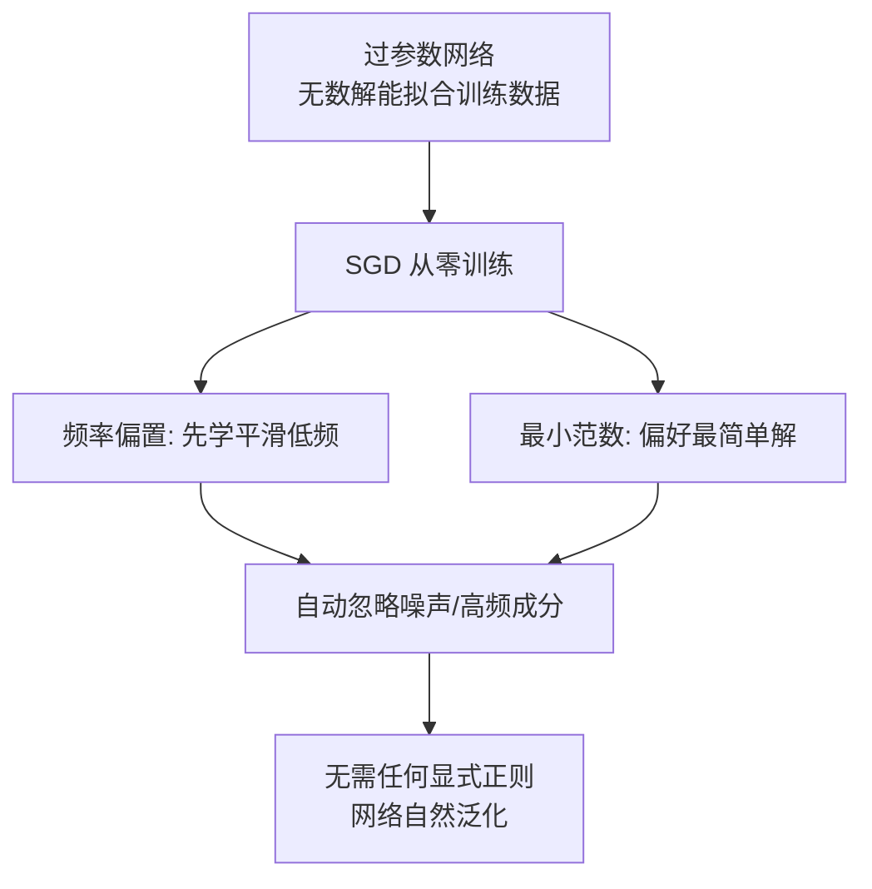

# 01 · 隐式正则：优化器本身就是正则器

> **这是五条主线里最核心的一条。** 回答一个直击灵魂的问题：你什么正则都没加（没 weight decay、没 dropout），为什么深度网络也不会疯狂过拟合？答案——**梯度下降本身就在正则**。

---

## 一、直觉层：函数空间里的"口味偏好"

### 1.1 无数个解，挑哪个？

过参数模型（参数多于样本）有个特点：**有无数组参数都能完美拟合训练数据**。

打个比方：让你画一条曲线穿过纸上的 20 个点。你可以画：
- 一条平滑的波浪线（简单解）；
- 一条疯狂抖动的曲线，精确穿过每个点还顺便绕了 100 个弯（复杂解）。

两者在训练点上都"零误差"，但**泛化天差地别**——平滑的解对新点好，抖动的解灾难。

**问题**：当容量足够大，函数空间里有无数解时，**梯度下降会挑哪一个？**

### 1.2 SGD 有"口味"

经验上（后来被理论部分证明）：梯度下降**强烈偏好简单解**。它几乎从不挑那个疯狂抖动的解，总是收敛到最平滑、最简单的那一个。

> 🎯 你没加任何正则，但 SGD **自己**就在挑简单解。这种"无需显式约束、由优化过程自发产生的偏好"，叫 **隐式正则（Implicit Regularization / Implicit Bias）**。

---

## 二、数学层：三种被证实的偏好

### 2.1 频率偏置（Spectral Bias / Frequency Principle）

**现象**：网络先学低频（平滑）成分，再学高频（细节/噪声）成分。

$$
\text{训练中: 低频误差下降快} \gg \text{高频误差下降慢}
$$

**实验 04 验证**（`04_spectral_bias.py`）：信号 = 低频 sin(1周期) + 高频 sin(4周期)，训练中分频段测残差功率：

```
步数    低频残差功率    高频残差功率
  100       1026           2484     低频快降, 高频几乎没动
  500         12           3004     低频已拟合, 高频还没动
 1500         11           2638     高频才开始缓慢下降
 6000          6           1940     高频仍远高于低频残差
```

低频功率从 1026 降到 6（**降 170 倍**），高频只从 2484 缓慢降到 1940。**网络优先、且高效地学会了平滑大势，细节/噪声成分学得极慢。**

> 💡 这就是为什么"早停"有用：训练早期网络主要保留了平滑解，还没来得及去拟合噪声。提前停下 = 自动过滤掉高频过拟合成分。

### 2.2 最小范数偏好（Minimum Norm Bias）

在线性/过参数回归里，能拟合数据的解有无穷多，梯度下降从零初始化出发，会收敛到**$\ell_2$ 范数最小**的那个。

$$
w_{\text{GD}} = \arg\min_{w} \|w\|_2 \quad \text{s.t.} \quad Xw = y
$$

最小范数解 = 最平滑、最不抖动的解 = 泛化最好。（数学上，最小 $\ell_2$ 范数解对应核方法里最光滑的插值器。）

### 2.3 大间隔偏好（Margin Maximization）

在分类任务（用交叉熵/logistic 损失）里，SGD 倾向收敛到让**类别得分差最大**的解（max-margin 解，Soudry 2018）。间隔越大，决策边界越"自信"、越鲁棒，泛化越好。

---

## 三、实证：闭式解 vs 梯度下降，同模型泛化差 219 倍

这是隐式正则最有力的证据（`02_implicit_regularization.py`）：

**同样的过参数多项式（d=9, n=20），两种求解方式：**

| 方式 | 测试 MSE | 说明 |
|------|---------|------|
| **闭式最小二乘**（一步到位，全局解） | **6.28** | 把所有高阶项都用上 → 过拟合 |
| **梯度下降**（从零训练，80000 步） | **0.029** | 优先学低阶 → 泛化好 |

$$
\text{GD 隐式正则把测试误差降低了 } \frac{6.28}{0.029} \approx 219 \text{ 倍!}
$$

而且 GD（0.029）甚至**优于实验 03 里手调最优的岭正则**（λ=1e-6 给 0.038）——**你什么都没调，SGD 自动做到了比手调正则还好**。

GD 训练曲线（测试 MSE 随步数）：

```
步数      训练MSE    测试MSE
   50     0.437      0.380     早期: 还没学高阶, 泛化好
 1000     0.216      0.115
 5000     0.197      0.090
80000     0.074      0.029     长期保持良好泛化
```

> 关键：GD 不是"训练得不够久所以没过拟合"——它长期训练都泛化好。是 GD 的**轨迹本身**偏好简单解（频率偏置 + 最小范数）。

---

## 四、为什么这解释了"裸奔网络也能泛化"

把线索串起来：



**这就是深度学习一个反直觉的真相**：你以为"训练 = 拟合训练数据"，但 SGD 其实在做"拟合训练数据 **中最简单的那种方式**"。简单 = 泛化。

---

## 五、批判性视角：隐式正则的边界

1. **它依赖优化器**。换成 Newton 法、二阶方法，隐式偏置会变（甚至消失）。SGD/Adam 的隐式正则不是"上帝的选择"，而是"这个优化器恰好偏好简单解"。
2. **它依赖初始化**。从零/小初始化出发才有强最小范数偏好；大初始化会破坏它。
3. **它不是万能的**。数据太少、噪声太大、训练太久，SGD 照样过拟合。隐式正则降低了过拟合概率，但不能消除。
4. **理论仍在发展**。对**线性**模型，GD→最小范数解已被严格证明（Gunasekar 2018 等）。对**深度**网络，隐式偏置的精确刻画仍是开放问题（Adam 的偏置比 SGD 更复杂、更不被理解）。

> 诚实地说：我们**经验上知道**SGD 偏好简单解，但**理论上还没完全说清**深度网络里"简单"究竟怎么定义。

---

## 📌 下一步

隐式正则解释了"为何不加正则也能泛化"。接下来看第二条主线：[02-平坦极小值.md](02-平坦极小值.md)——**为什么小 batch 训练出来的模型，泛化比大 batch 好？** 那是 SGD 噪声的另一种正则效应。

## ✍️ 练习

1. （概念）用自己的话解释：为什么"函数空间有无数解"时，挑哪个解成了关键？SGD 偏好哪一种？
2. （实验）跑 `04_spectral_bias.py`，把高频改成频率 2（更容易学），观察低频和高频是否都最终拟合。这对"频率偏置"说明了什么？
3. （思考）实验 02 里，GD 在 80000 步测试 MSE=0.029，比手调岭正则（0.038）还好。这是否意味着"以后都不用加正则了"？为什么？（提示：考虑深度网络、数据量、噪声）
4. （进阶）如果把优化器从 SGD 换成 Adam，隐式偏置会一样吗？查阅 Gunasekar 2018 / Wilson 2017，简述 Adam 与 SGD 隐式偏置的差异。
