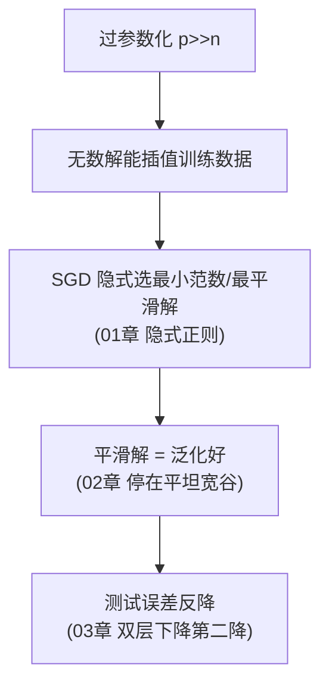

# 03 · 双层下降：过参数化为何反而良性

> 第三条主线，最直接面对悖论。Belkin et al. 2019 的里程碑发现：把"容量"轴画完整，测试误差不是经典理论的 U 型，而是**双降**。过了临界点后，参数越多，测试误差**不升反降**。

---

## 一、直觉层：经典 U 型 vs 真实双降

### 1.1 经典理论的预言（U 型）

传统 bias-variance 权衡：容量从 0 增加，测试误差先降（欠拟合→刚好），再升（刚好→过拟合）。一条优美的 U 型。

```
测试误差
  │  ↘                    ↗
  │   ↘                  ╱
  │    ↘    U型        ╱
  │     ↘            ╱
  │      ↘________╱
  └───────────────────────────容量
```

### 1.2 Belkin 的发现（双降）

当我们把容量**继续推到远超样本数**的区域，意外发生了：测试误差过了 U 型的峰之后，**再次下降**。

```
测试误差
  │  ↘        峰值         过参数区
  │   ↘        /\            ↘________
  │    ↘      /  \         反而下降!
  │     ↘____/    \_______
  │       欠拟合  临界插值
  └───────────────────────────────容量
         经典U型     现代发现(第二降)
```

- **第一峰（临界插值）**：参数数 ≈ 样本数，模型**刚好**能记住每个点，于是疯狂震荡（实验 00 的 d=13 测试 MSE=393 就是这个峰）。
- **第二降（过参数化良性）**：参数数 **远超** 样本数，最小范数解反而变平滑，测试误差**重新下降**。

---

## 二、数学层：过参数区的最小范数解为何良性

### 2.1 临界插值为何灾难

当参数数 $p \approx n$（样本数），模型恰好有足够自由度穿过每个训练点。但"恰好穿过"的解**极度不唯一且不稳定**——它会在训练点之间剧烈震荡（Runge 现象），测试误差爆炸。

### 2.2 过参数化为何良性

当 $p \gg n$，方程组欠定（参数 >> 约束），有无穷多解。在这些解里，**最小 $\ell_2$ 范数解**（也是 SGD 偏好的解，见 01 章）有一个惊人性质：

$$
p \to \infty \text{ 时, 最小范数插值解} \;\to\; \text{最光滑的插值器（核方法意义下）}
$$

参数越多，最小范数解反而越平滑（因为高维空间给了"绕远路"的自由，但它选择最直的、最简单的）。**光滑 = 泛化**。

> 🎯 这把 01 章的"最小范数偏好"和"过参数化良性"统一了起来：**过参数化给了 SGD 选择简单解的余地，而 SGD 真的选了它。**

### 2.3 与深度学习的对应

- 现代深度网络几乎都处于 $p \gg n$ 的**过参数区**（参数远超样本）。
- 它们不在 U 型的上升支（经典理论担心的过拟合），而在**第二降的下降支**——过参数化 + 隐式正则 = 泛化良好。

---

## 三、实证：高维随机特征复现双层下降

```bash
cd experiments && python3 01_double_descent.py
```

高维随机傅里叶特征（近似高斯核），输入维度 d=20，训练样本 n=60，扫描特征数 N：

```
特征数N   参数比N/n   训练MSE       测试MSE      区域
     5      0.08     6.1          5.8         欠参数(欠拟合)
    30      0.50     3.2         15.3
    58      0.97     0.31       910.5         ★临界前: 开始飙升
    60      1.00     1e-10      443.9         临界插值(N≈n)
    70      1.17     1e-13       39.3         记号态峰值
   200      3.33     1e-15        8.2         过参数区
   500      8.33     1e-16        5.9         继续降
  3000     50.00     1e-16        5.3         ★过参数区最佳!
```

$$
\text{测试误差: 峰值 910 (N=58)} \;\to\; \text{过参数区 5.3 (N=3000), 降了 171 倍!}
$$

参数从 58 涨到 3000（**50 倍于样本数**），测试误差不升反降 171 倍——经典理论预言它该爆炸，现实却反降。**这就是双层下降。**

---

## 四、诚实说明：双层下降是经验现象，不是普适定理

我必须强调两点：

1. **复现对设定敏感**。我最初用 **1D 低维 ReLU/傅里叶特征 + 纯插值（λ=0）**复现，结果**数值上严重震荡**（测试误差爆炸到 $10^{20}$，失败）。换成**高维 + 微正则（λ=1e-8）**才稳定。

2. **不是所有任务都出现**。双层下降在随机特征、核方法、某些真实网络里被反复观测，但它依赖数据分布、优化器、特征族。它是一条**经验规律**，不是对任意设定都成立的定理。

> 这恰恰是深度学习理论的现状：我们有**现象**和**部分解释**，但没有**普适定理**。

---

## 五、双层下降与三条主线的统一



三条主线其实是**同一个机制的三个视角**：过参数化给空间，SGD 选简单解，结果是泛化。

---

## 六、批判性视角

1. **临界峰是真实风险**。在 $p \approx n$ 的临界区，模型确实最危险（测试误差峰值）。实践中要么用小模型（左侧），要么大胆过参数化（右侧），**避开临界区**。
2. **第二降不无限持续**。参数加到一定程度后，测试误差趋于平稳（甚至因优化困难略升）。不是"参数越多越好"，而是"过参数区比临界区好"。
3. **数据噪声影响形状**。无噪声数据的双层下降更尖锐；高噪声数据峰值可能被噪声主导。
4. **不能解释一切**。双层下降解释了"容量轴"，但 LLM 的 in-context learning、grokking 等新现象超出了它的范围（见 05 章）。

---

## 📌 下一步

三条"为何能泛化"的主线讲完了。进入 [04-架构归纳偏置与显式正则.md](04-架构归纳偏置与显式正则.md)——**工程上，我们怎么主动让网络泛化？** 这是"怎么实现"的部分。

## ✍️ 练习

1. （概念）用自己的话解释"双层下降"的两个峰/降分别对应什么。
2. （实验）跑 `01_double_descent.py`，把训练样本数 n 从 60 改成 200，观察临界峰位置和过参数区是否仍出现。
3. （思考）为什么 1D 低维复现失败，高维却成功？这暗示双层下降依赖什么？
4. （进阶）实践中"避开临界区"意味着什么？给一个 ResNet 选宽度，你会刻意选"刚好够"还是"明显过参数"？为什么？
