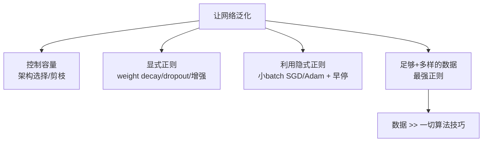

# 04 · 架构归纳偏置与显式正则：怎么让网络泛化

> 前三章是"为何能泛化"（理论）。本章是"**怎么实现**"（工程）。归纳成两条：**(A) 用架构预先编码任务结构**（缩小搜索空间），**(B) 用显式正则人为约束**（把网络往简单解推）。两者都把"泛化"从"碰运气"变成"可设计"。

---

## 一、主线 4：架构的归纳偏置（Inductive Bias）

### 1.1 直觉：架构 = 预先剪裁假设空间

一个"1750 亿参数的全连接网络"和一个"1750 亿参数的 Transformer"，参数数相同，泛化能力天差地别。差别在哪？**架构本身把"任务结构"硬编码进去了**，从而缩小了网络实际搜索的函数空间。

> 🎯 架构不是"中性的参数容器"，它是**最大的隐式正则**。选对架构，等于告诉网络"别在不合理的函数族里浪费力气"。

### 1.2 经典架构编码了什么结构

| 架构 | 编码的结构假设 | 效果 |
|------|--------------|------|
| **CNN** | 权值共享 + 局部连接 = **平移不变性**（猫在左上和右下都是猫）| 参数暴降，天然适合图像 |
| **Transformer** | 注意力 = **集合/位置等变性**（元素间可动态交互）| 适合序列、图、集合 |
| **GNN** | **图对称性**（节点排列不变）| 适合分子、社交网络 |
| **RNN** | **时间共享**（同一套权重跨时间步）| 适合序列（已被 Transformer 取代）|

### 1.3 归纳偏置的代价

架构先验是**双刃剑**：

- **对**：CNN 处理图像效率极高（因为图像确实有平移不变性）。
- **错**：CNN 处理集合数据就浪费（集合没有空间结构），ViT（Vision Transformer）在某些视觉任务上反超 CNN，正是因为它**去掉了**强空间先验，用数据和注意力学结构。

> 工程权衡：**数据少 → 靠强归纳偏置（CNN）；数据多 → 用弱先验+大数据（Transformer）**。这是"Inductive → Deductive"的架构演进。

---

## 二、主线 5：显式正则（人为加约束）

前三章讲"网络自动泛化"（隐式），但实践中我们**主动加**正则来强化泛化。核心思想统一：**人为缩小有效假设空间，逼网络选简单解**。

### 2.1 显式正则手段全景

| 手段 | 机制 | 对应多项式里的 |
|------|------|--------------|
| **Weight Decay（L2）** | 把权重拉小，惩罚大权重（剧烈震荡） | 岭回归 λ |
| **L1（Lasso）** | 产生稀疏权重（很多归零） | L1 正则 |
| **Dropout** | 训练时随机关闭神经元，逼网络不依赖单一通路 | （找平坦解）|
| **数据增强** | 告诉网络"翻转/裁剪后还是猫"，编码不变性 | （等效增大数据 n）|
| **Early Stopping** | 在过拟合前停下 | （实验02 的 GD 早停）|
| **BatchNorm / LayerNorm** | 稳定优化、平滑 loss 面 | （间接）|
| **标签平滑 / Mixup** | 软化目标 / 插值增广 | （约束输出分布）|
| **对抗训练** | 对扰动鲁棒 | （最小化最坏情况损失）|

### 2.2 实证：岭正则（=Weight Decay）的威力

```bash
cd experiments && python3 03_regularization_zoo.py
```

固定高阶多项式 d=15（严重过拟合），扫描岭 λ（≡ 深度网络的 weight decay）：

```
岭 λ        训练MSE      测试MSE      解读
  0        0.024       17.8         无正则: 严重过拟合
  1e-10    0.040        0.64
  1e-6     0.046        0.038       ★正则化救场!
  1e-3     0.056        0.041
  1e-1     0.212        0.109
  100      0.550        0.460       过强正则: 又欠拟合
```

$$
\text{weight decay 把测试误差从 17.8 降到 0.038, 降了 470 倍!}
$$

且呈完美 **bias-variance U 型**：λ 太小过拟合，λ 太大欠拟合，中间最优。

### 2.3 多项式 ↔ 深度网络的对照

| 多项式回归 | 深度网络 |
|-----------|---------|
| 阶数 d（容量）| 网络宽度/深度 |
| 岭 λ | **weight decay** |
| 降阶 | 剪枝 / 缩小网络 |
| 加噪声数据 | **数据增强** |
| 早停 | **early stopping** |

> 同一思想，不同实现。**正则化 = 让模型倾向"平滑/简单"解 → 泛化**。

---

## 三、工程总览：训练一个会泛化的模型，本质在做四件事



### 各手段的"性价比"排序（业界共识）

1. **🏆 数据 + 数据增强**（回报最大，"More data beats clever algorithms"）
2. **架构选择**（选对 CNN/Transformer，胜过一堆 trick）
3. **预训练 + 微调**（大数据学通用特征迁移）
4. **Weight Decay / Dropout / Early Stopping**（标准配方，便宜有效）
5. **小 batch SGD**（隐式正则，免费但牺牲速度）
6. **标签平滑 / Mixup / 对抗训练**（边际提升，特定场景）

---

## 四、批判性视角

1. **正则不是越多越好**。实验 03 显示 λ=100 反而欠拟合。正则是 bias-variance 权衡，要调。
2. **强归纳偏置会过时**。CNN 的平移先验在数据足够多时反而限制表达（ViT 的崛起）。架构选择要匹配数据规模。
3. **数据增强可能引入偏差**。错误的增强（如对医学影像做不合理的翻转）会教错不变性，损害泛化。
4. **没有银弹**。任何单一手段都不能保证泛化。真实工程是"数据 + 架构 + 正则 + 优化"的**组合拳**。

---

## 📌 下一步

理论（为何泛化）和工程（怎么实现）都讲完了。最后一章 [05-批判与未解.md](05-批判与未解.md) 诚实面对：**我们其实还没真正理解深度学习为何泛化**——以及那些挑战现有理论的新现象。

## ✍️ 练习

1. （概念）为什么"参数数相同，CNN 比 MLP 在图像上泛化好"？用"归纳偏置"解释。
2. （实验）跑 `03_regularization_zoo.py`，把 d 从 15 改成 9，观察最优 λ 和最优测试 MSE 如何变化。
3. （设计）你要训练一个识别手写数字的小网络（数据少），会选 CNN 还是 MLP？为什么？如果要加正则，加哪几种？
4. （思考）数据增强为什么能提升泛化？它和"增大 n"完全等价吗？（提示：增强编码了"什么变换下标签不变"，这是先验，不只是更多数据）
