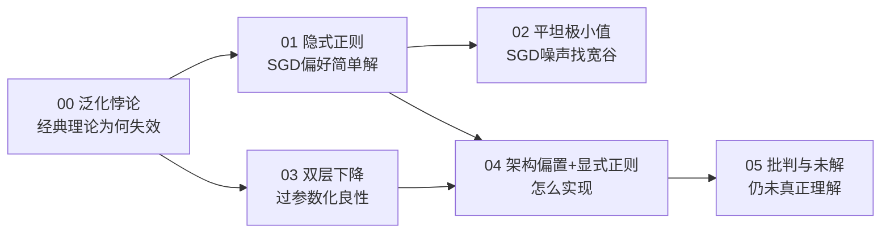

# 05 · 批判与未解：我们其实还没真正理解它

> 终章。前面五章给出了"为何能泛化"的五条解释主线，它们都**部分成立**，但**没有一条是完整答案**。诚实地面对这个事实，是理解深度学习理论的最后一步。

---

## 一、现状：解释丰富，证明稀缺

| 主线 | 它解释了什么 | 它没解释/未证明什么 |
|------|------------|-------------------|
| 隐式正则 | 为何 SGD 偏好简单解 | 深度网络里"简单"的精确定义；Adam 的偏置远未理解 |
| 平坦极小值 | 为何小 batch 泛化好 | "平坦"的稳健度量仍争议；存在平坦却不泛化的反例 |
| 双层下降 | 过参数区为何良性 | 是经验现象，非普适；依赖设定 |
| 架构归纳偏置 | 为何 CNN/Transformer 有效 | 无法预测具体泛化误差 |
| 显式正则 | 工程上怎么强化泛化 | 只是把"碰运气"变"可调"，没回答"为何有效" |

**核心坦诚**：我们能让深度网络泛化得**很好**（靠数据+架构+正则），但**无法精确预测**"这个网络在这个数据上泛化误差是多少"。经典统计学习理论给出的界，在深度网络上仍是**空的**（上界 > 1，等于没说）。

> 一句话：**我们能用，但不真懂。** 这是 AI 目前最大的理论空白之一。

---

## 二、泛化其实很脆弱：三个提醒

"能泛化"是在**同分布**假设下的。一旦假设被打破，泛化立刻崩塌：

### 2.1 分布偏移（Distribution Shift）

训练时是晴天路况的自动驾驶，部署后遇到雪天——模型可能彻底失效。网络泛化的是**训练分布**，不是"真实世界"。

### 2.2 对抗样本（Adversarial Examples）

给一张正确分类的熊猫图片，加一层**人眼完全看不出**的精心扰动，网络可能高置信度判成"长臂猿"。说明网络学到的"规律"和人类理解的规律**不是一回事**——它对微小扰动极不鲁棒。

### 2.3 记忆 vs 泛化的张力

研究（Zhang 2017, *Understanding Deep Learning Requires Rethinking Generalization*）显示：**大网络能纯记忆完全随机的标签**（训练误差→0）。但同样的架构在真实标签上却泛化。

> 这证明：**泛化能力不来自架构本身，而来自"数据的真实结构 × 优化器的偏好"的共同作用**。架构只是提供了"既能记忆、又能泛化"的能力，最终走向哪边，取决于数据是否有结构。

---

## 三、挑战现有理论的新现象

### 3.1 Grokking

训练 loss 早已降到 0（网络已"记住"训练数据），但测试 loss **延迟很久**（几千步后）才突然下降——泛化"突然出现"。经典 bias-variance 理论完全无法解释这种"训练已收敛、泛化却延迟"的现象。

> 猜测：网络先记忆，后在隐式正则驱动下慢慢"重新组织"成泛化解。但机制仍在争论。

### 3.2 In-Context Learning（上下文学习）

LLM **不改任何参数**，仅凭 prompt 里的几个例子就能学会新任务。这打破了"学习=改参数"的传统范式。泛化从"训练时获得"变成了"推理时涌现"——现有泛化理论（都围绕训练）对此**完全空白**。

### 3.3 涌现能力（Emergence）

模型规模过某个阈值后，突然出现之前没有的能力。这种**相变**式的泛化提升，无法用平滑的理论解释。

### 3.4 神经标切核（NTK）的局限

理论上，无限宽网络的训练动力学可由 NTK 精确描述（Jacot 2018），一度被认为能解释泛化。但 NTK 预测的"特征学习"与真实网络不符——真实网络会**学习新特征**（lazy vs feature learning），NTK（lazy regime）做不到。这暴露了理论工具的根本局限。

---

## 四、为什么这很重要（给工程师的你）

1. **不要迷信"大模型一定能泛化"**。GPT 也会幻觉、会过拟合训练分布的偏见。泛化是有条件的。
2. **评估要测分布外（OOD）**。只看同分布测试集精度，会掩盖泛化的脆弱。工业级评估必须包含分布偏移、对抗、长尾。
3. **正则和数据是工程抓手，理论是导航**。知道"为何泛化"帮你在掉点时**定位问题**（是数据不够？架构不匹配？正则太强？），但不会给你一个保证泛化的公式。
4. **理论的滞后是机会**。深度学习理论远落后于实践——这意味着还有大量"工程师能发现、理论家还没解释"的现象等着被命名。

---

## 五、全系列回顾

| 章 | 你获得的能力 |
|----|------------|
| 00 | 能说清"泛化悖论"是什么、为何经典理论失效 |
| 01 | 能解释"为何不加正则网络也泛化"（隐式正则）|
| 02 | 能解释"为何小 batch 泛化更好"（平坦极小值）|
| 03 | 能解释"为何参数远超样本却不崩"（双层下降）|
| 04 | 能工程化地强化泛化（架构+正则+数据）|
| 05 | 能诚实面对理论的边界，不被"能泛化"误导 |

你现在能从"一行 `loss.backward()`"到"为何这个网络对新数据有效"，讲出一条完整的、带实证的因果链——同时也清楚这条链上**哪里是铁律、哪里是猜测、哪里仍是空白**。这就是"讲透"。

---

## 📌 下一步

- **动手**：跑完 `experiments/` 全部 5 个实验，亲手复现所有数字。
- **延伸阅读**：
  - Belkin et al. 2019, *Reconciling modern ML with bias-variance tradeoff*（双层下降）
  - Keskar et al. 2017, *On Large-Batch Training*（平坦极小值）
  - Rahaman et al. 2019, *Spectral Bias*（频率偏置）
  - Zhang et al. 2017, *Understanding DL Requires Rethinking Generalization*（记忆 vs 泛化）
  - Nakkiran et al. 2019, *Deep Double Descent*（更系统的双层下降）
- **回到体系**：本教程与「讲透激活函数」互补——激活函数管"能否训练"，泛化管"训练好为何对新数据有效"。两者合起来，是深度学习的两大支柱理论。
- **挑战 [exercises.md](exercises.md)**。

## ✍️ 练习

1. （反思）本系列哪条主线让你最意外？为什么？
2. （论证）有人说"参数多就该过拟合，所以大模型不靠谱"。用本系列学到的知识，写 3 句话反驳或修正这个说法。
3. （开放）grokking 或 in-context learning，挑一个，谈谈它为何挑战现有泛化理论。
4. （行动）下次你训练的模型掉点了，你会按什么顺序排查（数据/架构/正则/优化）？为什么是这个顺序？
